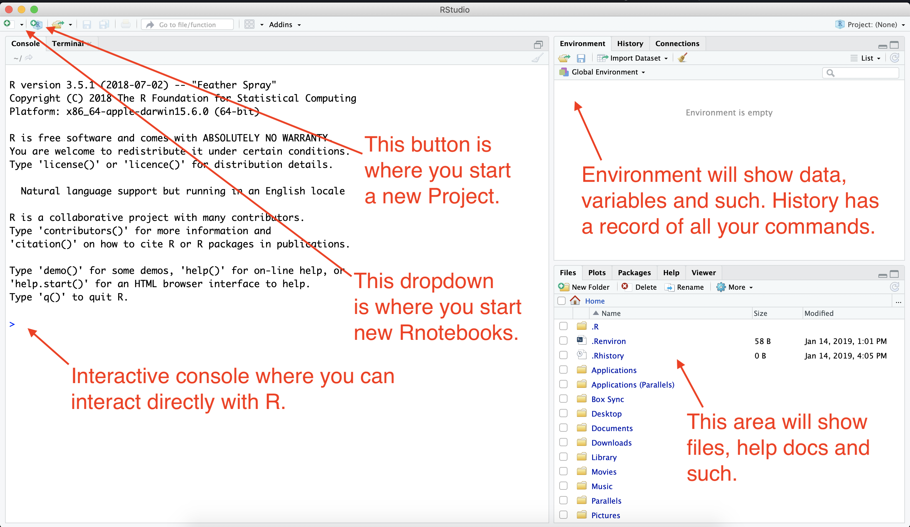

# Introduction to R {#intro}

## RStudio tour

When you launch RStudio, you'll get a screen that looks like this:



## Updating preferences

There is a preference in RStudio that I would like you to change. By default, the program wants to save a the state of your work (all the variables and such) when you close a project, but that is not good practice. We'll change that.

1. Go to the **RStudio** menu and choose **Preferences**
1. Under the **General** tab, uncheck the first four boxes.
1. On the option "Save Workspace to .Rdata on exit", change that to **Never**.
1. Click *OK* to close the box.


## Starting a new Project

When we work in RStudio, we will create "Projects" to hold all the files related to one another. This sets the "working directory", which is a sort of home base for the project.

1. Click on the second button that has a green `+R` sign.
1. That brings up a box to create the project with several options. You want **New Directory** (unless you already have a Project directory, which you don't for this.)
1. For **Project Type**, choose **New Project**.
1. Next, for the **Directory name**, choose a new name for your project folder. For this project, use "firstname-first-project" but use YOUR firstname.
1. For the subdirectory, you want to use the **Browse** button to find your new `rwd` folder we created earlier.

I want you to be anal about naming your folders. It's a good programming habit.

- Use lowercase characters.
- Don't use spaces. Use dashes.
- For this class, start with your first name.


When you hit **Create Project**, your RStudio window will refresh and you'll see the `yourfirstname-first-project.Rproj` file in your Files list.

## Using R Notebooks

For this class, we will almost always use [RNotebooks](https://rmarkdown.rstudio.com/lesson-10.html). This format allows us to write text in between our blocks of code. The text is written in a language called [RMarkdown](https://rmarkdown.rstudio.com/lesson-1.html), a juiced-up version of the common documentation syntax used by programmers, Markdown. We'll learn that in a moment.

### Create your first notebook

1. Click on the button at the top-left of RStudio that has just the green `+` sign.
1. Choose the item **R Notebook**.

This will open a new file with some boilerplate R Markdown code.

1. At the top between the `---` marks, is the **metadata**. This is written using YAML, and what is inside are commands for the R Notebook. Don't sweat the YAML syntax too much right now, as we won't be editing it often.
1. Next, you'll see a couple of paragraphs of text that describes how to use an RNotebook. It is written in RMarkdown, and has some inline links and bold commands, which you will learn,
1. Then you will see an R code chunk that looks like the figure below.


Let's take a closer look at this:

- The three back tick characters (the key found at the top left on your keyboard) followed by the `{r}` indicate that this is a chunk of R code. The last three back ticks say the code chunk is over.
- The `{r}` bit can have some parameters added to it. We'll get into that later.
- The line `plot(cars)` is R programming code. We'll see what those commands do in a bit.
- The green right-arrow to the far right is a play button to run the code that is inside the chunk.
- The green down-arrow and bar to the left of that runs all the code in the Notebook up to that point. That is useful as you make changes in your code and want to rerun what is above the chunk in question.

### Save the .Rmd file

1. Do *Cmd+S* or hit the floppy disk icon to save the file.
1. It will ask you what you want to name this file. Call it `01-first-file.Rmd`.

When you do this, you may see another new file created in your Files directory. It's the pretty version of the notebook which we'll see in a minute.

In the metadata portion of the file, give your notebook a better title.

1. Replace "R Notebook" in the `title: "R Notebook"` code to be "Christian's first notebook", but use your name.

### Run the notebook

There is only one chunk to run in this notebook, so:

1. Click on the green right-arrow to run the code. The keyboard command (from somewhere within the chunk) is *Cmd+Shift+Return*.

You should get something like this:


What you've done here is create a plot chart of a piece of sample data that is already inside R. (FWIW, It is the speed of cars and the distances taken to stop. Note that the data were recorded in the 1920s.)

But that wasn't a whole lot of code to see there is a relationship with speed vs stopping distance, eh?

This is a "base R" plot. We'll be using the tidyverse ggplot methods later in the semester.

### A note about RMarkdown

We always want to annotate our code to explain what we are doing. To do that, we use a syntax called [RMarkdown](https://rmarkdown.rstudio.com/authoring_basics.html), which is an R-specific version of Markdown. We use this syntax because it both makes sense in text but also makes a very pretty version in HTML when we "knit" our project. You can see how it to [write RMarkdown here](https://rmarkdown.rstudio.com/authoring_basics.html).

This entire book is written in RMarkdown.

Here is an example:

```rmarkdown
## My dating age

The following section details the [socially-acceptable maximum age of anyone you should date](https://www.psychologytoday.com/us/blog/meet-catch-and-keep/201405/who-is-too-young-or-too-old-you-date).

The math works like this:

- Take your age
- subtract 7
- Double the result
```

- The `##` line is a headline. Add more `###` and you get a smaller headline, like subheads.
- There is a full blank return between each element, including paragraphs of text.
- In the first paragraph we have embedded a hyperlink. We put the words we want to show inside square brackets and the URL in parenthesis DIRECTLY after the closing square bracket: `[words to link](https://the_url.org)`.
- The `-` at the beginning of a line creates a bullet list. (You can also use `*`). Those lines need to be one after another without blank lines.

1. Go ahead and copy the code above and add it as text in the notebook so you can see it works later.

### Adding new code chunks

The text after the chart describes how to insert a new code chunk. Let's do that.

1. Add a couple of returns before the paragraph of text about code chunks.
1. Use the keys *Cmd+Option+i* to add the chunk.
1. Your cursor will be inserted into the middle of the chunk. Type in this code in the space provided:

```{r}
# update 54 to your age
age <- 54
(age - 7) * 2
```

1. Change for "54" to your real age.
1. With your cursor somewhere in the code block, use the key command *Cmd+Shift+Return*, which is the key command to RUN ALL LINES of code chunk.

> NOTE: To run an individual line, use *Cmd+Return* while on that line.

Congratulations! The answer given at the bottom of that code chunk is the [socially-acceptable maximum age of anyone you should date](https://www.psychologytoday.com/us/blog/meet-catch-and-keep/201405/who-is-too-young-or-too-old-you-date).

Throwing aside whether the formula is sound, let's break down the code.

- `# update 54 to your age` is a comment. It's a way to explain what is happening in the code without being considered part of the code. We create comments by starting with `#`. You can also add a comment at the end of a line.
- `age <- 54` is assigning a number (`54`) to an R object/variable called (`age`). A variable is a placeholder. It can hold numbers, text or even groups of numbers. Variables are key to programming because they allow you to change a value as you go along.
- The next part is simple math: `(age - 7) * 2` takes the value of `age` and subtracts `7`, then multiplies by `2`.
- When you run it, you get the result of the math equazion, `[1] 94` in my case. That means there was one observation, and the value was "94". For the record, my wife is _much_ younger than that.

Now you can play with the number assigned to the age variable to test out different ages. Do that.

### Practice adding code chunks

Now, on your own, add a similar section that calculates the **minimum** age of someone you should date, but using the formula `(age / 2) + 7`.

1. Add a RMarkdown headline and text describing what you are doing.
1. Create a code chunk that that calculates the formula based on your age.
1. Include a comment within the code block.

### Preview the report

The rest of the boilerplate text here describes how you can *Preview* and *Knit* a notebook. Let's do that now.

- Press *Cmd+Shift+K* to open a Preview.

This will open a new window and show you the "pretty" notebook that we are building.

Preview is a little different than *Knit*, which runs all the code, then creates the new knitted HTML document. It's **Knit to HMTL** that you'll want to do before turning in your assignments. That is explained below.

### The toolbar

One last thing to point out before we turn this in: The toolbar that runs across the top of the R Notebook file window. The image below explains some of the more useful tools, but you _REALLY_ should learn and use keyboard commands when they are available.


### Knit the final workbook

1. Save your File with *Cmd+S*.
1. Click on the dropdown next to the **Run** menu item and choose _Restart R and Run All Chunks_. We do this to make sure everything still works.
1. Use the **Knit** button in the toolbar to choose **Knit to HTML**.

This will open your knitted file. Isn't it pretty?

## Turning in our projects

If you now look in your Files pane, you'll see you have four files in our project.  (Note the only one you actually edited was the `.Rmd` file.)


The best way to turn in all of those files into Canvas is to compress them into a single `.zip` file that you can upload to the assignment.

1. In your computer's Finder, open the `Documents/rwd` folder.
1. Follow the directions for your operating system linked below to create a compressed version of your `yourname-final-project` folder.
1. [Compress files on a Mac](https://www.macinstruct.com/tutorials/how-to-compress-zip-files-and-folders-on-a-mac/).
1. [Compress flies on Windows](https://www.laptopmag.com/articles/how-to-zip-files-windows-10).
1. Upload the resulting `.zip` file to the assignment for this week in Canvas.


If you find you make changes to your R files after you've zipped your folder, you'll need to delete the `zip` file and compress it again.

Because we are building "repeatable" code, I'll be able to download your `.zip` files, uncompress them, and the re-run them to get the same results.

Well done! You've completed the first level and earned the _Beginner_ badge.

