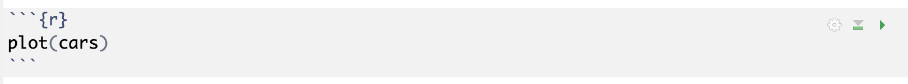
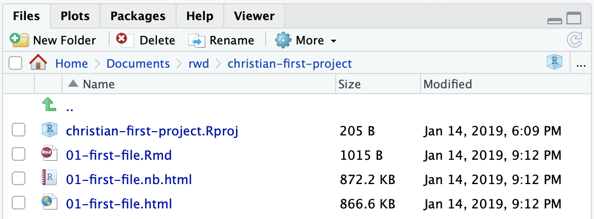

# Introduction to R {#intro}

Let's get this party started.

> NOTE: R and RStudio are already install on lab computers.

## Installing R

Our first task is to install the [R programming language](https://www.r-project.org/) onto your computer. There are a number of "mirrors" which have the software.

- Go to the [download site](https://cran.r-project.org/mirrors.html).
- Go down to USA and choose one of the links there. They should all work the same.
- Click on the link for your operating system.
- The following steps will differ slightly based on your operating system.
  - For Macs, you want the "latest package"
  - For Windows, you want the "base" package. You’ll need to decide whether you want the 32- or 64-bit version. (Unless you’ve got a pretty old system, chances are you’ll want 64-bit.)

Here's hoping it will be self explanatory after that.

## Installing RStudio

[RStudio](https://www.rstudio.com/) is an "integrated development environment" -- or IDE -- for programming in R. Basically, it's the program you will use when doing work for this class.

- Go to <https://www.rstudio.com> and find the "Download RStudio" button.
- Find the "Free" versions and find the installer for your operating system and download it.
- Install it. Should be like installing any other program.

## Getting started with RStudio

### Class project folder

To keep things consistent and help with troubleshooting, I'd like you to save your work in the same location all the time.

- On both Mac and Windows, every user has a "Documents" folder. Open that folder. (If you don't know where it is, ask me to help you find it.)
- Create a new folder called "rwd". Use all lowercase letters.

When we create new "Projects", I want you to always save them in the `Documents/rwd` folder.

## RStudio tour

This is a knitr test for images:

```{r, out.width = "50%", echo=FALSE}
knitr::include_graphics("_images/02-rstudio-start.png")
```
```


When you launch RStudio, you'll get a screen that looks like this:

{width=600px}

## Starting a new Project

When we work in RStudio, we will create "Projects" to hold all the files related to one another. This sets the "working directory", which is a sort of home base for the project.

- Click on the second button that has a green `+R` sign.
- That brings up a box to create the project with several options. You want **New Directory** (unless you already have a Project directory, which you don't for this.)
- For **Project Type**, choose **New Project**.
- Next, for the **Directory name**, choose a new name for your project folder. For this project, use "firstname-first-project" but use YOUR firstname.

I want you to be anal about naming your folders. It's a good programming habit.

- Use lowercase characters.
- Don't use spaces. Use dashes.
- For this class, start with your first name.

{width=400px}

When you do this, your RStudio window will refresh and you'll see the `yourfirstname-first-project.Rproj` file in your Files list.

## Using R Notebooks

For this class, we will almost always use [R Notebooks](https://rmarkdown.rstudio.com/lesson-10.html). This format allows us to write text inbetween our blocks of code. The text is written in a language called [R Markdown](https://rmarkdown.rstudio.com/lesson-1.html). It allows us to write text that gets turned into pretty HTML for our reports. The R Markdown syntax is not hard. It is based on vanilla Markdown, which is a common documentation syntax for programmers.

### Create your first notebook

- Click on the button at the top-left of RStudio that has just the green `+` sign.
- Choose the item **R Notebook**.

This will open a new file with some boilerplate R Markdown code.

- At the top between the `---` marks, is the **metadata**. This is written using YAML, and what is inside are commands for the R Notebook. Don't sweat the YAML syntax too much right now, as we won't be editing it often.
- Next, you'll see a couple of paragraphs of text that describes how to use an R Notebooks. It is written in R Markdown, and has some inline links and bolding commands, which you will learn,
- Then you will see an R code chunk that looks like the figure below.

{width=600px}

Let's take a closer look at this:

- The three backticks characters ( found at the top left on your keyboard) followed by the `{r}` indicate that this is a chunk of R code. The last three backticks say the code chunk is over.
- The `{r}` bit can have some parameters added to it. We'll get into that later.
- The line `plot(cars)` is R programming code. We'll see what those commands do in a bit.
- The green right-arrow to the far right is a play button to run the code that is inside the chunk.
- The green down-arrow and bar to the left of that runs all the code in the Notebook up to that point.

### Save the .Rmd file

- Do command-s or hit the floppy disk icon to save the file.
- It will ask you what you want to name this file. Call it `01-first-file.Rmd`.

When you do this, you may see another new file created in your Files directory. It's the pretty version of the notebook which we'll see in a minute.

In the metadata portion of the file, give your notebook a better title.

- Replace "R Notebook" in the `title: "R Notebook"` code to be "Christian's first notebook", but use your name.

### Run the notebook

There is only one chunk to run in this notebook, so:

- Click on the green right-arrow to run the code.

You should get something like this:

{width=600px}

What you've done here is create a plot chart of a piece of sample data that is already inside R. (FWIW, It is the speed of cars and the distances taken to stop. Note that the data were recorded in the 1920s.)

But that wasn't a whole lot of code to see there is a relationship with speed vs stopping distince, eh?

### Adding new code chunks

The text after the chart describes how you an insert a new code chunk. After that text, I'd like you to do that.

- After the text that describes how to add code, but before the next bit of text, add a new code junk with *Cmd+Option+I*.
- Your cursor will be inserted into the middle of the chunk. Type in this code:

```pre
# min age to date
age = 52
(age / 2) + 7
```

- Change for "52" to your real age.
- With your cursor somewhere in the code block, use the key command *Cmd+Shift+Return*, which is the key command two run an ENTIRE chunk.
- NOTE: To run an individual line, use *Cmd+Return* while on that line.

Congratualtions! The answer given at the bottom of that code chunk is the [socially-acceptable minimum age of anyone you should date](https://www.psychologytoday.com/us/blog/meet-catch-and-keep/201405/who-is-too-young-or-too-old-you-date).

Throwing aside whether the formula is sound, let's break down the code.

- `# min age to date` is a comment. It's a way to explain what is happening in the code without being considered part of the code.
- `age = 51` is assigning a number (`52`) to a variable name (`age`).
- `(age / 2) + 7` takes the value of `age` and divides that by `2`, then adds `7`.

Now you can play with the age variable assignment to test out different ages.

### Practice adding code chunks

Now, on your own, add a similar code chunck that calculates the maximum age of someone you should date, but using the formula `(age - 7) * 2`.

### Preview the report

The rest of the boilerplate text here describes how you can *Knit* or *Preview* a notebook. Let's do that now.

- Press *Cmd+Shift+K* to open a Preview.

This will open a new window and how you the "pretty" notebook that we are building. It's really an HTML file that was create by RStudio. (You can also open this in a web browser).

Preview is a little different than *Knit*, which runs all the code, then creates the new knitted document.

### The toolbar

Last thing to describe before we turn this in is the toolbar that runs across the top of the R Notebook file window.

{width=600px}

### Knit the final workbook

- Save your File with *Cmd+S*.
- Use the **Knit** button to choose **Knit to HTML**.

## Turning in our projects

So now if you look in your Files pane, you'll see you have four files in our project.

{width=500px}

Now we have to zip these all up into a single file that you can turn into Canvas. (Note the only one you actually edit is the `.Rmd` file.)

- In your computer's finder, open the `Documents/rwd` folder.
- Follow the directions for your operating system linked below to create a compressed version of your `yourname-final-project` folder.
- [Compress files on a Mac](http://www.macinstruct.com/node/159).
- [Compress flies on Windows](https://www.laptopmag.com/articles/how-to-zip-files-windows-10).
- Upload the resulting `.zip` file to the assignment for this week in Canvas.

Here is what the compression steps looks like on a Mac:

```{r}
# {width=400px}
```

If you find you make changes to your R files after you've zipped your folder, you'll need to delete the `zip` file and do it again.
