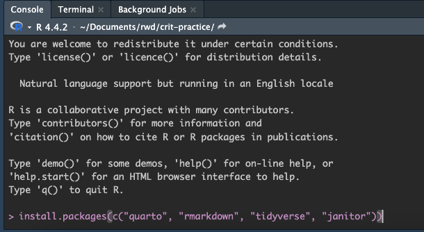
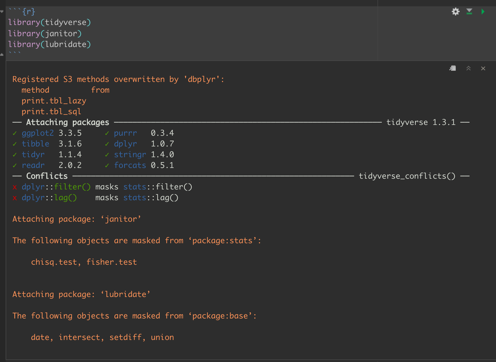
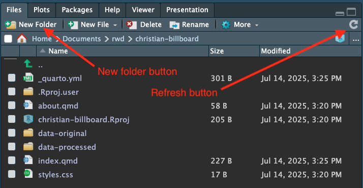
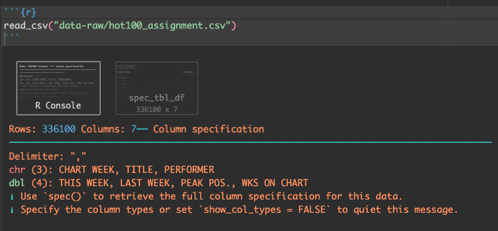
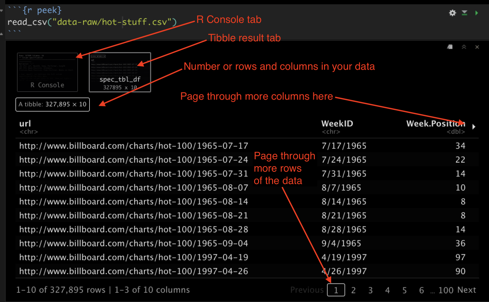
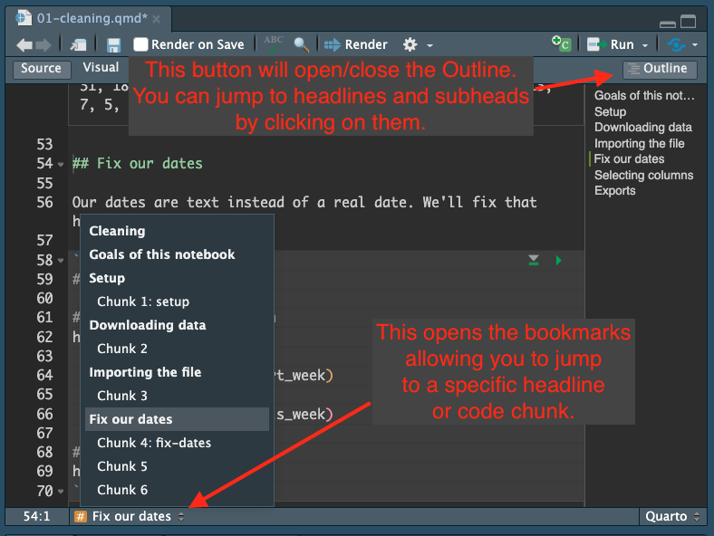
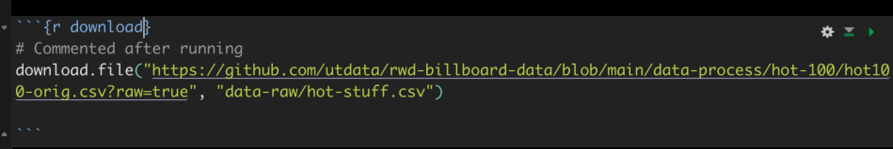
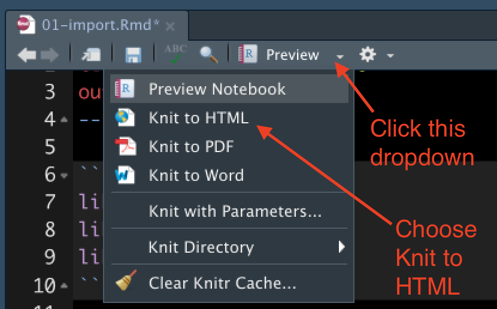

# Summarize with count - import {#counts-import}

> “If you’re doing data analysis every day, the time it takes to learn a programming language pays off pretty quickly because you can automate more and more of what you do.” --Hadley Wickham, chief scientist at RStudio

Note: This lesson was written by Prof. McDonald and I use macOS.

## Learning goals of this lesson

- Practice organized project setup.
- Learn a little about data types available to R.
- Learn about R packages, how to install and import them.
- Learn how to download and import CSV files using the [readr](https://readr.tidyverse.org/) package.
- Introduce the Tibble/Data Frame.
- Introduce the tidyverse ` %>% `.
- Learn how to modify data types (date) and `select()` columns.

We'll be exploring the Billboard Hot 100 charts along the way. Eventually you'll find the answers to a bunch of questions in this data and write about it.

## Basic steps of this lesson

Before we get into our storytelling, we have to set up our project, get our data and make sure it is in good shape for analysis. This is pretty standard for any new project. Here are the major steps we'll cover in detail for this lesson (and many more to come):

- Create your project structure
- Find the data and (usually) get onto on your computer
- Import the data into your project
- Clean up column names and data types
- Export cleaned data for later analysis

## Create a new project

You've done this once already in Chapter 2 so you got this! But here are the basic steps for you to follow:

1. Launch RStudio
1. Make sure you don't have an existing project open. Use File > Close project if you do.
1. Use the `+R` button to create a **New Project** in a **New Directory**.
1. Name the project `yourfirstname-billboard` and put it in your `~/Documents/rwd` folder.
1. Use the `+` button and use **R Notebook** to start a new notebook.
1. Change the title to "Billboard Hot 100 Import".
1. Delete the other boilerplate text.
1. Save the file as `01-import.Rmd`.

We named this notebook starting with `01-` because we will eventually end up with multiple notebooks and we want to know  the order to run them.

### Describe the goals of the notebook

We'll add our first bit of RMarkdown just after the meta data to explain what we are doing. Add this text to your notebook:

```rmarkdown
## Goals of this notebook

Steps to prepare our data:

- Download the data
- Import into R
- Clean up data types and columns
- Export for next notebook
```

We want to start each notebook with a list like this so our future selves and others know what the heck we are trying to accomplish.

We will also write text like this for each new "section" or goal in the notebook.

### The R Package environment

We have to back up from the step-by-step nature of this lesson and talk a little about the R programming language.

R is an open-source language, which means that other programmers can contribute to how it works. It is what makes R beautiful.

What happens is developers will find it difficult to do a certain task, so they will write an R "Package" of code that helps them with that task. They share that code with the community, and suddenly the R garage has an ["ultimate set of tools"](https://youtu.be/Y1En6FKd5Pk?t=24) that would make Spicoli's dad proud. 

One set of these tools is the [tidyverse](https://www.tidyverse.org/) introduced by Hadley Wickham and his team at RStudio. It's a set of R packages for data science that work together in similar ways. Prof. Lukito and I are worshipers of the tidyverse worldview and we'll use these tools extensively. While not required reading, I highly recommend Wickham's book [R for data science](https://r4ds.had.co.nz/index.html), which is free.

There are also a series of useful tidyverse [cheatsheets](https://www.rstudio.com/resources/cheatsheets/) that can help you as you use the packages and functions from the tidyverse. We'll refer to these throughout the course.

### Installing and using packages

There are two steps to using an R package:

- **Install the package** using `install.packages("package_name")`. You only have to do this once for each computer, so I usually do it using the R Console instead of in an R Notebook.
- **Include the library** using `library(package_name)`. This has to be done for each R Notebook or script that uses it, so it is usually one of the first things you'll see in a notebook.

> Note that you have to use "quotes" around the package name when you are installing, but you DON'T use quotes when you load the library.

We're going to install several packages we will use in this project. To do this, we are going to use the **Console**, which we haven't talked about much yet.

{width=600px}

1. Use the image above to orient yourself to the R Console and Terminal.
1. In the Console, type in:

```r
install.packages("tidyverse")
```

As you type into the Console, you'll see some type-assist hints on what you need. You can use the arrow keys to select one and hit the _tab_ key to complete that command, then enter the values you need. If it asks you to install "from source", type `Yes` and hit return.

You'll see a bunch of response in the Console.

When you install the "tidyverse" package you actually get eight individual packages. You'll see references to "dplyr" even some functions referenced as `dplyr::filter()` but they are all part of the tidyverse. You can explore the list at [tidyverse.org](https://www.tidyverse.org/) but know there are other packages from the same folks that we use and load separately.

1. We need two other packages as well, so also do:

```r
install.packages("janitor")
install.packages("lubridate")

```

We'll use janitor to clean up our data column names, among other things. A good reference to learn more is the [janitor vignette](https://cran.r-project.org/web/packages/janitor/vignettes/janitor.html).

We'll use [lubridate](https://lubridate.tidyverse.org/) to fix some dates, which are a special complicated thing in programming. While Lubridate is part of the tidyverse universe, we have to install and load it separately.

You only have to install the packages once on your computer (though you have to load the libraries into each new notebook, which is explained below).

### Load the libraries

Next, we're going to tell our R Notebook to use these three libraries.

1. After the metadata at the top of your notebook, use *Cmd+option+i* to insert an R code chunk.
1. In that chunk, type in the three libraries and run the code block with *Cmd+Shift+Return*.

This is the code you need:

```{r setup, echo=T, message=F, warning=F}
library(tidyverse)
library(janitor)
library(lubridate)
```

Your output will look something like this:

{width=600px}

Don't sweat the Conflicts listed there. It's all good.

### Create a directory for your data

Next we are going to create some folders in our project folder. We'll use some standard names for consistency.

The first folder is called `data-raw`. We are creating this folder because we want to keep a pristine version of our original data that we never change or overwrite. This is a core data journalism commandment: _Thou shalt not change original data_.

In your Files pane at the bottom-right of Rstudio, there is a **New Folder** icon.

1. Click on the **New Folder** icon.
1. Name your new folder `data-raw`. This is where we'll put raw data. We never write data to this folder.
1. Also create another new folder called `data-processed`. This is were we will write data. We separate them so we don't accidentally overwrite raw data.

Once you've done that, they should show up in the file explorer in the Files pane. Click the refresh button if you don't see them. (The circlish thing at top right of the screenshot below. You might have to widen the pane to see it.)

{width=400px}

Your `.Rproj` file name is likely a different name (and that is OK) and you can ignore the `.gitignore` I have there.

### About data sources

Depending on the data source, importing can be brilliantly easy or a major pain in the rear. It all depends on how well-formatted it is.

In this class, we will primarily use data stored as CSVs (Comma Separated Value), Excel files and APIs (Application Programming Interface).

- **CSVs** are a kind of lowest-common-denominator for data. Most any database or program can import or export them. It's just text with a `,` or some other separator between each value.
- **Excel** files are good, but can get messy when humans get involved. They often have multiple header rows, columns used in multiple ways, notes added, etc. Just know you might have to clean them up before or after importing them.
- **APIs** are systems designed to respond to programming. In the data world, we often use the APIs by writing a query to ask a system to return a selection of data. By definition, the data is well structured. You can often determine the file type of the output as part of the API call, including ...
- **JSON** (or JavaScript Object Notation) is the data format preferred by JavaScript. R can read it, too. It is often the output format of APIs, and prevalent enough that you need to understand how it works. We'll get into that later in semester.

Don't get me wrong ... there are plenty of other data types and connections available through R, but those are the ones we'll deal with most in this book.

While our data may be found on the internet in a data portal or through an API, we typically want to download a copy of it to our own machine for safe keeping. We will do that here, but let's talk about the data first.

## The Billboard Hot 100

The _Billboard_ [Hot 100](https://www.billboard.com/charts/hot-100/) singles charts has been the music industry's standard record chart since its inception on 8/2/1958. The rankings, published by Billboard Media, are currently based on sales (physical and digital), radio play, and online streaming. The methods and policies of the chart have changed over time.

The data we will use here is a combination of data collected by Kaggle user [Dhruvil Dave](https://www.kaggle.com/dhruvildave/billboard-the-hot-100-songs), along with some scraping and merging by Prof. McDonald. It is stored on the code sharing website Github for safe keeping.

When you write about this data (and you will), you should source it as **the Billboard Hot 100 from Billboard Media**, since that is where it originally came from and they are the "owner" of the data.

### Data dictionary

Take a look at the [current chart](https://www.billboard.com/charts/hot-100/). Our data contains many (but not quite all) of the elements you see there. **Each row of data (or observation as they are known in R) represents a song and the corresponding position on that week's chart.** Included in each row are the following columns (a.k.a. variables):

- CHART WEEK: The release date of the chart
- THIS WEEK: The current ranking as of the chart date
- SONG: The song title
- PERFORMER: The performer of the song
- LAST WEEK: The ranking on the previous week's chart
- PEAK POS.: The peak rank the song has reached as of the chart date
- WKS ON CHART: The number of weeks the song has appeared as of the chart date

### Let's download our data

Since this data is stored on Github, we can reference it through a URL and download it into our project. Since this is a new "section" of our R Notebook, we'll note what we are doing and why in Markdown.

1. Add a Markdown headline `## Downloading data` and on a new line text that indicates you are downloading data. You would typically include a link and explain what it is, etc, often linking to the original source.
1. Create an R chunk and include the following (hint: use the copy icon at the top right):

```r
download.file("https://github.com/utdata/rwd-billboard-data/blob/main/data-out/hot100_archive.csv?raw=true", "data-raw/hot100_archive.csv")
```

This `download.file` function takes at least two arguments:

- The URL of the file you are downloading
- The path and name of where you want to save it.

Note those two arguments are in quotes. The path includes the folder and file name as it relates to where your R Notebook is. In this case we need to go inside the `data-raw` folder and then name the file: `data-raw/hot100_archive.csv`.

When you run this, it should save the file and then give you output similar to this:

```text
trying URL 'https://github.com/utdata/rwd-billboard-data/blob/main/data-out/hot100_archive.csv?raw=true'
Content type 'text/plain; charset=utf-8' length 17960724 bytes (17.1 MB)
==================================================
downloaded 17.1 MB
```

That's not a small file at 17 MB and 300,000 rows, but it's not a huge one, either.

### Consider commenting the download

Now that we've downloaded the data to our computer, we don't need to run this line of code again unless we know our data source has updated. We can "comment" the code to preserve it but keep it from running again if we re-run our notebook (and we will).

1. Put a `#` at the beginning of the line with the `download.file()` function.
2. In Markdown above it, add a note to your future self that you commented the download for now.

Adding comments in programming is a common thing and every programming language has a way to do it. It is a way for the programmer to write notes to their future self, colleagues or — like in this case — comment out some code that you want to keep, but don't want to execute when the program is run.

In R, anything following one ore more hashes `#` _inside a code chunk_ will be a comment: The text is there, but it won't be executed as code. (Yes, this is a bit confusing since `#`'s are used for headlines in the Markdown parts of the file.)

In R Notebooks we put a most of our "explaining" text in Markdown _outside_ of code chunks ... it's one of the reasons we like using R Notebooks. But sometimes it makes more sense to explain something right where the code is being executed, so that is where the code comments come in.

## Import the data

Now that we have the data on our machine, let's import it into our notebook so we can see it.

Since we are doing a new thing, we should note that with a Markdown headline and text. 

1. Add a Markdown headline: `## Import data`
1. Add some text to explain  that we are importing the Billboard Hot 100 data.
1. After your description, add a new code chunk (*Cmd+Option+i*).

We'll be using the `read_csv()` function from the tidyverse [readr](https://readr.tidyverse.org/) package, which is different from `read.csv` that comes with base R. `read_csv()` is mo betta.

Inside the function we put in the path to our data, inside quotes. If you start typing in that path and hit tab, it will complete the path. (Easier to show than explain).

1. Add the following code into your chunk and run it.

```r
read_csv("data-raw/hot100_archive.csv")
```

> Note the path is in quotes.

You get two results printed to your screen.

The first result called **"R Console"** shows what columns were imported and the data types. It's important to review these to make sure things happened the way that expected. In this case it noted which columns came in as text (`chr`), or numbers (`dbl`).

Note: **Red** colored text in this output is NOT an indication of a problem.

{width=600}

The second result **spec_tbl_df** prints out the data like a table. The data object is a [tibble](https://tibble.tidyverse.org/), which is a fancy tidyverse version of a "data frame".

> I will use the term tibble and data frame interchangably. Think of tibbles and data frames like a well-structured spreadsheet. They are organized rows of data (called observations) with columns (called variables) where every column is a specific data type.

{width=600}

When we look at the data output into RStudio, there are several things to note:

- Below each column name is an indication of the data type. This is important.
- You can use the arrow icon on the right to page through the additional columns.
- You can use the paging numbers and controls at the bottom to page through the rows of data.
- The number of rows and columns is displayed.

Of special note here, we have only printed this data to the screen. We have not saved it in any way, but that is next.

## Assign our import to an R object

As of right now, we've only printed the data to our screen. We haven't "saved" it at all. Next we need to assign it to an **R object** so it can be named thing in our project environment and we can reuse it. We don't want to re-import the data every time we use the data.

The syntax to create an object in R can seem weird at first, but the convention is to name the object first, then insert stuff into it. So, to create an object, the structure is this:

```r
# this is pseudo code. Don't put it in your notebook.
new_object <- stuff_going_into_object
```

Think of it like this: You must have a bucket before you can fill it with water. We "name" the bucket, then fill it with data.

Let's make a object called `hot100` and fill it with our imported tibble.

1. Edit your existing code chunk to look like this. You can add the `<-` by using _Option+-_ as in holding down the Option key and then pressing the hyphen:

```{r hot100_assign, message=FALSE, warning=FALSE, include=TRUE, results=FALSE}
hot100 <- read_csv("data-raw/hot100_archive.csv")
```

Run that chunk and several things happen:

- We no longer see the result of the data in the notebook because we created an object instead of printing it.
- In the **Environment** tab at the top-right of RStudio, you'll see the `hot100` object listed.
    + Click on the **blue play button** next to _hot100_ and it will expand to show you a summary of the columns.
    + Click on the name  **hot100** and it will open a "View" of the data in another window, so you can look at it in spreadsheet form. You can even sort and filter it.
- Once you've looked at the data, close the data view with the little `x` next to the tab name.

### Print a peek to your R Notebook

Since we can't see the data after we assign it, let's print the object to our notebook so we can refer to it.

1. Edit your import chunk to add the last two lines of this, including the one with the `#`:

```r
hot100 <- read_csv("data-raw/hot100_archive.csv")

# peek at the data
hot100
```

> You can use the green play button at the right of the chunk, or preferrably have your cursor inside the chunk and do _Cmd+Shift+Return_ to run all lines. (_Cmd+Return_ runs only the current line.)

This prints your saved object to your notebook.

Note I added a little comment with the `#` _inside_ the code chunk. I'm just noting to my future self why I'm doing this.

### Glimpse the data

There is another way to peek at the data that I prefer because it is more compact and shows you all the columns and data examples without scrolling: `glimpse()`.

1. In your existing chunk, edit the last line to add the `glimpse()` function as noted below.

I'm showing the return here as well. Afterward I'll explain the pipe: ` %>% `.

```r
hot100 <- read_csv("data-raw/hot100_archive.csv")

# peek at the data
hot100 %>% glimpse()
```

```{r hot100-glimpse-notebook, echo=F, message=F, warning=F}
hot100 <- read_csv("data-raw/hot100_archive.csv")

# peek at the data
hot100 %>% glimpse()
```

The glimpse shows there are 300,000+ rows and 7 columns in our data. Each column is then listed out with its data type and the first several values in that column.

### About the pipe %>%

We need to break down this code a little: `hot100 %>% glimpse()`.

We are starting with the object `hot100`, but then we follow it with ` %>% `, which is called a pipe. The pipe is a tidyverse tool that allows us to take the **results** of an object or function and pass them into another function. Think of it like a sentence that says **"AND THEN" the next thing**.

It might look like there are no arguments inside `glimpse()`, but what we are actually doing is passing the `hot100` tibble into it.

You can't start a new line with a pipe. If you are breaking your code into multiple lines, then the ` %>% ` needs to be at the end and the next line should be indented so there is a visual clue it is related to line above it, like this:

```r
hot100 %>%
  glimpse()
```

> IMPORTANT: There is a keyboard command for the pipe ` %>% `: **Cmd+Shift+m**. Learn that one!

## Cleaning data

This "Checking Your Data" section of this [DataCamp tutorial](https://www.datacamp.com/community/tutorials/r-data-import-tutorial) has a good outline of what makes good data, but in general it should:

- Have a single header row with well-formed column names.
    + One column name for each column. No merged cells.
    + Short names are better than long ones.
    + Spaces in names make them harder to work with. Use and `_` or `.` between words. I prefer `_` and lowercase text.
- Remove notes or comments from the files.
- Each column should have the same kind of data: numbers vs words, etc.
- Each row should be a single thing called an "observation". The columns should describe attributes of that observation.

Data rarely comes perfect and that can cause challenges when importing and cleaning data. We'll face some of those challenges here. In our case our columns names could use help, and our field `CHART WEEK` is not really a date, but text characters. We'll tackle those issues next.

## Cleaning column names

So, given those notes above, we should clean up our column names. This is why we have included the janitor package, which includes a neat function called `clean_names()`

1. Edit the first line of your chunk to add a pipe and the clean_names function: ` %>% clean_names()`

```{r hot100-clean-names, eval = TRUE, message=F, warning=F}
hot100 <- read_csv("data-raw/hot100_archive.csv") %>% clean_names()

# peek at the data
hot100 %>% glimpse()
```

This function has cleaned up your names, making them all lowercase and using `_` instead of periods between words. Believe me when I say this is helpful when you are writing code. It makes type-assist work better and you can now double-click on a column name to select all of it and copy and paste somewhere else. When you have spaces or dashes in an object you can't double-click on it and get all of it. 

## Fixing the date

Dates in programming are a tricky datatype because they are represented essentially as the number of seconds before/after January 1, 1970. Yes, that's crazy, but it is also cool because that allows us to do math on them. So, to use our `chart_week` properly in R we need to convert it from the text into a real _date_ datatype. (You can read more about why dates are tough in programming  [here](https://levelup.gitconnected.com/why-is-programming-with-dates-so-hard-7477b4aeff4c).)

Converting text into dates can be difficult, but the tidyverse universe has a package called [lubridate](https://lubridate.tidyverse.org/) to ease the friction. (Get it?).

Since we are doing something new, we want to start a new section in our notebook and explain what we are doing.

1. Add a headline: `## Fix our dates`.
1. Add some text that you are using lubridate to create a new column with a real date.
1. Add a new code chunk. Remember _Cmd+Option+i_ will do that.

We will be **changing or creating** our data, so we will create a **new object** to store it in. We do this so we can go back and reference the _unchanged_ data if we need to. Because of this, we'll set up a chunk of code that allows us to peek at what is happening while we write our code. We'll do this often.

1. Add the following inside your code chunk.

```{r date-base}
# part we will build upon
hot100_date <- hot100

# peek at the result
hot100_date %>% glimpse()
```

Let's break this down:

- I have a comment starting with `#` to explain the first part of the code
- We created a new "bucket" called `hot100_date` and we fill it with our `hot100` data. Yes, as of now they are exactly the same.
- I have a blank line for clarity
- Then another comment
- Then we glimpse the new `hot100_date` object so we can see changes as we work on it.

> To be clear, we haven't changed any data yet. We just created a new object like the old object.

### Working with mutate()

We are going to use the text of our date field `chart_week` to create a new converted date. We will use the dplyr function [`mutate()`](https://dplyr.tidyverse.org/reference/mutate.html) to do this, with some help from lubridate.

> [dplyr](https://dplyr.tidyverse.org/) is the tidyverse package of functions to manipulate data. We'll use functions from it a lot. It is loaded with the `library(tidyverse)` so you don't have to load it separately.

Let's explain how mutate works first: Mutate changes every value in a column. You can either create a new column or overwrite an existing one.

Within the mutate function, we name the new thing first (the bucket first!) and then fill it with the new value.

```r
# this is psuedo code. Don't run it.
data %>% 
  mutate(
    newcol = new_stuff_from_math_or_whatever
  )
```

That new value could be arrived at through math or any combination of other functions. In our case, we want to convert our old text-based date to a _real date_, and then assign it back to the "new" column.

> A note about my pseudo code above: I strategically used returns to make the code more readable. This code would work the same if it were all on the same line, but writing it this way helps me understand it. RStudio will help you indent properly this as you type. (Easier to show than explain.)

1. Edit your chunk to add the changes below and run it. I **implore** you to _type_ the changes so you see how RStudio helps you write it. Use tab completion, etc.

```{r date-mutate}
# part we will build upon
hot100_date <- hot100 %>% 
  mutate(
    chart_date = mdy(chart_week)
  )

# peek at the result
hot100_date %>% glimpse()
```

Again, let's break down what we've done:

- At the end of the first line, we added the pipe ` %>% ` because we are taking our `hot100` data **AND THEN** we will mutate it.
- Next, we start the `mutate()` function. If you use type assist and tab completion to type this in, your cursor will end up in the middle of the parenthesis. This allows you to then hit your **Return** key to split it into multiple lines with proper indenting. We do this so we can more clearly see what _inside_ the mutate ... where the real action is going on here. It's also possible to make multiple changes within the same mutate, and putting each one on their own line makes that more clear.
- Inside the mutate, we first name our new column `chart_date` and then we set that equal to `mdy(chart_week)`, which is explained next.

The `mdy()` function is part of the lubridate package. Lubridate allows us to parse text and then turn it into a real date _if_ we tell it the order of the date values in the original data.

- Our original date was something like "07/17/1965". That is month, followed by day, followed by year.
- We use the lubridate function `mdy()` to say that's the order this text is in, now please convert this into a _real date_, which properly shows as YYYY-MM-DD. Lubridate is smart enough to figure out if you have `/` or `-` between your values in the original text.

If your original text is in a different date order, then you look up what lubridate function you need to convert it. I typically use the **cheatsheet** on the [lubridate documentation](https://lubridate.tidyverse.org/). You'll find them in the PARSE DATE-TIMES section.

### Check the result!

This new `chart_date` column is added at the END of our data. After doing any kind of mutate you want to check the result to make sure you got the results you expected. This is why we built our code this way with `glimpse()` so we can see example of our data from both the first and the last column. (We'll rearrange all the columns in a bit once we are done cleaning everything.)

Did your dates convert correctly?

## Arrange the data

If you are paying attention to the dates of our rows of data, you'll notice the first row is from "2021-11-06", which is not the first date of our data as I described this (that was in 1958) nor the last date (late December of 2021).

Let's sort this data so that the oldest data is at the top.

Sorting data is not a particularly difficult concept to grasp, but it is one of the [Basic Data Journalism Functions](https://vimeo.com/showcase/7320305) ...

<iframe width="560" height="315" src="https://www.youtube.com/embed/Wl4IDvnzPcs" title="YouTube video player" frameborder="0" allow="accelerometer; autoplay; clipboard-write; encrypted-media; gyroscope; picture-in-picture" allowfullscreen></iframe>

<br>

In R, the sorting function we use is called `arrange()`.

We'll build our our data and use the pipe`%>%` to push it into an `arrange()` function. Inside arrange we'll give it the columns we wish to sort by.

1. Edit your chunk to the following to add the `arrange()` function:

```{r clean-date}
# part we will build upon
hot100_date <- hot100 %>% 
  mutate(
    chart_date = mdy(chart_week)
  ) %>%
  arrange(chart_date, this_week)

# peek at the result
hot100_date %>% glimpse()
```

Now when you look at the glimpse, the first record in the `chart_date` column is from "1958-08-02" and the first in the `this_week` is "1", which is the top of the chart.

Just to see this all clearly in table form, we'll print the top of the table to our screen so we can see it.

1. Add a line of Markdown text in your notebook explaining your are looking at the table.
1. Add a new code chunk and add the following.

> In case you haven't noticed yet, the code printout in your notebook is [a lot cooler](https://youtu.be/Z6XIGZ51VMo?t=149) than in this online book.

```{r date-done-peek}
hot100_date %>% head(10)
```

This just prints the first 10 lines of the data.

1. Use the arrows to look at the other columns of the data (which you can't see in the book).

> Note: It's OK that the `last_week` columns has "NA" for those first rows because this is the first week ever for the chart. There was no `last_week`.

### Getting summary stats

Printing your data to the notebook can only tell you so much. Yes, you can arrange by different columns to see the maximum and minimum values, but it's hard to get an overall sense of your data that way when there is 300,000 rows like we have here. Luckily there is a nice function called `summary()` that is similar to `glimpse()` that gives you some summary statistics for your columns.

1. Add some Markdown text that you'll print summary stats of your data.
1. Add a new R chunk and put the following in and run it

```{r}
hot100_date %>% summary()
```

These summary statistics can be informative for us. It is probably the easiest way to check what the newest and oldest dates are in your data (see the Min. and Max. returns for `chart_date`). You get an average (mean) and median for each number, too. You might notice potential problems in your data, like if we had a `this_week` number higher than "100" (we don't).

## Selecting columns

Now that we have the fixed date column, we don't need the old `chart_week` version that is text. We'll use this opportunity to discuss `select()`, which is another concept in our Basic Data Journalism Functions series:

<iframe width="560" height="315" src="https://www.youtube.com/embed/L0FYEy1W8Wc" title="YouTube video player" frameborder="0" allow="accelerometer; autoplay; clipboard-write; encrypted-media; gyroscope; picture-in-picture" allowfullscreen></iframe>

<br>

In R, the workhorse of the select concept is the function called — you guessed it — [`select()`](https://dplyr.tidyverse.org/reference/select.html). In short, the function allows us to choose a subset of our columns. We can either list the ones we want to keep or the ones we don't want.

Like a lot of things in R, `select()` is really easy at its most basic level: List the columns you want to keep. But `select()` can also be very powerful as you learn more options. There are a bunch of [selection helpers](https://dplyr.tidyverse.org/reference/select.html) like `starts_with()` and `ends_with()` and `everything()`. You can choose ranges with numbers `1:3` or column names `col_name1:col_name9`, or a combination `c(col_nam1, col_name3)`. You can specify what NOT to keep with the negate symbol `!` like this `!c(col_nam1, col_name3)`. You can even rename columns as you select them, which we'll do below.

In our case we will select the columns want to keep, and we'll rename some as we do.

1. Add a Markdown headline: `## Selecting columns`.
1. Explain in text we are dropping the text date column and renaming others.
1. Add the code below and then I'll explain it. We again are setting this up to create a new object and view the changes.

```{r select}
hot100_tight <- hot100_date %>% 
  select(
    chart_date,
    # renaming example with new name first
    current_rank = this_week,
    song,
    performer,
    previous_rank = last_week,
    peak_rank = peak_pos,
    wks_on_chart
  )

hot100_tight %>% glimpse()
```

Line by line, it goes like this:

- Name our new object `hot100_tight` and fill it with the result of `hot100_date` _and then_ the modifications that follow.
- We use the `select()` function to choose our columns to keep, renaming some of them along the way:
    - We start with `chart_date` which is our _real date_. We just won't ever name the text version so we won't keep it.
    - When we get to our `this_week` column, we rename it to `current_rank`. We're doing this because we'll rename all the "ranking" columns with something that includes `_rank` at the end. We're being (too) clever here so later we can use `select(ends_with("_rank"))` to get those ranking columns together. Note the R concept of naming the new thing first before filling it.
    - For `song` and `performer` we just list them because we want them to come next but we don't need to change the names at all.
    - For the other columns we rename or not as needed.
- Lastly, we glimpse the new object to check it.

There are other ways to accomplish the same thing, but this works for us.

## Exporting data

### Single-notebook philosophy

I have a pretty strong opinion that you should be able to freshly open any R Notebook in your project and run it from top to bottom without it breaking. In short, one notebook should not be dependent on running another open notebook.

This is why I had you name this notebook `01-import.Rmd` with a 01 at the beginning. We'll number our notebooks in the order they should be run. It's an indication that before we can use the notebook `02-analysis` (next lesson!) that the `01-import.Rmd` notebook has to be run first.

> I use `01-` instead of just `1-` in case there are more than nine notebooks. I want them to appear in order in my files directory. I'm anal retentive like that, which is a good trait for a data journalist.

So we will create an exported file from our first notebook that can be used in the second one. Once we create that file, the second notebook can be opened and run at any time.

Why make this so complicated?

The answer is **consistency**. When you follow the same structure with each project, you quickly know how to dive into that project at a later date. If everyone on your team uses the same structure, you can dive into your teammates code because you already know how it is organized. If we separate our importing/cleaning into it's own file to be used by many other notebooks, we can fix future cleaning problems in ONE place instead of many places. 

One last example to belabor the point: It can save time. I've had import/cleaning notebooks that took 20 minutes to process. Imagine if I had to run that every time I wanted to rebuild my analysis notebook. Instead, the import notebook spits out a clean file that can be imported in a fraction of that time.

This was all a long-winded way of saying we are going to export our data now.

### Exporting as rds

We are able to pass cleaned data between notebooks because of a native R data format called `.rds`. When we export in this format it saves not only rows and columns, but also the data types. (If we exported as CSV, we would potentially have to re-fix the date or other data types when we imported again.)

We will use another readr function called `write_rds()` to create our file to pass along to the next notebook, saving the data into the `data-processed` folder we created earlier. We are separating it from our data-raw folder because **"Thou shalt not change original data"** even by accident. By always writing data to this different folder, we hopefully avoid accidentally overwriting our original data.

1. Create a Markdown headline `## Exports` and write a description that you are exporting files to .rds.
1. Add a new code chunk and add the following code:

<!-- running this code to get output for future chapter -->

```{r export}
hot100_tight %>% 
   write_rds("data-processed/01-hot100.rds")
```

So, here we are starting with the `hot100_tight` tibble that we saved earlier. We then pipe ` %>% ` the result of that into a new function `write_rds()`. In addition to the data, the function needs to know where to save the file, so in quotes we give the path to where and what we want to call the file: `"data-processed/01-hot100.rds"`.

Remember, we are saving in data-processed because we never export into data-raw. We are naming the file starting with `01-` to indicate to our future selves that this output came from our first notebook. We then name it, and use the `.rds` extension.

## Naming chunks

I didn't want to break our flow of work to explain this earlier*, but I want you to name all your chunks so you can use a nice feature in RStudio to jump up and down your notebook.

Let me show you and example of why first. Look at the bottom of your window above the console and you'll see a dropdown window. Click on that.

Here is mine, but yours will be different:

{width=400}

You'll notice that my chunks have names, but yours probably don't. It's pretty helpful have these names so you know what the chunk does. You can use this menu to skip up and down the notebook.

How to name a chunk? Well, I can't show you in code because it is not rendered in the book, but here is a picture:

{width=500}

See where I have `{r download}`? I named it that because that is what the chunk does.

- I suggest using a single word or `-` or `_` between words.
- There are other configurations we can do between the `{}` here, but that is for another day.

1. Go back through your notebook and name all your chunks.
1. Under the **Run** menu, choose _Restart R and run all chunks_.

Make sure that your Notebook runs all the way from top to bottom. The order of stuff in the notebook matters and you can make errors as you edit up and down the notebook. You **always** want to do this before you finish a notebook.

> \* Break the flow ... I wrote that and laughed out loud at all the silly asides (like this one) that I throw into intricate documentation. Like if. You are welcome and I'm sorry.

## Knit your page

Lastly, I want you to Knit your notebook so you can see the pretty HTML version.

1. Next to the **Preview** menu in the notebook tool bar, click the little dropdown to see the knitting options.
1. Choose **Knit to HTML**.

{width=300}

After you do this, the menu will probably change to just **Knit** and you can just click on it to knit again.

This will open a nice reader-friendly version of your notebook. You could send that file (called `01-import.html`) to your editor and they could open it in a web browser.

> I use these knit files to publish my work on Github, but it is a bit more involved to do all that so we'll skip that for now.

## Review of what we've learned so far

Most of this lesson has been about importing and combining data, with some data mutating thrown in for fun. (OK, I have an odd sense of what fun is.) Importing data into R (or any data science program) can sometimes be quite challenging, depending on the circumstances. Here we were working with well-formed data, but we still used quite a few tools from the tidyverse like readr (read_csv, write_rds) and dplyr (select, mutate).

Here are the functions we used and what they do. Most are linked to documentation sites:

- `install.packages()` downloads an R package to your computer. Typically executed from within the Console and only once per computer. We installed the [tidyverse](https://www.tidyverse.org/packages/), [janitor](https://cran.r-project.org/web/packages/janitor/vignettes/janitor.html) and [lubridate](https://lubridate.tidyverse.org/) packages.
- `library()` loads a package. You need it for each package in each notebook, like `library(tidyverse)`.
- [`read_csv()`](https://readr.tidyverse.org/reference/read_delim.html) imports a csv file. You want that one, not `read.csv`.
- `clean_names()` is a function in the [janitor](https://cran.r-project.org/web/packages/janitor/vignettes/janitor.html) package that standardizes column names.
- [`glimpse()`](https://www.rdocumentation.org/packages/dplyr/versions/0.3/topics/glimpse) is a view of your data where you can see all of the column names, their data type and a few examples of the data.
- `head()` prints the first 6 rows of your data unless you specify a different integer within the function.
- [`mutate()`](https://dplyr.tidyverse.org/reference/mutate.html) changes data. You can create new columns or overwrite existing ones.
- `mdy()` is a [lubridate](https://lubridate.tidyverse.org/) function to convert text into a date. There are other functions for different date orders.
- [`select()`](https://dplyr.tidyverse.org/reference/select.html) selects columns in your tibble. You can list all the columns to keep, or use `-` to remove columns. There are many variations.
- `summary()` gives you some quick summary statistics about your data like min, max, mean, median.
- [`write_rds()`](https://readr.tidyverse.org/reference/read_rds.html) writes data out to a file in a format that preserves data types.

## What's next

Importing data is just the first step of exploring a data set. We'll work through the next chapter before we turn in any work on this.

Please reach out to me if you have questions on what you've done so far. These are important skills you'll use on future projects.
