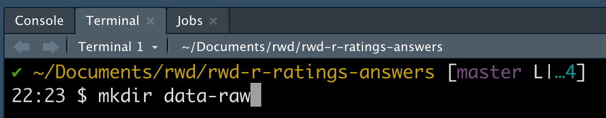
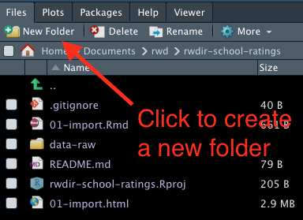
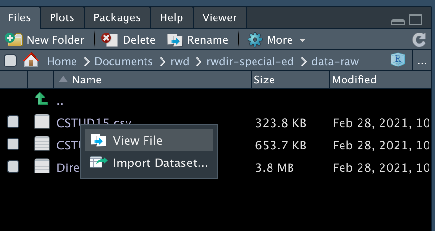
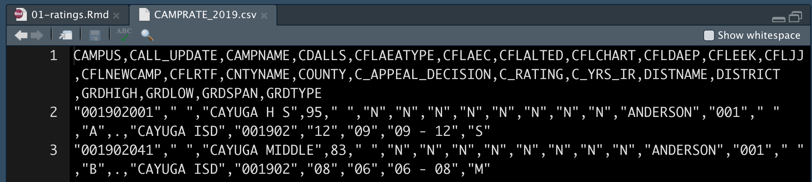
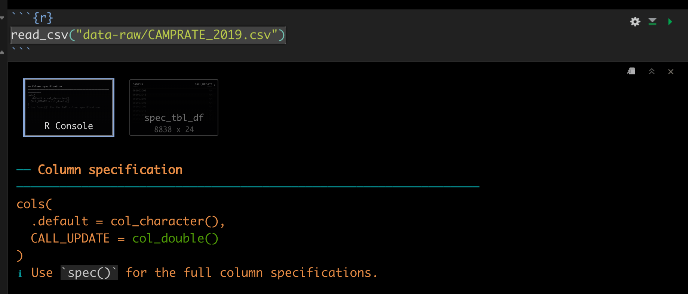
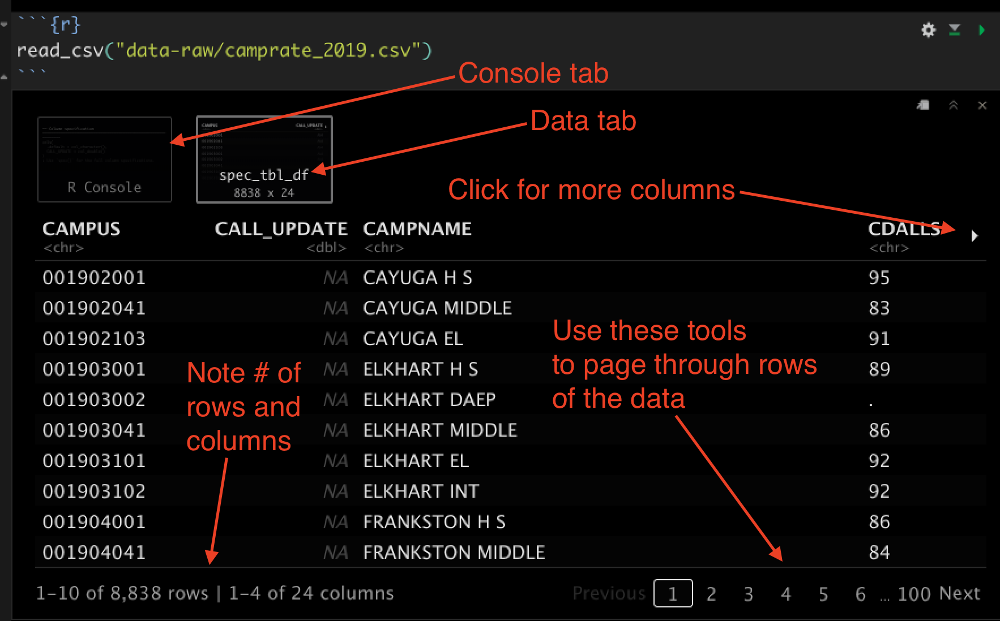

# Importing data {#import}

## Goals for this section

- Learn a little about data types available to R.
- Practice organized project setup.
- Learn about R packages, how to install and import them.
- Learn how to import CSV files.
- Introduce the Data Frame/Tibble.

We will do this through working with School Ratings data from the Texas Education Agency (the same data we used with the Sheets lesson.) We'll download the data again.

## Data types

After installing and launching RStudio, the next trick is to import data. Depending on the data source, this can be brilliantly easy or a pain in the rear. It all depends on how well-formatted is the data.

In this class, we will primarily be importing Excel files, CSVs (Comma Separated Value) and APIs (Application Programming Interface).

- CSVs are a kind of lowest-common-denominator for data. Most any database or program can import or export them.
- Excel files are good, but are often messy because humans get involved. There often have multiple header rows, columns used in multiple ways, notes added, etc. Just know you might have to clean them up before using them.
- APIs are systems designed to respond to programming. In the data world, we often use the APIs by writing a query to ask a system to return a selection of data. By definition, the data is well structured. You can often determine the file type of the output as part of the API call, including ...
- JSON (or JavaScript Object Notation) is the data format preferred by JavaScript. R can read it, too. It is often the output format of APIs, and prevalent enough that you need to understand how it works. We'll get into that later in semester.

Don't get me wrong ... there are plenty of other data types and connections available through R, but those are the ones we'll deal with most in the class.

### What is clean data

The Checking Your Data section of this [DataCamp tutorial](https://www.datacamp.com/community/tutorials/r-data-import-tutorial) has a good outline of what makes good data, but in general it should:

- Have a single header row with well-formed column names.
    + One column name for each column. No merged cells.
    + Short names are better than long ones.
    + Spaces in names make them harder to work with. Use and `_` or `.` between words.
- Remove notes or comments from the files.
- Each column should have the same kind of data: numbers vs words, etc.
- Each row should be a single thing called an "observation". The columns should describe that observation.

## Create a new project

We did this in our first lesson, but here are the basic steps:

- Launch RStudio
- Use the `+R` button to create a **New Project** in a **New Directory**
- Name the project `yourfirstname-ratings` and put it in your `~/Documents/rwd` folder.
- Use the `+` button to use **R Notebook** to start a new notebook.
- Change the title to "TEA School Ratings".
- Delete the other boilerplate text.
- Save the file as `01-ratings.Rmd`.

### The R Package environment

We have to back up from the step-by-step nature of this lesson and talk a little about the R programming language.

R is an open-source language, which means that other programmers can contribute to how it works. It is what makes R beautiful.

What happens is developers will find it difficult to do a certain task, so they will write an R "Package" of code that helps them with that task. They share that code with the community, and suddenly the R garage has an ["ultimate set of tools"](https://youtu.be/Y1En6FKd5Pk?t=24) that would make Spicoli's dad proud. 

One set of these tools is Hadley Wickham's [Tidyverse](https://www.tidyverse.org/), a set of packages for data science. These are the tools we will use most in this course. While not required reading, I highly recommend Wickham's book [R for data science](https://r4ds.had.co.nz/index.html), which is free. We'll use some of Wickham's lectures in the course.

There are also a series of useful [cheatsheets](https://www.rstudio.com/resources/cheatsheets/) that can help you as you use the packages and functions from the tidyverse. We'll refer to these throughout the course.

### Installing and using packages

There are two steps to using an R package:

- **Install the package** using `install.packages("package_name"). You only have to do this once for each computer, so I usually do it using the R Console instead of in notebook.
- **Include the library** using `library(package_name)`. This has to be done for each Notebook or script that uses it, so it is usually one of the first things in the notebook.

We're going to install several packages we will use in the ratings project. To do this, we are going to use the **Console**, which we haven't talked about much yet.

{width=600px}

- Use the image above to orient yourself to the R Console and Terminal.
- In the console, type in `install.packages("tidyverse")` and hit return.
  + As you type, you will see the Console will give you hints on what you need. You can use the arrow keys to select one and hit Tab to complete that command.
- If it asks you to install "from source", type `Yes` and hit return.


You'll see a bunch of commands work through your Console. Remember that you only have to install a package to your computer once.

We'll need another package, so also do:

```r
install.packages("janitor")
```

We'll use some commands from janitor to clean up our data column names, among other things. A good reference to learn more is the [janitor vignette](https://cran.r-project.org/web/packages/janitor/vignettes/janitor.html).

You only have to install the packages once on your computer (though you have to load them every time, which is explained below).

### Load the libraries

Next, we're going to tell our R Notebook to use these two libraries.

- After the metadata at the top of your notebook, use *Cmd+option+i* to insert an R code chunk.
- In that chunk, type in the two libraries and run the code block with *Cmd+shift+Return*.

This is the code you need:

```text
library(tidyverse)
library(janitor)
```

It will look like this:

{width=600px}


### Create a folder for your data

I want you to create a folder called `data-raw` in your project folder. I'm going to explain two ways, but you only need to do one of them.

#### Using Terminal

- In the bottom part of the RStudio window next to the Console window is another one called **Terminal**. Click on that and you have a method to talk to your computer using typed commands.
- Once you click on that and you'll get a flashing prompt after a `$`. Type in `mkdir data-raw` and hit return.



Once you hit return, the prompt will return with no errors (hopefully). But if you look at your files window to the right you'll see you created "made" a new directory (hence `mkdir`, as in make directory.)



That was pretty easy even if a bit technical. Welcome to the power of **Terminal**. It's quicker than the alternate method.

#### Make a directory using the file explorer

The other way to do this is to use your computer's regular file explorer to find your project file and make a new folder. Folders and directories are the same thing. If you had trouble with the above command, you can do it the old fashion way now. Hopefully you know how.

## Let's get some data

Now that we have a folder for our data, we can download our data into it. I have a copy of the data in the School Ratings Github assignment.

The process to download this data is explained in the [School Ratings](https://github.com/utdata/rwd-mastery-assignments/blob/master/ed-school-ratings/README.md) assignment in the RWD Mastery Assignments Github repository. Since we did that in an earlier assignment I won't make you do that again here, but I will give you an opportunity to learn something else new: the Terminal.

- Right-click on this link: [CAMPRATE_2019.csv](https://github.com/utdata/rwd-mastery-assignments/blob/master/ed-school-ratings/data/CAMPRATE_2019.csv?raw=true) and use "Save as" and use the prompt to save this file in the `data-raw` folder in your project.


### Inspect the data

We want to look at the data so we understand it.

- In the **Files** pane, click on the `data-raw` folder to open in.
- Click on the `CAMPRATE_2019.csv` file until you get the drop down that says View Files.



- The file _should_ open it just fine, into a new window. It will look like this:



The numbers on the left are row numbers in the file. Because lines will wrap in your window, those numbers let you know where each line starts.

We can see first row is our column headers and the first column is our `CAMPUS` ID. This ID identifies our campus.

Note that the real header for this file starts as line `5`, which means when we import this file, we need to skip the first four lines.

You can close this file now.

## Import csv as data

- Now we need to start adding some text to indicate what we are doing, which right now we are importing the file. So, write some text in Markdown that describes where the data came from and what it is.
    + Write where the data came from. Include the link to the web page.
    + Include which counties were included, and which 
- After your descriptions, add a new code chunk (*Cmd+option+i*).
- Inside the chunk, add the following and hit return, then I'll explain:

```r
read_csv("data-raw/WellRpts_County_Use.csv")
```

- `read_csv()` is the function we are using the load the data. This version from the **readr** package in the tidyverse is different from `read.csv` that comes with R. It is mo betta.
- Inside the parenthesis is the path to our data, inside quotes. If you start typing in that path and hit tab, it will complete the path. (Easier to show than explain).

This prints two things to our notebook, which are shown as tabs.

The first resultc called "R Console" shows what columns were imported and the data types. It's important to review these to make sure things happened the way that you want. When I look at this, I'm struck that the column names all start with "Textbox", which wasn't what I expected when I was looking at the data on the website. (FWIW, the fact the text is in **red** is NOT an indication of a problem.)



The second result prints out the data like a table. The data object is called a [Tibble](https://tibble.tidyverse.org/), which is a fancy version of a data frame that is part of the tidyverse.

> I will often call a tibble a "data frame", which is the generic R from of this data structure. Think of data frames and tibbles like a well-structured table in a spreadsheet. They are organized rows of data with columns where every item in the column is of the same data type.



What went wrong? Remember that our data doesn't really start until line five. We need to modify our import to skip the first for lines. But how does we find out how to do that? Help is on the way!!

### Help files

Another tab over by your **Files** pane is the **Help** pane.

- Click on the **Help** pane
- In the search box, type in `read_csv` and hit Return.

What you get in return is information about that function. Any function loaded into RStudio also comes with these help files. The documentation style might look foreign at first, but you'll get used to reading them.

If we look through this one, we can see there is a `skip = x` option we can add to our import to skip lines.

- Modify the import line to this and then rerun the entire chunk with *Cmd+shift+Return*:

```r
read_csv("data-raw/WellRpts_County_Use.csv", skip = 3)
```

I first tried `skip = 4`, but then it didn't properly use the header row, I _think_ because the readr package skips empty rows by default.

## Assign our data to a data frame

As of right now, we've only printed the data to our screen. We haven't "saved" it at all. What we need to do next is "assign" it to a data frame.

It's kind of weird, but the convention in R is to work from right to left. We _name_ things before we fill them with stuff. So, to create a data frame, the structure is this:

```r
new_data_frame <- stuff_going_into_new_data_frame
```

We have our stuff as the output of our `read_csv()` function ... now we need to assign it to a data frame we will call `wells`.

- Edit your existing code chunk to look like this:

```r
wells <- read_csv("data-raw/WellRpts_County_Use.csv", skip = 3)
```

Run that chunk and two things happen:

- We no longer see the result printed to the screen. That's because we created a data frame instead.
- In the **Environment** tab at the top-right of RStudio, you'll see `wells` listed.
    + Click on the blue play button next to wells and it will expand to show you a summary of the columns.
    + Click on the name and it will open a "View" of the data in another window, so you can look at it, sort of like a spreadsheet.

## Inspect the data

Now that you are looking at the data, take a look at both the data types in the Environment tab, along with the View of the data. Take special care to look at the data types and examples to see if they make sense to you. Some things to consider:

- Are numbers actually numbers or characters?
- Are there numbers that should be strings, like ZIP codes?
- Have integers been imported as double numbers or vice versa?
- Are dates imported properly?

### Write notes about things to change

- In text below the table output, I want you to write out a list of all the things you might have to fix in this data frame.

We'll fix them in the next lesson, as well as start looking more closely at the data.

## Turn in your project

Congratulations! You have created a new project in R and imported data. That is a feat of skill worth celebrating, so we will turn in this in as an assignment.

- Save your `.Rmd` file.
- Use the **Preview/Knit** button to Knit your report to HTML. Look your report over and make sure you like it.
- If you need to, edit your `.Rmd` file, save, reKnit.
- When you are ready, go under the **File** menu to **Close project**.
- Go into your computer's finder and locate your `firstnanme-wells` project.
- Create a `.zip` file of the folder.
- Upload it to the proper assignment in Canvas.

## Practice assignment: Import census

To practice these skills on your own, you'll create a new project and use new data. You'll work on it through multiple lessons, applying what you've learned along the way.

- Create a new Project called "firstname-census-practice". You'll want to save that inside your "rwd" folder so you can use it later. We'll keep building on it.
- Create a new folder in your project called "data-raw".
- Download this CSV file and put it into your data-raw folder: [DEC_10_SF1_TX_County_population.csv](https://drive.google.com/file/d/1L51qQbdW3dHXTdlvlHx3z5p8Py5Cgv2a/view). The data is 2010 Census populations by county and race for Texas.
- Start a new R Notebook with a good title and filename.
- Write text to describe the data set.
- Import the data using `read_csv()` and print the data to the screen.
- Compare the imported data to the original csv file and note any problems you might see with the column names or data types that you might want to fix.
- Save, Knit, and Zip the project folder and upload to the "Practice: Import" assignment.

## Resources

- This [DataCamp tutorial on imports](https://www.datacamp.com/community/tutorials/r-data-import-tutorial) covers a ton of different data types and connections.
