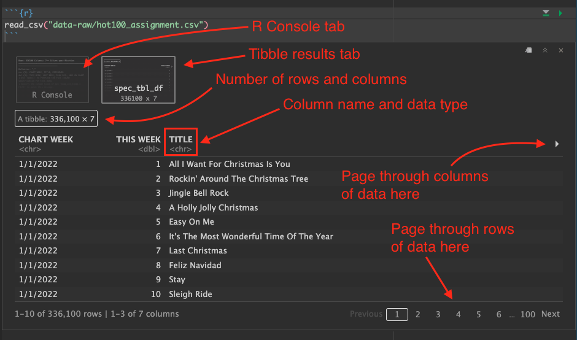
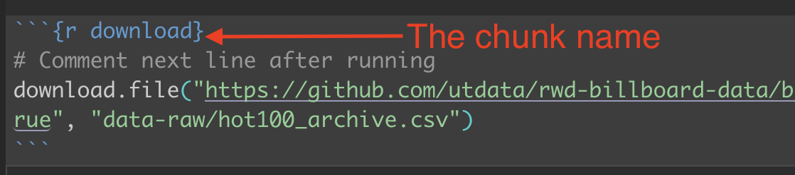

# Import {#import}

> “If you’re doing data analysis every day, the time it takes to learn a programming language pays off pretty quickly because you can automate more and more of what you do.” --Hadley Wickham, chief scientist at RStudio

## Learning goals of this lesson

- Practice organized project setup.
- Learn a little about data types available to R.
- Learn about R packages, how to install and import them.
- Learn how to download and import CSV files using the [readr](https://readr.tidyverse.org/) package.
- Introduce the Data Frame/Tibble.
- Introduce the tidyverse ` %>% `.
- Learn how to modify data types (date) and `select()` columns.

We'll be exploring the Billboard Hot 100 charts along the way. Eventually you find the answers to a bunch of questions in this data and write about it.

## Basic steps of this lesson

Before we get into our storytelling, we have to get our data and make sure it is in good shape for analysis. This is pretty standard for any new project. Here are the major steps we'll cover in detail for this lesson (and many more to come):

- Create your project structure
- Find the data and get it
- Import the data into your project
- Clean up data types and columns
- Export cleaned data for later analysis

## Create a new project

We did this once Chapter 2, but here are the basic steps:

1. Launch RStudio
1. Make sure you don't have an existing project open. Use File > Close project if you do.
1. Use the `+R` button to create a **New Project** in a **New Directory**
1. Name the project `yourfirstname-billboard` and put it in your `~/Documents/rwd` folder.
1. Use the `+` button and use **R Notebook** to start a new notebook.
1. Change the title to "Billboard Hot 100".
1. Delete the other boilerplate text.
1. Save the file as `01-import.Rmd`.

### Describe the goals of the notebook


We'll add our first bit of RMarkdown just after the meta data to explain what we are doing. Add this text to your notebook:

```rmarkdown
## Goals of this notebook

Steps to prepare our data:

- Download the data
- Import into R
- Clean up data types and columns
- Export for next notebook
```

We want to start each notebook with a list like this so our future selves and others know what the heck we are trying to accomplish.

We will also write comments like this for each new "section" or goal in the notebook.

### The R Package environment

We have to back up from the step-by-step nature of this lesson and talk a little about the R programming language.

R is an open-source language, which means that other programmers can contribute to how it works. It is what makes R beautiful.

What happens is developers will find it difficult to do a certain task, so they will write an R "Package" of code that helps them with that task. They share that code with the community, and suddenly the R garage has an ["ultimate set of tools"](https://youtu.be/Y1En6FKd5Pk?t=24) that would make Spicoli's dad proud. 

One set of these tools is Hadley Wickham's [Tidyverse](https://www.tidyverse.org/), a set of packages for data science. These are the tools we will use most in this course. While not required reading, I highly recommend Wickham's book [R for data science](https://r4ds.had.co.nz/index.html), which is free.

There are also a series of useful [cheatsheets](https://www.rstudio.com/resources/cheatsheets/) that can help you as you use the packages and functions from the tidyverse. We'll refer to these throughout the course.

### Installing and using packages

There are two steps to using an R package:

1. **Install the package** using `install.packages("package_name"). You only have to do this once for each computer, so I usually do it using the R Console instead of in notebook.
1. **Include the library** using `library(package_name)`. This has to be done for each Notebook or script that uses it, so it is usually one of the first things in the notebook.

> Note that you have to use "quotes" around the package name when you are installing, but you DON'T use quotes when you load the library.

We're going to install several packages we will use in this project. To do this, we are going to use the **Console**, which we haven't talked about much yet.

{width=600px}

1. Use the image above to orient yourself to the R Console and Terminal.
1. In the Console, type in:

```r
install.packages("tidyverse")
```

As you type into the Console, you'll see some type-assist hints on what you need. You can use the arrow keys to select one and hit Tab to complete that command, then enter the values you need.If it asks you to install "from source", type `Yes` and hit return.

You'll see a bunch of response in the Console.

1. We need two other packages as well, so also do:

```r
install.packages("janitor")
install.packages("lubridate")

```

We'll use janitor to clean up our data column names, among other things. A good reference to learn more is the [janitor vignette](https://cran.r-project.org/web/packages/janitor/vignettes/janitor.html).

We'll use [lubridate](https://lubridate.tidyverse.org/) to fix some dates, which are a special complicated thing in programming. Lubridate is part of the tidyverse universe, but we have to install and load it separately.

You only have to install the packages once on your computer (though you have to load them into each new notebook, which is explained below).

### Load the libraries

Next, we're going to tell our R Notebook to use these three libraries.

1. After the metadata at the top of your notebook, use *Cmd+option+i* to insert an R code chunk.
1. In that chunk, type in the two libraries and run the code block with *Cmd+Shift+Return*.

This is the code you need:

```{r setup, echo=T, message=F, warning=F}
library(tidyverse)
library(janitor)
library(lubridate)
```

Your output will look something like this:

{width=600px}

### Create a directory for your data

I want you to create a folder called `data-raw` in your project folder. We are creating this folder because we want to keep a pristine version of our original data that we never change or overwrite. This is a basic data journalism principle: _Thou shalt not change raw data_.

In your Files pane at the bottom-right of Rstudio, there is a **New Folder** icon.

1. Click on the **New Folder** icon.
1. Name your new folder `data-raw`. This is where we'll put raw data. We never write data to this folder.
1. Also create another new folder called `data-processed`. This is were we write data. We separate them so we don't accidentally overwrite raw data.

Once you've done that, they should show up in the file explorer in the Files pane. Click the refresh button if you don't see them. (The circlish thing at top right of the screenshot below. You might have to widen the pane to see it.)

{width=300px}

Your `.Rproj` file name is likely different (and that s OK) and you can ignore the `.gitignore` I have there.

### Let's get our data

Now that we have a folder for our data, we can download our data into it. The data was scraped and saved on [data.world](https://data.world/kcmillersean/billboard-hot-100-1958-2017) by Sean Miller, but you can just download my copy of the data using the `download.file` function in R.

For the purposes of this assignment, we will "source" the data as being from Billboard Media, as that who inititally provided it. I've worked with data fairly extensively, and it is sound.

1. Add a Markdown headline `## Downloading data` and on a new line text that indicates you are downloading data. You would typically include a link and explain what it is, etc, often linking to the original source.
1. Create an R chunk and include the following (hint: use the copy icon at the top right):

```r
# hot 100 download
download.file("https://github.com/utdata/rwd-billboard-data/blob/main/data-process/hot-100/hot100-orig.csv?raw=true", "data-raw/hot-stuff.csv")
```

This `download.file` function takes at least two arguments:

- The URL of the file you are downloading
- The path and name of where you want to save it.

Note those two arguments are in quotes. The path includes the folder name you are saving the file to, which we called `hot100.csv`.

When you run this, it should save the file and then give you output similar to this:

```text
trying URL 'https://github.com/utdata/rwd-billboard-data/blob/main/data-process/hot-100/hot100-orig.csv?raw=true'
Content type 'text/plain; charset=utf-8' length 45795374 bytes (43.7 MB)
==================================================
downloaded 43.7 MB
```

That's a pretty big file.

## About data sources

Depending on the data source, importing can be brilliantly easy or a major pain in the rear. It all depends on how well-formatted is the data.

In this class, we will primarily use data from CSVs (Comma Separated Value), Excel files and APIs (Application Programming Interface).

- **CSVs** are a kind of lowest-common-denominator for data. Most any database or program can import or export them. It's just text with a `,` between each value.
- **Excel** files are good, but are often messy because humans get involved. They often have multiple header rows, columns used in multiple ways, notes added, etc. Just know you might have to clean them up before or after importing them.
- **APIs** are systems designed to respond to programming. In the data world, we often use the APIs by writing a query to ask a system to return a selection of data. By definition, the data is well structured. You can often determine the file type of the output as part of the API call, including ...
- **JSON** (or JavaScript Object Notation) is the data format preferred by JavaScript. R can read it, too. It is often the output format of APIs, and prevalent enough that you need to understand how it works. We'll get into that later in semester.

Don't get me wrong ... there are plenty of other data types and connections available through R, but those are the ones we'll deal with most in this book.


## Our project data

Now that we've downloaded the data and talked about what data is, lets talk about our Billboard data specifically.

The data includes the Billboard's Weekly Hot 100 singles charts from its inception on 8/2/1958 through 2020. It is a modified version of data compiled by SEAN MILLER and posted on data.world. We are using a copy I have saved.

When you write about this data (and you will), you should source it as **the Billboard Hot 100 from Billboard Media**, since that is where the data comes from via an API.

## Data dictionary

This data contains weekly Hot 100 singles chart from Billboard.com. **Each row of data represents a song and the corresponding position on that week's chart.** Included in each row are the following elements:

- Billboard Chart URL
- WeekID
- Song name
- Performer name
- SongID - Concatenation of song & performer
- Current week on chart
- Instance (this is used to separate breaks on the chart for a given song. Example, an instance of 6 tells you that this is the sixth time this song has fallen off and then appeared on the chart)
- Previous week position
- Peak Position (as of the corresponding week)
- Weeks on Chart (as of the corresponding week)

Let's import it so we can _see_ the data.

## Import the data

Since we are doing a new thing, we should note that with a Markdown headline and text. 

1. Add a Markdown headline: `## Import data`
1. Add some text to explain  that we are importing the Billboard Hot 100 data.
1. After your description, add a new code chunk (*Cmd+Option+i*).

We'll be using the `read_csv()` function from the tidyverse [readr](https://readr.tidyverse.org/) package, which is different from `read.csv` that comes with base R. It is mo betta.

Inside the function we put in the path do our data, inside quotes. If you start typing in that path and hit tab, it will complete the path. (Easier to show than explain).

1. Add the follow code into your chunk and run it.

```r
read_csv("data-raw/hot-stuff.csv")
```

> Note the path is in quotes.

You get two results printed to your screen.

The first result called **"R Console"** shows what columns were imported and the data types. It's important to review these to make sure things happened the way that expected. In this case it noted which columns came in as text (`chr`), or numbers (`dbl`).

Note: **Red** colored text in this output is NOT an indication of a problem.

{width=600}

The second result **spec_tbl_df** prints out the data like a table. The data object is a [tibble](https://tibble.tidyverse.org/), which is a fancy tidyverse version of a "data frame".

> I will use the term tibble and data frame interchangably. Think of tibbles and data frames like a well-structured spreadsheet. They are organized rows of data (called observations) with columns (called variables) where every column is a specific data type.

{width=600}

When we look at the data output into RStudio, there are several things to note:

- Below each column name is an indication of the data type. This is important.
- You can use the arrow icon on the right to page through the additional columns.
- You can use the paging numbers and controls at the bottom to page through the rows of data.
- The number of rows and columns is displayed.

Of special note here, we have only printed this data to the screen. We have not saved it in any way, but that is next.

## Assign our import to a tibble

As of right now, we've only printed the data to our screen. We haven't "saved" it at all. Next we need to assign it to an **R object** so it can be named thing in our project environment so we can reuse it. We don't want to re-import the data every time we use the data.

The syntax to create and object in R can seem weird at first, but the convention is to name the object first, then insert stuff into it. So, to create an object, the structure is this:

```r
# this is pseudo code. don't run it.
new_object <- stuff_going_into_object
```

Let's make a object called `hot100` and fill it with our imported tibble.

1. Edit your existing code chunk to look like this. You can add the `<-` by using _Option+-_ as in holding down the Option key and then pressing the hyphen:

```{r hot100_assign, message=FALSE, warning=FALSE, include=TRUE, results=FALSE}
hot100 <- read_csv("data-raw/hot-stuff.csv")
```

Run that chunk and several things happen:

- We no longer see the result of the data printed to the screen. That's because we created a tibble instead of printing it to the screen. You do get the RConsole output.
- In the **Environment** tab at the top-right of RStudio, you'll see the `hot100` object listed.
    + Click on the blue play button next to ratings and it will expand to show you a summary of the columns.
    + Click on the name and it will open a "View" of the data in another window, so you can look at it in spreadsheet form. You can even sort and filter it.
- Once you've looked at the data, close the data view with the little `x` next to the tab name.

### Print a peek to the screen

Since we can't see the data after we assign it, let's print the object to the screen so we can refer to it.

1. Edit your import chunk to add the last two lines of this, including the one with the `#`:

```r
hot100 <- read_csv("data-raw/hot100.csv")

# peek at the data
hot100
```

> You can use the green play button at the right of the chunk, or preferrably have your cursor inside the chunk and do _Cmd+Shift+Return_ to run all lines. (_Cmd+Return_ runs only the current line.)

This prints your saved tibble to the screen.

The line with the `#` is a comment _within_ the code chunk. Commenting what your code is important to your future self, and sometimes we do that within the code chunk instead of markdown if it will be more clear.

### Glimpse the data

There is another way to peek at the data that I prefer because it is more compact and shows you all the columns and data examples without scrolling: `glimpse()`.

1. In your existing chunk, edit the last line to add the `glimpse()` function as noted below.

I'm showing the return here as well. Afterward I'll explain the pipe: ` %>% `.

```r
hot100 <- read_csv("data-raw/hot-stuff.csv")

# peek at the data
hot100 %>% glimpse()
```


```{r hot100-glimpse-notebook, echo=F, message=F, warning=F}
hot100 <- read_csv("data-raw/hot-stuff.csv")

# peek at the data
hot100 %>% glimpse()
```

Here you get the RConsole printout (hidden here for clarity), plus the glimpse shows there are 300,000+ rows and 10 columns in our data. Each column is then listed out with its data type and the first several values in that column.

### About the pipe %>%

We need to break down this code a little: `hot100 %>% glimpse()`.

We are starting with the tibble `hot100`, but then we follow it with ` %>% `, which is called a pipe. It is a tidyverse tool that allows us to take the **results** of an object or function and pass them into another function. Think of it like a sentence that says **"AND THEN" the next thing**.

It might look like there are no arguments inside `glimpse()`, but what we are actually doing is passing the `hot100` tibble into it.

You can't start a new line with a pipe. If you are breaking into multiple lines, but the ` %>% ` at the end.

> IMPORTANT: There is a keyboard command for the pipe ` %>% `: **Cmd+Shift+m**. Learn that one.

### What is clean data

The "Checking Your Data" section of this [DataCamp tutorial](https://www.datacamp.com/community/tutorials/r-data-import-tutorial) has a good outline of what makes good data, but in general it should:

- Have a single header row with well-formed column names.
    + One column name for each column. No merged cells.
    + Short names are better than long ones.
    + Spaces in names make them harder to work with. Use and `_` or `.` between words. I prefer `_` and lowercase text.
- Remove notes or comments from the files.
- Each column should have the same kind of data: numbers vs words, etc.
- Each row should be a single thing called an "observation". The columns should describe that observation.

Data rarely comes clean like that. There can be many challenges importing and cleaning data. We'll face some of those challenges here. In our case our columns names could use help, and our field `WeekID` is not really a date, but text characters. We'll tackle those issues next.

## Cleaning column names

So, given those notes above, we should clean up our column names. This is why we have included the janitor package, which includes a neat function called `clean_names()`

1. Edit the first line of your chunk to add a pipe and the clean_names function: ` %>% clean_names()`

```{r hot100-clean-names, eval = TRUE, message=F, warning=F}
hot100 <- read_csv("data-raw/hot-stuff.csv") %>% clean_names()

# peek at the data
hot100 %>% glimpse()
```

This function has cleaned up your names, making them all lowercase and using `_` instead of periods between words. Believe me when I say this is helpful later to auto-complete column names when you are writing code.

## Fixing the date

Dates are a tricky datatype because you can do math with them. To use them properly in R we need to convert them from the text we have here to a _real date_.

Converting dates can be a pain, but the tidyverse universe has a package called [lubridate](https://lubridate.tidyverse.org/) that can help us with that.

Since we are doing something new, we want to start a new section in our notebook and explain what we are doing.

1. Add a headline: `## Fix our dates`.
1. Add some text that you are using lubridate to create a new column with a real date.
1. Add a new code chunk. Remember _Cmd+Option+i_ will do that.

We are going to start by creating a new data frame that is the same as our current on, and then add a glimpse so we can see the results as we build upon it.

1. Add the following inside your code chunk.

```{r date-base}
# part we will build on
hot100_date <- hot100

# peek at the result
hot100_date %>% glimpse()
```

A refresher to break this down:

- I have a comment starting with `#` to explain the first part of the code
- We are taking the `hot100` object and pushing it into a new object called `hot100_date`.
- I have a blank line for clarity
- Another comment
- We glimpse the new `hot100_date` object so we can see changes as we work on it.

> To be clear, we haven't changed any data yet. We just created a new tibble like the old tibble.

### Working with mutate()

We are going to replace our current date field `week_id` with a converted date. We use a dplyr function [`mutate()`](https://dplyr.tidyverse.org/reference/mutate.html) to do this, with some help from lubridate.

> [dplyr](https://dplyr.tidyverse.org/) is the tidyverse package of functions to manipulate data. We'll use it a lot. It is loaded with the `library(tidyverse)`.

Let's explain how mutate works first. Mutate changes every value in a column. We can either create a new column or overwrite an existing one.

Within the mutate function, we name the new thing first (confusing I know) and the set the value of that new thing.

```r
# this is psuedo code. Don't run it.
data %>% 
  mutate(
    newcol = oldcol
  )
```

That new value could be arrived at through math or any combination of other functions. In our case, we want to convert our old text-based date to a _real date_, and then assign it back to the "new" column, **but really we are overwriting the existing one**.

Some notes about the above:

- It might seem weird to list the new thing first when we are changing it, but that is how R works in this case. You'll see that pattern elsewhere, like we have already with assigning data into tibbles.
- We need to be careful when we overwrite data. In this case I feel comfortable doing so because we are creating a new tibble at the same time, so I still have my original data in my project.
- I strategically used returns to make the code more readable. This code would work the same if it were all on the same line, but writing it this way helps me understand it. RStudio will help you indent properly this as you type. (Easier to show than explain.)

1. Edit your chunk to add the changes below and run it. I **implore** you to _type_ the changes so you see how RStudio helps you write it. Use tab completion, etc.

```{r date-mutate}
# part we will build on
hot100_date <- hot100 %>% 
  mutate(
    week_id = mdy(week_id)
  )

# peek at the result
hot100_date %>% glimpse()
```

What we did there with your `mutate()` function was name our **new** column but we used the name of an existing one `week_id` so it will really **replace** the data. We replaced it with a lubridate function which I'll explain next.

Lubridate allows us to parse text and then turn it into a date if we supply the order of the date values in the original data.

- Our original date was something like "07/17/1965". That is month, followed by day, followed by year.
- The lubridate function `mdy()` converts that text into a _real_ date, which properly shows as YYYY-MM-DD, or year then month then day. Lubridate is smart enough to figure out if you have `/` or `-` between your values in the original date.

If your original text is in a different date order, then you look up what function you need. I typically use the **cheatsheet** that you'll find on the [lubridate page](https://lubridate.tidyverse.org/). You'll find them in the PARSE DATE-TIMES section.

## Arrange the data

If you inspect our newish `week_id` in your glimpse return, you'll notice the first record starts in "1965-07-17" but our data goes back to 1958. We want to sort our data by the oldest records first using `arrange()`.

We will use the `%>%` and then the arrange function, feeding it our data (implied with the pipe) and the columns we wish to sort by.

1. Edit your chunk to the following:

```{r clean-date}
# part we will build on
hot100_date <- hot100 %>% 
  mutate(
    week_id = mdy(week_id)
  ) %>%
  arrange(week_id, week_position)

# peek at the result
hot100_date %>% glimpse()
```

Now when you look at the glimpse, the first record is from "1958-08-02" and the first `week_position` is "1", which is the top of the chart.

Just to see this all clearly in table form, we'll print the top of the table to our screen so we can see it.

1. Add a line of text in your notebook explaining your are looking at the table.
1. Add a new code chunk and add the following.

> The result will look different in your notebook vs this book.

```{r date-done-peek}
hot100_date %>% head(10)
```

This just prints the first 10 lines of the data.

1. Use the arrows to look at the other columns of the data (which you can't see in the book).

## Selecting columns

We don't need all of these columns for our analysis, so we are going to **select** only the ones we need. This will make our exported data file smaller. To understand the concept, you can review the [Select](https://vimeo.com/showcase/7320305) video in the Basic Data Journalism Functions series.

It boils down to this: We are selecting only the columns we need. In doing so, we will drop `url`, `song_id` and `instance`.

1. Add a Markdown headline: `## Selecting columns`.
1. Explain in text we are tightening the date to only the columns we need.
1. Add the code below and then I'll explain it.

```{r select}
hot100_tight <- hot100_date %>% 
  select(
    -url,
    -song_id,
    -instance
    )

hot100_tight %>% glimpse()
```

In our code we:

- Name our new tibble
- Assign to a result of the hot100_date tibble
- In that tibble, we use the select statement to remove (using `-`) certain columns.

Alternately, we could just name the columns we want to keep without the `-` sign. But there were fewer to remove than keep.

> To be clear, there are other ways to use [`select()`](https://dplyr.tidyverse.org/reference/select.html) this that use less code, but I want to be as straigtforward as possible at this point. It's pretty powerful.

## Exporting data

### Single-notebook philosophy

I have a pretty strong opinion that you should be able to open any RNotebook in your project and run it from top to bottom without it breaking. In short, one notebook should not be dependent on the previous running of another open notebook.

This is why I had you name this notebook `01-import.Rmd` with a number 1 at the beginning. We'll number our notebooks in the order they should be run. It's an indication that before we can use the notebook `02-analysis` (next lesson!) that the `01-import.Rmd` notebook has to be run first.

> I use `01-` instead of just `1-` in case there are more than nine notebooks. I want them to appear in order in my files directory. I'm anal retentive.

So we will create an exported file from our first notebook that can be used in the second one. Once we create that file, the second notebook can be opened and run at any time.

Why make this so complicated?

The answer is **consistency**. When you follow the same structure with each project, you quickly know how to dive into that project at a later date. If everyone on your team uses the same structure, you can dive into your teammates code because you already know how it is organized. If we separate our importing/cleaning into it's own file to be used by many other notebooks, we can fix future cleaning problems in ONE place instead of many places. 

One last example to belabor the point: It can save time. I've had import/cleaning notebooks that took 20 minutes to process. Imagine if I had to run that every time I wanted to rebuild my analysis notebook. Instead, the import notebook spits out clean file that can be imported in a fraction of that time.

This was all a long-winded way of saying we are going to export our data now.

### Exporting as rds

We are able to pass cleaned data between notebooks because of a native R data format called `.rds`. When we export in this format it saves not only rows and columns, but also the data types. (If we exported as CSV, we would potentially have to re-fix the date or other data types when we imported again.)

We will use another readr function called `write_rds()` to create our file to pass along to the next notebook, saving the data into the `data-processed` folder we created earlier. We are separating it from our data-raw folder because "Thou shalt not change raw data" even by accident. By always writing data to this different folder, we help avoid accidentally overwriting our original data.

1. Create a Markdown headline `## Exports` and write a description that you are exporting files to .rds.
1. Add a new code chunk and add the following code:

<!-- running this code to get output for future chapter -->

```{r export}
hot100_tight %>% 
   write_rds("data-processed/01-hot100.rds")
```

So, we are starting with the sped data frame that we saved earlier. We then pipe ` %>% ` the result of that into a new function `write_rds()`. In addition to the data, the function needs to who where to save the file, so in quotes we give the path to where and what we want to call the file: `"data-processed/hot100.rds"`.

Remember, we are saving in data-processed because we never export into data-raw. We are naming the file starting with `01-` to indicate to our future selves that this output came from our first notebook. We then name it, and use the `.rds` extension.

## Naming chunks

I didn't want to break our flow of work to explain this earlier, but I want you to name all your chunks so you can use a nice feature in RStudio to jump up and down your notebook.

Let me show you and example of why first. Look at the bottom of your window above the console and you'll see a dropdown window. Click on that.

Here is mine, but yours wlll be different:

{width=400}

You'll notice that my chunks have names, but yours probably don't. It's pretty helpful have these names so you know what the chunk does. You can use this menu to skip up and down the notebook.

How to name a chunk? Well, I can't show you in code because it is not rendered in the book, but here is a picture:

{width=500}

See where I have `{r download}`? I named it that because that is what the chunk does.

- Chunk names can't have spaces. Use a single word or `-` or `_` between words.
- There are other configurations we can do here, but that is for later.

1. Go back through your notebook and name all your chunks.
1. Under the **Run** menu, choose **Restart R and run all chunks**.

Make sure that your Notebook ran all the way from top to bottom. The order of stuff in the notebook matters and you can make errors as you edit up and down the notebook. You **Always** want to do this before you finish a notebook.

## Knit your page

Lastly, we want to Knit your notebook so you can see the pretty HTML verison.

1. Next to the **Preview** menu in the notebook tool bar, click the little dropdown to see the knitting options.
1. Choose **Knit to HTML**.

{width=300}

After you do this, the menu will probably change to just **Knit** and you can just click on it to knit again.

This will open a nice reader-friendly version of your notebook. You could send that file (called `01-import.html`) to your editor and they could open it in a web browser.

> I use these knit files to publish my work on Github, but it is a bit more involved to do all that so we'll skip it at least for now.)

## Review of what we've learned so far

Most of this lesson has been about importing and combining data, with some data mutating thrown in for fun. (OK, I have an odd sense of what fun is.) Importing data into R (or any data science program) can sometimes be quite challenging, depending on the circumstances. Here we were working with well-formed data, but we still used quite a few tools from tidyverse packages like readr (read_csv, write_rds) and dplyr (select, mutate).

Here are the functions we used and what they do. Most are linked to documentation sites:

- `install.packages()` downloads an R package to your computer. Typically executed from within the Console and only once per computer. We installed the [tidyverse](https://www.tidyverse.org/packages/), [janitor](https://cran.r-project.org/web/packages/janitor/vignettes/janitor.html) and [lubridate](https://lubridate.tidyverse.org/) packages.
- `library()` loads a package. You need it for each package in each notebook, like `library(tidyverse)`.
- [`read_csv()`](https://readr.tidyverse.org/reference/read_delim.html) imports a csv file. You want that one, not `read.csv`.
- `clean_names()` is a function in the [janitor](https://cran.r-project.org/web/packages/janitor/vignettes/janitor.html) package that standardizes column names.
- [`glimpse()`](https://www.rdocumentation.org/packages/dplyr/versions/0.3/topics/glimpse) is a view of your data where you can see all of the column names, their data type and a few examples of the data.
- `head()` prints the first 6 rows of your data unless you specify a different integer within the function.
- [`mutate()`](https://dplyr.tidyverse.org/reference/mutate.html) changes data. You can create new columns or overwrite existing ones.
- `mdy()` is a [lubridate](https://lubridate.tidyverse.org/) function to convert text into a date. There are other functions for different date orders.
- [`select()`](https://dplyr.tidyverse.org/reference/select.html) selects columns in your tibble. You can list all the columns to keep, or use `-` to remove columns. There are many variations.
- [`write_rds()`](https://readr.tidyverse.org/reference/read_rds.html) writes data out to a file in a format that preserves data types.

## Turn in your work

It's likely I'll have you turn in your project at this point. See Canvas for the assignment and review the steps to compress the files in the Intro chapter.
