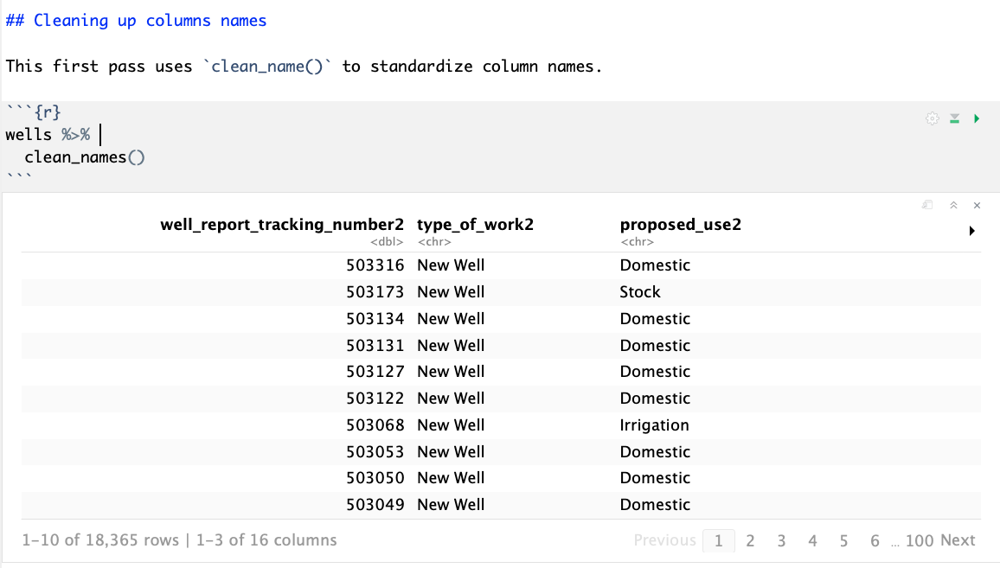

# Columns {#columns}

## Goals of this lesson

- Use the janitor plugin to clean columns names
- Mass rename columns with a pattern match
- Rename individual columns
- Fix data columns and other data types

## Relaunch the Wells project

- Launch RStudio. It _might_ open to your last project, but I tried to turn that off in preferences our first day. Hollar if that happens.
- Open your Wells project. There are several ways you can accomplish this:
    + If you've had the project open before, you can use the drop down in the top-right of RStudio to see a list of recent projects, and choose it from there.
    + Or, under the **File** menu to **Recent projects** and choose it.
    + Or, under **File** you can use **Open Project...** and go to that folder and choose it.
- Use the **Run** button in the R Notebook toolbar to **Run All** of the chunks, which will load all your data and load the data frame from our last assignment.

## Clean up column names

I'm a bit anal about cleaning up column names in my data frames, because it makes them easier to work with. We'll use a function called `clean_names` from the "janitor" package to fix them.

- After your list of things to fix, write a Markdown headline `## Clean column names`. Using the `##` makes this a smaller headline than the title. The more `###` the smaller the headline. The idea is to use these to organize your code and thoughts.
- Explain in text that we'll use janitor to clean the column names.
- Insert a new code chunk (*Cmd+shift+i* should be second nature by now.)
- Insert the name of your `wells_raw` data frame and run it to inspect the column names again.

These are not _too_ bad, but they are a mix of upper and lowercase names, and some of them are rather long. We'll try the janitor `clean_names` function first.

- Wrap the data frame name in the clean_names function like this, then rerun it:

```r
clean_names(wells_raw)
```
And you'll get a result like this:

{width=600px}

Now, we haven't _actually_ changed the names yet, we just printed it to the screen with new names. We have to assign those changes to the same data frame, or a new one, to make them stay. Let's assign them to a NEW data frame called `wells`, so we can keep the raw version around to compare.

- Update that same chunk of code to assign the clean names to a new data frame called wells.
- Then print `wells` to the screen so you can see the changes.

Like this:

```r
wells <- clean_names(wells_raw)
wells
```

It looks the same, but now it is saved as `wells`.

This is a start. We still have some problems:

- Some long names, like "well_report_tracking_number2".
- We have an annoying trailing "2" at the end of all the column names.

Let's remove the trailing "2" first.

### Mass renaming of columns

We can access all the column names of a data frame with a generic R function called [names](https://www.rdocumentation.org/packages/base/versions/3.5.2/topics/names), and we can use a pattern matching replacement called `sub()` to change them. I admit, I had no idea how to do this, so I Googled "tidyverse remove a character from a column name" and found [this link](http://r.789695.n4.nabble.com/Remove-part-of-string-in-colname-and-calculate-mean-for-columns-groups-td1014652.html). It was NOT the first result ... I had to look through several answers AND THAT IS PART OF LEARNING. Googling is probably the most important skill for a programmer.

 - Write in text that we are going to change the names of all the columns to remove the "2".
 - Create a new code block and insert this:

```r
names(wells)
```

What we get in return is a list of all the names of our data frames. Cool, that means we can reassign them with new values.

- Update that code chunk to this:
 
```r
names(wells) <- sub("*2", "", names(wells)) 
wells
```

Run it, see the magic and then I'll explain:

- The first `names(wells)` refers to the column "names" of wells, and the `<-` indicates are will assign new names.
- The `sub()` function has three parts:
    + The first set of quotes is what we are searching for: `"*2"`. The `*` is a wildcard meaning any number of any characters until we find a "2". This is a pattern matching technique called Regular Expressions that we will learn more about later.
    + The next set of quotes is what we are replacing our match with. Since we don't want to keep the "2", we replace it with an empty string.
    + The last bit is what we are searching through. We are searching through the column names of wells, hence `names(wells)`.

So in short, we are substituting the "names" in `wells` with the existing names in `wells`, but replacing the "2" with nothing.

Perhaps this is complicated for so early in this course, but it is a powerful intro into Regular Expressions that we'll cover in more detail later.

### Renaming individual columns

Renaming individual columns is a lot less complicated, and it allows us to introduce the concept of "piping" the results of one command into another, a core component of the tidyverse.

- Add text that we are going to rename two columns: well_report_tracking_number and plugging_report_tracking_number.
- Add a new code chunk and print the `wells` data frame.
- Go back into that code chunk and add the following:

```r
wells %>% 
  rename(well_number = well_report_tracking_number)
```

We will use the `%>%` pipe command _a lot_, so it is worth knowing that the keyboard command *Cmd+shift+m* will give you that string. Now, I didn't invent this keyboard command, but you might remember that Professor **M**cDonald taught it to you. It will serve you well.

Think of the ` %>% ` command as "Then". We have `wells`, THEN we are renaming the column.

Do *Cmd+Return* to run that line, and you'll see the changed column name. Note that is ONE line of code, even though it is written in multiple lines.

You'll find that we will be piping multiple commands together like this as we learn more about the tidyverse.

Have you figured out how the the `rename` function works?

```r
rename(new_column_name = old_column_name)`
```

It seems backward to me, but it works. Assignments in R seem to work from-right-to-left, sort of like `<-`.

Now, let's edit this to change the other column as well. `plugging_report_tracking_number` is the last column of the data and super long, so let's change that, too. We can do it in the same command.

- In the same code chunk, add a comma and a return before the ending `)`.
- add the new column mapping, like this:

```r
wells %>% 
  rename(well_number = well_report_tracking_number,
         plug_number = plugging_report_tracking_number)
```

Note the indents there. RStudio probably indented it properly for you, but it's done that way so you can visually see that these are related.

One last thing here: Like the `clean_names` function (and unlike `names`), we haven't actually saved these changes, we've only printed them to the screen. To save the change, we need to assign it back to `wells`, then we can print the saved data frame out again:

```r
wells <- wells %>% 
  rename(well_number = well_report_tracking_number,
         plug_number = plugging_report_tracking_number)
wells
```

### Fix dates, lubridate and mutate

Fixing dates in generic R can be a semi-complicated process. Luckily, there is a library within the tidyverse called [lubridate](https://lubridate.tidyverse.org/) that makes date conversions simple. The package was included when we installed the tidyverse package, but we need to add the library.

- Go back to the top of your R Notebook where the libraries are loaded, and add this line and run it: `library(lubridate)`.
- Return back to the bottom of the Notebook and add text in Markdown describing that you will use lubridate to convert the date fields.
- Insert a new code chunk and add and run this, then I'll explain it:

```r
wells %>%
  mutate(drilling_start_date = mdy(drilling_start_date))
wells
```

- The first `wells` means we are starting with that data frame.
- `mutate()` is a conversion tool, and not just for dates. We will use this command to change and create all kinds of changes.
- The first argument of `mutate` is the name of the new column. In this case, we are changing the _existing_ column, so we are using `drilling_start_date`.
- `=` is the assignment operators. What is on the right will be put into the left.
- `mdy(drilling_start_date)` is the lubridate function. We are telling lubridate that the _existing_ format of the field that we want to be a date is in Month/Day/Year format. Lubridate is smart enough to realize the `/` separates the dates, and it would also understand if the separators were `-` or `.`.

#### Your turn

It's time for you to use some of the skills you've learned already to accomplish a couple of easy tasks:

- Update the `mutate()` function above to also update `drilling_end_date` field to a date. Hint: `mutate` is a tidyverse function just like `rename`, so it works similarly.
- Assign the changes you've made back to the  `wells` data frame and then reprint it to make sure it's all good.

### Fix the bore hole depth

If you look at the CSV data, the `borehole_depth` is and integer (a number without a decimal point), but it was imported as a `<dbl>` number with decimals. This _could_ cause us problems later if we wanted to math on these, so we'll convert this to an integer using `mutate()`.

- Add a Markdown headline and description to describe our actions.
- Add a code chunk and add the following and run it:

```r
wells %>% 
  mutate(borehole_depth = as.integer(borehole_depth))
wells
```

This will reassign that column as an integer. How did I know to use `as.integer`? I Googled "r convert float to integer" and found [this tutorial](http://www.r-tutor.com/r-introduction/basic-data-types/integer) and this [Stack Overflow article](https://stackoverflow.com/questions/11638303/how-to-convert-num-to-int-in-r).

> A side note about this: I didn't realize this might be a problem until a later lesson. If I found a problem like this in Excel, I would have to redo all my steps, but since I'm using a script, I was able to make this change and then rerun the notebook.

As a last step, we have to **reassign our mutated data frame back to wells**, so change the first line to `wells <- wells %>% `.

## Export the data

It's not a bad idea to organize a project into multiple R Notebooks. I'll often create my first notebook to complete the tasks of downloading and cleaning up data, and then create a new one to handle analysis, etc. (This is why I had you name the files **01-**wells.Rmd.) It's possible to output the data frame you have created with all the changes and datatypes into a special `.rds` format that will re-import into R in exactly the same form. We'll do that now.

- Use the **Files** pane to create a **New Folder** called `data-out`.
- Create a new text header and text description to explain that you are exporting the data. (If the folder doesn't exist already, you'll get an error trying save the file.)
- Create a new code chunk and add the following and run it:

```r
saveRDS(wells, "data-out/wells_01.rds")
```

- `saveRDS()` is the function.
- The first argument is the data frame you are exporting.
- The second argument is the path.

Use your **Files** pane to make sure it worked.

Congratulations! You finished this chapter, having renamed columns and changed data types. Depending on where we are in the week, you _may_ be asked to turn this in at this stage. In any event, you should save and Knit your files.


