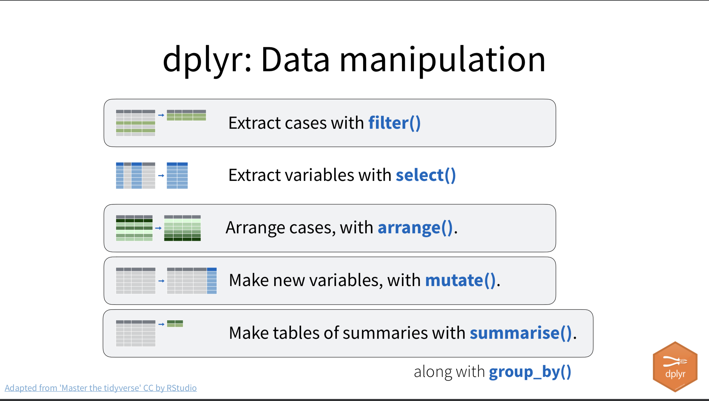
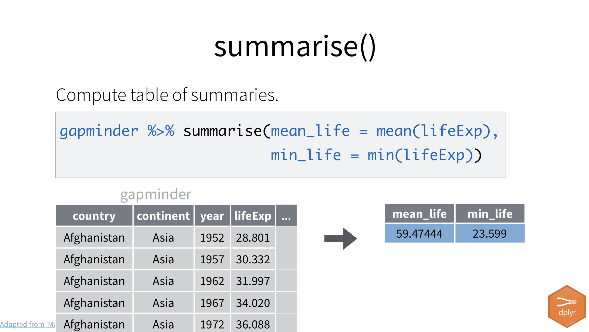

---
output:
  pdf_document: default
  html_document: default
---
# Summarize with count - analysis {#count-analysis}

This chapter is by Prof. McDonald and keyboard commands and screenshots are from  macOS.

This chapter continues the Billboard Hot 100 project. In the previous chapter we downloaded, imported and cleaned the data. We'll be working in the same project.

## Goals of this lesson

- To use the group_by/summarize/arrange combination to count rows of data.
- To use filter in two ways: to focus data before summarizing, and to logically end summarized lists.
- We'll also cover some more complex filters using and/or.
- Introduce the shortcut `count()` function

## The questions we'll answer

Now that we have the Billboard Hot 100 charts data in our project it's time to find the answers to the following questions:

- Which performer had the most appearances on the Hot 100 chart at any position?
- Which song/performer combination has been on the charts the most number of weeks at any position?
- Which song/performer combination was No. 1 for the most number of weeks?
- Which performer had the most songs reach No. 1?
- Which performer had the most songs reach No. 1 in the most recent five years?
- Which performer had the most Top 10 hits overall?

> What are your guesses for the questions above? NO PEEKING!

In each case we'll talk over the logic of finding the answer and the code to accomplish it.

Before we can get into the analysis, we want to set up a new notebook to separate our cleaning from our analysis.

## Setting up an analysis notebook

At the end of the last notebook we exported our clean data as an `.rds` file. We'll now create a new notebook and import that data. It will be much easier this time.

1. If you don't already have it open, go ahead and open your Billboard project.
1. If your import notebook is still open, go ahead and close it.
1. Use the `+` menu to start a new **R Notebook**.
1. Update the title as "Billboard analysis" and then remove all the boilerplate text below the YAML metadata.
1. Save the file as `02-analysis.Rmd` in your project folder.
1. Check your Environment tab (top right) and make sure the environment is empty. We don't want to have any leftover data. If there is, then go under the **Run** menu and choose **Restart R and Clear Output**.

Since we are starting a new notebook, we need to set up a few things. First up we want to list our goals.

1. Add a headline and text describing the goals of this notebook. You are exploring the Billboard Hot 100 charts data.
1. Go ahead and copy all the questions we outlined above into your notebook.
1. Format those questions as a nice list. Start each line with a `-` or `*` followed by a space. There should be a blank line above and below the entire LIST but not between the items. List tiems should be on sequential lines ... and it is the only markdown item like that.
1. Now add a another headline (two hashes) called Setup.
1. Add a chunk, also name it "setup" and add the tidyverse library.
1. Run the chunk to load the library.

```{r setup, echo=F, message=F, warning=F}
library(tidyverse)
```

### Import the cleaned data

We need to import the data that we cleaned and exported in the last notebook. It's just a couple of lines of code and you could write them all out and run it, but here is where I tell you for the first of a 1,000 times:

**WRITE ONE LINE OF CODE. RUN IT. CHECK THE RESULTS. REPEAT.**

Yes, sometimes for the sake of brevity I will give you multiple lines of code at once, but to understand what is actually going on you should add and run that code one line at a time.

We'll painstakingly walk through that process here to belabor the point. Here are our goals for this bit:

- Document that we are importing clean data
- Import our cleaned data
- Fill an R object with that data
- Glimpse the R Object so we can check it

I want you to:

1. Start a Markdown section with a headline noting you are importing the cleaned data. Add any other text notes you might need for yourself.
1. Add a code chunk and name it "import".
1. In your code chunk, add this line of code:

```r
read_rds("data-processed/01-hot100.rds")
```

This `read_rds()` function is just like the `read_csv()` function we used in our last notebook to read in data from our computer, except we are reading a different kind of file format: RDS. The argument (in quotes) is the path where our file is on our computer.

1. Run that line of code.

What did you expect to happen? It should print the results of the data in your notebook. Did it?

If you got an error, you should read that error output for some clues about what happened. When using a `read_` function problems are usually about the path ... that you have the folder structure wrong or something misspelled.

> CATCHING COMMON MISTAKES: This guide about [common R mistakes](https://nickch-k.github.io/DataCommSlides/Lecture_04_Common_R_Problems.html) is worth bookmarking and reading.

Our next goal is to take all that data and put it into a new R object.

1. **Edit** your one line of code to assign the data to an object `hot100`. Remember we will put the new object FIRST (our bucket) and then use the `<-` operator to put the data inside it.
2. Run it!

It should look like this:

```r
hot100 <- read_rds("data-processed/01-hot100.rds")
```

What happened when you ran the code? Did you get an error? Did you get a result printed to the screen?

That last one was kind of a trick question. When you save data into an object it does NOT print it to your notebook, but it does save that object into your "Environment", which means it is in memory and can be called and run at any time. You should see `hot100` listed in your Environment tab the top right of RStudio.

Now, before I started this quest, I knew I wanted that data inside the `hot100` object and could've written it like that from the beginning. But I didn't becuase most "read" problems are in the path, so I wanted to make sure that function was written correctly first. Also, when I put the data into the object I can't see it until I print it out again, so I do it one piece at at time. You should, too.

So next we'll print the data out to our screen. We do that by just by calling the object.

1. **Edit** your code chunk to add a blank line then the object and run it, like this:

```r
hot100 <- read_rds("data-processed/01-hot100.rds")

hot100
```

This should print out the data to your screen so you can see the first couple of columns and the first 10 rows of data.

But what we really need is to see all the column names, the data types and an example of the data. We can get that with our `glimpse()` function.

1. **Edit** the last line of the chunk to add the pipe and the `glimpse()` function
2. Run it.

Your code (and result) should look like this now:

```{r import}
hot100 <- read_rds("data-processed/01-hot100.rds")

hot100 |> glimpse()
```

Again, I could've written all that code at once before running it, as I've written code like that for many years. **I still write code one line at a time**, and you should, too. It is the only way to make sure your code is correct. It's easier to find problems. So, for the second of a 1,000 times: 

**WRITE ONE LINE OF CODE. RUN IT. CHECK THE RESULTS. REPEAT.**

> IMPORTANT NOTE: If you are looking at my code and writing it into your notebook, you have to run each line of code BEFORE you add the pipe ` |> ` at the end of that line. A pipe ` |> ` must have a function directly following it on the same or next (or same) line to work.

## Introducing dplyr

One of the packages within the tidyverse is [dplyr](https://dplyr.tidyverse.org/). Dplyr allows us to transform our data frames in ways that let us explore the data and prepare it for visualizing. It's the R equivalent of common Excel functions like sort, filter and pivoting.

> There is a cheatsheet on the [dplyr](https://dplyr.tidyverse.org/) that you might find useful. 

{width=600px}

We've used `select()`, `mutate()` and `arrange()` already, but we'll introduce more dplyr functions in this chapter.

We will use these dplyr functions to find the answers to our questions.

## Most appearances

Our first question: **Which performer had the most appearances on the Hot 100 chart at any position?**

Let's work through the logic of what we need to do before I explain exactly how to do it.

Each row in the data is one song ranked on the chart. It includes a field with the name of the "performer" so we know who recorded it.

**So, to figure out how many times a performer is in the data, we need to count the number of rows with the same performer.**

We'll use the tidyverse's version of Group and Aggregate to get this answer. It is actually two different functions within dplyr that often work together: `group_by()` and `summarize()`

### Group & Aggregate

Before we dive into the code, let's review this video about "Group and Aggregate" to get a handle on the concept.

<iframe width="560" height="315" src="https://www.youtube.com/embed/a3VNWYJoy5A" title="YouTube video player" frameborder="0" allow="accelerometer; autoplay; clipboard-write; encrypted-media; gyroscope; picture-in-picture" allowfullscreen></iframe>

<br>

We'll dive deep into this next.

### Summarize

We'll start with [`summarize()`](https://dplyr.tidyverse.org/reference/summarise.html) first because it can stand alone.

The `summarize()` function **computes summary tables describing your data**. We're usually finding a single number to describe a column of data, like the "average" of numbers in column.

In our case we want a "summary" about the **number** of times a specific performer appears in data, hence we use **`summarize()`**.

> THEY BE THE ZAME: `summarize()` and `summarise()` are the same function, as R supports both the American and UK spelling of summarize. They work the same and I don't care which you use.

Here is an example if `summarize()` in a different context:

{width=500px}

The example above is giving us two summaries: It is applying a function `mean()` (or average) on all the values in the `lifeExp` column, and then again with `min()`, the lowest life expectancy in the data.

Much like the `mutate()` function we used earlier, within `summarize()` we list the name of the new column first, then assign to it the function and column we want to accomplish using `=`.

Again, in our case (as we work toward finding the performer with most appearances) we want to summarize the **number** of rows, and there is a function for that: `n()`. (Think "**n**umber of observations".) Every row in the data is an appearance ... we just need to count how many rows have each performer.

But first, to show how this works, we'll count _all_ the rows in our data. Let's write the code and run it on our code, then I'll explain:

1. Set up a new section with a Markdown headline, text and explain you are looking for most appearances.
1. Add a named code chunk and add the following:

```{r summary-alone}
hot100 |> 
  summarize(
    appearances = n()
  )
```

- We start with the tibble first and then pipe into `summarize()`.
- Within the function, we define our summary:
  + We name the new column "appearances" because that is a descriptive column name for our result.
  + We set that new column to count the **n**umber of rows.
  
Basically we are summarizing the total number of rows in the data. Through 2021 there were 330,800 rows.

> AN ASIDE: Like with mutate, I often break up the arguments inside `summarize()` into new lines so they are easier to read, like above.

But I bet you're asking: Professor, we want to count the number of times an _performer_ has appeared, right?

This is where we bring in a close friend to `summarize()` ... the `group_by()` function.

### Group by

The [`group_by()`](https://dplyr.tidyverse.org/reference/group_by.html) function pre-sorts data into groups so that whatever function follows is applied _within_ each of the groups. That means `group_by()` always has something following it, and that something is _usually_ `summarize()`. 

If we `group_by()` performer _before_ we summarize/count our rows, it will put all of the rows with "Aerosmith" together, then all the "Bad Company" rows together, etc. and then it will count the rows _within_ those groups ... first those for Aerosmith and then those for Bad Company.
 
1. Modify your code block to add the group_by:

```{r most-app-group}
hot100 |>
  group_by(performer) |> 
  summarize(appearances = n())
```

What we get in return is a **summarize**d table that shows all 10,000+ different performers that have been on the charts, and the **n**umber of rows in which they appear in the data.

That's great, but who had the most?

### Arrange the results

Remember in our import notebook when we sorted all the rows by the oldest chart date? We'll use the same `arrange()` function here, but we'll change the result to **desc**ending order, because journalists almost always want to know the _most_ of something.

1. **Edit** your chunk to add the pipe and arrange function below and run it, then I'll explain.

```{r most-app-arrange}
hot100 |>
  group_by(performer) |> 
  summarize(appearances = n()) |> 
  arrange(desc(appearances))
```

- We added the `arrange()` function and fed it the column of "appearances". If we left it with just that, then it would list the smallest values first.
- _Within the arrange function_ we wrapped our column in another function: `desc()` to change the order to "descending", or the most on the top.

> I sometimes pipe the column name into the `desc()` function like this: `arrange(appearances |> desc())`. You can also put a `-` before the column name like this: `arrange(-appearances))` but I think is out of favor among tidyverse worldview folk.

### Get the top of the list

We've printed 10,000+ rows of data into our notebook when we really only wanted the Top 10 or so. You might think it doesn't matter, but your knitted HTML file will store all that data and can make it a big file (as in hard drive space), so I try to avoid that when I can.

We can use the `head()` command again to get our Top 10. It will give us a specified number of rows at the top of the table (with a default of six if we don't specify.) There is a corresponding `tail()` function to get the last rows.

1. Pipe the result into `head()` function set to 10 rows.

```{r most-app-head}
hot100 |>
  group_by(performer) |> 
  summarize(appearances = n()) |> 
  arrange(appearances |> desc()) |> 
  head(10)
```

If I was to explain all of the code above in English, I would describe it as this:

- We start with the hot100 data AND THEN
- we group by the data by performer AND THEN
- we summarize it by counting the number of rows in each group, calling the count "appearances" AND THEN
- we arrange the result by appearances in descending order AND THEN
- we keep just the first 10 rows

Since we have our answer here and we're not using the result later, we don't need to create a new object or anything. Printing it to our notebook is sufficient.

So, **Taylor Swift** ... is that who you guessed? A little history here, Swift past Elton John in the summer of 2019. Elton John has been around a long time, but Swift's popularity at a young age, plus changes in how Billboard counts plays in the modern era (like streaming) has rocketed her to the top. (Sorry, Rocket Man). And it doesn't hurt that she is re-releasing her entire catalog (Taylor's version)!

> AN IMPORTANT NOTE: The list we've created here is based on **unique** `performer` names, and as such considers collaborations separately. For instance, Drake is near the top of the list but those are only songs he performed alone and not the many, many collaborations he has had with other performers. So, songs by "Drake" are counted separately than "Drake featuring Future" and even "Future featuring Drake". You'll need to make this clear when you write your data drop in a later assignment.

## Song/performer with most appearances

Our quest here is this: **Which song/performer combination has been on the charts the most number of weeks at any position?**

This is very similar to our quest to find the artist with the most appearances, but we have to consider both `song` and `performer` together because different artists can perform songs of the same name. For example, Adele's song "Hold On" entered the Hot 100 at 49 in December 2021, but 18 different performers have had a song called "Hold On" on the Hot 100.

1. Start a new section (headline, text describing goal and a new code chunk.)
1. Add the code below ONE LINE AT A TIME and run it and then I'll outline it below.

**WRITE ONE LINE OF CODE. RUN IT. CHECK IT. REPEAT**

Remember, you write and run the line *BEFORE* you add the pipe ` |> `!

```{r appear-start}
hot100 |> # start with the data, and then ...
  group_by(performer, song) |> # group by performer and song, and then ..
  summarize(appearances = n()) |> # count the rows with n(), and then ...
  arrange(desc(appearances)) # arrange by appearances in descending order
```

The logic works like this:

- We want to count combinations over two columns: `song, performer`. When you group_by more then one column, it will group rows where the values are the same in all columns. i.e. all rows with both "Rush" as a performer and _Tom Sawyer_ as a song are in the same group. Rows with "Rush" and _Red Barchetta_ will be considered in a different group.
- Within `summarize()`, we can name the new column first (we chose `appearances` as a name here), then describe what should fill it. In this case we filled the column using the `n()`, which counts the **n**umber of rows in each group.
- Once you have a summary table, we sort it by appearances and set it to **desc**ending order, which puts the highest value on the top.

We will _often_ use `group_by()`, `summarize()` and `arrange()` together, which is why I'll refer to this as the **GSA trio**. They are like three close friends that always want to hang out together.

So, what was your guess or this one? A little bit of history in that answer ... The Weeknd's _Blinding Lights_ passed Imagine Dragon's _Radioactive_ some time in 2021.

### Introducing filter()

I showed you `head()` in the previous quest and that was useful to quickly limit that list, but it does so indiscriminately. In this case, if we use the default `head()` function that retains six rows, it would cut right in the middle of a tie at 68 records. (at least with data through 2021). A better strategy is to cut off the list at a logical place using `filter()`. Let's dive into this new function:

Filtering is one of those Basic Data Journalism Functions:

<iframe width="560" height="315" src="https://www.youtube.com/embed/ckojM4rtlMc" title="YouTube video player" frameborder="0" allow="accelerometer; autoplay; clipboard-write; encrypted-media; gyroscope; picture-in-picture" allowfullscreen></iframe>

<br>

The dplyr function `filter()` reduces the number of rows in our data based on one or more criteria within the data.

The syntax works like this:

```r
# this is psuedo code. don't run it
data |> 
  filter(variable comparison value)

# example
hot100 |> 
  filter(performer == "Judas Priest")
```

The `filter()` function typically works in this order:

- What is the variable (or column) you are searching in.
- What is the comparison you want to do. Equal to? Greater than?
- What is the observation (or value in the data) you are looking for?

Note the two equals signs `==` in our Judas Priest example above. It's important to use two of them when you are asking if a value is "true" or "equal to", as a single `=` typically means you are assigning a value to something.

#### Comparisons: Logical tests

There are a number of these logical tests for the comparison:

| Operator          | Definition               |
|:------------------|:-------------------------|
| x **<** y         | Less than                |
| x **>** y         | Greater than             |
| x **==** y        | Equal to                 |
| x **<=** y        | Less than or equal to    |
| x **>=** y        | Greater than or equal to |
| x **!-** y        | Not equal to             |
| x **%in%** c(y,z) | In a group               |
| **is.na(**x**)**  | Is NA                    |
| **!is.na(**x**)** | Is not NA                |

Where you apply a filter matters. If we filter before group by/summarize/arrange (GSA) we are focusing the data before we summarize. If we filter after the GSA, we are affecting only the results of the summarize function, which is what we want to do here.

#### Filter to a logical cutoff

In this case, I want you to use filter _after_ the GSA actions to include **only results with 65 or more appearances**.

1. **Edit** your current chunk to add a filter as noted in the example below. I'll explain it after.

```{r song-appear-filter}
hot100 |>
  group_by(performer, song) |>
  summarize(appearances = n()) |>
  arrange(appearances |> desc()) |> 
  filter(appearances >= 65) # this is the new line
```

Let's break down that last line:

- `filter()` is the function.
- The first argument in the function is the column we are looking in, `appearances` in our case.
- We then provide a comparison operator `>=` to get "greater than or equal to".
- We then give the value to compare, `65` in our case.

## Song/Performer with most weeks at No. 1

We introduced `filter()` in the last quest to limit the summary. For this quest you'll need to filter the data _before_ the group by/summarize/arrange trio.

Let's review the quest: **Which performer/song combination was No. 1 for the most number of weeks?**

While this quest is very similar to the one above, it _really_ helps to think about the logic of what you need and then build the query **one line at a time** to make each line works.

Let's talk through the logic:

- We are starting with our `hot100` data.
- Do we want to consider all the data? In this case, no: We only want songs that have a `current_rank` of 1. This means we will **filter** before any summarizing.
- Then we want to count the number of rows with the same **performer** and **song** combinations. This means we need to `group_by` both `performer` and `song`.
- Since we are **counting rows**, we need use `n()` as our summarize function, which counts the **number** or rows in each group.

So let's step through this with code: 

1. Create a section with a headline, text and code chunk
2. Start with the `hot100` data and then pipe into `filter()`.
1. Within the filter, set the `current_rank` to be `==` to `1`.
1. Run the result and check it

```{r song-no1-filter}
hot100 |> 
  filter(current_rank == 1)
```

The result should show _only_ songs with a `1` for `current_rank`.

The rest of our logic is just like our last quest. We need to group by the `song` and `performer` and then `summarize` using `n()` to count the rows.

1. Edit your existing chunk to add the `group_by` and `summarize` functions. Name your new column `appearances` and set it to count the rows with `n()`.

> While **ONE LINE AT A TIME** is still "the Way", `group_by()` won't actually show you any different results that without it, so I usually write `group_by()` and `summarize()` together. Or I write the `summarize()` line first to make sure it works, then edit in the `group_by()` line to split the data before the summary.

<details>
  <summary>Try this on your own before you peek for the answer</summary>
```{r song-no1-group}
hot100 |>
  filter(current_rank == 1) |> 
  group_by(performer, song) |>
  summarize(appearances = n())
```
</details>

Look at your results to make sure you have the three columns you expect: performer, song and appearances.

This doesn't quite get us where we want because it lists the results alphabetically by the performer. You need to **arrange** the data to show us the most appearances at the top.

1. **Edit** your chunk to add the `arrange()` function to sort by `appearances` in `desc()` order. This is just like our last quest.

<details>
  <summary>Maybe check your last chunk on how you used arrange, then try it before checking the answer here.</summary>
  
```{r song-no1-arrange}
hot100 |>
  filter(current_rank == 1) |> 
  group_by(performer, song) |>
  summarize(appearances = n()) |>
  arrange(appearances |> desc())
```
</details>

You have your answer now (you go, Lil Nas) but we are listing more than 1,000 rows. Let's cut this off at a logical place like we did in our last quest.

1. Use `filter()` to cut your summary off at `appearances` of 14 or greater.

<details>
  <summary>You've done this before ... try it on your own!</summary>

```{r song-no1-cutoff}
hot100 |>
  filter(current_rank == 1) |> 
  group_by(performer, song) |>
  summarize(appearances = n()) |>
  arrange(appearances |> desc()) |> 
  filter(appearances >= 14)
```
</details> 

Now you have the answers to the performer/song with the most weeks at No. 1 with a logical cutoff. If you add to the data later, that logic will still hold and not cut off arbitrarily at a certain number of records.

## Performer with most songs to reach No. 1

Our new quest is this: **Which performer had the most songs reach No. 1?** The answer might be easier to guess if you know music history, but perhaps not.

This sounds similar to our last quest, but there is a **distinct** difference. (That's a bad joke that will reveal itself here in a bit.)

Again, let's think through the logic of what we have to do to get our answer:

- We need to consider only No. 1 songs. (filter!)
- Because a song could be No. 1 for more than one week, we need to consider the same song/performer combination only once. Another way to say this is we need unique or distinct combinations of song/performer. (We'll introduce a new function to find this.)
- Once we have all the unique No. 1 songs in a list, then we can group by **performer** and count the **n**umber of times they are on the list.

Let's start by getting the No. 1 songs. You've did this in the last quest.

1. Create a new section with a headline, text and code chunk.
1. Start with the `hot100` data and filter it so you only have `current_rank` of 1.

```{r most-no1-filter}
hot100 |> 
  filter(current_rank == 1)
```

Now look at the result. Note how "Poor Little Fool" shows up more than once? Other songs do as well. If we counted rows by `performer` now, that would tell us the number of weeks they've had No. 1 songs, not how many _different_ songs have made No. 1.

### Using distinct()

The next challenge in our logic is to show only unique performer/song combinations. We do this with [`distinct()`](https://dplyr.tidyverse.org/reference/distinct.html).

We feed the `distinct()` function with the variables we want to consider together, in our case the `perfomer` and `song`. All other columns are dropped since including them would mess up their distinctness.

1. **Edit** your chunk to add the `distinct()` function to your code chunk.

```{r no1_distinct}
hot100 |> 
  filter(current_rank == 1) |> 
  distinct(song, performer)
```

Now we have a list of just No. 1 songs!

### Summarize the performers

Now that we have our list of No. 1 songs, we can summarize the "number" of times a performer is in the list to know how many No. 1 songs they have.

We'll again use the group_by/summarize/arrange combination for this, but we are only grouping by `performer` since that is the values we are counting.

1. **Edit** your chunk to add a group_by on `performer` and then a `summarize()` to count the rows. Name the new column `no_hits`. Run it.
1. After you are sure the group_by/summarize runs, add an `arrange()` to show the `no1_hits` in descending order.

<details>
  <summary>You've done this before! Give it a go before checking the code here.</summary>
```{r no1_group}
hot100 |> 
  filter(current_rank == 1) |>
  distinct(song, performer) |>
  group_by(performer) |>
  summarize(no1_hits = n()) |>
  arrange(no1_hits |> desc())
```
</details>

### Filter for a good cutoff

Like we did earlier, use a `filter()` after your arrange to cut the list off at a logical place.

1. Edit your chunk to filter the summary to show performers with `8` or more No. 1 hits.

<details>
  <summary>You can do this. Really.</summary>
```{r no1_cutoff}
hot100 |> 
  filter(current_rank == 1) |>
  distinct(song, performer) |>
  group_by(performer) |>
  summarize(no1_hits = n()) |>
  arrange(no1_hits |> desc()) |> 
  filter(no1_hits >= 8)
```
</details>

So, **The Beatles**. Was that your guess? Look closely at that list ... who has any chance of topping them?


## No. 1 hits in last five years

**Which performer had the most songs reach No. 1 in the most recent five years?**

Let's talk through the logic. This is very similar to the No. 1 hits above but with two differences:

- In addition to filtering for No. 1 songs, we also want to filter for songs in 2017-2021.
- We might need to adjust our last filter for a better "break point".

We haven't talked about filtering dates, so let me tell you this: You can use filter operations on dates just like you do any other text. This will give you rows _after_ the last day of 2016.

```r
filter(chart_date > "2016-12-31")
```

But since we need this filter before our group, we can do this within the same filter function where we get the number one songs.

1. Create a new section (headline, text, chunk).
1. Build (from scratch, one line at a time) the same filter, group_by, summarize and arrange as above, but **leave out the cut-off filter** at the end. Make sure it runs.
1. **Edit your filter** to put a comma after `current_rank == 1` and then add this filter: `chart_date > "2016-12-31"`. Run the code.
1. Build a new cut-off filter at the end and keep only rows with more than 1 `top_hits`.

<details>
  <summary>No, really. Try it on your own first.</summary>

```{r no1_5yr}
hot100 |> 
  filter(
    current_rank == 1,
    chart_date > "2016-12-31"
  ) |> 
  distinct(song, performer) |> 
  group_by(performer) |> 
  summarize(top_hits = n()) |> 
  arrange(top_hits |> desc()) |> 
  filter(top_hits > 1)
```

</details>

## Top 10 hits overall (on your own)

Which performer had the most Top 10 hits overall?

This one I want you to do on your own.

The logic is very similar to the "Most No. 1 hits" quest you did before, but you need to adjust your filter to find songs within position 1 through 10. Don't over think it, but do recognize that the "top" of the charts are smaller numbers, not larger ones.

1. Make a new section
1. Describe what you are doing
1. Do it using the group_by/summarize method
1. Filter to cut off at a logical number or rows. (i.e., don't stop at a tie)


## Complex filters

You can combine filters in different ways to really target which rows to keep. For these I want you to play around a bit.

1. Copy **each of the examples below** into your notebook, but change the song and/or artists to some that you like.

### Multiple truths

If you want filter data for when **two or more things are true**, you can write two equations and combine with `&`. Only rows where both sides prove true are returned.

```{r filter-multi}
# When Poor Little Fool was No. 1, but not any other position
hot100 |> 
  filter(song == "Poor Little Fool" & current_rank == 1) |> 
  select(chart_date:performer)
```

### Either is true

If you want an **or** filter, then you write two equations with a `|` between them.

```{r filter-or}
# songs by Adam Sandler OR Alabama Shakes
hot100 |> 
  filter(performer == "Adam Sandler" | performer == "Alabama Shakes") |> 
  select(chart_date:performer)
```

> `|` is the _Shift_ of the `\` key above Return on your keyboard. That `|` character is also sometimes called a "pipe", which gets confusing in R with ` |> `.)

### Mixing criteria

If you have **multiple criteria**, you separate them with a comma `,`. Note I've also added returns to make the code more readable and added distinct to songs only once.

```{r filter-complex}
# gives us rows with either Taylor Swift or Drake,
# but only those that reached No. 1
hot100 |> 
  filter(
    performer == "Taylor Swift" | performer == "Drake",
    current_rank == 1
) |> 
  distinct(current_rank, song, performer)
```

### Search within a string

And if you want to search for text **within** the data, you can use [`str_detect()`](https://stringr.tidyverse.org/reference/str_detect.html) to look for specific characters within a value to filter rows. `str_detect()` needs two arguments: 1) What column to search in, and 2) what to search for "in quotes". I also use `distinct()` here to show only unique song/performer combinations.


```{r detect}
# Songs where "2 Chainz" was among performers
hot100 |> 
  filter(str_detect(performer, "2 Chainz")) |> 
  distinct(song, performer)
```

Of course there is much, much more.

## On your own

Now I want you to find something else on your own. It doesn't matter what it is. Just find something about a performer or song you like.

1. Start a new section with a Markdown headline
1. Use Markdown text to declare what you are looking for
1. Find it! 
1. After your code, explain what functions you used and why (like what did they do for you)

## A shortcut: count()

In the interest of full disclosure but at the risk of confusing you, I must reveal this fact:

We count stuff in data science (and journalism) all the time. So dplyr has a shortcut to group, count and arrange rows of data. We needed to use the long way above because a) we will use `group_by()` and `summarize()` with other math that isn't just counting rows, and b) you need to understand what is happening inside `count()`, which is really just using group_by/summarize/arrange under the hood.

The [`count()`](https://dplyr.tidyverse.org/reference/count.html) function takes the columns you want to group and then does the summarize on `n()` for you:

```{r count-short}
hot100 |> 
  count(performer)
```

To get the same pretty table you still have to rename the new column and reverse the sort, you just do it differently as arguments within the `count()` function. You can view the [`count()` options here.](https://dplyr.tidyverse.org/reference/count.html)

- Add this chunk to your notebook (with a note you are trying `count()`) so you have it to refer to.

```{r count-expanded}
hot100 |> 
  count(performer, name = "appearances", sort = TRUE) |> 
  filter(appearances > 600)
```

So the code above does same things here as we did in our first quest, but quicker.

> IMPORTANT: We will concentrate on using group_by/summarize/arrange because it can do SO MUCH MORE than `count()`. Count can ONLY count rows. It can't do any other kind of math in summarize.

## Review of what we've learned

We introduced a number of new functions in this lesson, most of them from the [dplyr](https://dplyr.tidyverse.org/) package. Mostly we filtered and summarized our data. Here are the functions we introduced in this chapter, many with links to documentation:

- [`filter()`](https://dplyr.tidyverse.org/reference/filter.html) returns only rows that meet logical criteria you specify.
- [`summarize()`](https://dplyr.tidyverse.org/reference/summarise.html) builds a summary table _about_ your data. You can count rows [`n()`](https://dplyr.tidyverse.org/reference/n.html) or do math on numerical values, like `mean()`.
- [`group_by()`](https://dplyr.tidyverse.org/reference/group_by.html) is often used with `summarize()` to put data into groups before building a summary table based on the groups.
- [`distinct()`](https://dplyr.tidyverse.org/reference/distinct.html) returns rows based on unique values in columns you specify. i.e., it deduplicates data.
- [`count()`](https://dplyr.tidyverse.org/reference/count.html) is a shorthand for the group_by/summarize operation to count rows based on groups. You can name your summary columns and sort the data within the same function.

## Turn in your project

1. Make sure everything runs properly (Restart R and Run All Chunks) and then Knit to HTML.
1. Zip the folder.
1. Upload to the Canvas assignment.

## Soundtrack for this assignment

This lesson was constructed with the vibes of [The Bright Light Social Hour](https://www.thebrightlightsocialhour.com/home). They've never had a song on the Hot 100 (at least not through 2021).

```{r blsh}
hot100 |> 
  filter(str_detect(performer, "Bright Light"))
```

