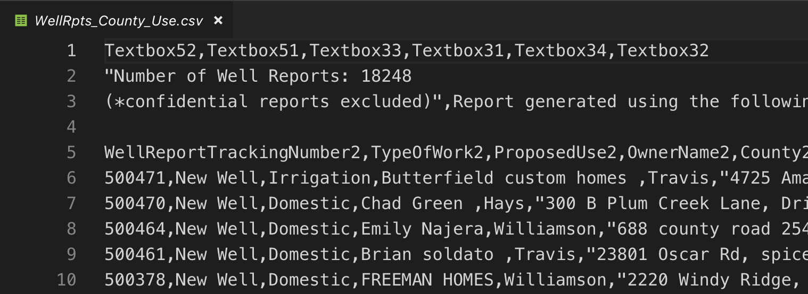

# Importing data {#import}

After installing and launching RStudio, the next trick is to import data. Depending on the data source, this can be brilliantly easy or a pain in the rear depending on how well formatted the original is.

In this class, we will primarily be importing Excel files, CSVs (comma separated values) and using some APIs (Application Programming Interface).

- APIs are well structured by definition, so it is really a matter of learning those.
- CSVs are a kind of lowest-common-denominator for data. Most any database can import or export them.
- Excel files are good, but are often messy. There are often multiple header rows, columns used in multiple ways, notes added, etc. Just know you might have to clean them up before using them.

## What is clean data

The Checking Your Data section of this [DataCamp tutorial](https://www.datacamp.com/community/tutorials/r-data-import-tutorial) has a good outline of what makes good data, but in general it should:

- Have a single header row with well-formed column names.
    + Short namnes are better than long
    + Space are bad. Use and `_` or `.` between words.
- Remove notes or comments from the files.

In our first lesson, we'll be using a CSV file that has descriptions at the top. We'll bet able to skip those lines when we import.

## Overview of our project

We are going to work with well drilling reports from the Texas Water Development board. We'll pull reports from counties in the Austin MSA and be able to see the kinds of wells dug, where they are the pace of drilling.

## Create a project

We did this in our first lesson, but here are the basic steps:

- Launch RStudio
- Use the `+R` button to create a **New Project** in a **New Directory**
- Name the project `yourfirstname-wells` and put it in your `~/Documents/rwd` folder.
- In the **Files** pane, use the **New Folder** button to create a folder called `data-raw`. (I typically separate my raw data from any files that I create.)

## Let's get some data

I could've supplied you with this data, but it is not hard to find and grab yourself, so let's do that.

- Go to the [Texas Water Development Board Driller Reports](http://www.twdb.texas.gov/groundwater/data/drillersdb.asp) page and then click on the **Well Reports Search by County and Use** link.
- In the **County** dropdown, choose: Bastrop, Caldwell, Hays, Travis and Williamson counties.
- In the **Proposed Use** column, choose **Select All*.
- Click **View Reports**. You get 400+ returns.
- Look for the floppy disk/arrow icon that is the download button. Choose **CSV (comma delimited)**.

That file should end up in your Downloads folder. Use your finder to move this into your project folder in the `data-raw` folder you created.

## Inspect the data

Here is where RStudio fails us. If you use the Files pain to open the `data-raw` folder, you can usually click on your CSV file and view it. This one is rather large, and RStudio complains. I've tried to view it, and failed, but we need to know what it looks like.

- Launch Visual Studio Code.
- Use *Cmd+O* to open a file.
- Negotiate to your `Documents/rwd/firstname-well/data-raw` folder and open the CSV file you put there.

It will look somthing like this:

{width=400px}

Note that the real header for this file starts as line `5`, which means when we import this file, we need to skip the first four lines.

## Start a new Notebook

- Use the `+` button to create a new **R Notebook*.
- Change the title to "Yourname wells report".
- Delete the other boilerplate text

THIS IS WHERE I STOPPED.

## Resources

- This [DataCamp tutorial on imports](https://www.datacamp.com/community/tutorials/r-data-import-tutorial) covers a ton of different data types and connections.
