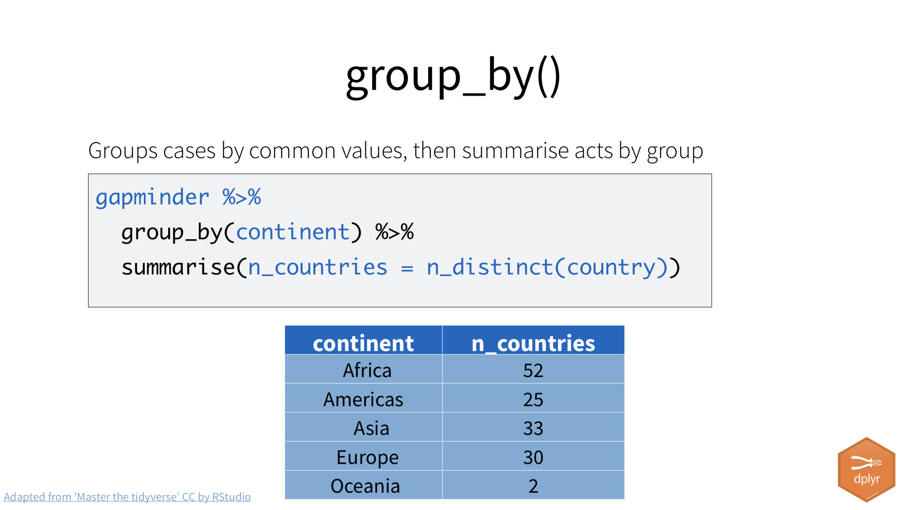
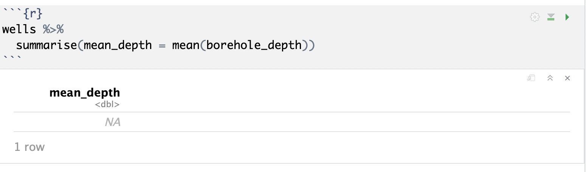

# Summarize

> FIRST DRAFT OF NEW SUMMARIZE CHAPTER

In this lesson we'll actually get answers to the questions we posed when we started this quest. All of these questions refer to Austin ISD schools: 

- Which campus gained the most (count difference) special education students from 2015 to 2020?
- Which campus has the highest share (percent) of special education students in 2020?
- Which campus had the greatest change in share of in special education students between 2015 and 2020.
- How many AISD schools would be above the special education "audit threshold" of 8.5% in 2020 if it were still in effect? How does those numbers compare to 2015?

## New task, new notebook

We've been organizing our work into different RNotebooks that serve a single purpose. We started with downloading, importing and joining our data. We built a new notebook to handle our computations, and we'll build yet another one here for our analysis.

How you break up this work is really up to you, your colleagues you work with, and the needs of the project. For instance, I  typically include computations in either my import/clean or analysis notebooks, but I felt there were reasons to separate in this instance:

- The import step included downloading and processing of data. As I work through analysis, I often restart R and re-run my notebooks and I didn't want to re-download and process that data each time.
- Even though my immediate goal was to look at Austin ISD data, I wanted to preserve state-level data for possible comparison later. So I prepared the data for the entire state, leaving the Austin filtering for later.

Your needs may vary by project, but strive to live by these rules:

1. Don't change or write over original data. One way to accomplish this is keep raw data in a separate folder and never write to it.
2. Notebooks should run independently. You should be able to open it and do Run All and it work. (It's OK to use data from a previous notebook, but R objects should not carry over.)
3. If notebooks must be run in series, then indicate that in the name of the file.
4. Use descriptive names for everything. Avoid generic terms in file names like "data" or "myfile".

This is a long-winded way of saying this: Time to start a new notebook.

### Create analysis notebook

- If you haven't already, make sure you have the project open, but close all files and restart R.
- Create a new RNotebook. Update the title so "Special Education AISD analysis". Remove the boilerplate code.
- Save the file and name it `03-analysis-aisd.Rmd`.
- Create your first chunk and name it "setup". Add the tidyverse and janitor libraries.

```{r setup}
library(tidyverse)
library(janitor)
```

### Import

We need to import our data using the `read_rds()` function.

- Create a new chunk. Name it import.
- Add the following

```{r import}
sped_calcs <- read_rds("data-processed/02_sped_calcs.rds")

sped_calcs %>% glimpse()
```

### Filter to Austin ISD

Since we are seeking answers about our local district, let's filter the data to just those schools.

- Create a new chunk and call is `aisd`.
- Use `filter()` to find rows with `district_name` of "AUSTIN ISD".
- Use `select()` to remove the `district_name` and `campus` columns.
- Assign the result  to a new data frame called `aisd`.
- Print the data frame to the screen to you can browse through it.

```{r aisd}
aisd <- sped_calcs %>% 
  filter(district_name == "AUSTIN ISD") %>% 
  select(-district_name, -campus)

aisd
```

## Sorting with arrange()

Our first question we were tasked to answer is: 

- Which campus gained the most (count difference) special education students from 2015 to 2020?

In our computations notebook we created the `sped_c_diff` column for just this purpose. We just need to "arrange" the data so we can see the highest number at the top!

### About arrange

The `arrange()` function sorts data.

```r
dataframe %>% 
  arrange(column_name)
```

It will sort in ascending (A-Z or 1-10) by default.

If you want to sort the column be descending order (Z-A or 10-1), then you add on `desc()` function:

```r
dataframe %>% 
  arrange(desc(column_name))
```

The above code wraps your sorting column with the `desc()` function. I'm more apt to write this the tidyverse way, as the pipe makes the order of operations more clear to me:

```r
dataframe %>% 
  arrange(column_name %>% desc())
```

### Most new special education students

So, let's take our example data and arrange it with the highest count diff at the top.

- Add a markdown headline `## Most new special education students`.
- Add a chunk called **cntdiff-highest**, add the code below and run it.

```{r arrange-example}
aisd %>% 
  arrange(sped_c_diff %>% desc()) %>% 
  head(10)
```

OK, so Bowie High School is at the top with 70 new special education students. Bowie is the largest high school in the district, so perhaps that is not a surprise.

### The head() command

I've used the `head()` command above and a couple of times but haven't really explained it. Basically it just gives you the first six rows of data unless you tell it you want a specific number of rows, like I asked for 10 above. There is also a `tail()` command that gives you the bottom rows of the data.

I often use `head()` when I only need to see a couple of rows because .Rmd files get bigger when you display more data. While  printing a 1000-row table to the screen only shows us 10 rows at a time, it has all 1000 rows stored in memory.

### Highest share of special education students in 2020

We can reveal the answer for our next question by using `arrange()` with the `sped_p_20` column.

```{r share20}
aisd %>% 
  arrange(sped_p_20 %>% desc()) %>% 
  head(10)
```

It looks like Brooke Elementary has the highest share of special education students, almost 1 in 4.

### Greatest change in share of special education students

Our last question to answer with arrange is who had the "greatest change in the share of special education students". That's a mouthful and the answer is nuanced, too.

Let's start by arranging by the percent change in the count: `sped_c_prccng`.

```{r prccng}
aisd %>% 
  arrange(
    sped_c_prccng
  )
```

Seven schools more than doubled their share of special education students. Wooldridge Elementary went from 35 to 79 students, a 132 percent increase.

We can also look at the change in the percentage point change by sorting on `sped_p_ppd`.

```{r ppd}
aisd %>% 
  arrange(sped_p_ppd %>% desc())
```

Brooke Elementary went from 12.4 percent to 24.6 percent, climbing from 43 to 71 students. It amounted to a 65 percent change in the share of students.

But which number makes more sense for our story? Both are accurate. Ask yourself which one a reader could wrap their head around the easiest. I would say the percent change gives the reader a better picture and more properly describes the issue.

## Aggregates with summarize()

Our last question is: How many AISD schools would be above the special education "audit threshold" of 8.5% in 2020 if it were still in effect? How does those numbers compare to 2015?

To answer this we need to introduce a new concept and function: `summarize()`, and it's companion `group_by`.

The `summarize()` and `summarise()` functions compute tables _about_ your data. They are the same function, as R supports both the American and European spelling of summarize. I don't care which you use.

{width=500px}

Much like the `mutate()` function, we list the name of the new column first, then assign to it the function we want to accomplish using `=`.

To demonstrate, let's find the average number (or mean) of special education students in AISD schools in 2020. (You don't need to do this, just see it.)

```{r mean}
aisd %>% 
  summarize(
    mean_sped_students = sped_c_20 %>% mean()
  )
```
You might also see that calculation as: `mean_sped_students = mean(sped_c_20)`. Both are correct. I flip back and forth, using tidyverse pipe method when I think it is more clear. Others may disagree.

A mean (or average in common terms) is a way to use one number to represent a group of numbers. It works well when the variance in the numbers is not great. `median()` is another way, and sometimes better when there are high or low numbers that would unduly influence a mean. It's the "middle" value.

## Group_by()

The `summarize()` function is an especially useful in combination with another function called `group_by()`, which allows us to categorize our data by common values before aggregating on thos values. You might review the [Group & Aggregate](https://vimeo.com/showcase/7320305/video/435910349) video that explains the concept.



This is easier to understand when you can see an example, so let's do it.

### Group and count

If we want to know how many schools how many AISD schools were above the the 8.5% threshold in 2015 (our `sped_)

```{r group-count}
aisd %>% 
  group_by(sped15_thsh) %>% 
  summarize(schools = n())
```
Let's break this down:

- The `group_by` has organized (or "grouped") all our data by the `sped15_thsh` value first (N vs Y)
- Then inside `summarize()` we counted the number `n()` of rows. We named that new column "schools", because that is what we are really counting.

### The count() function shortcut

We count row A LOT in data science, so there is a convenience function to do this: `count()`. We used it earlier when we wanted to know our instruction types.

Let's rewrite this with count:

```{r count-example}
aisd %>% 
  count(sped15_thsh)
```

Under the hood, `count()` is doing the same thing as the "group and summarize" function above it. 

### Comparing thresholds for 2015 and 2020

When we use count, we just feed it the columns that we want to group data by. And we can feed it more than one column.

In our case, we want to know the number of schools for both 2015 and 2020, so let's feed count with both columns:

- Add a Markdown header: `# Comparing thresholds 2015 and 2020`.
- Create a new chunk and name it `thsh-compare`.
- Add the following code:

```{r thsh-compare}
aisd %>% 
  count(sped15_thsh, sped20_thsh)
```

To break down our results here:

- Our first row (N and N) is schools below the threshold in both years: 7.
- The second ( N and Y) is schools that were below in 2015 but above in 2020: 36.
- The third (Y and N) is the schools that were above in 2015, but dropped in 2020: 2.
- The last (Y and Y) are the schools above in both years: 64.

With this we can write a sentence describing how many schools climbed above 8.5% (36) and how many dropped (just 2).

Note the count column has a header of "n", for the number of rows. We can make this a little prettier by renaming that column.

- Modify your code chunk to add the rename() function below:

```{r thrsh-compare-renamed}
aisd %>% 
  count(sped15_thsh, sped20_thsh) %>% 
  rename(schools = n)
```

## More on summarize

Let's review the group_by and summarize combo:

- We start with our data frame.
- We then **group_by** the data by column or columns we want to consider. If we printed the data frame at this point, we won't really see a difference. The `group_by()` function always needs another function to see a result.
- We then **summarize** the grouped data. Common summaries are to count rows `n()`, or do match on the results in a column like `mean()` (the average), `median()` (middle value) or `sum()` (adds together). If we want to name our new column, we do so first: `new_name = mean(col_name)`.

We can do multiple calculations within the `summarize()` function, like this:


### Ignoring NA values

Sometimes you'll try to calculate a `mean()` with summarize and get an error because there are blank values. We don't have an example in our special education data, but consider this data set of water wells, trying to find the average depth of the well: `borehold_depth`.



We get an error because some rows of the data don't have a value for `borehole_depth`. They are NA values, or Not Available.

We can apply a function inside `summarize()` called `na.rm`, which "removes" NA values before doing the summary. Like this:


## Review what we learned

In this lesson used `arrange()` to sort our data, `summarize()` and the shortcut `count()` to find aggregates, like the number of rows based on values within the data. We'll do lots more of this in lessons to come.

Next we'll practice all the things we've learned with a new data set.
