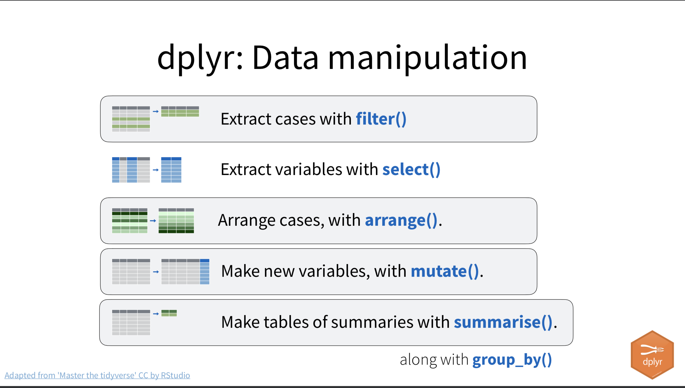
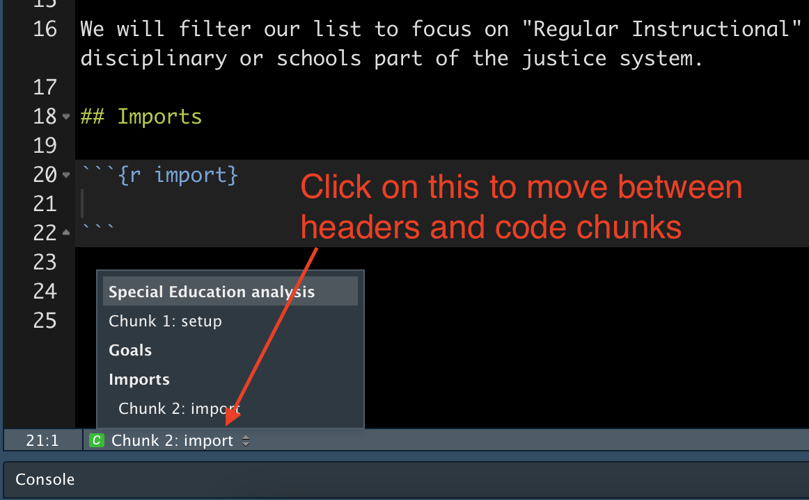
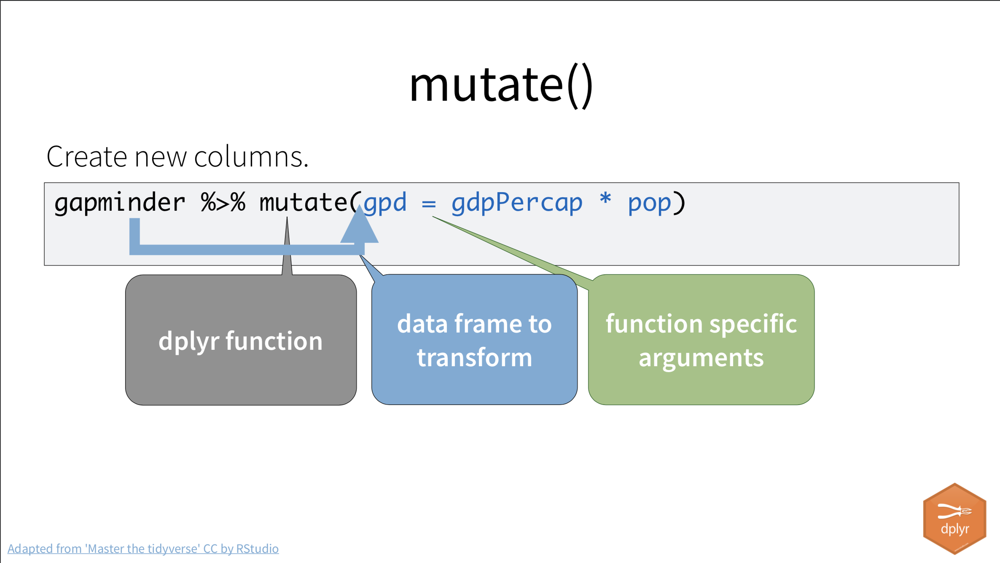
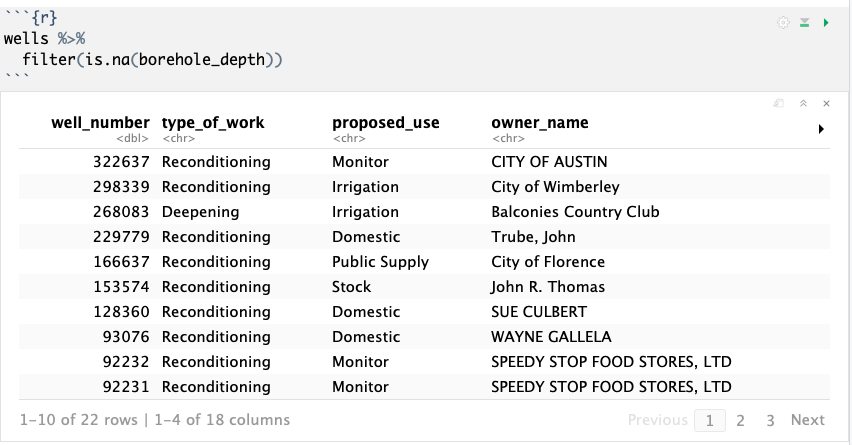
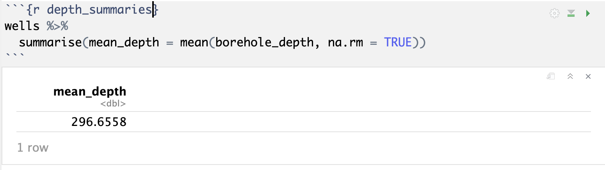

# Transform {#transform}

One of the packages within the tidyverse is [dplyr](https://dplyr.tidyverse.org/) ( [cheatsheet](https://www.rstudio.com/wp-content/uploads/2015/02/data-wrangling-cheatsheet.pdf) ) which allows us to transform our data frames in ways that let us explore the data and prepare it for visualizing. It's the R equivalent of common Excel functions like sort, filter and pivoting.

{width=600px}

(Some slides included here are used with permission from Hadley and Charlotte Wickham.)

## Start a new R Notebook

As I explained at the end of our last lesson, it's a good practice to separate your import/cleaning functions from your analysis functions into separate notebooks, so we'll create a new one for our analysis.

- Launch RStudio and open your wells project.
- Create a new R Notebook and set a new title of "Wells exploration and analysis".
- Remove the boilerplate language and add a description of our goals: To explore an analyze our wells project. Mention that you have to run the other notebook first in case your someone else (or your future self) comes here first.
- Save your file as `02-wells-analysis.Rmd`.
- Insert a new chunk, load the tidyverse library and run it. Make one change to this, in that we want to start naming all our chunks.

```pre
{r setup}
```

By adding the word `setup` after our the `{r}` at the beginning, then we can find that chunk in our navigation drop down at the bottom of the R Notebook window.

{width=500px}

## Import our data

- Add a Markdown headline and description that you are loading the data.
- Add a code chunk named `import` with the following:

{width=600px}

Now we are back to where we eneded with the first notebook.

## Goals

What do we want to learn about these wells? Look over the columns and some of the values in them and come up with a list of at least five things to look at.

- Add a Markdown headline `## Goals`.
- Create a bullet list of things you might want to find. Use a `*` or `-` to start each new line.

We'll review some of your ideas in class.

## Filter()

Let's filter all the wells to the those just in Travis County. We'll use dplyr's `filter()` function to this this. It works like this:

{width=600px}

Let's filter our wells data to just those in Travis County:


When you run this, you'll see that you the about 9000 rows instead of the 18,000+ of the full data set.

Note the two equals signs there `==`. It's important two use two of them, as a single `=` will not work, as that means something else.

There are a number of these logical test operations:

{width=600px}

### Filter your turn

Create new code blocks and filter for the following:

- Wells with a proposed use of Irrigation.
- Wells at least 1000 feet deep.
- One more that might help you answer one of your goals you listed above.

### Common mistakes with filter

{width=600[x]}

## Combining filters

You can filter for more than one thing at a time by separating more than one test with a comma.

```r
filter(wells, county == "Travis", proposed_use == "Irrigation")
```

If you use a comma to separate tests, then both tests have to be true. If you want OR, then you use a pipe `|` (the shift-key above the backslash.)

{width=600px}

### Your turn combining filters

Your quest is to filter to wells in Travis or Williamson counties that have a start date in 2018. **BIG HINT**: If you include `library(lubridate)` in your notebook then you can access the year of a field with `year(name_of_date_field)`.

### Common mistakes with combining filters

{width=600px}

Note if you want to combine a series of strings in your filter, you have to put them inside a "concatenate" function, which is shoretened to `c()`, as in the example above.

## Arrange()

The `arrange()` function sorts data.

{width=600px}

Let's sort our data by their depth:

```r
arrange(wells, borehole_depth)
```

You'll have to scroll the colums over to see it, and the depths start at zero, which is not very sexy. As journalists, we usually want to see the largest (or deepest) thing, so we can arrange the column in descending order with this:


Now we see some deep wells ... 3300 feet when I pulled my test data.

## Multi-step operations

But what if you want to both filter and arrange? It is possible to nest such operations, but there is a better way: the pipe.

{width=600px}

Two things to think of with the pipe `%>%`.

- Think of it as "and then to this".
- The keyboard command *Cmd+Shift+m* (Mac) or *Ctrl+Shift+m* (Windows) will give you the pipe.

Need to remember that key command? While I didn't invent the pipe, you might remember that Professor **M**cDonald taught it to you.

Let's find the deepest well in Travis County:

```r
wells %>% 
  filter(county == "Travis") %>%
  arrange(desc(borehole_depth))
```

All the tidyverse functions understand the pipe, and we'll be using it alot. It makes it easier to write and understand the code.

Another advantage you'll see is you can use tab completion in more places when you use pipes. RStudio better understands the fields you are working with when you declare the data frame first.

### Your turn to combine and pipe

Find a list of the deepest irrigation wells in Travis County in 2017. Use the pipe to string together your functions.

## Select()

As we've worked with `borehole_depth` it's been kind of a pain to tab through all the fields to see the result we want. The `select()` function allows you to choose which fields to display from a data frame. If we are only interested in the `owner` and `borehole_depth` from our previous query of deepest wells in Travis, then we we can pipe the results to a select function. It works by listing the column names inside the function. You can use `-` before a column name to remove it.

Add this to the end of your previous code chunk:

```r
<code chunk> %>%
  select(owner_name, borehole_depth)
```

The order of all these operations matter. If you use select to remove a column, you cannot filter using that column later.

## Mutate()

The mutate function allows us to change data based on a formula. We can assign the change back to an existing column or create a new one.

{width=600px}


In the example above:

- `gapminder` is the source data frame.
- `gdp` is the new column being created. it comes first.
- `= gdpPercap * pop` is the function. It is multiplying the the two columns that are in the `gapminder` data frame.

The applied function doesn't have to be math. It could be pulling part of a string or any number of things.

We'll use this to create a new "year" column that has just the year that well was started. It will help us plot data later.

We're going to do this is two steps. We'll first write the function to make sure it working like we want, then we'll assign the result back to the `wells` data frame.


You'll end up with two columns. We added the `select()` function so we didn't have to dig through the data frame to see if it worked. Now we can modify the code chunk to save our changes:

- Before the code chunk, write out what we are doing. Add a Markdown headline and description of our task: to add a "year" column.
- Name the chunk by adding `add_year` inside the `{r}` part of the chunk.
- Remove the pipe and the `select()` statement, as we don't want to lose those columns for realz.
- Edit the first line `wells %>% ` to `wells <- wells %>% ` to assign the mutate result back to our wells data frame.

```r
wells <- wells %>% 
  mutate(year_drilled = year(drilling_start_date))
```

When you do this, it won't print the table to the screen anymore because you've instead reassigned it. Inspect the `wells` data frame within the Environment tab and to make sure it was created properly.

Like with `filter()`, we can create more than one column within the same `mutate()` function by separating them with commas.

### Your turn to mutate

- Modify the above mutate function to also add a `month_drilled` column.

## Summarize()

The `summarize()` and `summarise()` functions compute tables _about_ your data. They are the same function, as R supports both the American and European spelling of summarize. I don't care which you use.

{width=600px}

Much like the `mutate()` function, we list the name of the new column first, then assign to it the function we want to accomplish using `=`.

Let's find the average `borehole_depth` of all the wells.


But, our return isn't good? What's up with that?

### ignoring na

In short, you can't divide by zero or a NULL or NA value. I'll show you how to ignore them, but first we should find out how many there are:



Take a look at this and guess what is happening. Clearly `is.na` is a thing. How is it being used?

There are 22 records returned out of 18k+. Can we safely exclude them? I think so.

We can apply a similar function `na.rm` function inside our `summarise()` filter to remove the missing values before the calculation, like this:



A mean (or average in common terms) is a way to use one number to represent a group of numbers. It works well when the variance in the numbers is not great. Median is another way, and sometimes better when there are high or low numbers that would unduly influence a mean.

### Your turn with summarise

Like filter and mutate, you can do more than one calculation within a summarize function. Edit the code chunk above in two ways:

- Make sure to name the code chunk, something like `depth_summaries`.
- Modify the summarise function to also create a `median_depth` summary. Look at your dplyr cheat sheet or google to find out how.

## Group_by()

> Add something here.
