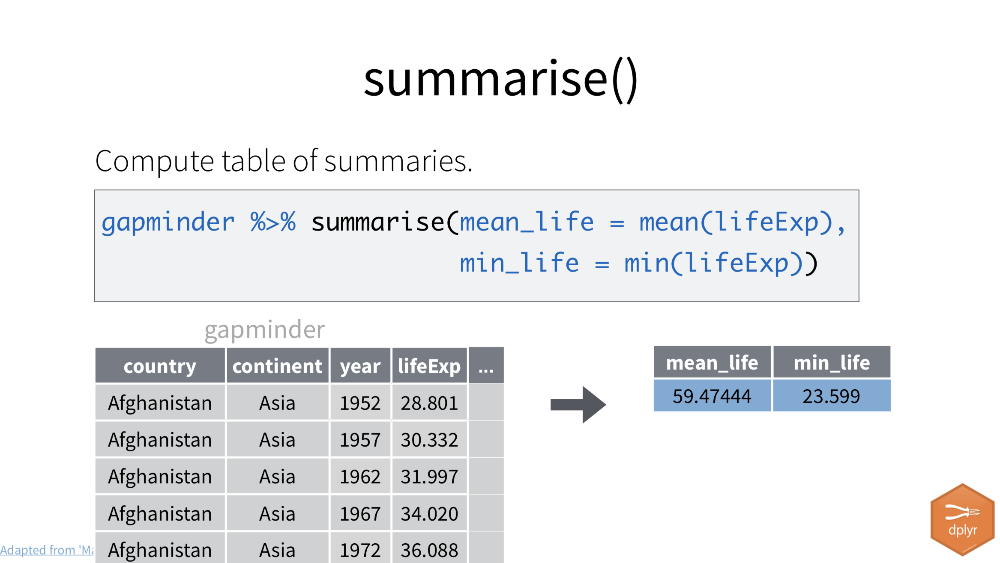

# Transform {#transform}

## Goals for the section

- Pay more attention to the Markdown to record our goals, actions and explain our code. We'll name our code chunks, too.
- Use the [dplyr]() tools to filter, sort and create new columns of data.

## Introducing dplyr

One of the packages within the tidyverse is [dplyr](https://dplyr.tidyverse.org/) ( [cheatsheet](https://www.rstudio.com/wp-content/uploads/2015/02/data-wrangling-cheatsheet.pdf) ) which allows us to transform our data frames in ways that let us explore the data and prepare it for visualizing. It's the R equivalent of common Excel functions like sort, filter and pivoting.

{width=600px}

(Some slides included here are used with permission from Hadley and Charlotte Wickham.)

## Start a new R Notebook

As I explained at the end of our last lesson, it's a good practice to separate your import/cleaning functions from your analysis functions into separate notebooks, so we'll create a new one for our analysis.

- Launch RStudio and open your wells project.
- Create a new R Notebook and set a new title of "Wells exploration and analysis".
- Remove the boilerplate language and add a description of our goals: To explore an analyze our wells project. Mention that you have to run the other notebook first in case your someone else (or your future self) comes here first.
- Save your file as `02-wells-explore.Rmd`.

## Record our goals

What do we want to learn about these wells? Look over the columns and some of the values in them and come up with a list of at least five things you might want to learn from the data.

- Add a Markdown headline `## Goals`.
- Create a bullet list of things you might want to find. Use a `*` or `-` to start each new line.

We'll review some of your ideas in class.

## Name your code chunks

By adding the word `setup` after our the `{r}` at the beginning, then we can find that chunk in our navigation drop down at the bottom of the R Notebook window.

{width=600px}

## Import our data

- Add a Markdown headline and description that you are loading the data.
- Add a code chunk named `import` with the following:

{width=600px}

Now we are back to where we ended with the first notebook.

## Filter()

We can use dplyr's `filter()` function to capture a subset of the data, like all the wells in Travis County. It works like this:

{width=600px}

Let's filter our wells data to just those in Travis County. We are going to use the ` %>% ` pipe function to do this to the `wells` data frame.


When you run this, you'll see that you the about 9000 rows instead of the 18,000+ of the full data set.

Note the two equals signs there `==`. It's important two use two of them, as a single `=` will not work, as that means something else.

There are a number of these logical test operations:

{width=600px}

### Filter your turn

Create new code blocks and filter for each of the following:

- Wells with a proposed use of Irrigation.
- Wells at least 1000 feet deep. (HINT: If you are filtering on a number, don't put it in quotes, or it will become text instead.)
- One more that might help you answer one of your goals you listed above.

### Common mistakes with filter

Some common mistakes that happen when using filter.

#### Use two == signs for "true"

DON'T DO THIS:

```r
wells %>% 
  filter(county = "Travis")
```

DO THIS:

```r
wells %>% 
  filter(county == "Travis")
```

#### Forgetting quotes

DON'T DO THIS:

```r
wells %>% 
  filter(county == Bastrop)
```

DO THIS:

```r
wells %>% 
  filter(county == "Bastrop")
```


## Combining filters

You can filter for more than one thing at a time by separating more than one test with a comma.

```r
wells %>% 
  filter(county == "Travis", proposed_use == "Irrigation")
```

If you use a comma to separate tests, then both tests have to be true. If you want OR, then you use a pipe `|` (the shift-key above the backslash.)

{width=600px}

### Your turn combining filters

Your quest is to filter to wells in Travis or Williamson counties that have a start date in 2018.

**BIG HINT**: If you include `library(lubridate)` in your notebook then you can access the year of a field with `year(name_of_date_field)`.

### Common mistakes with combining filters

Some things to watch when trying to combine filters.

#### Collapsing multiple tests into one

DON'T DO THIS:

```r
wells %>% 
  filter(county == "Travis" | "Williamson")
```

DO THIS:

```r
well %>% 
  filter(county == "Travis" | county == "Williamson")
```

BUT EVEN BETTER:

```r
wells %>% 
  filter(county %in% c("Travis", "Williamson"))
```

If you want to combine a series of strings in your filter, you have to put them inside a "concatenate" function, which is shortened to `c()`, as in the example above.

## Arrange()

The `arrange()` function sorts data.

```r
dataframe %>% 
  arrange(column)
```

Or, to arrange in descending order (biggest on top):

```r
dataframe %>% 
  arrange(desc(column))
```

So, let's sort our data by the borehole depth:

```r
wells %>% 
  arrange(borehole_depth)
```

You'll have to scroll the columns over to see it, and the depths start at zero, which is not very sexy. As journalists, we usually want to see the largest (or deepest) thing, so we can arrange the column in descending order with this:

{width=600px}

Now we see some deep wells ... 3300 feet when I pulled my test data.

## Multi-step operations

But what if you want to both filter and arrange? It is possible to chain piped opperations together.

Let's find the deepest well in Travis County:

```r
wells %>% 
  filter(county == "Travis") %>%
  arrange(desc(borehole_depth))
```

### Your turn to combine and pipe

Find a list of the deepest irrigation wells in Travis County in 2017. Use the pipe to string together your functions.

## Select()

As we've worked with `borehole_depth` it's been kind of a pain to tab through all the fields to see the result we want. The `select()` function allows you to choose which fields to display from a data frame. If we are only interested in the `owner` and `borehole_depth` from our previous query of deepest wells in Travis, then we we can pipe the results to a select function. It works by listing the column names inside the function. You can use `-` before a column name to remove it.

- One the end of your previous code chunk, add a pipe, then `select(owner_name, borehole_depth)`:

```r
wells %>% 
  filter(county == "Travis") %>%
  arrange(desc(borehole_depth)) %>% 
  select(owner_name, borehole_depth)
```

The order of all these operations matter. If you use `select()` that removes a column, you cannot later use filter on that removed column.

## Mutate()

We used the `mutate()` function with our data cleaning, but let's dive more into it. `mutate()` allows us to change data based on a formula. We can assign the change back to an existing column or create a new one.

{width=600px}

In the example above:

- `gapminder` is the source data frame.
- `gdp` is the new column being created. it comes first.
- `= gdpPercap * pop` is the function. It is multiplying the the two columns that are in the `gapminder` data frame.

The applied function doesn't have to be math. It could be pulling part of a string or any number of things.

We'll use this to create a new "year_drilled" column that has just the year that well was started. It will help us plot data later.

We're going to do this is two steps. We'll first write the function to make sure it working like we want, then we'll assign the result back to the `wells` data frame.


This added our new column to the end of the data frame.

### Your turn to mutate

- Modify the above mutate function to also add a `month_drilled` column.

### Document and save new columns

- Before the code chunk, write out what we are doing. Add a Markdown headline and description of our task, which was to add a "year_drilled" and "month_drilled" column.
- Name the chunk by adding `add_year_month` inside the `{r}` part of the chunk.
- Edit the first line `wells %>% ` to `wells <- wells %>% ` to assign the mutate result back to our wells data frame.

```r
wells <- wells %>% 
  mutate(
    year_drilled = year(drilling_start_date),
    month_drilled = month(drilling_start_date)
  )
```

As we've seen before, when we assign the result back to `wells`, the data frame will no longer print to the screen anymore. That's OK. Inspect the `wells` data frame within the Environment tab and to make sure it was created properly. (If you really want to check the data on your screen, you could use `head(wells)` to see just the several lines.)

As you may recall from our lesson on column renaming, we can create more than one column within the same `mutate()` function by separating them with commas.

### Export the mutated data

We actually want to keep these new columns to use later, so let's do a quick export to save them for later.

```r
wells %>% saveRDS("data-out/wells_02.rds")
```

## Summarize()

The `summarize()` and `summarise()` functions compute tables _about_ your data. They are the same function, as R supports both the American and European spelling of summarize. I don't care which you use.

{width=600px}

Much like the `mutate()` function, we list the name of the new column first, then assign to it the function we want to accomplish using `=`.

Let's find the average `borehole_depth` of all the wells.


But, our return isn't good? What's up with that?

### ignoring na

In short, you can't divide by zero or a NULL or NA value. I'll show you how to ignore them, but first we should find out how many there are:


Take a look at this and guess what is happening. Clearly `is.na` is a thing. How is it being used?

There are 22 records returned out of 18k+. Can we safely exclude them without affecting the results? I think so.

We can apply a similar function `na.rm` function inside our `summarise()` function to remove the missing values before the calculation, like this:


A mean (or average in common terms) is a way to use one number to represent a group of numbers. It works well when the variance in the numbers is not great. Median is another way, and sometimes better when there are high or low numbers that would unduly influence a mean.

### Your turn with summarise

Like filter and mutate, you can do more than one calculation within a summarize function. Edit the code chunk above in two ways:

- Make sure to name the code chunk, something like `depth_summaries`.
- Modify the summarize function to also create a `median_depth` summary. Look at your dplyr cheat sheet or google to find out how.

## Group_by()

The `summarise()` function is an especially useful in combination with another function called `group_by()`, which allows us to pivot tables to count and measure data by its values.


This is easier to understand when you can see an example, so let's do it.

### Group and count

So, we have more than 18,000 wells, but we don't know how many of each kind. We could filter them one-by-one, but there is an easier way.


Let's break this down:

- We start with the **wells** data frame.
- We then **group_by** the data by the `proposed_use`. If we print the data frame at this point, we won't really see a difference. The `group_by()` function always needs another function to see a result.
- We then **summarise** the grouped data. In this case, we are creating a column called `count`, and we are assigning to is a special function `n()` which counts the number of records within each group.
    + The result is for each unique value in the **prospose_use** column, we get the number of records that have that have that value.
- We then **arrange** the resulting table in descending order by our new column, `count`, so we can see which value has the most records.

We can see that "Domestic" wells are more prevalent by a wide margin. If page through the list, you'll see that to get an accurate count of each type of well, we'll need to do some data cleaning. We'll do that at another time.

Let's walk through another example:


### Your turn to group

- How many wells were drilled in each county? Use the same `group_by` and `summarise` method to make a table that counts wells drilled in each county.
- Since you can `summarise` by more than one thing, try to find the count and average (mean) borehole_depth of wells by proposed use. You can copy the first summary we did and work from that, editing the `summarise` statement.

### Counting only

We'll use summarize to do more than count, but if counting  is all you want to know, there is an easier way. (I'll try not to show you too many alternate methods ... there are many ways to do everything, but this is worth knowing.)

```r
well %>% 
  count(proposed_use)
```

It creates a column named "n" with the count. You could _then_ use `rename(new = old)` to call it something else, like "wells_drilled".

## Transform review

This has been a lot to learn, but it is the basics of just about any data analysis ... to **filter**, **select**, **arrange**, **group** and **summarise** values. And to create new variables with with **mutate**.

Next, we'll start plotting some of this data so we can _see_ it.

## Turn in your in-class project

At this point, you'll want so **save**, **knit to HTML** and then close your project. Zip up the folder and turn it into the assignment in Canvas.

## Practice assignment: Transforms on census

For this practice assignment, you'll continue with your "census-practice" project.

The goal here is: For each race in the data, find the county with the highest percentage for that race. You'll use the dplyr commands from this lesson to do it.

- Start a new notebook that imports the cleaned data from the last assignment. Start the notebook name with "02-" so you know the order to run them in the future.
- Use `mutate()` to create a new column for each race that calculates the percentage for that race. You might create columns names like "hispanic_prc" with the formula "(hispanic / total_populaton) * 100". Assign those values back to the "census" data frame.
- Create a series of code chunks, one for each race that does this: Arrange the data so the county with the highest percentage of that race is on top, then use `select()` to show these columns: The county, total population, that race total, and the percentage of that race.
- Make sure that each each action is clearly described in Markdown headlines and text, and that each code chunk is named. 

If you feel like you are repeating yourself a lot on this assignment and feel like there should be a better way, I assure you there is. We will get to that.

Save, Knit, Zip and upload your project to the "Practice: Transform with dplyr" assignment.


