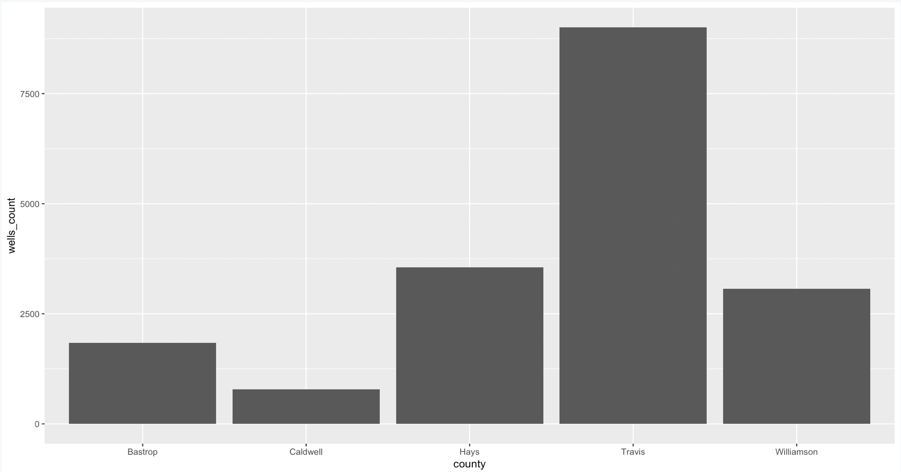

# Graphics {#graphics}

[ggplot2](https://ggplot2.tidyverse.org/) is the data visualization library within Hadley Wickham's [tidyverse.](https://www.tidyverse.org/). It uses a concept called the Grammar of graphics, the idea that you can build every graph from the same components: a data set, a coordinate system, and geoms -- the visual marks that represent data points. With a hat tip to [Matt Waite](http://www.mattwaite.com/), the main concepts are: 

- **aesthetics**: which in this case means the data which we are going to plot
- **geometries**: which means the shape the data is going to take
- **scales**: which means any transformations we might make on the data
- **layers**: which means how we might lay multiple geometries over top of each other to reveal new information.
- **facets**: which means how we might graph many elements of the same dataset in the same space

The challenge to understand here is for every graphi, we start with the data, and then describe how to layer plots or pieces on top of that data.

## Set up our Notebook

- Create a new RNotebook. Title it "Wells visualizations" and name the file `04-charts.Rmd`.
- Load the following libraries: tidyverse, lubridate.
- Import our `wells_03.rds` data,

```r
library(tidyverse)
library(lubridate)
wells <- readRDS("data-out/wells_03.rds")
```

## Wells per county

For our first graphic, we will plot how many wells were drilled in each county.

### Shape our data

If we are plotting wells per county, we need to first build a data frame that counts the number of wells for each county. We can use the same `count()` function that we used when we cleaned our data.

```r
wells_by_county <- wells %>% 
  count(county) %>% 
  rename(wells_count = n)
wells_by_county
```

Let's break this down:

- The first line creates the new data frame `wells_by_county`, starting with our `wells` data frame.
- We apply the `count()` function on the "county" column. This makes our basic pivot table.
- On the third line, we rename the "n" column that was created by `count()`, so it is more descriptive, calling it `wells_count`.
- So now we have a data frame with two columns: **county** and **wells_count**. We print it on the fourth line so we can inspect it.

### The basic ggplot template

The template for a basic plot is this. (The `<>` signify we are inserting values there.)

```r
ggplot(data = <DATA>) +
  <GEOM_FUNCTION>(mapping = aes(<MAPPINGS>))
```

- **ggplot()** is our function. We feed into it the data we wish to plot.
- The **+** is the equivalent of `%>%` in our tidyverse data. It means we are adding a layer, and it should always be at the end of the line, not at the begginning of the next.
- **<GEOM_FUNCTION>** is the type of chart or addition we are adding. They all start with the term **geom_** like **geom_bar**, which is what we will build.
- The geometric function needs "aesthetics" to describe what it should look like, the main one being the **mappings** of the x and y axis.

### Plot our wells by county

```r
ggplot(data = wells_by_county) +
  geom_bar(mapping = aes(x = county, y = wells_count), stat = "identity")
```

- On the first line we tell `ggplot()` that we are using the we `wells_by_county` data.
- On the next, we apply the `geom_bar()` function to make a bar chart. It needs two things:
    + The mapping, which are the aesthetics. We well it to plot **county** on the x (horizontal) axis, and **wells_count** on the y (vertical) axis. Because **county** is not a number, we have to use the `stat = "identity"` value to describe that we are using values within county.

{width=500px}

We can be a little little less verbose about this because `ggplot()` will understand we are feeding it data and mappings.

```r
ggplot(wells_by_county) +
  geom_bar(aes(x=county, y=wells_count), stat = "identity")
```

### Add a layer of text labels

For each new thing that we add to our graphic, we add it with `+`. In this case, we want to add number labels to show the wells_count for that county.

```r
ggplot(data = wells_by_county, aes(x = county, y = wells_count)) +
  geom_bar(stat = "identity") +
  geom_text(aes(label=wells_count), vjust=-0.25)
```

{width=500px}


## Resources

- [R Graphics Cookbook](http://www.cookbook-r.com/Graphs/)
- [The ggplot2 documentation](http://ggplot2.tidyverse.org/reference/index.html)
- [ggplot2 cheatsheets](https://github.com/rstudio/cheatsheets/blob/master/data-visualization-2.1.pdf)


## Further reading

Note [This article about BBC using R, ggplot](https://medium.com/bbc-visual-and-data-journalism/how-the-bbc-visual-and-data-journalism-team-works-with-graphics-in-r-ed0b35693535). BBC created [bblot](https://github.com/bbc/bbplot) package to set BBC default styles, and [BBC R cookook](https://bbc.github.io/rcookbook/) as collection of tips and tricks to build their styled graphics.

