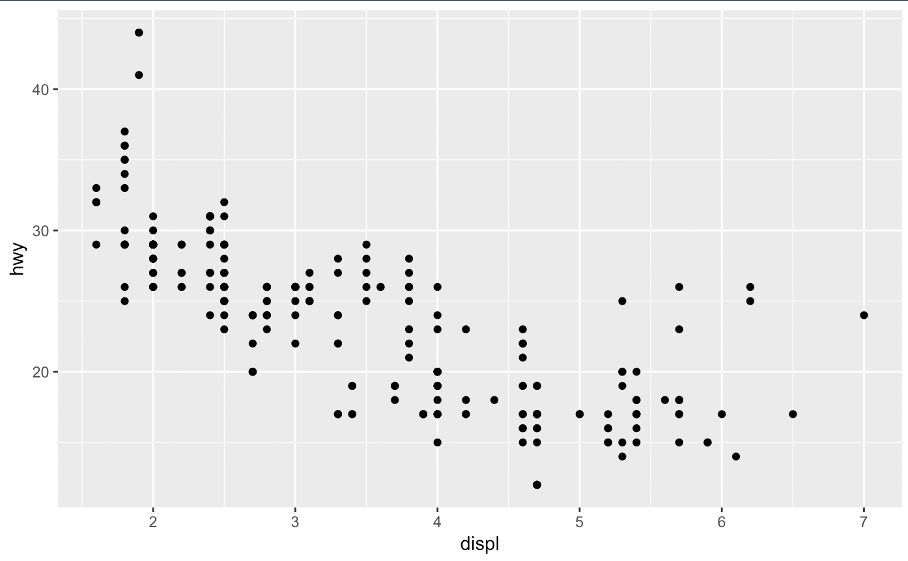
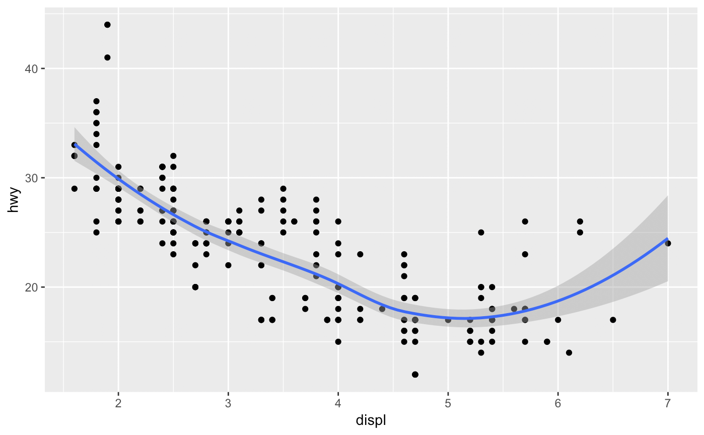
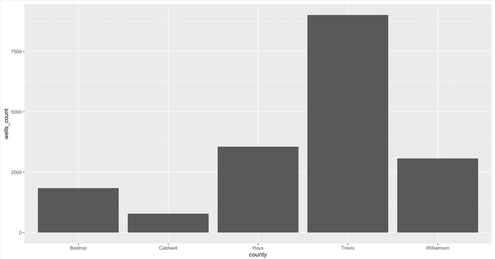
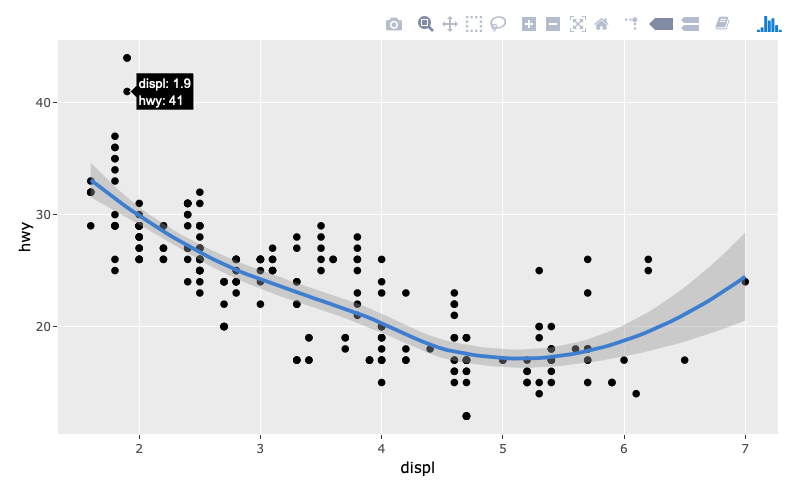
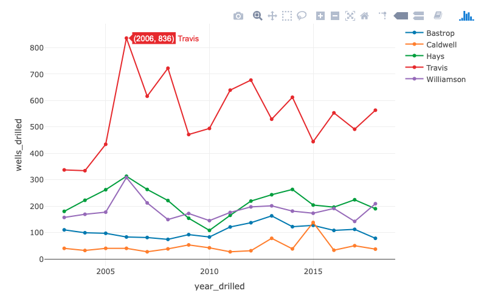

# Plots {#plots}


## UPDATES NEEDED

- use pot data for very start
- maybe use skittles for testing? (Not j-data)

---

old


## Goals for this section

- An introduction to the Grammar of Graphics
- We'll make charts!

## Introduction ggplot

[ggplot2](https://ggplot2.tidyverse.org/) is the data visualization library within Hadley Wickham's [tidyverse](https://www.tidyverse.org/). It uses a concept called the [Grammar of Graphics](https://byrneslab.net/classes/biol607/readings/wickham_layered-grammar.pdf), the idea that you can build every graph from the same components: a data set, a coordinate system, and geoms -- the visual marks that represent data points. With a hat tip to [Matt Waite](http://www.mattwaite.com/), the main concepts are: 

- **data**: which data frame you are pulling from
- **aesthetics**: the specific data from the data frame which we are going to plot
- **geometries**: the shape the data is going to take
- **scales**: any transformations we might make on the data
- **layers**: how we might lay multiple geometries over top of each other to reveal new information.
- **facets**: which means how we might graph many elements of the same data set in the same space

The challenge to understand here is for every graphic, we start with the data, and then describe how to layer plots or pieces on top of that data.

## The basic ggplot template

The template for a basic plot is this. (The `<>` denote that we are inserting values there.)

```r
ggplot(data = <DATA>, aes(mapping = <MAPPINGS>)) +
  <GEOM>(<ADDITONAL_MAPPINGS>)
```

- **`ggplot()`** is our function. We feed into it the data we wish to plot.
- **`aes()`** stands for "aesthetics", and it describes the column of data we want to plot, and how, like which column is on the **x axis** and which is on the **y axis**. These are called **mappings**, which we show in our template with **`<MAPPINGS>`**. They typically look like this: `aes(x = col_name_x, y = col_name_y)`. Now matter what type of chart we are building (bar chart, scatterplot, etc) we have to tell it which columns to show on the chart.
- The **`+`** is the equivalent of `%>%` in our tidyverse data. It means we are adding a layer, and it should always be at the end of the line, not at the beginning of the next.
- **`<GEOM_FUNCTION>`** is the type of chart or addition we are adding. They all start with the term **geom_** like **`geom_bar`**, which is what we will build with this example. It will take the mappings we supplied and plot them on the type of **geom_** we choose.
- **`<ADDITIONAL MAPPINGS>`** if a geom_ requires it, we can specify additional columns/axis mapping combinations to that **geom_**. We don't always have or need them. 

There are some ways to simplify this, and some ways to complicate it. Let's simplify first:

- It is implied that the first thing fed to `ggplot` is the data, so you don't have to write out `data =` unless there is ambiguity.
- The `aes()` values are also implied as mappings, so you don't have to write out `mapping =` unless there is ambiguity.

```r
ggplot(<DATA>, aes(<MAPPINGS>) +
  <GEOM>
)
```

One of the ways we make things complicated, is we layer different geometries. We might start with a scatterplot, and then add a reference line on top of it, which is a new geometry. Each **goem_** can specify their own mappings.

```r
ggplot(<DATA>, aes(<MAPPINGS>)) +
  <GEOM_FUNCTION>(aes(<SPECIFIC_MAPPINGS>)) +
  <GEOM_FUNCTION>(aes(<SPECIFIC_MAPPINGS>))
```

## Let's plot!

### Set up our Notebook

- Create a new RNotebook. Title it "Wells visualizations" and name the file `04-charts.Rmd`.
- Load the following libraries: tidyverse, lubridate.

```r
library(tidyverse)
library(lubridate)
```

### Scatterplot

One of the better ways to see this in action for the first time is build a scatterplot showing the relationship between two numbers. Unfortunately, our wells data does not have two such values, so we'll explore this using a data set that is already built into ggplot2, **mpg**.

Take a look at the **mpg** by calling it like a data frame.

```r
mpg
```

It looks something like this, which shows the first and last couple of rows:

| manufacturer | model  | displ | year | cyl | trans      | drv | cty | hwy | fl | class   |
|--------------|--------|-------|------|-----|------------|-----|-----|-----|----|---------|
| audi         | a4     | 1.8   | 1999 | 4   | auto(l5)   | f   | 18  | 29  | p  | compact |
| audi         | a4     | 1.8   | 1999 | 4   | manual(m5) | f   | 21  | 29  | p  | compact |
| audi         | a4     | 2     | 2008 | 4   | manual(m6) | f   | 20  | 31  | p  | compact |
| audi         | a4     | 2     | 2008 | 4   | auto(av)   | f   | 21  | 30  | p  | compact |
| ...          | ...    | ...   | ...  | .   | ...        | .   | ..  | ..  | .  | ...     |
| volkswagen   | passat | 2     | 2008 | 4   | manual(m6) | f   | 21  | 29  | p  | midsize |
| volkswagen   | passat | 2.8   | 1999 | 6   | auto(l5)   | f   | 16  | 26  | p  | midsize |
| volkswagen   | passat | 2.8   | 1999 | 6   | manual(m5) | f   | 18  | 26  | p  | midsize |
| volkswagen   | passat | 3.6   | 2008 | 6   | auto(s6)   | f   | 17  | 26  | p  | midsize |

The data is a subset of fuel economy data from 1999 and 2008 for 38 popular cars. Don't get too hung up on the data, it is just for examples.

The size of an engine is shows in the column `displ`. The Audi A4 has a 1.8 liter engine. The column `hwy` is the fuel rating for highways. Well also us the `class` column, which categorizes the type of vehicle.

What kind of relationship might you expect between the size of the engine and highway mileage?

Let's use our plot to show this. If our basic template is like this:

```r
ggplot(<DATA>, aes(<MAPPINGS>) +
  <GEOM>
```

Now, let's put our data in here. Our goal here is to show how the **hwy** number (y axis) changes as the **displ** number gets bigger (x axis.)

```r
ggplot(mpg, aes(x = displ, y = hwy)) +
  geom_point()
```

Which gets us a our first chart:



We can see there is a relationships of sort here, but ggplot has some additional geometries to help us see this, including [`geom_smooth()`](https://ggplot2.tidyverse.org/reference/geom_smooth.html). Since we have already the mappings in the main `ggplot()` call, all we have to do is add the new geom.

```r
ggplot(mpg, aes(x = displ, y = hwy)) +
  geom_point() +
  geom_smooth() # new plot. don't forget the + on previous line
```



Let's add one more visual cue (or aesthetic) to this graphic by coloring the dots based on the `class` of the vehicle. Since we want this aesthetic to apply only to the `geom_point()`, we have to add the `aes()` value there.

```r
ggplot(mpg, aes(x = displ, y = hwy)) +
  geom_point(aes(color = class)) + # added color aesthetic
  geom_smooth()
```


Looking at that graphic, what values might you want to learn more about?


## Plotting our wells data

For bar charts and line charts, we can return to our wells data, so let's import what we had from our last notebook.

```r
wells <- readRDS("data-out/wells_03.rds")
```

### Total wells per county

#### Shape our data

If we are plotting wells per county, we need to first build a data frame that counts the number of wells for each county. We can use the same `count()` function that we used when we cleaned our data.

```r
wells_by_county <- wells %>% 
  count(county) %>% 
  rename(wells_count = n)
wells_by_county
```

Let's break this down:

- The first line creates the new data frame `wells_by_county`, starting with our `wells` data frame.
- We apply the `count()` function on the "county" column. This makes our basic pivot table.
- On the third line, we rename the "n" column that was created by `count()`, so it is more descriptive, calling it `wells_count`.
- So now we have a data frame with two columns: **county** and **wells_count**. We print it on the fourth line so we can inspect it.


#### Plot our wells by county

Here is the verbose plot for our counties.

```r
ggplot(data = wells_by_county) +
  geom_bar(mapping = aes(x = county, y = wells_count), stat = "identity")
```

- On the first line we tell `ggplot()` that we are using the we `wells_by_county` data.
- On the next, we apply the `geom_bar()` function to make a bar chart. It needs two things:
    - The mapping, which are the aesthetics. We well it to plot **county** on the x (horizontal) axis, and **wells_count** on the y (vertical) axis.
    - Because **county** is a category instead of a number, we have to use the `stat = "identity"` value to describe that we are using values within county to separate the bars. This is a special thing for bar charts. One of those things that drive you nuts.



Our less verbose way to do this looks like this:

```r
ggplot(wells_by_county, aes(x=county, y=wells_count)) +
  geom_bar(stat = "identity")
```

### Add a layer of text labels

For each new thing that we add to our graphic, we add it with `+`. In this case, we want to add number labels to show the wells_count for that county.

```r
ggplot(data = wells_by_county, aes(x = county, y = wells_count)) +
  geom_bar(stat = "identity") +
  geom_text(aes(label=wells_count), vjust=-0.25) # adds the numbers on bars
```


In this case, we are just adding another layer, the `geom_text()`. It requires some additional aesthetics, like what `label=` we want to use. The `vjust=` moves the numbers up a little. Change the number and see what happens.

The last layer we want to add here is a Title layer. The function for labels is called `labs()` and it takes an argument of `title = ""` You can also change your `x` and `y` axis names, etc.

```r
ggplot(data = wells_by_county, aes(x = county, y = wells_count)) +
  geom_bar(stat = "identity") +
  geom_text(aes(label=wells_count), vjust=-0.25)
  labs(title = "Number of wells drilled by county") # adds the title
```


Congratulations! You made your first `ggplot()` chart. Not particularly revealing, but it does show that Travis County has WAY more wells than the other counties.

Let's see how those trends play out over time.

## Wells per county over time

Our next chart will be a line chart to show how the number of wells drilled has changed over time within each county.

Again, it will help us to think about what we are after and then build our data frame to match. In this case, we want to plot the "number of wells" for each county, by year. That means we need a data frame that has columns for county, year and the number of wells. To get that, we have to use group and summarize.

Sometimes it helps to write out the steps of everything before you to do it.

- Start with the `wells` data frame.
- Filter to 2003 or later, because that's when the [system came online](http://www.twdb.texas.gov/groundwater/data/drillersdb.asp).
- Group by the `county` and `year_drilled` fields.
- Summarize to create a count of the number of `wells_drilled`.
- Set all of the above to a new data frame, `wells_county_year`.
- Start a plot with the new data.
- Set x (horizontal) to be year_drilled and y (vertical) to be wells_drilled, and color to be the county.

### Work up the data frame

```r
wells %>% 
  filter(year_drilled >= 2003) %>% 
  group_by(county, year_drilled) %>% 
  summarise(
    wells_drilled = n()
  )
```

This gives you a table similar to this:

| county   | year_drilled | wells_drilled |
|:---------|:-------------|--------------:|
| Bastrop  | 2003         |           110 |
| Bastrop  | 2004         |            99 |
| Bastrop  | 2005         |            97 |
| ...      | ...          |           ... |
| Caldwell | 2003         |            40 |
| Caldwell | 2004         |            32 |
| Caldwell | 2005         |            40 |

We call this _long_ data, because each row contains a single observation, instead of _wide_ data, which would have a column for each observation.

Once you are have the data formatted, set it to fill a new data frame called `wells_county_year`.

### Draw the plot

Remember the formula for a basic plot:

```r
ggplot(<DATA>, aes(<MAPPINGS>)) +
  <GEOM_FUNCTION>
```

and if all our mappings are the same, they can go into the ggplot function.

```r
ggplot(wells_county_year, aes(x=year_drilled, y=wells_drilled)) +
  geom_line(aes(color=county)) +
  labs(title = "Wells by county and year", x = "Year", y = "Number of wells")
```


How easy would it be to add points for every year to make each data point stand out?

### Your turn: Add layers

- Add a new layer `geom_point()` and see what happens
- Add a labels layer to add a title, like we did in the bar chart above.

### Dates as numbers and the problems they cause

There was one point during my work on this graphic when my x axis did not fall evenly on years, and I figured it was because the `year_drilled` field was a number and not a date. It's possible to fix that by including the `library(lubridate)` and then mutating the year_drilled column like this:

```r
  mutate(
    year_drilled = ymd(year_drilled, truncated=2L)
  ) %>%
```

## Your turn: Build a line chart

Now, I'd like you to build a line chart that shows how the different kinds of wells drilled has changed over time. Here's a major hint: It's very much like the line chart you just built, but with different columns. You'll need so start at creating a data frame with the correct data.

## Review of ggplot

Exploring with graphics are one of the more powerful features of working with R. It takes a bit to get used to the Grammar of Graphics and ggplot2 and it will be frustrating at first. But be assured it can do about anything once you learn how, and being able to fold in these charts with your thoughts and analysis in a repeatable way will make you a better data journalist.

By design, every chart in ggplot starts with the same three things: data, a geometric coordinate system, and a mapping of the aesthetics, including the x and y values.

```r
ggplot(data = <DATA>, mapping = aes(<MAPPINGS>)) +
  <GEOM_FUNCTION>
```

If your graphic is simple, there may be less verbose ways to write it as ggplot will assume your are passing it data first, and that `aes()` functions are for mapping.

## Plotly for more interactive graphics

At the risk of adding yet a little more complexity I want to introduce you to [Plotly](https://plot.ly/r/). I see two ways you might find Plotly interesting:

### ggplotly

[ggplotly](https://plot.ly/ggplot2/) allows you to port your ggplot graphic into Plotly so they have interactive tooltips. The tutorial examples are also not bad for a general ggplot reference.

After installing and loading the Plotly library, giving your chart hover tips is as easy as assigning your plot to an object (`p` in the example below), and then calling that with the `ggplotly()` function:


```r
p <- ggplot(mpg, aes(x=displ, y=hwy)) +
  geom_point() +
  geom_smooth()
ggplotly(p)
```



The black label above appears when you hover on the graphic.

### More with `plot_ly()` function

You can gain a little more control over your Plotly graphic if you build them using the `plot_ly()` function instead of `ggplot()`, but you have to learn a new syntax. It's still based on the Grammar of Graphics, so it's not hard ... just different.

For example, for our "Wells by County and Year" graphic we did earlier looks like this:

```r
wells_county_year %>% plot_ly(x = ~year_drilled, y = ~wells_drilled, name = ~county,
        type = "scatter", mode = "lines+markers")
```

And it ends up looking like this:



### Plotly's freemium model

It appears that you can use these open source libraries without charge from Plotly. They do also have a hosting service to allow you to embed charts in other websites, which can get into a pay tier of their service.

## Resources

- [The ggplot2 documentation](http://ggplot2.tidyverse.org/reference/index.html) and [ggplot2 cheatsheets](https://github.com/rstudio/cheatsheets/blob/master/data-visualization-2.1.pdf).
- [R for Data Science, Chap 3.](https://r4ds.had.co.nz/data-visualisation.html) Hadley Wickam dives right into plots in his book.
- [R Graphics Cookbook](https://r-graphics.org/index.html) has lots of example plots. Good to harvest code and see how to do things.
- [The R Graph Gallery](https://www.r-graph-gallery.com/) another place to see examples.
