# Tidy data {#tidy}

Data "shape" can be important when you are trying to work with and visualize data. In this chapter we'll discuss "tidy" data and how this style of organization helps us.

> Slides by Hadley Wickham are used with permission from the author.

## Goals for this section

- Explore what it means to have "tidy" data.
- Learn `gather()`, `spread()` and other [tidyr](https://tidyr.tidyverse.org/) verbs.
- Use Mixed Beverage Gross Receipts to explore shaping data.
    + We'll introduce the RSocrata package to get the data.
- Explore and chart the alcohol data to practice our skills.

## What is tidy data

"Tidy" data is well formatted so each variable is in a column, each observation is in a row and each value is a cell. Our first step in working with any data is to make sure we are "tidy".


It's easiest to see the difference through examples. The data frame below is of tuberculosis reports from the World Health Organization.

- Each row is a set of observations (or case) from a single country for a single year.
- Each column describes a unique variable. The year, the number of cases and the population of the country at that time.


Table2 below isn't tidy. The **count** column contains two different type of values.


When our data is tidy, it is easy to manipulate. We can use functions like `mutate()` to calculate new values for each case.


## Tidyr package

When our data is tidy, we can use the [tidyr](https://tidyr.tidyverse.org/) package to reshape the layout of our data to suit our needs.

In the figure below, the table on the left is "wide". There are are multiple year columns describing the same variable. It might be useful if we want to calculate the difference of the values for two different years. It's less useful if we want plot on a graphic because we don't have columns to map as X and Y values.

The table on the right is "long", in that each column describes a single variable. It is this shape we need when we want to plot values on a chart. We can then set our "Year" column as an X axis, our "n" column on our Y axis, and group by the "Country". 


## The tidyr verbs

We'll use functions within the [tidyr](https://tidyr.tidyverse.org/) package to manipulate data to our liking, depending on our need.

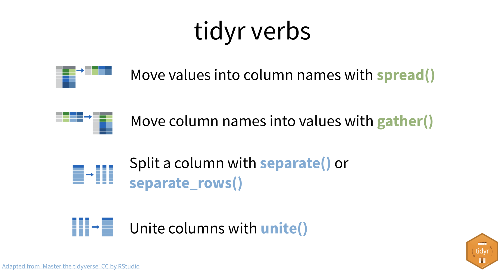


## Set up the mixbev project

We're going to work in a new project with new data for this assignment. I will try to get you up and running as quickly as possible.

- In RStudio, choose File > New Project
- Walk through the steps to create a New Project in a New Directory called `yourname-mixbev`.
- Once you have your project, create a new RNotebook. Save the file and name it `01-mixbev-import.Rmd`.
- Go to [this link](https://gist.githubusercontent.com/critmcdonald/151e1fa44c82ea5ca337b204cfc095d6/raw/c475fcce8b701cd03721dc1c753724c6e4636cd1/01-mixbev-import.Rmd) and copy the text and replace everything in your RNotebook.

There are a couple of things we need to do before you run this notebook:

- In the R Console, run `install.packages("RSocrata")`
- Use the Files pane to create a new folder called `data-raw` so we have a place to save our data.
- Now use **Cmd-option-R** (or go to Run > Run All) to run the notebook.

Running that notebook will download three years of data from Travis County establishments and save it into your `data-raw` folder in your project. How that is done is all documented in that notebook, but we may spend some time in class explaining going over it.

## Create an explore notebook

Now that we have data we don't have to download it again. Let's create a new RNotebook to import and explore it (and learn Tidyr while we are at it).

- Create a new RNotebook. Save the file as `02-mixbev-explore.Rmd`.
- Update the title in the metadata.
- Remove the boilerplate below the data.
- Add the code below, then **Restart R and Run All Chunks**.

```r
library(tidyverse)
library(lubridate)
library(scales)

# import the data
receipts <- readRDS("data-raw/receipts_api.rds")
```

### Peruse the data

In the environment window, click on the **receipts** data frame so it opens and you can look at the data. Some key things to know about the data:

- Columns with **`location_`** are about a specific restaurant or bar selling alcohol.
- Columns with **`taxpayer_`** are about the owners of that establishment.
- The monetary amounts for **`_receipts`** are total sales numbers for that establishment in that month.
- The **`obligation_end_date`** is the last day of the month for those sales.
- The liquor type sales like beer and wine _should_ all add up to the **total_receipts**, but sometimes type sales are blank. I don't trust **cover_charge_receipts** at all.
- There are several other columns we won't deal with in this lesson.

So these are NOT the number of drinks sold. It's the amount of money brought in for the total sale of each type of liquor within that month. The **total_receipts** is used to calculate tax paid to the state on those sales based on a formula. See the record layout on [Socrata](https://data.texas.gov/Government-and-Taxes/Mixed-Beverage-Gross-Receipts/naix-2893) for more information.

## What might we learn about this dataset

If we look at the data set, there are a series of questions we might ask it.

- How have total sales changed over the past three years?
- Who has sold the most alcohol over the past three years?
- Which campus-area bars have sold the most, and what are their sales trends?
- Do these campus-area bars sell more beer, wine or liquor?
- Have the number of establishments that sell alcohol increased? If so, where?

There are others for sure, but for this lesson we'll concentrate on campus-area bars you _might_ be familiar with.

## Add years and months values

We will end up doing a lot of summaries based on year and month of the data. It will be easier to do that if we create some new columns that have those values.

```r
receipts <- receipts %>% 
  mutate(
    # sales_year = year(obligation_end_date_yyyymmdd),
    sales_year = year(obligation_end_date_yyyymmdd) %>% as.character(),
    sales_month = month(obligation_end_date_yyyymmdd, label = TRUE)
  )
```

> I specifically coerced `sales_year` into a string because the year as a continuous number was causing problems with plots later when I got an axis mark for "2016.5". Probably not the best solution, but it worked.

## Campus bars

Let's take a look at sales around campus. Make a data frame of just the receipts from the 78705 area.

```r
uni_area <- receipts %>% 
  filter(
    location_zip  == '78705'
  )

# peek at the result
uni_area %>% head()
```

### Total 78705 sales leaders in 2018

Let's make a quick table to add `total_receipts` for 2018 so we can find the top selling bars from last year. We can do that by filtering for 2018, grouping by location and address, and then summing together the total receipts.

```r
uni_area %>% 
  filter(sales_year == 2018) %>% 
  group_by(location_name, location_address) %>% 
  summarize(
    total_sales = sum(total_receipts)
  ) %>% 
  arrange(desc(total_sales)) %>% 
  head(10)
```

And we get this:

| location_name                             | location_address    | total_sales |
|-------------------------------------------|---------------------|-------------|
| EXECUTIVE EDUCATION AND CONFERENCE CENTER | 1900 UNIVERSITY AVE | 1684571     |
| SPIDER HOUSE                              | 2908 FRUTH ST       | 1575812     |
| CAIN & ABEL'S                             | 2313 RIO GRANDE ST  | 1051230     |
| TRUDY'S TEXAS STAR CAFE                   | 409 W 30TH ST       | 1012269     |
| THE HOLE IN THE WALL                      | 2538 GUADALUPE ST   | 827799      |
| HOTEL ELLA/GOODAL'S KITCHEN & BAR         | 1900 RIO GRANDE ST  | 707431      |
| DOC'S MOTORWORKS 38TH                     | 1106 W 38TH ST      | 561019      |
| THE LOCAL PUB AND PATIO                   | 2610 GUADALUPE ST   | 544261      |
| VIA 313 PIZZA RESTAURANT II               | 3016 GUADALUPE ST   | 531878      |
| THE BACK LOT                              | 606 MAIDEN LN       | 494638      |

## West Campus student hot spots

Looking at the list above, let's filter our original data to some top student hangouts that we know are still open.

```r
student_bars <- receipts %>% 
  filter(
    location_name %in% c(
      "SPIDER HOUSE",
      "CAIN & ABEL'S",
      "TRUDY'S TEXAS STAR CAFE",
      "THE HOLE IN THE WALL",
      "THE LOCAL PUB AND PATIO"
    )
  )
  
# check the results
student_bars %>% count(location_name, location_address)
```

Note the `filter()` function above. In order to feed in a list of location names into the filter, I used the `%in%` operator (instead of `==`) and I put list of locations into a `c()` function. The C stands for concatenate, FWIW.

After creating the `student_bars` data frame above, I used `count()` to  make sure we caught all the bars and made sure each had the same number of reports. Which looks like this:

| location_name           | location_address   | n  |
|-------------------------|--------------------|----|
| CAIN & ABEL'S           | 2313 RIO GRANDE ST | 36 |
| SPIDER HOUSE            | 2908 FRUTH ST      | 36 |
| THE HOLE IN THE WALL    | 2538 GUADALUPE ST  | 36 |
| THE LOCAL PUB AND PATIO | 2610 GUADALUPE ST  | 36 |
| TRUDY'S TEXAS STAR CAFE | 409 W 30TH ST      | 36 |

Note I didn't save the `count()` function back to the data frame. I just viewed that to the notebook so we could check our work.

## Campus-area bar sales over time

### Visualizing your visualization

Now, if we are interested in charting it helps to think about what we need and how to shape our data to get it.

Let's start with charting **how sales at each bar have changed over the past three years**. Since we are looking at value over time for multiple things, a line chart will probably work best.

If our basic line chart works like this:

```r
ggplot(<DATA>, aes(x=<COL_VALUE>, y=<COL_VALUE>, group=<COL_VALUE>)) +
  geom_line()
```

We need to figure out how to configure our data to fit the chart.

- For the "X" value (horizontal) we have the `sales_year` field to track over time.
- For the "Y" value (vertical) we want the total sales of each bar for that year. We'll need to do a summary to get that.
- We want a line for each campus bar, which means we need a column for `location_name` for our "group", too.

We create this data frame by using our `group_by()` on `location_name` and `sales_year` and then `summarize()` to get our total sales by our grouping:

```r
student_bars_grouped <- student_bars %>% 
  group_by(location_name, sales_year) %>% 
  summarise(
    total_sales = sum(total_receipts)
  )
  
# peek at the results
student_bars_grouped %>% head()
```

Which ends up looking this this:

| location_name | sales_year | total_sales |
|---------------|------------|------------:|
| CAIN & ABEL'S | 2016       |      896114 |
| CAIN & ABEL'S | 2017       |      990631 |
| CAIN & ABEL'S | 2018       |     1051230 |
| SPIDER HOUSE  | 2016       |     1797800 |
| SPIDER HOUSE  | 2017       |     1721580 |
| SPIDER HOUSE  | 2018       |     1575812 |

Now we can plug in our columns to get our chart:

```r
ggplot(student_bars_grouped, aes(x=sales_year, y=total_sales, group=location_name)) +
  geom_line(aes(color=location_name)) + 
  geom_point() +
  scale_y_continuous(labels=comma)
```

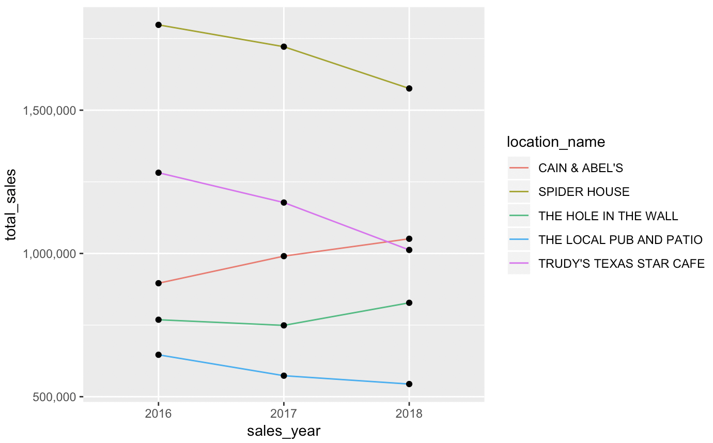

We've added a couple of do-dads to our line chart to make it prettier, like adding a color aesthetic the `geom_line()` function to color the lines and give us a legend, and a scale with labels to make the Y numbers pretty.

### What did we find?

Looking at the chart, we can see that Cain & Abel's is the only top campus-area bar with an increase in alcohol sales over each of the past three years. The Hole in the Wall did have a good 2018, reversing a downward trend. Everywhere else dropped sales each year.

## Types of sales within student bars

If we want to see how beer, liquor and wine sales differ at an establishment, we could use a very similar chart, but we would want each line to be the type of alcohol: beer, wine or liquor.

But this is how our columns look right now. Beer, wine and liquor are separate columns.

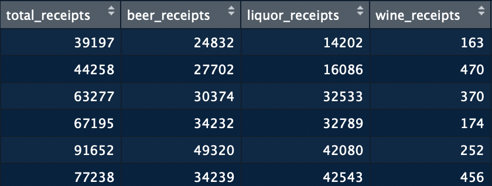


This is where we introduce `gather()` from tidyr so we can shape our data to meet our needs.

## How gather() works

The [`gather()`](https://tidyr.tidyverse.org/reference/gather.html) function is what we use to change wide data into long data. We are "gathering" all the extra columns into two: one for the value and one to describe it. In the example below, a **key** column is created called "Year" and a **value** column called "n" is created to hold the values from each of the yearly columns. For each value, a new row is created, and the column name is used for the "key" and the data is use for the "value".

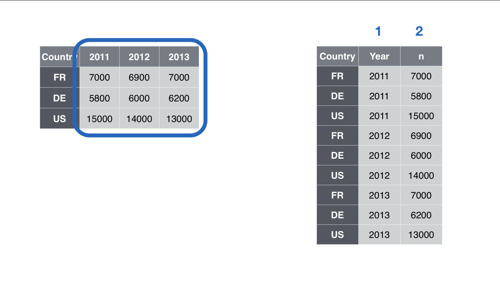

We can see how this works by tracking a single value from one shape to the other:


Now, how do we define this in code?

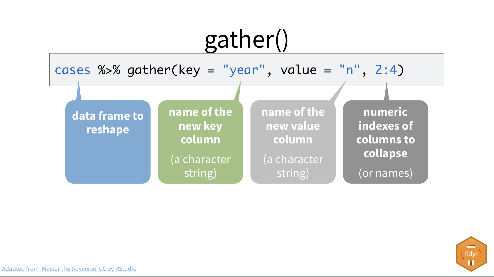

We are, of course, starting with the data frame and then piping it into the `gather()` function. The first value we have to give the function is to name our **key** column.

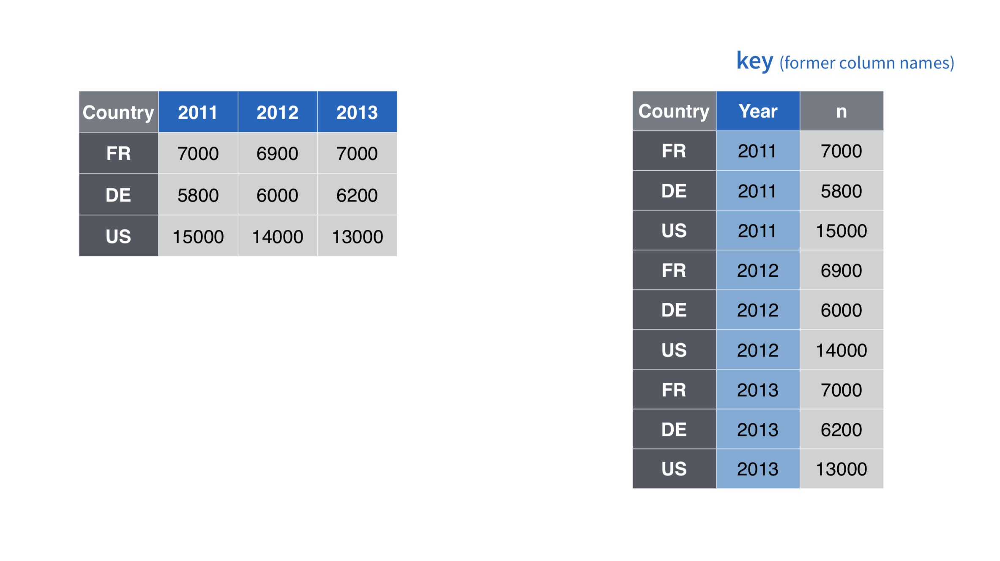

And the next value we give it is name of the **value** column.

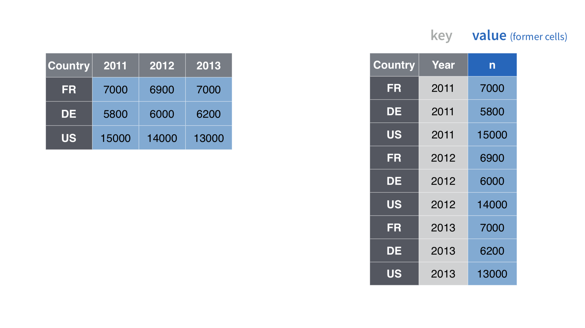

Then we have to give it the **range of columns** that we want to gather. You can define those in different ways.

The first method is a number range of the columns, starting in order of the columns in the data frame. So, for our example above, we want the second, third and fourth column, so we use the range `2:4`.

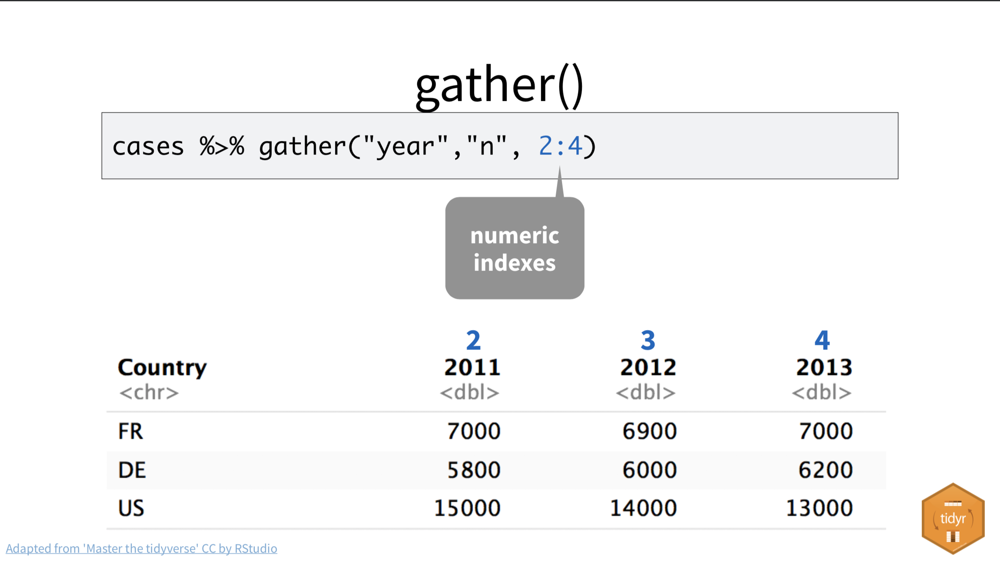

Or, we could supply those columns in other ways, like by their column names:

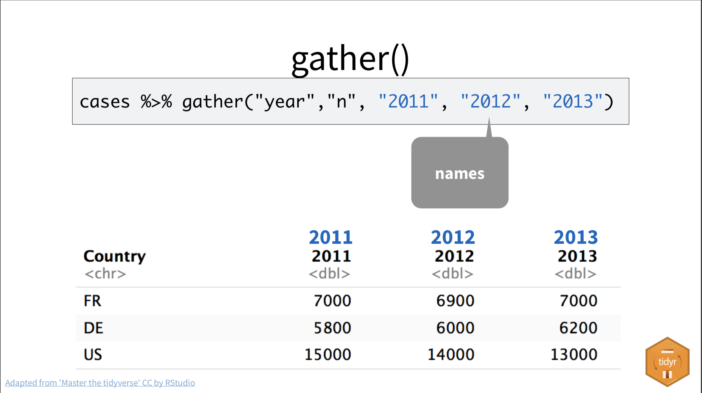

Or by specifying which columns we _don't_ want to gather:

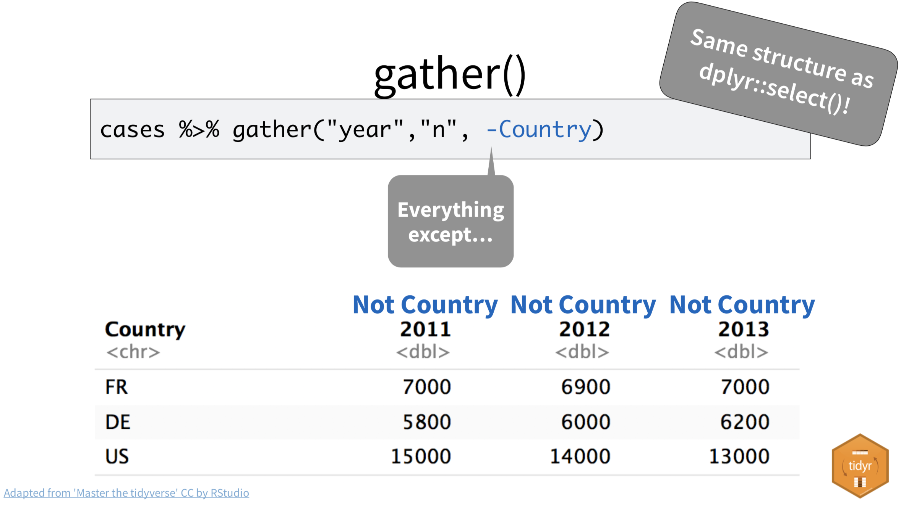


## Applying gather() to beer, wine and liquor

Let's start by making a new data frame with just the columns we need to work with. We are starting with the `student_bars` data frame we created that has the three years of receipts from just our five campus-area bars:

```r
student_sales <- student_bars %>% 
  select(location_name, sales_year, beer_receipts, wine_receipts, liquor_receipts) %>%
  rename(
    beer = beer_receipts,
    wine = wine_receipts,
    liquor = liquor_receipts
  )
student_sales %>% head() # to show our results
```

We get a result like this:

| location_name           | sales_year | beer  | wine | liquor |
|-------------------------|------------|-------|------|--------|
| THE LOCAL PUB AND PATIO | 2018       | 24832 | 163  | 14202  |
| THE LOCAL PUB AND PATIO | 2017       | 27702 | 470  | 16086  |
| THE HOLE IN THE WALL    | 2018       | 30374 | 370  | 32533  |
| THE HOLE IN THE WALL    | 2017       | 34232 | 174  | 32789  |
| THE HOLE IN THE WALL    | 2018       | 49320 | 252  | 42080  |
| CAIN & ABEL'S           | 2016       | 34239 | 456  | 42543  |


Now, if we can "gather" the beer, wine and liquor columns into two new columns -- alcohol type and sales amount -- then we could group and sum by the year and type.

The code below builds the new data frame we'll use for our chart (`student_sales_grouped`) but you skip the beginning data frame assignment and walk through it line by line to see how it gets built, starting with the `student_sales` data frame. Once you have it, then assign it back to `student_sales_group`.

```r
student_sales_grouped <- student_sales %>% 
  gather(alcohol_type, sales_by_type, 3:5) %>% 
  group_by(location_name, sales_year, alcohol_type) %>% 
  summarise(
    sales_sum_year = sum(sales_by_type)
  )
  
# peek at the result
student_sales_grouped %>% head() 
```

- We start with the `student_sales` data frame, where each row has the sales for each month of the year in multiple columns.
- `gather()` names our fields "alcohol_type" and "sales_by_type" and gathers our beer, wine and liquor columns. At this point, each row of data has the individual sale of a type of alcohol for each month of each year.
- `group_by()` collects our data by the name, year and type. This prepares us to:
- `summarize()` adds together all the beer sales for each month are summed up into one row for each year.

### Plot sales by type for a single campus-area bar

Let's figure out the line chart with one establishment first:

```r
cain <- student_sales_grouped %>% 
  filter(location_name == "CAIN & ABEL'S")

ggplot(cain, aes(x=sales_year, y=sales_sum_year, group=alcohol_type, color=alcohol_type)) +
  geom_line()
```

We get our chart like this:

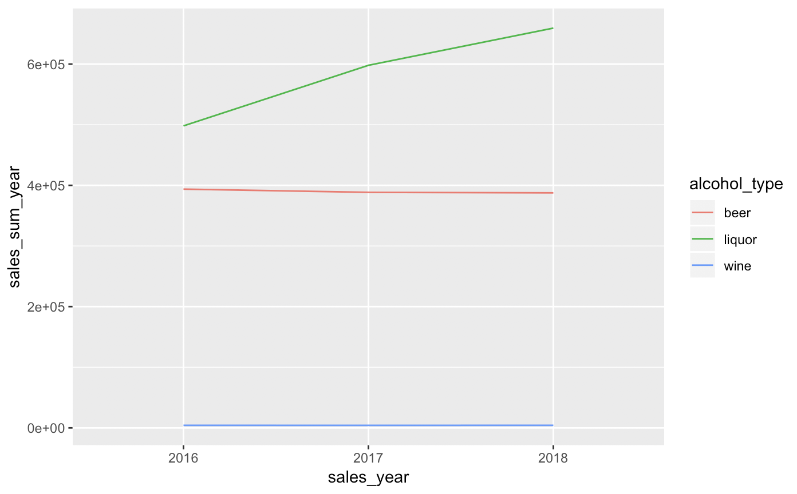


### Plot sales by type for multiple campus-area bars

For this chart, we are going to duplicate what we did for the graphic above, and then instead of applying to the `cain` data frame, we'll substitute in our our `student_sales_grouped` data frame so have all the West Campus bars.

And now we can introduce the `facet_wrap()`, which allows you to duplicate a graphic based on one of the categories in the data. We feed the `facet_wrap()` function with the variable (the column name) we want to duplicate. Weirdly, it has to start with a tilde, like this: `facet_wrap(~location_name)`.

```r
ggplot(student_sales_grouped, aes(x=sales_year, y=sales_sum_year, group=alcohol_type, color=alcohol_type)) +
  geom_line() +
  facet_wrap(~location_name) +
  scale_y_continuous(label=comma)
```


### What did we learn?

Liquor sales are what is driving Cain & Abel's increase in revenue. Wine sales are pretty low everywhere and Trudy's really sells a lot of liquor. It's those Mexican Martinis and Margaritas, I imagine.

## The spread() function

There is another tidyr function called [`spread()`](https://tidyr.tidyverse.org/reference/spread.html) that does the opposite of `gather()`. We won't do an example with this lesson, but this is how it generally works.

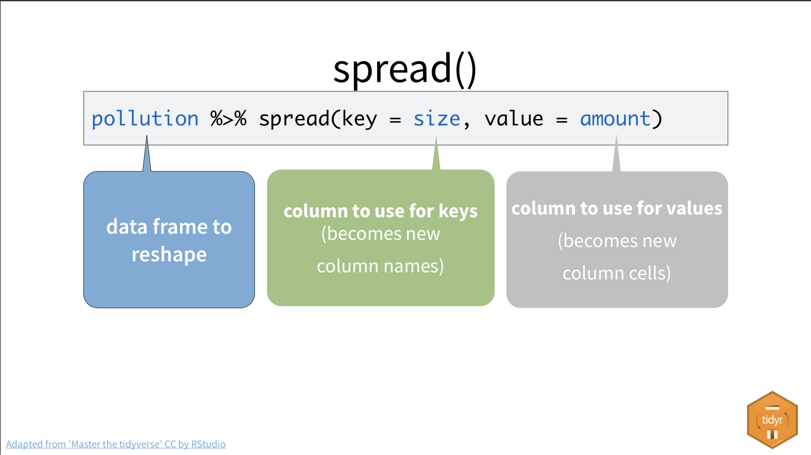

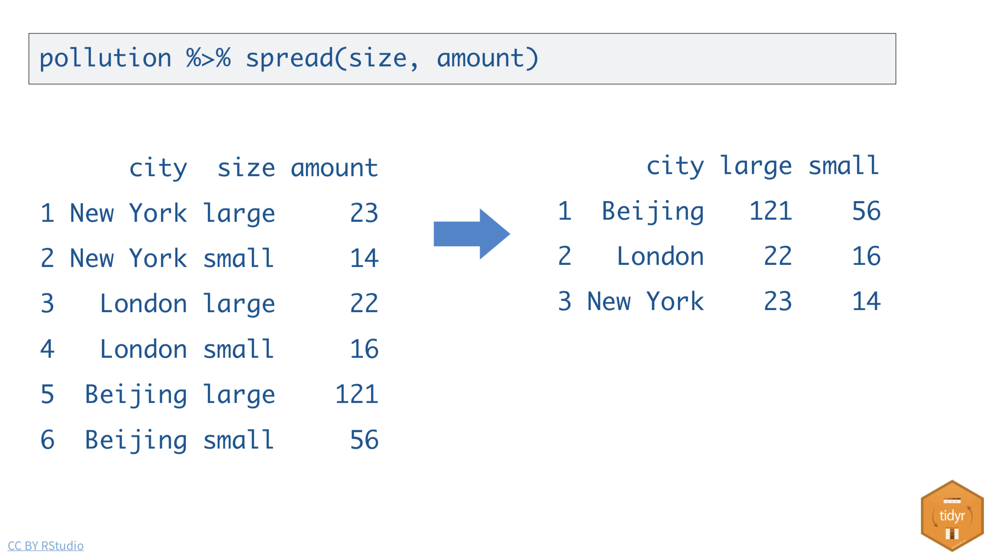


## Practice assignment: Exploring the top seller

This assignment looks a little further into some specific establishments from the Mixed Beverage Data. Here are the directions, with lots of hints thrown in.

- Create a new notebook called "03-practice.Rmd". Use the same libraries and data as the in-class assignment.
- Find the establishment with highest total receipts in last three years. See the first Bonus section below for the the code.
- For the top establishment found, **create a bar chart with sales by year**. Here are some hints:
    - Start with `receipts`, then filter by the `location_name` and the `location_address`. (You have to include `location_address` because there is more than one location in Ausitn for this chain.) Assign that to a data frame that you can use going forward.
    - Group by `sales_year`, then summarize to get the `sum(total_receipts)`. Review [Summarize](https://utdata.github.io/rwd-class/transform.html#summarize) if needed. Save the result into a new data frame.
    - Use `ggplot()` with `geom_bar(stat="identity")`. Review the less verbose [wells by county](https://utdata.github.io/rwd-class/graphics.html#plot-our-wells-by-county) for an example of how to write the plot.
- For that top establishment, **create a bar chart with total_receipts each month**. Some hints:
    - Don't over think this. You already have a filtered data set, and you can plot the x axis on the `obligation_end_date_yyyymmdd`.
- Because the chart shows trends but it's hard to see the values for the top months, **create a table showing the top monthly total sales by month**. Some hints:
    - Select the `oblibgation_end_date_yyyymmdd` and arrange the `total_receipts` in descending order. Show just the top by piping into `head()`
- For that establishment, **create a line chart with sales by alcohol type by year**. This one is more challenging, but you have everything you need in the chapter when we did this for Cain & Abel's. Here are some hints:
    - You can start from the the filtered data that you did with the previous chart.
    - Create a new data frame with just the columns you need: select name, sales_year, beer, wine, liquor
    - Use `gather()` to collect the beer, wine, liquor columns as `alcohol_type` and `sales_by_type`. This is the same as we did in class.
    - Group by `sales_year`, `alcohol_type`.
    - Summarize to get the `sales_sum_year`.
    - Plot as a geom_line chart with x=sales_year, y=sales_sum_year, group and color as alcohol_type.
- Lastly, to show that once you have code you can re-purpose it, **create a line chart of sales by alcohol type by year for the Circuit of the Americas**. Your hint:
    - Create a new data frame with just the Circuit of the Americas data.
    - Copy the steps from the last chart, and change out the data frame name.

## Bonus: Top 5 sellers in Travis County over three years

Because some chains might have that same `location_name` but more than one location, we need to group by both the `location_name` and the `location_address` fields. Then we can summarize their total sales.

```r
receipts %>% 
  group_by(location_name, location_address) %>% 
  summarise(
    total_sales = sum(total_receipts)
  ) %>% 
  arrange(desc(total_sales)) %>% 
  head(5)
```

Which gives you something like this:

| location_name        | location_address                  | total_sales |
|----------------------|-----------------------------------|------------:|
| WLS BEVERAGE CO      | 110 E 2ND ST                      |    35878211 |
| RYAN SANDERS SPORTS  | 9201 CIRCUIT OF THE AMERICAS BLVD |    20714630 |
| W HOTEL AUSTIN       | 200 LAVACA ST                     |    15435458 |
| ROSE ROOM/ 77 DEGREE | 11500 ROCK ROSE AVE               |    14726420 |
| THE DOGWOOD DOMAIN   | 11420 ROCK ROSE AVE STE 700       |    14231072 |

What exactly is that top location? (Google it). It looks like that location (hint: a hotel) has sold more that twice the amount as the next hotel.

What is the second location? That could be pretty interesting to look further into as well.

## Bonus: Total sales by county

So, are alcohol sales going up in Travis County? We can use our new `sales_year` column to group the data and summarize by the sum of `total_sales`.

```r
receipts %>%
  group_by(sales_year) %>% 
  summarise(
    total_sales = sum(total_receipts)
  )
```

If you want to _see_ the result, we can plot as a bar chart. I'm repeating our code above, but then shoving it into a new data frame, which we use to plot.

```r
receipts_group_all <- receipts %>%
  group_by(sales_year) %>% 
  summarise(
    total_sales = sum(total_receipts)
  )

ggplot(receipts_group_all, aes(x=sales_year, y=total_sales)) +
  geom_bar(stat = "identity") +
  scale_y_continuous(labels=comma)
```

The last line in the plot comes from the [scales](https://www.rdocumentation.org/packages/scales/versions/0.4.1) package and it gives us pretty numbers on the Y axis.

If you are writing a story about alcohol sales in Travis County over the last three years, you can say that sales have risen over each year. You might go further and compare the sales to the population over the same time period, but we'll skip that for now.
