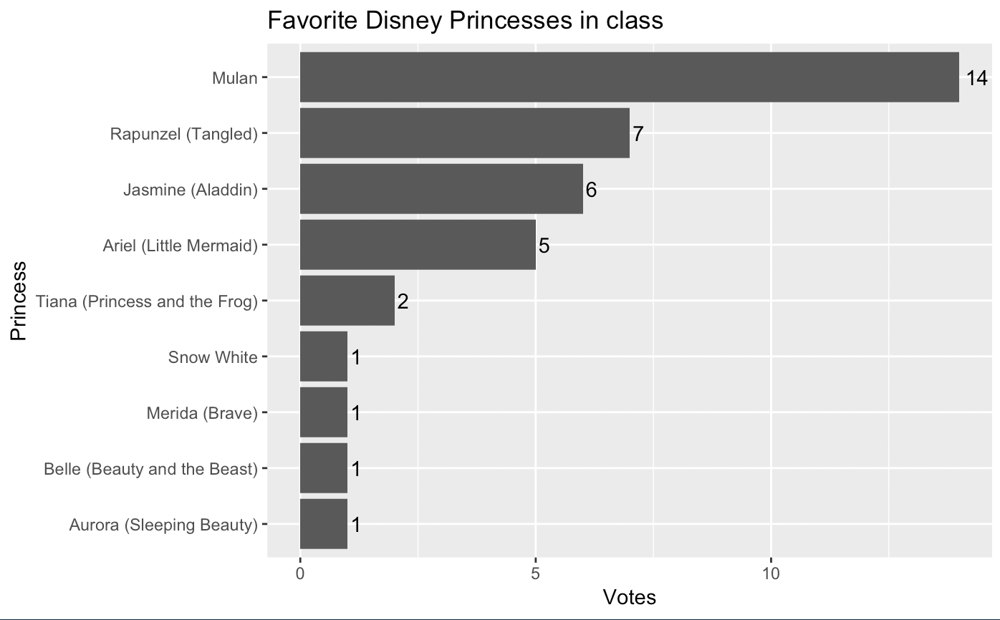
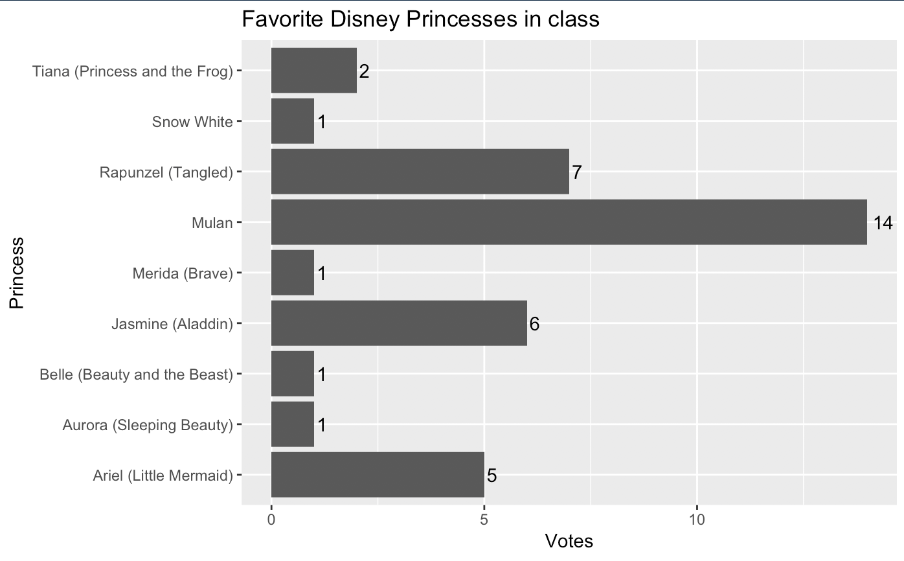

# Reordering factors

There is a complexity within R data frames that we need to cover becomes it comes into play when we want to order categorical data within graphics.

We are going to handle this through a new project using our Survey data from class.

## Goals for this session

- Create a new project with our class survey data.
- Create a chart that uses categorical data.
- Reorder the values in the chart using `fct_reorder()`.

This is the charts we want to build:



## Resources

These resources can help you understand the concepts. Factors can be a complicated, but we are just dealing with one thing, so we'll try to keep it as simple as possible.

- This post on [Reordering a variable in ggplot](https://www.r-graph-gallery.com/267-reorder-a-variable-in-ggplot2/) helped me understand how to reorder factors for graphics.
- Hadley Wickam's R for Data Science has a [Chapter on factors](https://r4ds.had.co.nz/factors.html). For those who _really_ want to learn more about them later.

## Create our survey project

### Setup

- In RStudio, choose File > New Project
- Walk through the steps to create a New Project in a New Directory called `yourname-survey`.
- In your project, create a new directory called `data-raw`.
- Go to [this link](https://raw.githubusercontent.com/utdata/rwd-r-assignments/master/survey-results/survey-results.csv) in a browser. Do **File > Save page as** and save the file inside your `data-out` folder as `survey-results.csv`.
- Create a new RNotebook. Save the file and name it `01-survey.Rmd`. For this simple example, we'll only be using one notebook.

### Libraries

We need two libraries. I _think_ the **forcats** library is already installed, but if not you'll have to run the following in your RConsole: `install.packages("forcats")`.

```r
library(tidyverse)
library(forcats)
```

### Import the data

Import the data from the csv

```r
survey <- read.csv("data-raw/survey-results.csv") %>% clean_names()

# peek at the data
survey %>% head()
```

Peeking at the data, we see it is something like this:

| class             | graduating | ice_cream           | princess               | computer  |
|-------------------|------------|---------------------|------------------------|-----------|
| Senior            | Yes        | Cookies & Cream     | Mulan                  | Macintosh |
| Masters candidate | Yes        | Rocky Road          | Mulan                  | Windows   |
| Senior            | Yes        | Chocolate           | Ariel (Little Mermaid) | Windows   |
| Senior            | No         | Mint chocolate chip | Mulan                  | Macintosh |
| Junior            | No         | Mint chocolate chip | Jasmine (Aladdin)      | Windows   |
| Senior            | No         | Mint chocolate chip | Rapunzel (Tangled)     | Macintosh |

## Charting the popularity of princess

Now, we want to build a column chart based on the princess data. To do this, we need to build a data frame that counts the number of rows for each princess value. These easiest way to do this is a simple `count()` summary. Build the count _before_ you assign it back to `princess_count` so you see what is happening, but this is similar to what we've done in the past.

```r
princess_count <- survey %>%
  count(princess) %>%
  rename(votes = n) %>%
  arrange(desc(votes))

# peak
princess %>% head
```

In order, we are:

- Assigning the result (which you do at the end), starting from `survey`.
- Count the rows of each princess.
- Rename the `n` column to `votes`.
- Arrange so the most votes are on top.

## Create our princess plot

We are going to use a new chart, `geom_col`, which is like `geom_bar` but it already understands the `stat="identity"`.

```r
princess_count %>% ggplot(aes(x = princess, y = votes)) +
  geom_col() +
  coord_flip() +
  labs(title="Favorite Disney Princesses in class", x = "Princess", y = "Votes") +
  geom_text(aes(label = votes), hjust=-.25)
```

And we get this:



Well, that is frustrating. The bars are not in the same order that we arranged them in the data frame.

As explained in [the R-Graph-Gallery post](https://www.r-graph-gallery.com/267-reorder-a-variable-in-ggplot2/): This is due to the fact that ggplot2 takes into account the order of the factor levels, not the order you observe in your data frame. You can sort your input data frame with sort() or arrange(), it will never have any impact on your ggplot2 graphic.

### Labels and titles

Before I get into factors, let me explain the other lines in the graphic above:

- `coord_flip()` transposes the bars so they go horizontal instead of vertical. This allows us to read the princess values.
- `labs()` allows us to add the title and cleaner axis labels.
- `geom_text()` adds the numbers at the end of the bar, with some adjustments to get them off the top of the bars.

## Factors

Factors allow you to apply an order (called "levels") to values beyond being alphabetical. It is super useful when you are dealing with things like the names of months which have a certain order ("Jan", "Feb", "March") which would not be ordered correctly alphabetically.

But is is kind of frustrating here.

We can improve it by reordering the levels of `princess` using `fct_reorder()`, which takes two main arguments: a) the factor (or column) whose levels you want to modify, and b) a numeric vector (or column of values) that you want to use to reorder the levels.

## Reorder princess

While we could do this in the ggplot code, it's easiest to do this when we make the data frame. So, go back up to where we made the `princes_count` data frame and add a new pipe like this:

```r
princess_count <- survey %>%
  count(princess) %>%
  rename(votes = n) %>%
  arrange(desc(votes)) %>% 
  mutate(princess = fct_reorder(princess, votes)) # reorder factors added

# peak
princess %>% head
```

The data frame won't look any different but if you re-run the ggplot code chunk, you graphic will be reordered.


## Factors recap

Factors in R allow us to apply "levels" to sort categorical data in a data frame.

If you are building a graphic that uses a categorical column as one of your aesthetics, then you might need to reorder the factor levels using `fct_reorder()` It's easiest to do that using dplyr's `mutate()` function on your data frame before you plot.

## Practice: Make an ice cream chart

Make the same chart as above, but using the `ice_cream` counts. Order the column chart by the most popular ice cream.

### Turn in this project

- Save, knit and zip the project and turn it into the Canvas assignment for "Factors".


