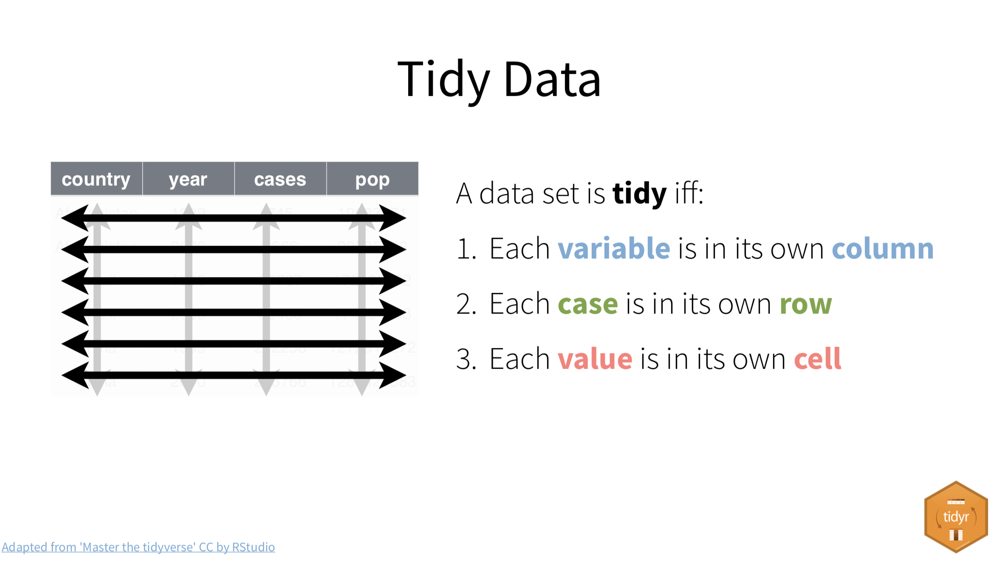
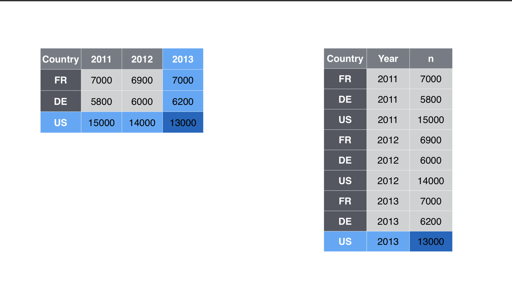
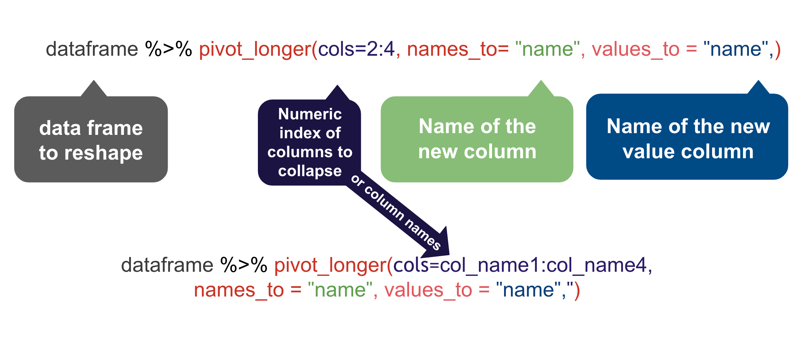

# Tidy data {#tidy-data}

Data "shape" can be important when you are trying to work with and visualize data. In this chapter we'll discuss "tidy data" and how it helps us with both ggplot and other charting tools like [Datawrapper](https://www.datawrapper.de/).

This chapter was written by Prof. McDonald, who uses a Mac.

## Goals for this section

- Explore what it means to have "tidy" data.
- Learn about and use `pivot_longer()`, `pivot_wider()` to shape our data for different purposes.
- Use candy data to practice shaping data.

## The questions we'll answer

- Are candy colors evenly distributed within a standard package of M&M's? (We'll get the mean of candies by color over a collection of packages.)
    - We'll plot the result as a column chart to show the average number of colored candies. We'll do it first in ggplot, then Datawrapper.
- Bonus 1: Who got the most candies in their bag?
- Bonus 2: What is the average number of candy in a bag?

## What is tidy data

"Tidy" data is well formatted so each variable is in a column, each observation is in a row and each value is a cell. Our first step in working with any data is to make sure we are "tidy".



It's easiest to see the difference through examples. The data frame below is of tuberculosis reports from the World Health Organization.

- Each row is a set of observations (or case) from a single country for a single year.
- Each column describes a unique variable. The year, the number of cases and the population of the country at that time.


Table2 below isn't tidy. The **count** column contains two different type of values.


When our data is tidy, it is easy to manipulate. We can use functions like `mutate()` to calculate new values for each case.


When our data is tidy, we can use the [tidyr](https://tidyr.tidyverse.org/) package to reshape the layout of our data to suit our needs. It gets loaded with `library(tidyverse)` so we won't need to load it separately.

### Wide vs long data

In the figure below, the table on the left is "wide". There are are multiple year columns describing the same variable. It might be useful if we want to calculate the difference of the values for two different years. It's less useful if we want plot on a graphic because we don't have a single "year" column to map as an x or y axes.

The table on the right is "long", in that each column describes a single variable. It is this shape we need when we want to plot values on a chart in ggplot. We can then set our "Year" column as an x-axis, our "n" column on our y-axis, and group by the "Country". 



**Neither shape is wrong**, they are just useful for different purposes. In fact, you'll find yourself pivoting the same data in different ways depending on your needs.

### Why we might want different shaped data

There are a myriad of reasons why you might need to reshape your data. Performing calculations on row-level data might be easier if it is wide. Grouping and summarizing calculations might be easier when it is long. ggplot graphics like long data, while Datawrapper sometimes wants wide data to make the same chart.

I find myself shaping data back and forth depending on my needs.

## Prepare our candy project

We will use candy count data we've been collected in Reporting wth Data classes to explore this subject.

Start a new project.

1. Create a new project and call it: `yourname-candy`
1. No need to create data folders as we'll just load data directly into the notebook.
1. Start a new R Notebook and edit the headline. Name it **01-candy**.
1. Create your setup block and load the libraries below.

```{r setup, echo=T, message=F, warning=F}
library(tidyverse)
library(janitor)
```

```{r test-data, include=FALSE}
# Using random test data until we get some from class
# This is hidden from printing (or should be)
test_data <- "https://docs.google.com/spreadsheets/d/e/2PACX-1vTlrXKADzSsFeARpgcmtIu_5ngT5iiylqrgqua9CelFgzL8XMLXViSaqb8mTInc5K2JyIKF6oGOAAQ2/pub?gid=0&single=true&output=csv"
```

### Get the data

We'll just load this data directly from Google Sheets into this notebook. We're doing something a little different here in we save the URL to our data into an object, then use that object in our `read_csv()` function. This is just a convenience for me, really, so I can swap that url out as needed.

1. Add a Markdown section noting that you are importing data.
1. Add this import chunk and run it.

```{r load-data, echo=T, message=F, warning=F}
# save the url
class_data <- "https://docs.google.com/spreadsheets/d/e/2PACX-1vRCGayKLOy-52gKmEoPOj3ZKnOQVtCiooSloiCr-i_ci27e4n1CMPL0Z9s6MeFX9oQuN9E-HCFJnWjD/pub?gid=1456715839&single=true&output=csv"

# read the data, clean names and save into the object "raw_data"
raw_data <- read_csv(test_data) %>% clean_names()

# peek at the data
raw_data
```

This data comes from a Google Sheets document fed by a form that students have filled out, counting the colors of candies in a standard size bag of plain M&Ms.

### Drop unneeded columns

For this exercise we don't need the `timestamp` and `candy_type` columns. We'll drop them so we can keep things simple.

1. Create a Markdown section noting you'll drop unneeded columns.
1. Create an R chunk and use `select()` to remove the columns noted above and save the result into a new data frame called `candy`.

You've done this in the past, so you should be able to do it on your own.

<details>
  <summary>You got this! (But, just in case ...)</summary>
```{r drop-cols}
candy <- raw_data %>% 
  select(
    -timestamp,
    -candy_type
  )
```
</details>

### Peek at the wide table

Let's look closer at this data:

```{r peek}
candy %>% head()
```

This is pretty well-formed data. This format would be useful to create a "total" column for each bag, but there are better ways to do this with **long** data. Same with getting our averages for each color.

### Where are we going with this data

We have two goals here:

- Find the average distribution of candy by color, i.e., the average of each color column.
- We want to chart the results as a bar chart simliar to the one below (which uses Skittles data).


To plot a chart like that in Datawrapper or ggplot, the data needs to be the same shape, like this:

| Color  | Average |
|:-------|--------:|
| Green  |    10.9 |
| Orange |    12.0 |
| Purple |    12.4 |
| Red    |    11.4 |
| Yellow |      12 |

It will be easier to accomplish both of these tasks if our data were in the **long** format.

So, instead of this:

| first_name | last_name | red | green | orange | yellow | blue | brown |
|:-----------|:----------|----:|------:|-------:|-------:|-----:|------:|
| Christian  | McDonald  |   2 |    17 |     11 |      4 |   16 |     4 |

We want this:

| first_name | last_name | color  | candies |
|:-----------|:----------|:-------|--------:|
| Christian  | McDonald  | red    |       2 |
| Christian  | McDonald  | green  |      17 |
| Christian  | McDonald  | orange |      11 |
| Christian  | McDonald  | yellow |       4 |
| Christian  | McDonald  | blue   |      16 |
| Christian  | McDonald  | brown  |       4 |

## The tidyr verbs

The two functions we'll use to reshape are data are:

- [pivot_longer()](https://tidyr.tidyverse.org/reference/pivot_longer.html) which "lengthens" data, increasing the number of rows and decreasing the number of columns.
- [pivot_wider()](https://tidyr.tidyverse.org/reference/pivot_wider.html) which "widens" data, increasing the number of columns and decreasing the number of rows.

Again, the best way to learn this is to present a problem and then solve it with explanation.


## Pivot longer

This visualization gives you an idea how `pivot_longer()` works.


Each column of data chosen (the colored ones) is turned into it's own row of data. Supporting data (the grey columns) are duplicated.

The `pivot_longer()` function needs several arguments: **cols=**, **names_to=** and **values_to**. Below are two examples to pivot the example data shown above.



- **`cols=`** is where you define a range of columns you want to pivot. _For our candy data we want the range `red:brown`_.
- **`names_to=`** allows you to name the new column filled by the column names. _For our candy data we want to name this "color" since that's what those columns described._
- **`values_to=** allows you to name the new column filled with the cell data. _For us we want to call this "candies" since these are the number of candies in each bag._

There are a number of ways we can describe the `cols=` argument ... anything in [tidy-select](https://tidyr.tidyverse.org/reference/tidyr_tidy_select.html) works. You can see a bunch of [examples here](https://tidyr.tidyverse.org/reference/pivot_longer.html#ref-examples).

### Pivot our candy data longer

What we want here is six rows for each person's entry, with a column for "color" and a column for "candies".

We are using a range, naming the first "red" and the last column "brown" with `:` in between. This only works because those columns are all together. We could also use `cols = !c(first_name, last_name)` to say everything but those two columns.

1. Add a note that you are pivoting the data
1. Add the chunk below and run it

```{r candy-pivot-long}
candy_long <- candy %>% 
  pivot_longer(
    cols = red:brown, # sets which columns to pivot based on their names
    names_to = "color", # sets column name for color
    values_to = "candies" # sets column name for candies
  )

candy_long %>% head()
```

### Get average candies per color

To get the average number of candies per each color, we can use our `candy_long` data and `group_by` color (which will consider all the **red** rows together, etc.) and use `summarize()` to get the mean.

This is something you should be able to do on your own, as it is very similar to the `sum()`s we did with military surplus, but you use `mean()` instead.

Save the resulting summary table into a new tibble called `candy_avg`.

<details>
  <summary>Try it on your own</summary>
```{r avg-bag}
candy_avg <- candy_long %>% 
  group_by(color) %>% 
  summarize(avg_candies = mean(candies))

candy_avg
```
</details>

### Round the averages

Let's **modify this summary** to round the averages to tenths so they will plot nicely on our chart.'

The `round()` function needs the column to change, and then the number of digits past the decimal to include.

1. Edit your summary to include the mutate below.

```{r summary-mutate}
candy_avg <- candy_long %>% 
  group_by(color) %>% 
  summarize(avg_candies = mean(candies)) %>% 
  mutate(
    avg_candies = round(avg_candies, 1)
  )

candy_avg
```

BONUS POINT OPPORTUNITY: Using a similar method to rounding above, you can also capitalize the names of the colors. You don't _have_ to do this, but I'll give you bonus points if you do:

- In your mutate, add a rule that updates `color` column using `str_to_title(color)`.

You can read more about [converting the case of a string here](https://stringr.tidyverse.org/reference/case.html). It's part of the [stringr](https://stringr.tidyverse.org/index.html) package, which is loaded with tidyverse.

### On your own: Plot the averages

Now I want you to use ggplot to create a bar chart that shows the average number of candies in a bag. This is very similar to the [Disney Princesses bar chart in Chapter 7](https://utdata.github.io/rwdir/ggplot-intro.html#lets-build-a-bar-chart).

1. Build a bar chart of average color using ggplot.

Some things to consider:

- I want the bars to be ordered by the highest average on top.
- I want you to have a good title, subtitle and byline, along with good axes names. Make sure a reader has all the information they need to understand what you are communicating with the chart.
- Include the values on the bars
- Change the theme to something other than the default

Here is what it should more or less look like, but with good text, etc: 

```{r avg-plot, echo=F, message=FALSE, warning=FALSE}
candy_avg <- candy_avg %>% mutate(color = str_to_title(color))
ggplot(candy_avg, aes(x = reorder(color, avg_candies), y = avg_candies)) +
  geom_col() +
  coord_flip() +
  geom_text(aes(label = avg_candies), hjust = 1.5, color = "white") + # plots votes text values on chart
  labs(
    title = "Give it a good title",
    subtitle = str_wrap("Explain where the data came in your subtitle. You can wrap the text in an str_wrap() function so that the text will wrap into a new line like this one does instead off going off the chart."),
    caption = "By Your Name",
    x = "Do you even need an axis name here?",
    y = "Provide a good axis name here",
  )
```

**The numbers in the example above may not be up to date**, so don't let that throw you.

## Introducing Datawrapper

There are some other great charting tools that journalists use. My favorite is [Datawrapper](https://www.datawrapper.de/) and is free for the level you need it.

Datawrapper is so easy I don't even have to teach you how to use it. They have [excellent tutorials](https://academy.datawrapper.de/).

What you do need is the data to plot, but you've already "shaped" it the way you need it. Your `candy_avg` tibble is what you need.

Here are the steps I want you to follow:

### Review how to make a bar chart

1. In a web browser, go to the [Datawrapper Academy](https://academy.datawrapper.de/)
1. Click on **Bar charts**
1. Choose **[How to create a bar chart](https://academy.datawrapper.de/article/7-bar-chart)**

The first thing to note there is they show you what they expect the data to look like. Your `candy_avg` tibble is just like this, but with Color and Candies.

You'll use these directions to create your charts so you might keep this open in its own tab.

### Start a chart

1. In a new browser tab, go to [datawrapper.de](https://www.datawrapper.de/) and click the big **Start creating** button.
2. Use the **Login/Sign Up** button along the top to create an account or log in if you have one.
1. The first screen you have is where you can **Upload data** or paste it into the window. We are going to paste the data, but we have to do some stuff in R to get it.

### Get your candies data

We need to install a package called clipr.

1. In your R project **in the R Console** install the package clipr: `install.packages("clipr")`.
1. Start a section that says you are going to get data for Datawrapper.
3. Create a chunk with the following and run it.

```{r get-clip, warning=F, message=F}
library(clipr)

candy_avg %>% write_clip(allow_non_interactive = TRUE)
```

You won't see anything happen, but all the data in `candy_avg` has been added to your clipboard as if you highlighted it and did **Copy**. You must have the `allow_non_interactive = TRUE` argument to allow your RMarkdown document to knit.

### Build the datawrapper graphic

1. Return to your browser where you are making the chart, put your cursor into the "Paste your copied data here ..." window and paste. (Like *Cmd-V* or use the menu Edit > Paste.)
1. Click **Proceed**.

You can now follow the Datawrapper Academy directions to finish your chart.

When you get to the Publish & Embed window, I want you to click the **Publish Now** button and then add the resulting *Link to your visualization:* URL to your R Notebook so I can find it for grading.

## Pivot wider

In this case we don't have a real need to pivot our data wider, but I'd like to show you how it is done.

As you can imagine, `pivot_wider()` does the opposite of `pivot_longer()`. When we pivot wider we move our data from a "long" format to a "wide" format. We create a new column based categories and values in the data.


We'll practice this by taking our long candy data and pivot it so there is a column for each person in the data.

`pivot_wider()` needs two arguments:

- `names_from =` lets us define from which column (or columns) we are pulling values from to create the new column names. _In our case, we need two columns to combine the first and last names. We can do that with `c(first_name, last_name)`_.
- `values_from =` lets us say which column will be the values in the new arrangement. _In our case, we want the `candies` column_.

```{r pivot-wider}
candy_long %>% 
  pivot_wider(names_from = c(first_name, last_name), values_from = candies)
```

### Pivot wider on your own

Now I want you do apply the same `pivot_wider()` function to that same `candy_long` data, but to have the rows be people and the column be each color, basically like how our data started. (But, of course, I want to acdtually use `pivot_wider()` to do it!)

1. Start a new section and note this is pivot_wider on your own.
1. Start with the `candy_long` data, and then ...
1. Use `pivot_wider()` to make the data shaped like this

```{r message=TRUE, warning=TRUE, include=FALSE}
candy_long %>% 
  pivot_wider(names_from = color, values_from = candies) %>% 
  head()
```

| first_name | last_name | red | green | orange | yellow | blue | brown |
|:-----------|:----------|----:|------:|-------:|-------:|-----:|------:|
| Christian  | McDonald  |   2 |    17 |     11 |      4 |   16 |     4 |


## Bonus questions

More opportunities for bonus points on this assignment. These aren't plots, just data wrangling to find answers.

### Most/least candies 

Answer me this: Who got the most candies in their bag? Who got the least?

I want a well-structured section (headline, text) with two chunks, one for the most and one for the least.

### Average total candies in a bag

Answer me this: What is the average number of candy in a bag?

Again, well-structured section and include the code.

Hint: You need a total number of candies per person before you can get an average.

## Turn in your work

1. Make sure your notebook runs start-to-finish.
1. Knit the notebook
1. Stuff your project and turn it into the Candy assignment in Canvas.

## What we learned

- We learned what "tidy data" means and why it is important. It is the best shape for data wrangling and plotting.
- We learned about [`pivot_longer()`](https://tidyr.tidyverse.org/reference/pivot_longer.html) and [`pivot_wider()`](https://tidyr.tidyverse.org/reference/pivot_wider.html) and we used `pivot_longer()` on our candy data.
- We also used [`round()`]((http://www.cookbook-r.com/Numbers/Rounding_numbers/)) to round off some numbers, and you might have used `str_to_title()` to change the case of the color values.


