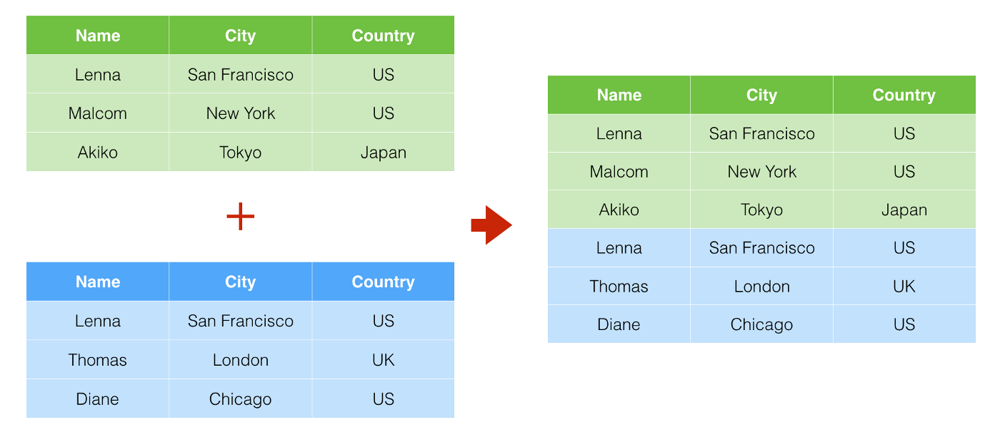

# Bind and join {#bind-join}

So far all of our lessons have come from a single data source, but that's not always the case in the real world. With this lesson we'll learn how to "bind" and "join" data, which are different ways to bring multiple data frames together into a single object. 

This is the first of a two-chapter project. It is by Prof. McDonald, using a Mac.

## Goals of the chapter

- Merge multiple data files with `bind_rows()`
- Join data frames with `inner_join()`
- Use `str_remove()` to clean data
- Introduce `if_else()` for categorization

## The story: An update to Denied

In 2016, the Houston Chronicle published a multi-part series called [Denied](https://www.houstonchronicle.com/denied/1/) that outlined how a Texas Education Agency policy started in 2004 could force an audit of schools that have more than 8.5% of their students in special education programs. The story was a Pulitzer Prize finalist. Here's an excerpt:

> Over a decade ago, the officials arbitrarily decided what percentage of students should get special education services — 8.5% — and since then they have forced school districts to comply by strictly auditing those serving too many kids.

> Their efforts, which started in 2004 but have never been publicly announced or explained, have saved the Texas Education Agency billions of dollars but denied vital supports to children with autism, attention deficit hyperactivity disorder, dyslexia, epilepsy, mental illnesses, speech impediments, traumatic brain injuries, even blindness and deafness, a Houston Chronicle investigation has found.

> More than a dozen teachers and administrators from across the state told the Chronicle they have delayed or denied special education to disabled students in order to stay below the 8.5 percent benchmark. They revealed a variety of methods, from putting kids into a cheaper alternative program known as "Section 504" to persuading parents to pull their children out of public school altogether.

Following the Chronicle's reporting (along with other news orgs), the Texas Legislature in 2017 [unanimously banned](https://www.chron.com/news/houston-texas/houston/article/Legislature-unanimously-approves-bill-designed-to-11134046.php) using a target or benchmark on how many students a district or charter school enrolls in special education.

**Has the percentage of special education students in each school district changed since the benchmarking policy was dropped? How many districts were above that arbitrary 8.5% benchmark before and after the changes? And lastly, how have local districts changed?**

To prepare for this:

1. Read [Part 1](https://www.houstonchronicle.com/denied/1/) of the original Denied series.
1. Read [About this series](https://www.houstonchronicle.com/denied/about/)

## About the data

Each year, the Texas Education Agency publishes the percentage of students in special education as part of their [Texas Academic Performance Reports](https://tea.texas.gov/texas-schools/accountability/academic-accountability/performance-reporting/texas-academic-performance-reports). We can download a file that has the percentages for each district in the state.

There are some challenges, though:

- We have to download each year individually. There is nine years of data.
- The are no district names in the files, only a district ID. We can get a reference file, though.
- There are some differences is formatting for some files.

I will save you the hassle of going through the TAPR database to find and download the individual files, and I will also supply code to clean the files to make them consistent. I'll try not to get lost in the weeds along the way.

### Set up your project

1. Go to [this page](https://github.com/utdata/rwdir/blob/chap10/resources/rwdir-sped-template.zip).
1. Look for the **Download** button and download the zip file.
1. Find that on your computer and uncompress it.
1. Rename the folder to `yourname-sped` **but use your name**.
1. Move the folder to your `rwd` folder or wherever you've been saving your class projects.
1. In RStudio, choose File > New Project. **Choose Next Directory** at the next step and then find the folder you just moved. Use that to create your project.

You should now have your own project that already has a head start on this project. It has the data in a `data-raw` folder, and your first notebook `01-import` that already has some code in it.

```{r include=FALSE}

library(tidyverse)
library(janitor)

# district reference table
dref <- read_csv("data-raw/DREF_21.csv") %>% clean_names() %>% 
  mutate(
    district = str_remove(district, "'")
  ) %>% 
  select(district, distname, cntyname, dflalted, dflchart)

# 2021 student data is formatted differently that rest
dstud21 <- read_csv("data-raw/DSTUD_21.csv") %>% clean_names() %>%
  mutate(
    year = "2021",
    district = str_remove(district, "'")
    ) %>% 
  select(district, year, dpetallc, dpetspec, dpetspep)

# 2013-2020 data is formatted the same, so these just repeat with changing years
dstud13 <- read_csv("data-raw/DSTUD_13.csv") %>% clean_names() %>%
  mutate(year = "2013") %>% 
  select(district, year, dpetallc, dpetspec, dpetspep)

dstud14 <- read_csv("data-raw/DSTUD_14.csv") %>% clean_names() %>%
  mutate(year = "2014") %>% 
  select(district, year, dpetallc, dpetspec, dpetspep)

dstud15 <- read_csv("data-raw/DSTUD_15.csv") %>% clean_names() %>%
  mutate(year = "2015") %>% 
  select(district, year, dpetallc, dpetspec, dpetspep)

dstud16 <- read_csv("data-raw/DSTUD_16.csv") %>% clean_names() %>%
  mutate(year = "2016") %>% 
  select(district, year, dpetallc, dpetspec, dpetspep)

dstud17 <- read_csv("data-raw/DSTUD_17.csv") %>% clean_names() %>%
  mutate(year = "2017") %>% 
  select(district, year, dpetallc, dpetspec, dpetspep)

dstud18 <- read_csv("data-raw/DSTUD_18.csv") %>% clean_names() %>%
  mutate(year = "2018") %>% 
  select(district, year, dpetallc, dpetspec, dpetspep)

dstud19 <- read_csv("data-raw/DSTUD_19.csv") %>% clean_names() %>%
  mutate(year = "2019") %>% 
  select(district, year, dpetallc, dpetspec, dpetspep)

dstud20 <- read_csv("data-raw/DSTUD_20.csv") %>% clean_names() %>%
  mutate(year = "2020") %>% 
  select(district, year, dpetallc, dpetspec, dpetspep)

```


### Open, read and run

Once you have your project set up ...

1. Open up the `01-import` notebook.
2. Read every line
3. Run each chunk as you do.

Go ahead. I'll wait.

<div style="width:100%;height:0;padding-bottom:56%;position:relative;"><iframe src="https://giphy.com/embed/ExSXXwQmCSMWKor0qb" width="100%" height="100%" style="position:absolute" frameBorder="0" class="giphy-embed" allowFullScreen></iframe></div><p><a href="https://giphy.com/gifs/snl-saturday-night-live-season-47-ExSXXwQmCSMWKor0qb">via GIPHY</a></p>

There is a lot there to take in there about where the data came from and how we dealth with it. Here is where you end up:

- **You have nine data files for each year and one reference file imported.**

## Merging data together

OK, so we have nine different yearly files. Wouldn't it be a lot easier if these were ONE thing? Indeed, we can **merge** these files together by stacking them on top of each other. Let's review the concept using Starburst data:

<iframe width="560" height="315" src="https://www.youtube.com/embed/9WA8YxMjpnI" title="YouTube video player" frameborder="0" allow="accelerometer; autoplay; clipboard-write; encrypted-media; gyroscope; picture-in-picture" allowfullscreen></iframe>

Here's an image representation of the concept. You have two data sets and you stack them on top of each other where the column names match. (Note here that identical rows in both data sets remain).



Since all nine of our data files have the same column names, we can easily merge them with function **`bind_rows()`**.

Let's demonstrate through building it.

1. Start a new section on your R Markdown document and note you are merging data
1. Add a chunk with just the `dstud13` data and run it.

```{r merge_start}
dstud13
```

The result shows there are **1,228** rows and **5** variables in the data, which should match what shows for `dstud13` in your Environment tab.

1. Now **edit** that chunk to use `bind_rows()` with `dstud14`.

```{r merge_first}
dstud13 %>% 
  bind_rows(dstud14)
```

This shows we now have **2,455** rows and **5** variables. This is good ... we've addded the rows of `dstud14` but we don't have any new columns because the column names were identical.

Now **edit the chunk** to save the result and do all these things:

1. Save the result of the merge into a new data frame called `sped_merged`.
1. Tack on another `bind_rows()` for the `dstud15` data so you can see you are adding more on.
1. At the bottom of the chunk print out the `sped_merged` datafram and pipe it into `count(year)` so you can make sure you continue to add rows correctly.

It should look like this:

```{r merge_count}
sped_merged <- dstud13 %>% 
  bind_rows(dstud14) %>% 
  bind_rows(dstud15)

# we use this to ensure we bind correctly when we add new years
sped_merged %>% count(year)
```

Now that we know this is working, you'll finish this out on your own.

1. **Edit your chunk** to add `bind_rows()` for the rest of the files `dstud16` through `dstud21`. You just keep tacking them on like we did with `dstud15`.
2. After you are done, make sure you look at the `sped_merged` listing in your environment to make sure you end up with **10,891** rows of data and **5** variables.

```{r merged, include=FALSE}
sped_merged <- dstud13 %>% 
  bind_rows(dstud14) %>% 
  bind_rows(dstud15) %>% 
  bind_rows(dstud16) %>% 
  bind_rows(dstud17) %>% 
  bind_rows(dstud18) %>% 
  bind_rows(dstud19) %>% 
  bind_rows(dstud20) %>% 
  bind_rows(dstud21)

# we use this to ensure we bind correctly
sped_merged %>% count(year)
```

OK, we have all our data in one file, but we still don't know the district names. It's time to **Join** our data with our reference file.

## About joins

OK, before we go further we need to talk about joining data. It's one of those [Basic Data Journalism Functions](https://vimeo.com/showcase/7320305) ...

<iframe width="560" height="315" src="https://www.youtube.com/embed/T6PPd-ukFyk" title="YouTube video player" frameborder="0" allow="accelerometer; autoplay; clipboard-write; encrypted-media; gyroscope; picture-in-picture" allowfullscreen></iframe>

What joins do is match rows from two data sets that have a column of common values, like an ID or county name. (The `district` ID column in our case). Columns from the second data set will be added based on where the ID's match.

There are several types of [joins](https://dplyr.tidyverse.org/reference/mutate-joins.html). We describe these as left vs right based on which table we reference first (which is the left one). How much data you end up with depends on the "direction" of the join.

- An **inner_join** puts together columns fron both tables where there are matching rows. If there are records in either table where the IDs don't match, they are dropped.
- A **left_join** will keep ALL the rows of your first table, then bring over columns from the second table where the IDs match. If there isn't a match in the second table, then new values will be blank in the new columns.
- A **right_join** is the opposite of that: You keep ALL the rows of the second table, but bring over only matching rows from the first.
- A **full_join** keeps all rows and columns from both tables, joining rows when they match.

Here's two common ways to think of this visually.

In the image below, The orange represents data that remains after the join.


This image below shows this as tables where only two rows "match" so you can see that non-matches are blank. The functions listed there are the tidyverse versions of each join type.


### Joining our reference table

In our case we are going to start with our `dref` data and then use an **inner_join** to add all the yearly data values. We're doing it in this order so the `dref` values are listed first in our resulting table.

1. Start a new Markdown section an note we are joining the reference data
2. Add the chunk below and run it

```{r join}
sped_joined <- dref %>% 
  inner_join(sped_merged, by = "district")

# sped_joined %>% head()
sped_joined %>% glimpse()
```

I'm show both a `head()` and `glimpse()` here so you can see all the columns have been added.

Let's explain what is going on here:

- We are creating a new bucket `sped_joined` to save our data.
- We start with `dref` so those fields will be listed first in our result.
- We then pipe into `inner_join()` to `sped_merged`, which will attach our `dref` data to our merged data when the ID matches in the `district` variable.
- The `by = "district"` argument ensures that we are matching based on the `district` column in both data sets.

We could've left out the `by =` argument and R would match columns of the same name, but it is best practice to specify how you joining so it is clear what is happening. You wouldn't want to be surprised by other columns of the same name that you didn't want to join on. If you wanted to specify join columns of different names it would look like this: `df1 %>% inner_join(df2, by = c("df1_id" = "df2_id))`

There are now **10,684** rows in our joined data, fewer than what was in the original merged file because some districts (mostly charters) have closed and we don't want to include those. We are comparing only districts that have been open during this time period. For that matter, we don't want charter or alternative education districts at all, so we'll drop those next.

## Some cleanup: filter and select

Filtering and selecting data is something we've done time and again, so you should be able to do this on your own.

You are going remove charter and alternative education schools. This is a judgement call on our part to focus on just traditional public schools. We can always come back later and change if needed.

You'll also remove and rename columns to make the more descriptive.

1. Start a new markdown section and note you are cleaning up your data.
1. Create an R chunk and start with the `sped_joined` and then do all these things ...
1. Use `filter()` to keep rows where:
    - the `dflalted` field is "N"
    - AND the `dflchart` field is "N"
1. Use `select()` to:
    - remove (or not include) the `dflalted` and `dflchart` columns. (You can only do this AFTER you filter with them!)
1. Use `select()` or `rename()` to rename the following columns:
    - change `dpetallc` to `all_count`
    - change `dpetspec` to `sped_count`
    - change `dpetspep` to `sped_percent`
1. Make sure all your changes are saved into a new data frame called `sped_cleaned`.

I really, really suggest you don't try to write that all at once. Build it one line at a time so you can see the result as you build your code.

```{r include=FALSE}
sped_cleaned <- sped_joined %>% 
  filter(dflalted == "N" & dflchart == "N") %>% 
  select(
    district,
    distname,
    cntyname,
    year,
    all_count = dpetallc,
    sped_count = dpetspec,
    sped_percent = dpetspep
  )
```

You should end up with **9,182** rows and **7** variables.

## Create a threshold columns

Part of this story is to note when a district is above the "8.5%" benchmark that the TEA was using for their audit calculations. It would be useful to have a column that noted if a district was above or below that threshold so we could plot districts based on that flag. We'll create this new column and introduce the logic of [`if_else()`](https://dplyr.tidyverse.org/reference/if_else.html).

OK, our data looks like this:

```{r}
sped_cleaned %>% head()
```


We want to add a column called `audit_flag` that says **ABOVE** if the `sped_percent` is above "8.5", and says **BELOW** if it isn't. This is a simple true/false condition that is perfect for the `if_else()` function.

1. Add a new Markdown section and add you are adding an audit flag column
2. Create an r chunk that and run it and I'll explain after.

```{r}
sped_flag <- sped_cleaned %>% 
  mutate(audit_flag = if_else(sped_percent > 8.5, "ABOVE", "BELOW"))

# this pulls 30 random rows so I can check results
sped_flag %>% sample_n(10)
```

Let's walk through the code above:

- We're making a new data frame called `sped_flag` and then starting with `sped_cleaned`.
- We use `mutate()` to create a new column and we name it `audit_flag`.
- We set the value of `audit_flag` to be the result of this `if_else()` function. That function takes three arguments: A condition test (`sped_percent > 8.5` in our case), what is the result if the condition is true ("ABOVE" in our case), and what is the result if the condition is NOT true ("BELOW") in our case.
- Lastly we print out the new data `sped_cleaned` and pipe it into `sample_n()` which gives us a number of random rows from the data. I do this because the top of the data was all TRUE so I couldn't see if the mutate worked properly or not. (Always check your calculations!!)


## Export the data

This is something you've done a number of times as well, so I leave you to you:

1. Make a new section and note you are exporting the data
2. Export your `sped_flag` data using `write_rds()` and save it in your `data-processed` folder.

In the next chapter we'll build an analysis notebook to find our answers!

```{r export, include=FALSE}
sped_flag %>% write_rds("data-processed/01-sped-districts.rds")
```

