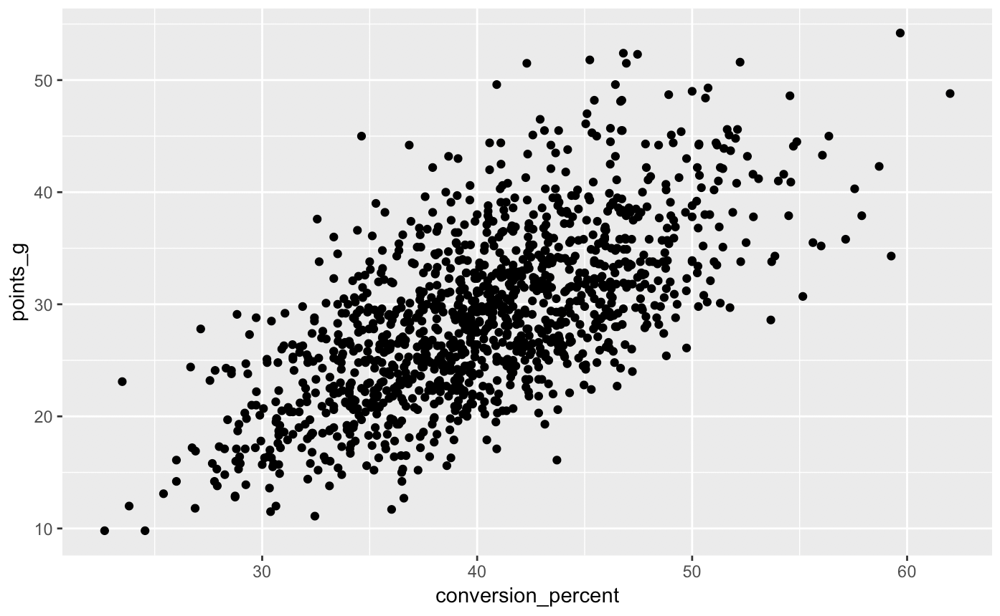
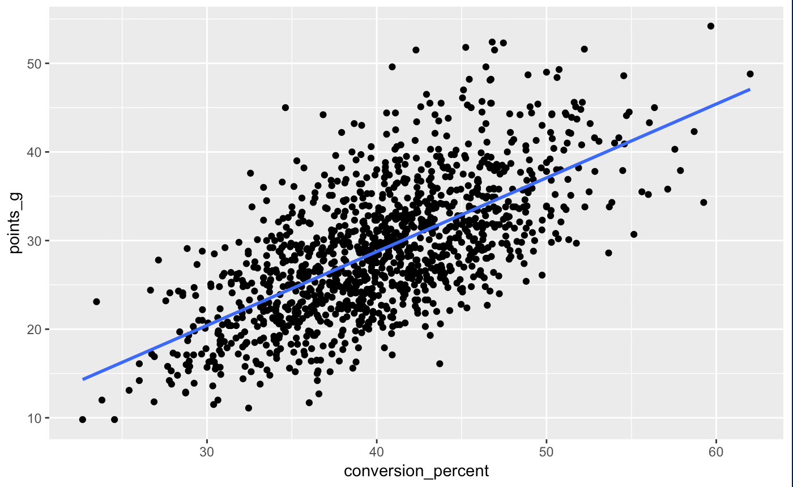
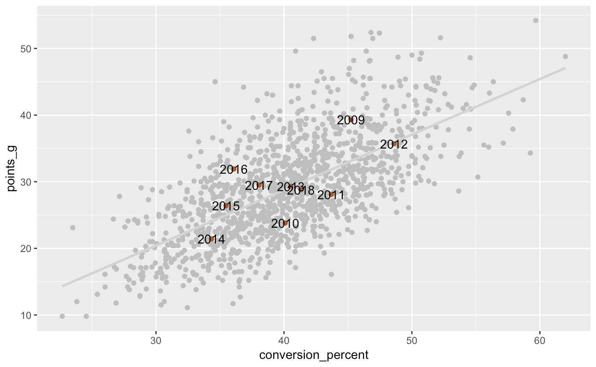
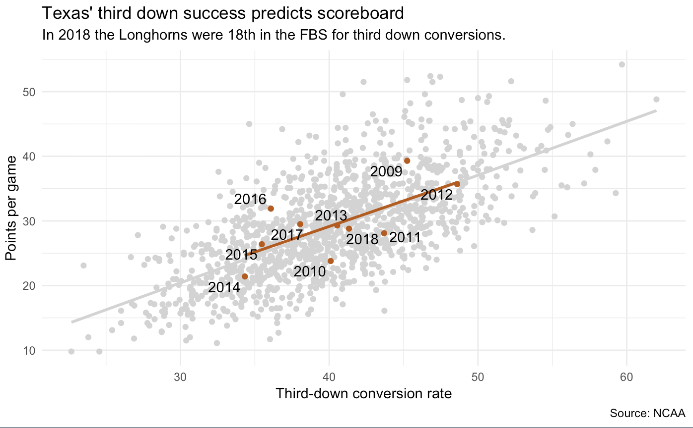

# Joins

## Goals for this section

- Learn how to join two files based on a common column
- Explore correlations between two numerical values
- Practice showing relationships with scatterplots
- Learn how to merge two files one top of each other

This lesson is _heavily_ cribbed from a lesson in Matt Waite's Sports Data Journalism course at the University of Nebraska.

## Project setup

- Create your project. Call it `yourname-football`.
- Create a `data-raw` folder so you have a place to download the files.
- Start a new notebook.

### Download the data

You can download the files we are using based on their URLs in a Github repository. Once you've run this block of code, comment out the three `download.file()` lines by putting a `#` at the beginning. You really only need to download the files once.

```r
# Downloads the files. Convert to comments once you've done this:
download.file("https://github.com/utdata/rwd-mastery-assignments/blob/master/football-compare/penalties.csv?raw=true", "data-raw/penalties.csv")
download.file("https://github.com/utdata/rwd-mastery-assignments/blob/master/football-compare/scoring_offense.csv?raw=true", "data-raw/scoring_offense.csv")
download.file("https://github.com/utdata/rwd-mastery-assignments/blob/master/football-compare/third_down_conversion.csv?raw=true", "data-raw/third_down_conversion.csv")
```

Import the three files:

```r
# import the files
scoring <- read_csv("data-raw/scoring_offense.csv") %>% clean_names()
thirddown <- read_csv("data-raw/third_down_conversion.csv") %>% clean_names()
```

## The story

The data we are using comes from [cfbstats](http://www.cfbstats.com/), a website for college football statistics. We will be comparing how [third-down conversions](http://www.cfbstats.com/2018/leader/national/team/offense/split01/category25/sort01.html) might correlate to a football team's [scoring offense](http://www.cfbstats.com/2018/leader/national/team/offense/split01/category09/sort01.html).

## Explore the data

We have two data sets here.

### Third-down conversions

- **year**: Year. Goes from 2009-2018
- **name**: Team name. There are 131 different teams.
- **g**: Number of games played
- **attempts**: Third-down attempts
- **conversions**: Third-down attempts that were successful
- **conversion_percent**: conversions/attempts * 100

### Scoring

- **year**: Year
- **name**: Team name
- **g**: Number of games played
- **td**: Touchdowns
- **fg**: Field goals
- **x1xp**: 1pt PAT made
- **x2xp**: 2pt PAT made
- **safety**: Safeties
- **points**: Total points scored
- **points_g**: Points per game

Now our goal here is to compare how the `conversion_percent` might relate to `points_g` for all teams, and how specific teams might buck the national trend.

## About joins

To make our plot, we need to join the two data sets on common fields. We want to start with the `scoring` data frame, and then add all the columns from the `thirddown` data frame. We want to do this based on the same year and team.

There are several types of [joins](https://dplyr.tidyverse.org/reference/join.html). We describe these as left vs right based on which table we reference first (which is the left one). In the figure below, we can see which matching records are retained based on the type of join we use.


In our case we only want records that match on both `year` and `name`, so we'll use an `inner_join()`.

The syntax works like this:

```r
new_dataframe <- *_join(first_df, second_df, by = field_name_to_join_on)
```

If you want to use more than one field in the *by* part like we do, then you define them in a concatenated list: `by = "field1", "field2")`.

If the fields you are joining on are not named the same, then you can define the relationships: `by = c("a" = "b")`.

For our project we want to use an `inner_join()`. Add the code below to your notebook along with notes describing that you are joining the two data sets:

```r
offense <- inner_join(scoring, thirddown, by=c("year", "name"))

# peak at the new data frame
offense %>% head()
```

So, to break this down:

- Our new combined dataframe will be called `offense`.
- We'll be doing an `inner_join()`, which is just keep matching records. (They all match, FWIW.)
- Our "left" table is `scoring` and our "right" table is `thirddown`.
- We are joining on both the `year` and `name` columns.

Anytime you do a join (or a bind as described below), check the resulting number of rows and columns to make sure they pass the logic test.

## Build our scatterplot

We're trying to show the relationship between `conversion_percent` and `points_g`, so we can use those as our x and y values in a `geom_point()` graphic.

```r
offense %>% 
  ggplot(aes(x = conversion_percent, y = points_g)) + 
  geom_point() 
```



### Add a fit line

We can see by the shape of the dots that indeed, as conversion percentage goes up, points go up. 

In statistics, there is something called a fit line -- the line that predicts what happens given the data. There's lot of fit lines we can use but the easiest to understand is a straight line. It's like linear algebra -- for each increase or decrease in x, we get an increase or decrease in x. To get the fit line, we add [`geom_smooth()`](https://ggplot2.tidyverse.org/reference/geom_smooth.html) with a method.

```r
offense %>% 
  ggplot(aes(x = conversion_percent, y = points_g)) +
  geom_point() + 
  geom_smooth(method=lm, se=FALSE) # adds fit line
```



The `lm` means linear method. The `se=FALSE` removes the confidence interval (based on the standard error) of the prediction. See the [`geom_smooth()`](https://ggplot2.tidyverse.org/reference/geom_smooth.html) for more information.

### Run a correlation test

So we can see how important third down conversions are to scoring. But still, how important? For this, we're going to dip our toes into statistics. We want to find out the correlation coefficient (specifically the [Pearson Correlation Coefficient](https://statistics.laerd.com/statistical-guides/pearson-correlation-coefficient-statistical-guide.php). That will tell us how related our two numbers are. We do that using `cor.test()`, which is part of R core.

```r
cor.test(offense$conversion_percent, offense$points_g)
```

The result is:

```
	Pearson's product-moment correlation

data:  offense$conversion_percent and offense$points_g
t = 30.82, df = 1251, p-value < 2.2e-16
alternative hypothesis: true correlation is not equal to 0
95 percent confidence interval:
 0.6242939 0.6873331
sample estimates:
      cor 
0.6569602 
```


That bottom number is the key. If we square it, we then know exactly how much of scoring can be predicted by third down conversions.

```r
(0.6569602 * 0.6569602) * 100
```

Which gets us 43.15967. 

So what that says is that 43 percent of a team's score is predicted by their third down percentage. That's nearly half. In social science, anything above 10 percent is shockingly predictive. So this is huge if this were human behavior research. In football, it's not that surprising, but we now know how much is predicted.

## How does Texas compare?

Let's compare how Texas does vs the field by plotting their results on top of the national stats. Create a data frame of the Texas data.

```r
tx <- offense %>%
  filter(name == "Texas")
```

And now we'll add some layers to our ggplot graphic. We're also editing our original `geom_point()` and `geom_smooth()` layers to make them light grey so that the Texas plots stand out more.

```r
offense %>% 
  ggplot(aes(x = conversion_percent, y = points_g)) +
  geom_point(color = "light grey") + # adds light grey color
  geom_smooth(method=lm, se=FALSE, color = "light grey") + # adds light grey color
  geom_point(data = tx, aes(x = conversion_percent, y = points_g), color = "#bf5700") + # adds Texas points colored burnt orange, of course
  geom_text(data = tx, aes(x = conversion_percent, y = points_g, label = year)) # adds year labels to see
```



This is good, but the labels for the year are sitting on top of the values. There is an R package called [ggrepel](https://cran.r-project.org/web/packages/ggrepel/vignettes/ggrepel.html) that will move those labels off the numbers, which we'll use with our next set of changes. You might have to run `install.packages('ggrepel')` to make this work.

For this update, we are doing a number of things, adding or modifying layers along the way:

- Add a `goem_smooth()` fit line specific to Texas, in burnt orange. We'll put it before the text so it shows underneath the labels.
- Modify the `geom_text` to `geom_text_repel` to move the labels off the points.
- Add `labs()` for a title and such to finish out our graphic.
- Add `theme_minimal()` just to improve the looks.

```r
  ggplot(aes(x = conversion_percent, y = points_g)) +
  geom_point(color = "light grey") + 
  geom_smooth(method=lm, se=FALSE, color = "light grey") +
  geom_point(data = tx, aes(x = conversion_percent, y = points_g), color = "#bf5700") +
  geom_smooth(data = tx, aes(x = conversion_percent, y = points_g), method=lm, se=F, color = "#bf5700") +
  geom_text_repel(data = tx, aes(x = conversion_percent, y = points_g, label = year)) +
  labs(x="Third-down conversion rate",
       y="Points per game",
       title="Texas' third down success predicts scoreboard",
       subtitle="In 2018 the Longhorns were 18th in the FBS for third down conversions.",
       caption="Source: NCAA") +
  theme_minimal()
```



## Correlaton test for Texas

It looks like Texas tracks pretty much along the national average.

Let's do the correlation test for Texas just to compare.

```r
cor.test(tx$conversion_percent, tx$points_g)
```

Which yields a correlation of 0.685967. Let's see how much third-down conversions predict Texas' scoring per game.

```r
(0.685967 * 0.685967) * 100
```

Which gets us 47.1%, not too far from the national average of 43.2%.

## Practice 1: Compare Penn State

Not every team tracks the national average like Texas. Tell me (and show me) how Penn State performs in this same third down conversion vs scoring metric by creating a similar graphic and correlation test from the Penn State data on top of the national data.

## Practice 2: Penalties vs scoring

How predictive are penalty yards per game on points per game? Do more disciplined teams score more points than undisciplined ones? How does Texas compare to the rest of the league?

Create a **new RNotebook** to answer these questions.

- You will need to join [penalty data](http://www.cfbstats.com/2018/leader/national/team/offense/split01/category14/sort01.html) (you've already downloaded the file `data-raw/penalties.csv` file) to the same points-per-games statistics from [scoring offense](http://www.cfbstats.com/2018/leader/national/team/offense/split01/category09/sort01.html).
- Make your own scatterplot with a fit line to show the relationships between penalty yards per game vs points per game.
- Run a correlation test for both the national average and for Texas.
- What does it say? Write a sentence that explains this to a reader.

## Using bind_rows() to merge data sets

We won't go through an example or do practice sessions, but you should be aware that you can also merge data sets on top of each other when your columns are the same.

Let's say you have a multiple data sets where each year is broken into a different file or data frame. You can "stack" data frames on top of each other with a tidyverse function called  [`bind_rows()`](https://dplyr.tidyverse.org/reference/bind.html). When row-binding, columns are matched by name, and any missing columns will be filled with NA.

An example might look like this ... 

- Let's say you have three years of data in three different data frames: fy2016, fy2017, fy2018.
- And all three data frames have the same column names: donor_type, date, amount. 
- And each data frame has 1000 rows of data.

If you want then all in the same file you would do this:

```r
combined <- bind_rows(fy2016, fy2017, fy2018)
```

The new data frame `combined` would have all the same columns, but would have 3000 rows of data.

### Combine data with a group

If you needed to know which data frame each row came from, you can name a "group" for each data frame, and then merge them. We will name our groups for each year they come from.

```r
combined <- bind_rows(
  "2016" = fy2016,
  "2017" = fy2017,
  "2018" = fy2018,
  .id = "year"
)
```

With this you would end up with a new data frame called `combined`, but it would have four columns: year, donor_type, date, amount. It would have all 3000 rows. All the rows that were pulled from `fy2016` would have a `year` of "2016", and so on.

It's a good way to note which file the data came from, and especially helpful if they are from different years, like the example.

It is admittedly weird that you name the groups before you specify the data frame the come from, but specify `.id` before the name of your new column. `¯\_(ツ)_/¯`
