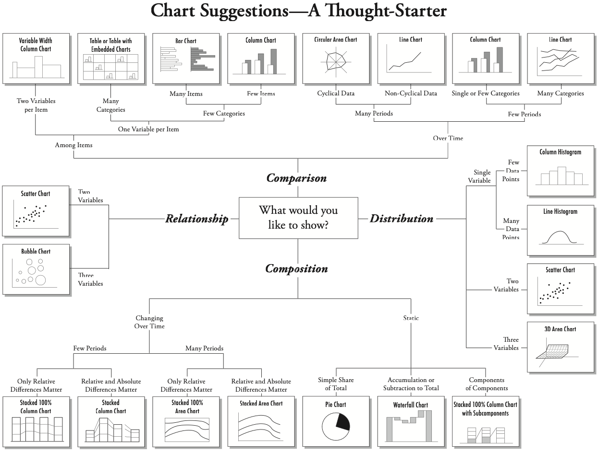
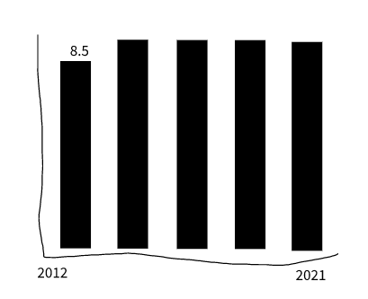

# Plotting for answers {#answers}

This is the second of of a two-chapter project. Now that we have assembled and cleaned our data, we need to answer this question in our followup to the [Denied](https://www.houstonchronicle.com/denied/) series:

- Has the percentage of special education students in Texas changed since the benchmarking policy was dropped??
- How many districts were above that arbitrary 8.5% benchmark before and after the changes?
- How have local districts changed?

The idea here is to answer those two questions through plotting. We'll use this chapter to walk through the process of using plots to explore and find answers in your data.

## Goals of this chapter

- Introduce `datatables()` from the [DT package](https://rstudio.github.io/DT/)
- Practice pivots to prepare data for plotting
- Practice plots to reveal insights in data
- There are wrap-up assignments that include writing, charts and this analysis

When a new concept is introduced, it shown and explained here. However, there are also **on your own** parts where you apply concepts you have learned in previous chapters or assignments.

## Project setup

1. Within the same project you've been working, create a new R Notebook. You might call it `02-analysis`.
1. We will be using a new package so you'll need to install it. **Use your Console** to run `install.packages("DT")`.
1. Include the libraries below and run them.

```{r setup, results='hide', message=F, warning=F}
library(tidyverse)
library(scales)
library(DT)
```

## Import cleaned data

1. Create a section for your import
2. Import your cleaned data and call it `sped` if you want to follow along here.

You should know how do do all that and I don't know what you called in export anyway.

```{r import, include=FALSE}
sped <- read_rds("data-processed/01-sped-districts.rds")

sped %>% head()
```

But to recap, it should look like this:

```{r sped-peek}
sped %>% head()
```

## Make a searchable table

Wouldn't it be nice to be able to see the percentage of special education students for each district for each year? The way our data is formatted now, that's pretty hard to see with our "long" data here.

We could use something more like this?  (But with all the years)

| distname      | cntyname | 2013 | 2014 | 2015 | etc |
|---------------|----------|-----:|-----:|-----:|-----|
| CAYUGA ISD    | ANDERSON | 12.3 | 13.7 | 13.2 | ... |
| ELKHART ISD   | ANDERSON |  9.1 |  8.9 | 10.4 | ... |
| FRANKSTON ISD | ANDERSON | 10.8 |  9.7 |  9.7 | ... |
| NECHES ISD    | ANDERSON | 11.1 |    9 | 11.1 | ... |
| PALESTINE ISD | ANDERSON |  7.7 |  7.8 |  8.7 | ... |
| WESTWOOD ISD  | ANDERSON |  9.3 |   10 |  9.3 | ... |

And what if you could make that table searchable to find a district by name or county? That would be magic, right?

We can do this by first reshaping our data using `pivot_wider()` and then applying a function called `datatable()`.

### Pivot wider

You used [`pivot_wider()`](https://tidyr.tidyverse.org/reference/pivot_wider.html) with the candy data [in Chapter 9](https://utdata.github.io/rwdir/tidy-data.html#pivot-wider), so you can look back at how that was done, but here are some hints:

1. Create a new section that notes you are creating a table of district percents.
1. First use `select()` to get just the columns you need: `distname`, `cntyname`, `year` and `sped_percent.`
1. Then use `pivot_wider()`to make a tibble like the one above. Remember that the `names_from =` argument wants to know which column you want to use to create the names of the new columns. The `values_from = ` argument wants to know which column to pull the cell values from.
1. Save the result into a new tibble and call it `district_percents_data`

<details>
  <summary>You won't need this code below because I believe in you</summary>
```{r select-pivot-wider}
district_percents_data <- sped %>% 
  select(distname, cntyname, year, sped_percent) %>% 
  pivot_wider(names_from = year, values_from = sped_percent)
```
<details>


### Make a datatable

Now comes the magic. 

1. In a new R chunk take your `district_percents_data` and then pipe it into a function called `datatable()`

```{r datatable}
district_percents_data %>% 
  datatable()
```

That's kinda brilliant, isn't it? You know can search by any value in the table.

Quick, tell me what was the percentage for Austin ISD in 2020?

That will be useful tool for you when you are writing about specific districts.

## Choosing a chart to display data

Our first question about this data was this: **Has the percentage of special education students in Texas changed since the benchmarking policy was dropped?**

Given the data we have, can we answer this?

Let's think about the charts that might be able to show two related variables like that. Choosing the chart type to display that takes experimentation and exploration.  Chapter 4 of Nathan Yau's _Data Points_ book is an excellent look at which chart types help show different data.

This decision tree option might also help you think through it.



Lastly, another resource to consider this is the [ggplot cheatsheet](https://github.com/rstudio/cheatsheets/blob/main/data-visualization-2.1.pdf), where it includes possible chart types based on the type of data we are comparing.

## Plot yearly student percentage

I'll often do a hand drawing of a chart that might help me understand or communicate data. This helps me think about how to summarize and shape my data to get to that point.

For this question **Has the percentage of special education students in Texas changed since the benchmarking policy was dropped?**, we could show the percentage of special education students for each year. If we are to chart this, the x axis would be the year and the y axis would be the percentage for that year. Perhaps like this:



We have the percent of students in special education for each district in each year. We _could_ get an average of those percentages for each year, but that won't take into account the size of each district. Some districts have a single-digit number of students while others have hundreds of thousands of students.

But we also have the number of all students in a district with `all_count` and the number of special education students `sped_count`. With these, we can build a more accurate percentage across _all_ the districts. This allows us to calculate our student groups by year.

### Build the statewide percentage by year data

So, let's summarize our data. This is a "simple" group_by and summarize to get yearly totals, then a mutate to build our percentage. I'll supply the logic so you can try writing it yourself.

1. Start a new notebook section and note you are getting yearly percentages
1. In an R chunk, start with your `sped` data.
1. Group by the `year` variable.
1. In summarize, create a `sum()` of the `all_count` variable. Call this `total_students`.
1. In the same summarize, create a sum() of the `sped_count` variable. You might call this `total_sped`.
1. Check your results at this point ... make sure it makes sense.
1. Next use `mutate()` to create a percentage called `sped_percent` from your `total_students` and `total_sped` summaries. The math for percentage is: (part / whole) * 100. You might want to round that resulting value to tenths as well.
1. I suggest you save all that into a new tibble called `yearly_percent` (because that's what I'm gonna do).

<details>
  <summary>My version</summary>
```{r yearly-percent-data}
yearly_percent <- sped %>% 
  group_by(year) %>% 
  summarise(
    total_students = sum(all_count),
    total_sped = sum(sped_count)
  ) %>% 
  mutate(sped_percent = ((total_sped / total_students) * 100) %>% round(1))

yearly_percent
```
</details>

### Build the statewide percentage chart

And with that table, you can plot your chart using the `year` and `sped_percent`.

```{r yearly-percent-plot}
yearly_percent %>% 
  ggplot(aes(x = year, y = sped_percent)) + 
  geom_col() +
  geom_text(aes(label = sped_percent, vjust = -.5))
```

This definitely shows us that the percentage of students in special education (in traditional public schools) has increased each year since 2017 when the benchmark was dropped and then outlawed by the legislature.

I would be careful about saying the increase is _because_ of the changes (though that is likely true), but you can certainly say with authority that it has gone up, and interview other people to pontificate on the reasons why.

BTW, if you wanted to make that chart in [datawrapper](https://academy.datawrapper.de/article/20-how-to-create-a-column-chart), you could use the same tibble, select just the `year` and `sped_percent` columns and then use the `clipr::write_clip()` function to copy your data.

## Districts by benchmark and year

Our second question is this: **How many districts were above that arbitrary 8.5% benchmark before and after the changes?**

It was in anticipation for this that we built the `audit_flag` field in our data. With that we can count how many rows have the "ABOVE" or "BELOW" value. (In reality, it's probably at this point we would discover it useful to create, instead of at the data cleaning phase, but I wanted to get that part out of the way to we can concentrate on the charts.)

To decide on which chart to build, we can go back to our chart decision workflow or consult the ggplot cheetsheet. Given we have the discrete values of `audit_flag` and `years`, and we want to plot how many districts are counted (which is a continuous value), we're looking at a stacked or grouped column/bar chart or a line chart.

### Build the audit flag data

Before we can build the chart, we need to summarize our data. The logic is this: We need to group our data by both the `year` and the `audit_flag`, and then count the number of rows for those values.

1. Start a new Markdown section and note you are counting districts by the audit flag.
1. Start with your original `sped` data.
1. Group your data by both `year` and `audit_flag`.
1. Summarize your data by counting `n()` the results. Name the variable `count_districts`.
1. Save the resulting data into a tibble called `flag_count_districts`. You might print that result out so you can refer to it.

<details>
  <summary>Use GSA or the `count()` shortcut</summary> 
```{r count-districts-code}
# I used the count() shortcut instead of GSA
flag_count_districts <- sped %>% 
  count(year, audit_flag, name = "count_districts")
```
</details>
<br>
The data should look like this:

```{r count-districts-show, echo=FALSE}
flag_count_districts
```


### Build the audit flag chart

Now that we have the data, we can build the ggplot column chart. The key new thing here is we are using a new aesthetic `fill` to apply colors based on the `audit_flag` column.

1. Add some notes you are buliding the first exploratory chart
1. Add an R chunk with the following:

```{r audit-col-stacked}
flag_count_districts %>% 
  ggplot(aes(x = year, y = count_districts, fill = audit_flag)) +
  geom_col()
```

This is actually not a bad look because it does clearly show the number of districts below the 8.5% audit benchmark is dropping year by year, and the number of districts above is growing.

Leave that chart there for reference, but let's build a new one that is almost the same, but we'll adjust it to be a grouped column chart instead of stacked. The key difference is we are adding `position = "dodge"` to the column geom.

1. Note in Markdown text you are building the grouped column version
1. Add a new chunk and start with exactly what you have above.
1. Update the column geom to this: `geom_col(position = "dodge")`

```{r audit-col-grouped}
flag_count_districts %>% 
  ggplot(aes(x = year, y = count_districts, fill = audit_flag)) +
  geom_col(position = "dodge")
```

That's not bad at all ... it might be the winner.

Lastly, let's chart this data as a line chart to see if that looks any better or is easier to comprehend.

1. Note you are visualizing as a line
1. Add the chunk below.

```{r audit-line}
flag_count_districts %>% 
  ggplot(aes(x = year, y = count_districts, group = audit_flag)) +
  geom_line(aes(color = audit_flag)) +
  ylim(0,1000)
```

The chart above has `ylim()` added because the default didn't start the y axis at zero. `ylim` is a shortcut for `scale_y_continuous(limits = c(0,1000))`.

### Which chart is best?

Remember, this is the question you are trying to answer: **How many districts were above that arbitrary 8.5% benchmark before and after the changes?**

I would say the grouped bar chart (the bars next to each other) is probably best to explain this concept.

## Local districts

We have one last question: **How have local districts changed?** i.e., what are the percentages for districts in Bastrop, Hays, Travis and Williamson counties? We want to make sure none of these buck the overall trend.

You can certainly use the searchable table we made to get an idea of the number of districts and how the numbers have changed, but you can't **_see_** them there. Searching there does reveal there are too many districts to visualize them all at once. Maybe we can chart one county at a time.

Looking at the chart suggestions workflow, we are doing a comparison over time of many categories ... so our trusty line chart is the horse to hitch.

To make that line chart we think about our axes and groups: We need our x axis of `year`, y axis of the `sped_percent` and we need to group the lines by their district. Since we need a column that has each year, the _long_ data we started with should suffice:

```{r local-show-sped}
sped %>%
  head()
```

We just need to filter that down to a single county `cntyname == "BASTROP"` to show this. We can even do this all in one code block. Let's see if you can follow this logic and build Bastrop county for yourself.

1. Start a new section that you are looking at local districts
1. Start a new chunk with your original `sped` data
1. Filter it to have just rows for **BASTROP** county
1. Pipe that result into the `ggplot()` function
1. For the x axis, you are using `year`, for the y use `sped_percent` and for group use `distname`
1. Inside your `geom_line()` set the the color to the district: `aes(color = distname)`.

It should look like this:

```{r echo=FALSE}
sped %>% 
  filter(cntyname == "BASTROP") %>% 
  ggplot(aes(x = year, y = sped_percent, group = distname)) +
  geom_line(aes(color = distname))
```

1. Now do the same for the other three counties, each in their own code chunk: Hays, Travis and Williamson.

These charts give you some reference for the local districts. You'll see the more districts there are within a county, the less effective the line chart becomes. But at least it gives you an idea of which districts are following the trend.

## The assignments

Now that you have looked at this data, you should be able to describe what has happened to the share of special education students across the state. You'll do this in three parts: a written piece, a published Datawrapper chart, and you'll turn in this analysis.

See Canvas for details on each of these.

-- 30 --

