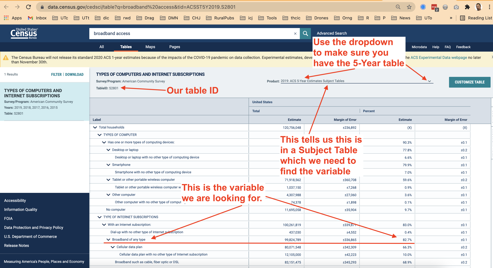
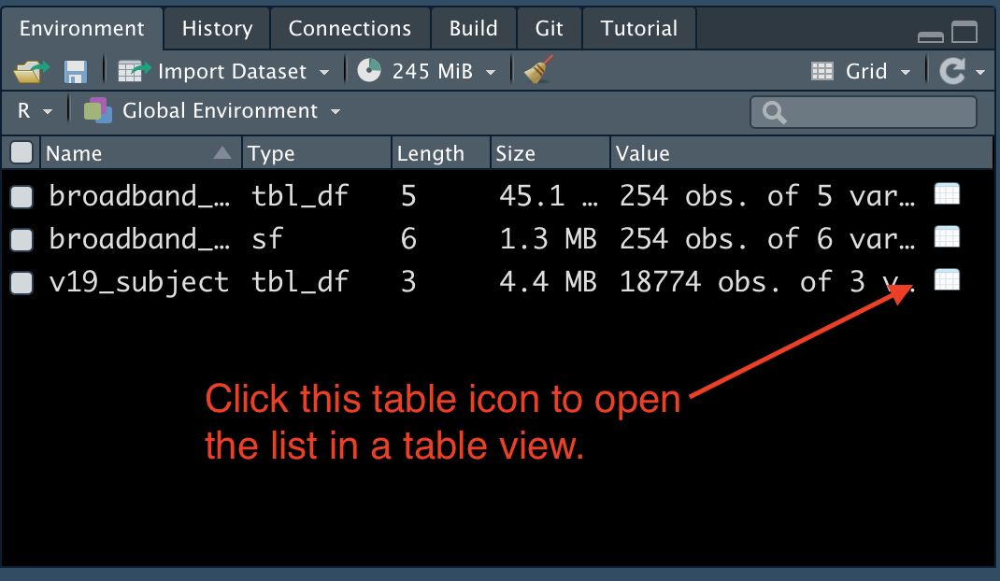

# Census introduction {#census-intro}

The U.S. [Census Bureau](https://census.gov/) has a wealth of data that can help journalists tell stories. This chapter is _not_ a comprehensive guide on how to use it, but instead an introduction on some ways you can.

There is a recorded lecture in Canvas that covers different data programs within the census, so you should watch that before embarking on this. You do need some basic knowledge of those programs for this to make sense.

## Goals of this section

- Introduce the official U.S. Census Bureau site [data.census.gov](https://data.census.gov/cedsci/).
- Explain API keys and set them up for census data.
- Introduce and explore the [tidycensus](https://walker-data.com/tidycensus/) package to pull census data into R.
- Introduce some mapping techniques using tidycensus.
_ Introduce the concept of joining data together.
- Note some other packages and methods to use census data.

## Start a tidycensus project

1. Start a new project called `yourname-census`.
1. Start a new R Notebook and title it `broadband.Rmd`.
1. Install tidycensus **in your Console**: `install.packages("tidycensus")`
1. Create a setup section with the following libraries

```{r setup,  echo=T, results='hide', message=F, warning=F}
library(tidyverse)
library(tidycensus)
library(scales)
```

## Census data portal and API

Before we dive in, we need to do some setup for your machine.

The Census Bureau has a data portal [data.census.gov](https://data.census.gov/cedsci/) where you can search for and download data, but the site is ... lacking. There is so much data it can be overwhelming at first. But once you've gained experience with the different programs and offerings it gets easier to find what you want. We'll use the official portal to find our data, but I also want to give a shoutout to [CensusReporter](https://censusreporter.org/), a tool built by journalists for journalists looking for finding census data. But for now, we'll use data.census.gov.

But what we are really here to learn is how to import Census Bureau data directly into R through using their Application Programming Interface, or API. 

API's let programming languages like R talk to other systems and request responses, typically through a URL. Packages like tidycensus, which we'll explor here, help us do that behind the scenes. There are a number of packages that do this with the census API, and they each work a little differently to solve different challenges.

> Manually downloading census data is usually a multiple-step and multiple-decision process. An advantage to using the API is you can script that decision-making process for consistency. It's transparent and repeatable.

The Census requires a free API key to use their service. It's like your personal license, and should not be shared with others. We do NOT write our API key into our R Notebooks.

If you do not already have a Census API Key or have not installed in yet into your R environment, follow these steps:

### Request a key

(I may ask you to do this before we get into this chapter. If I do, then you already have your key.)

1. Sign up for an [API key here](http://api.census.gov/data/key_signup.html). You should get an email back within a few minutes that includes a long string of random numbers and letter and a link to activate the key. Do activate that key through the link in the email.

### Install a key

2. **In your Console (NOT in Markdown)** enter the code below, **but replace your_key_here with the key you got in the email**. Keep the quotes there.

```r
census_api_key("your_key_here", install = TRUE)
```

1. Next you'll need to reload the environment. **In your Console** do this:

```r
readRenviron("~/.Renviron")
```

You can check to make sure it is working by running the following **in your Console**:

```r
Sys.getenv("census_api_key")
```

Which should return your API key string. That just let's you know it is working.

> You only have to set up your API key **once on each machine**. Once installed, it gets automatically loaded when you restart R.

Here is more [explanation on saving keys](https://rdrr.io/cran/tidycensus/man/census_api_key.html) if you need it.

## About the tidycensus package

[Kyle Walker](http://personal.tcu.edu/kylewalker/) is a professor at TCU who developed the [tidycensus](https://walker-data.com/tidycensus/index.html) package to return census data in tidyverse-ready tibbles with options to include spatial geometry to make maps. He is also writing a book [Analyzing US Census Data](https://walker-data.com/census-r/index.html).

Basically, it's brilliant.

There is [excellent documentation](https://walker-data.com/tidycensus/index.html) on using tidycensus. In this chapter we'll walk through searching through data, fetching data and making a map.

### Finding the data you want

To get data through tidycensus you need to know the "census program" and the specific "variables" or data points you want and there are thousands of these IDs across the different Census files. To be honest, I find this the hardest part of the process.

We can use a function in tidycensus called `load_variables` to help find what we need, but we must know what "program", the "year" and sometimes the "product" our data is in before we can use it to find our specific data.

I've found the best way to start this process is to find the data you want on data.census.gov first, which we'll walk through in a moment.

We'll start by using the American Community Survey (ACS) program. The survey comes in 5-year and 1-year versions. The 1-year version is more current, but is limited in geographies available. The 5-year version has more data, but it encompasses 5-years of answers. See the lecture for more on that. We'll uses the 5-year versions for . To access a 5-year data set, we use the last year of the data, so we use "2019" for the 2015-2019 5-Year ACS, which is the most recent release.

Just to make it more complicated (sorry), there are different "products" within the ACS: Detailed Tables, Subject Tables and Data Profiles.

Finding the variables is the hardest part of this exercise, I think.

## Broadband access by county in Texas

Here is our first challenge: **What counties in Texas have the highest percentage of households with broadband access of any type.**

Here is how we go about finding what we need:

1. Go to <http://data.census.gov>.
2. In the search box there, search for "broadband access"
3. The first **Table** results should be "TYPES OF COMPUTERS AND INTERNET SUBSCRIPTIONS". Click on that table to open it.
4. Click on the dropdown at top right (indicated below) and change it to "2019 ACS **5-Year** Estimates Subject Table". (We use the 5-year version so we can get results for every county in Texas. The 1-year version would only have larger counties.)

If you have trouble finding the table, you can [get it here](https://data.census.gov/cedsci/table?tid=ACSST5Y2019.S2801).



The default view of this table shows us values for this data across the entire US. This particular table has both **Total** values (the **estimate**) and the the **Percent** values (which is a percentage of that variable vs **Total Households**, the "univerise" of our data shown on the first line of data.)

The values we want for this is the one I've underlined above with the red line ... it is the **Percent** of **households** with **Broadband of any type**.

Before we can ask for our data through the API, we need to find the **exact variable name** for this value, but that isn't shown here on the table (damnit.) But we'll use the information on this screen to find it.

## Using the tidycensus load_variable() function

Looking at my marked up screenshot above, I look for several things when I'm trying to get data:

- I look at the table name: `S2801`
- I look at the "Product" line in the result. It will say something like **"2019 ACS 5-Year Estimates Subject Table"**. It is the last two words in this line we are looking at to determine the program.

Here is a schematic of the difference.
  
| Product | tidycensus value | Details |
|---|---|---|
| Detailed Tables | "acs1" or "acs5" | Tables about specific subjects or characteristics. Typically estimates and margin of errors only. |
| Subject Tables | "acs5/subject" | Topic-based collections. Has both estimates and percentages. |
| Data Profiles | "acs5/profile" | Specific collections around social, economic, housing and demographic areas. Can have both estimates and percentages. |

Here we'll use the `load_variables()` function again, but we have to specify that we are looking at **acs5/subject** tables since that is the  program we are using.

1. Create a new section that you are finding our broadband variable.
1. Add the code below and run it.


```{r download-vars}
v19_subject <- load_variables(2019, "acs5/subject", cache = TRUE)
```

- The first item `v19_subject` is the R object we are filling.
- We start with `load_variables()` and the first argument is the year of data that we want. Fo us this is: `2019`.
- The second argument is the profile type: `acs5/subject` for the subject tables.
- The third argument `cache = TRUE` saves this table to your computer so it doesn't download it each time you view it.

Once you have saved the table into an object, you'll see it listed in your Environment pane. Click on the little table icon on the right side to open it as a table:



Once you have the table open:

1. Click on the **Filter** box and put in our table id under **name**: `S2801`. That filters the results to just the table we want.
2. Under **label** type in "broadband", which will further filter the table just to rows that have that term.
3. We are looking for rows that start with "Estimate!!Percent" and we want the one that ends with "!!Broadband of any type". It happens the be the first Percent result if you haven't reordered the table accidently.
4. If you hover over the **label** column and leave your cursor there, you'll get a pop-up that shows you the value.
5. Once you find the row you need, you copy the **name** value for that row. The one we need is **`S2801_C02_014`**.
6. Copy that value and then add it as a Markdown note in your notebook so you have it saved there.


I swear this is the hardest part of this. I wish there were an easier way, but I haven't found one. Believe me, I've asked around about it.

## Use tidycensus to fetch our data

Now that we have the variable we are looking for, we'll grab that value for the U.S. so we can make sure we have the right thing.

To fetch data from the ACS program we use a the function `get_acs()`. It needs at least three things:

- The **year** of the dataset. For us this is `2019`.
- The variable (or **variables**) you seek. For us that is `S2801_C02_014`. We'll also name for clarity.
- The **geography** scope of the data. We'll first use `us` to check we have the right thing.

1. Start a new section and note you are getting the broadband percent data.
1. Add the following chunk and run it.

```{r test-var}
get_acs(
  year = 2019,
  variables = c(broadband = "S2801_C02_014"),
  geography = "us"
)
```

Now for a **very important step**:

1. Check the values you got back for **estimate** and compare it to the value you want from the table you got on [data.census.gov](https://data.census.gov/cedsci/table?tid=ACSST5Y2019.S2801).

The **estimate** should be "82.7", which is the percentage of households throughout the US that have broadband access of any type.

If you don't have the right number, then you don't have the correct variable. Make sure that is `S2801_C02_014`.

### Get broadband rates by county in Texas

Now that we have confirmed we have the right data, we can get this for Texas counties.

1. Create a subsection or otherwise note you are getting broadband for Texas counties.
2. Add the chunk below and run it and then I'll explain after

```{r get-broadband-county}
get_acs(
  year = 2019,
  variables = c(broadband = "S2801_C02_014"),
  geography = "county", # we changed this to county
  state = "TX" # We've added state to filter to just Texas
)
```

Here is what we've done here:

- We have the same `get_acs()` function with the same **year** and **variables**.
- We changed the **geography** argument to "county" which will give us this same variable for _every_ county in the country. But we don't want that so ...
- We added a **`state = "TX"`** argument to get just Texas counties.

Your list should start with Anderson County, Texas.

### On your own: Arrange to get lowest/highest values

We're going to save the result above into a new R object and then use that to get the two lists: The counties with the most access, and those with the least.

1. **Edit** your chunk to save the `get_acs()` code into a new object called `broadband_tx`. Run it so the object is created.
2. Write a bit of markdown that says you are getting the counties with the lowest access.
3. Write a block that takes `broadband_tx` and arranges it by the `estimate`, which will put the lowest access at the top. Pipe that into `head(10)` to see just the top values.
4. Write a bit of markdown that says you are getting the _hightest_ access and then a block to arrange by `estimate` in descening order. Pipe that into `head(10)` as well.

```{r broadband-lists, include=FALSE}
broadband_tx <- get_acs(
  year = 2019,
  variables = c(broadband = "S2801_C02_014"),
  geography = "county", # we changed this to county
  state = "TX" # We've added state to filter to just Texas
)

broadband_tx %>% 
  arrange(estimate) %>% 
  head(10)

broadband_tx %>% 
  arrange(estimate %>% desc()) %>% 
  head(10)
```

### What you have here

If you were writing a story about broadband access, you could note the counties that have the least and most access.

Getting the data answer was easy once you have the variable, right?

Now to blow your mind a little.

## Map broadband access by counties in Texas

Walker's tidycensus package can also bring in [spatial files](https://walker-data.com/tidycensus/articles/spatial-data.html) with a single additional line of code, which allows us to map data using ggplot's `geom_sf()` function.

1. Make a new section and note that you are _mapping_ broadband access.
2. Add the code chunk below and run it.

> I'm suppressing the output here because it doesn't show well in the book.

```{r broadband-geo, echo=T, results='hide', message=F, warning=F}
broadband_tx_geo <- get_acs(
  year = 2019,
  variables = c(broadband = "S2801_C02_014"),
  geography = "county",
  state = "TX",
  geometry = TRUE # this is the only new line
)

broadband_tx_geo
```

We've added ONE LINE of code here that gives us the geometric shapes for each county in our data. I saved this into a new tibble for clarity.

### Plot the broadband map

We'll plot the map here, and it looks like a lot, so I'll explain each part afterward.

I _really_ suggest that you build this one line or section at a time. You'll see me do that in the screencast (I hope).

```{r plot-broadband}
ggplot(broadband_tx_geo) + 
  geom_sf(aes(fill = estimate), color = "white", size = .1) +
  theme_void() +
  labs(
    title = "Broadband access in Texas counties",
    caption = "Source: Census Bureau/ACS 5-year 2019"
  ) +
  scale_fill_distiller(
    palette = "Oranges",
    direction = 1,
    name = "% households\nwith broadband"
  ) +
  theme(plot.margin = unit(c(0,10,0,10), "pt"))
```

Let's go through it line by line:

- We start with ggplot and fill it with our data.
- We add `geom_sf`, which stands for shapefile. We add an `aes()` of `fill = estimate`, which is the column in our data that has the median family income. At this point, we have a map! The rest is just improving it.
- In addition to the geom, I added `color = "white"` which changes the color of the lines around the counties. I also added `size - .1` to make them thinner.
- `theme_void()` removes the grid lines and axis names. It is pretty much used only with maps.
- We add our `labs()` which you should be familiar with now.
- Then we add `scale_fill_distiller()` with a bunch of settings. I'll be honest, I only know of this scale because of a some tutorial that I have since lost. But let's walk through the options used here:
  - `palette = "Oranges"` changes the colors since I didn't like the default blue. You could [try some of these](http://www.cookbook-r.com/Graphs/Colors_(ggplot2)/#rcolorbrewer-palette-chart)? I googled to find that.
  - `direction = 1` reverses the colors so higher numbers are darker instead of lighter. It makes more sense that way, at least to me.
  - `name = "% households\nwith broadband"` update the name on the legend. Note the weird `\n` in the middle with creates a **new line** with the legend so the name isn't so long.
- The last `theme(plot.margin)` line adds some margins around the plot since `theme_void()` removes all of that. I [found that here](https://stackoverflow.com/a/40408281). The number order is clockwise: top, right, bottom, left.

### You did it!

So you have a map of the broadband access by county for Texas.

Getting the data from tidycensus into R is pretty sweet, but it does take a get getting used to. I can tell you it is still easier than downloading CSV data and filtering and selectiong for what you need. And the mapping is just fun.

## Keep this project

We'll use this project in the next chapter, too.

## What we've learned

- We used <http://data.census.gov> to find interesting data. There is way more to explore there.
- You set up your computer with a U.S. Census API key.
- We've explored the [`tidycensus`](https://walker-data.com/tidycensus/index.html) package by Kyle Walker to fetch data using the Census API.
- You made a map!

---

> The rest of this chapter is just for your information. You don't need to do anything with it.

## Other useful census-related packages

### The censusapi package

[Hannah Recht](https://twitter.com/hannah_recht?lang=en) now of Kaiser Health News developed the [censusapi](https://www.hrecht.com/censusapi/) package to pull data directly from the Census Bureau into R. See that site for more examples and documentation on use.

Below is an example code chunk from censusapi that pulls the median income estimate (`B19013_001E`) and margin of error (`B19013_001M`), but I'm also including the total population for the county with `B01003_001E`, which was not in the "B19013" table. This is another advantage to using the API, as we are pulling from multiple tables at once. To do this manually, we would have to search for and download two separate data sets and merge them.

```r
tx_income <- getCensus(name = "acs/acs5", vintage = 2017, 
    vars = c("NAME","B01003_001E", "B19013_001E", "B19013_001M"), 
    region = "county:*", regionin = "state:48")
```

Which ends up looking like this:

| state | county | NAME                  | B01003_001E | B19013_001E | B19013_001M |
|-------|--------|-----------------------|------------:|------------:|------------:|
| 48    | 199    | Hardin County, Texas  |       55993 |       56131 |        3351 |
| 48    | 207    | Haskell County, Texas |        5806 |       43529 |        6157 |
| 48    | 227    | Howard County, Texas  |       36491 |       50855 |        2162 |

This gives us data in a different "shape" than the tidycensus package. It adds new variables as a column as "wide" data instead of new rows in "long" data, which is what tidycensus does.


This [censusapi example](https://utdata.github.io/rwd-r-census-examples/01-tidycensus.html) I have goes through a use of censusapi and finishes out by pulling data form Kyle Walker's [tigris](https://github.com/walkerke/tigris) to make a median income map.

If you already have the Census data, or perhaps data that is not from the census but has a county name or one of the other geographic code values, then you can use Walker's [tigris](https://github.com/walkerke/tigris) package to get just the shapefiles. That [censusapi notebook](https://utdata.github.io/rwd-r-census-examples/01-censusapi.html) also includes use of the tigris package, if you want to see that.

## Interactive maps with leaflet

You can also create interactive maps in R.

[Here is a tutorial](https://rpubs.com/rosenblum_jeff/censustutorial1) that walks through creating an interactive map of median income by census tract using the [leaflet](https://rstudio.github.io/leaflet/),  [mapview](https://r-spatial.github.io/mapview/index.html), [tigris](https://github.com/walkerke/tigris) and  [acs](https://www.rdocumentation.org/packages/acs/versions/2.1.4) packages. It's a pretty basic map best used for exploration, but it's pretty neat and not too hard to make.

## More resources and examples

Some other resources not already mentioned:

- [R Census guide](https://rconsortium.github.io/censusguide/)
- [Mapping Census Bureau Data in R with Choroplethr by package creator Ari Lamstein](https://www.census.gov/data/academy/courses/choroplethr.html)
- [Using the R Package RankingProject to Make Simple Visualizations for Comparing Populations by former Census Bureau statistician Jerzy Wieczorek](https://www.census.gov/data/academy/courses/ranking-project.html)
- [Baltimore Sun example story](https://www.baltimoresun.com/maryland/bs-md-acs-census-release-20181206-story.html) and [code](https://github.com/baltimore-sun-data/census-data-analysis-2018). [Christine Zhang](https://twitter.com/christinezhang) says "Sometimes I prefer the output of one over the other (censusapi vs tidycensus) which is why I alternate.
- [Spatial Data Science with R](https://www.rspatial.org/) Tutorial.
- Not a tutorial but but this [post by Timo Grossenbacher](https://timogrossenbacher.ch/2019/04/bivariate-maps-with-ggplot2-and-sf/) is an explanation and inspiration on how far you can take R in mapping. [Here is a version](https://gist.github.com/chris-prener/cd6b0aa0b2096daf13e545f4264ea6bb) that uses U.S. Census Bureau data.

## Using the data portal to download data

When you download a table from the data.census.gov portal, you get a stuffed archive with three files. Here is an example from a 5-year ACS data set for table B19013, which includes median income data:

- `ACSDT5Y2017.B19013_data_with_overlays_2019-04-20T000019.csv` is the data. It contains two header rows (arg!) with the first row being coded values for each column. The second row has long descriptions of what is in each column.
- `ACSDT5Y2017.B19013_metadata_2019-04-20T000019.csv` is a reference file that gives the code and description for each header in the data.
- `ACSDT5Y2017.B19013_table_title_2019-04-20T000019.txt` is a reference file with information about the table. If data is masked or missing, this file will explain the symbols used in the data to describe how and why.

The first part of the file names include the program, year and table the data comes from. At the end of the file name is the date and time the data was downloaded from the portal.

### Importing downloaded data

When I import this data into R, I typically use the `read_csv()` function and skip the first, less-descriptive row. The second row becomes the headers, which are really long but explain the columns. I then rename them to something shorter. If you are only using selected columns, then you might use `select()` to get only those you need.

Here is an example:

```r
tx_income <- read_csv("data-raw/ACSDT5Y2017.B19013_2019-04-20T000022/ACSDT5Y2017.B19013_data_with_overlays_2019-04-20T000019.csv", skip = 1) %>% 
  rename(
    median_income = `Estimate!!Median household income in the past 12 months (in 2017 inflation-adjusted dollars)`,
    median_income_moe = `Margin of Error!!Median household income in the past 12 months (in 2017 inflation-adjusted dollars)`
  ) %>% clean_names()
```

Which yields this:

| id             | geographic_area_name  | median_income | median_income_moe |
|----------------|-----------------------|--------------:|------------------:|
| 0500000US48199 | Hardin County, Texas  |         56131 |              3351 |
| 0500000US48207 | Haskell County, Texas |         43529 |              6157 |
| 0500000US48227 | Howard County, Texas  |         50855 |              2162 |


### Fields made to join with other data

Pay attention to fields named `id` or `geoid` or similar names as these are often fields meant to be joined to other tables. Many use parts of FIPS codes that define specific geographic areas, and allow you to match similar fields in multiple data sets.

This is especially important when it comes to mapping data, as these codes are how you join data to "shape files", which are a data representation of geographic shapes for mapping. While we won't go into a lot of detail about maps in this lesson, I've linked some examples below.

You may find you want to join data based on geography names, in which case you might need to use [dplyr](https://dplyr.tidyverse.org/) tools to split and normalize those terms so they match your other data set, like changing "Travis County, Texas" to just "Travis".

