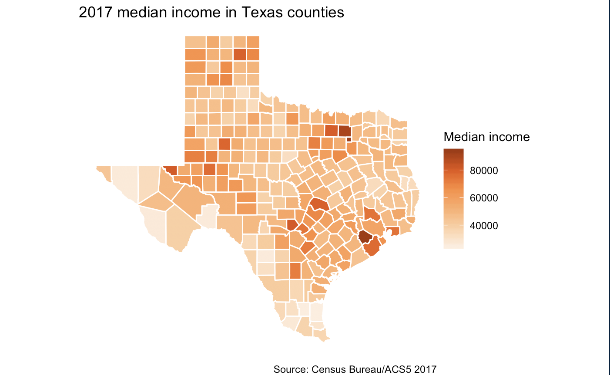

# Census {#census}

The U.S. [Census Bureau](https://census.gov/) has a wealth of data that can help journalists tell stories. This chapter is _not_ a comprehensive guide on how to use it, but instead an introduction on some says you can.

But we can't talk about specifics of _how_ do to anything before learning _about_ the different Census programs, so here is a mini overview of some of the more popular programs.

## Goals of this section

- Introduce three of the more popular Census data sets and how they differ:
    - [Decennial Census](https://www.census.gov/programs-surveys/decennial-census/decade.2010.html)
    - [American Community Survey](https://www.census.gov/programs-surveys/acs)
    - [Population Estimates Program](https://www.census.gov/programs-surveys/popest.html)
- Discuss differences between [American FactFinder](https://factfinder.census.gov/faces/nav/jsf/pages/index.xhtml) and [data.census.gov](https://data.census.gov/cedsci/).
- Introduce and demonstrate packages that use the Census Bureau's API to pull data into R.
- Introduce packages that allow static and interactive mapping within R, which often comes into play when using Census data.

None of these topics are comprehensive. I have [lectured on the census](https://drive.google.com/open?id=1vfPIhXcodmqVHvZCauEc9QZgyev-Lm4ZWxn2nlhhzRI) in the past and have  [multiple](https://drive.google.com/open?id=1z6XnsPg2fhdwZeko7MG5IYq4CJfqDqxQx5-RLFUUiIM) [lessons](https://drive.google.com/open?id=18hZ7DvQkGoSnJNKGvqjR3rvErglNZGAmTO-PysarsSQ) using different software if you want more general instruction, or you could just dive in and gain your own experience.

## Census Bureau programs and platforms

The Census Bureau has a series of different data "programs" and data sets, many with their own distribution platforms. They are currently in a development effort to combine distribution of all of them into a new, combined platform: [data.census.gov](https://data.census.gov/cedsci/). _It is a work in progress._ That said, the plan is to stop publishing new data to the much-bemoaned [American FactFinder](https://factfinder.census.gov/faces/nav/jsf/pages/index.xhtml), their "old" site, this summer of 2019. As such, I'll concentrate on [data.census.gov](https://data.census.gov/cedsci/).

That's to say that while I'm outlining three different programs here, the data will eventually be found all int he same place, but it's in a state of flux currently. Your default should be to use [data.census.gov](https://data.census.gov/cedsci/) first, then go to [American FactFinder](https://factfinder.census.gov/faces/nav/jsf/pages/index.xhtml) if you can't find something. We'll also discuss some R packages that use the Census API, and the advantages of using them.

### Decennial Census

Every [ten years](https://www.census.gov/programs-surveys/decennial-census/decade.2010.html), the government tries to count everyone in every household in America. The results are used to redraw Congressional Districts, allocate tax dollars and a million other reasons. The number of questions asked each decade has been condensed to center around how many people live in a household, their age, race and ethnicity, their relationship to each other, and if they own or rent the home.

> The decennial census data is the most accurate snapshot you can get for a single point in time. It's just limited in the scope of data.

Most decennial data has been migrated to the data.census.gov data portal.

April 1, 2020 is [Census Day](https://2020census.gov/en) for the [next count](https://www.census.gov/programs-surveys/decennial-census/2020-census.html).

### American Community Survey

The [American Community Survey](https://www.census.gov/programs-surveys/acs), or ACS, is the method the government uses to collect more detailed data than who lives where. It is quite extensive, with information relevant to almost any beat in Journalism.

While the decennial count comes once every ten years, the ACS has been continuously collecting data since 2005. Each year about 1.7% of Americans answer the ACS survey, and those results are distributed at regular intervals each year.

This is fine for large geographic areas with 65,000 people or more. But, when you want results for smaller geographic areas or very specific individuals, the bureau combines five years of survey results together so they have enough data to make estimates. This combination of 1-year and 5-year data sets is a trade off: New data each year for large areas, but fuzzier 5-year windows for small areas.

Each estimate also comes with a "margin of error", which represents the upper and lower bounds of the estimate with a 90% confidence rate. You can read more about this in the [ACS media guide](https://www.census.gov/library/publications/2008/acs/media.html), but here is a brief example:

If an estimate is 2,000 with an MOE of +/- 100, that means that you could take 10 new random samples in that area and the average of those samples would be between 1,900 and 2,100 for nine out of the 10 samples.

As journalists, we don't typically report the margin of error each time we use an estimate, but we do make sure our readers understand the data are based on survey estimates. Most importantly we make sure the MOE is not more than 10% of our estimate if we are basing our story on that number. 

> The ACS allows us to get the most detailed characteristics about our population, like how we travel to work or how much of our income we spend on rent. However, it comes with a degree of uncertainty, especially for smaller geographic areas. It is still very valuable.

Most of these tables are available on data.census.gov, with the rest scheduled to be ported this year (2019). New releases will only be published to the data portal.

### Population Estimates Program

PEP uses current data on births, deaths, and migration to calculate population change since the most recent decennial census. Each year the Census Bureau publishes tables with estimates of population, demographics, and housing units for cities, counties and metro areas.

> Populations estimates are a great way to see population and demographic changes for large areas. It does not have a margin of error like the ACS because it is based on actual data and not random surveys of a part of the population.

These tables are currently only available in FactFinder, but should be ported to the new data.census.gov data portal this year (2019).

## Using the new data portal

Again, the [data.census.gov](https://data.census.gov/cedsci/) data portal is under development and has some known challenges, but it's the one you should learn first since FactFinder will be retired this year. It is slow, cumbersome and error prone but getting better with each new release.

Instead of me writing out directions, I recommend you watch [this webinar](https://www.census.gov/data/academy/webinars/2019/transition-data-census.html) that demonstrates how to use the portal and outlines the current challenges and development plans for the future.

I will provide brief demos of the data portal and FactFinder in class, just so you can see them.

### Tips about using downloaded portal data in R

When you download a table from the portal, you get a stuffed archive with three files. Here is an example from a 5-year ACS data set for table B19013, which includes median income data:

- `ACSDT5Y2017.B19013_data_with_overlays_2019-04-20T000019.csv` is the data. It contains two header rows (arg!) with the first row being coded values for each column. The second row has long descriptions of what is in each column.
- `ACSDT5Y2017.B19013_metadata_2019-04-20T000019.csv` is a reference file that gives the code and description for each header in the data.
- `ACSDT5Y2017.B19013_table_title_2019-04-20T000019.txt` is a reference file with information about the table. If data is masked or missing, this file will explain the symbols used in the data to describe how and why.

The first part of the file names include the program, year and table the data comes from. At the end of the file name is the date and time the data was downloaded from the portal.

### Importing downloaded data

When I import this data into R, I typically use the `read_csv()` function and skip the first, less-descriptive row. The second row becomes the headers, which are really long but explain the columns. I then rename them to something shorter. If you are only using selected columns, then you might use `select()` to get only those you need.

Here is an example:

```r
tx_income <- read_csv("data-raw/ACSDT5Y2017.B19013_2019-04-20T000022/ACSDT5Y2017.B19013_data_with_overlays_2019-04-20T000019.csv", skip = 1) %>% 
  rename(
    median_income = `Estimate!!Median household income in the past 12 months (in 2017 inflation-adjusted dollars)`,
    median_income_moe = `Margin of Error!!Median household income in the past 12 months (in 2017 inflation-adjusted dollars)`
  ) %>% clean_names()
```

Which yields this:

| id             | geographic_area_name  | median_income | median_income_moe |
|----------------|-----------------------|--------------:|------------------:|
| 0500000US48199 | Hardin County, Texas  |         56131 |              3351 |
| 0500000US48207 | Haskell County, Texas |         43529 |              6157 |
| 0500000US48227 | Howard County, Texas  |         50855 |              2162 |


### Fields made to join with other data

Pay attention to fields named `id` or `geoid` or similar names as these are often fields meant to be joined to other tables. Many use parts of FIPS codes that define specific geographic areas, and allow you to match similar fields in multiple data sets.

This is especially important when it comes to mapping data, as these codes are how you join data to "shape files", which are a data representation of geographic shapes for mapping. While we won't go into a lot of detail about maps in this lesson, I've linked some examples below.

You may find you want to join data based on geography names, in which case you might need to use [dplyr](https://dplyr.tidyverse.org/) tools to split and normalize those terms so they match your other data set, like changing "Travis County, Texas" to just "Travis".

## Using the Census API in R

You can also import data into R directly from the Census Bureau using their API. There are a number of packages that do this, and they all work a little  differently to solve different challenges. Again, I won't go into great detail about how to use these, but I'll show examples and provide links to further self-study.

> Manually downloading census data is usually a multiple-step and multiple-decision process. An advantage to using the API is you can script that decision-making process for consistency. Different packages also provide the data in different formats, which might be beneficial depending on your goal.

### Setting up an API key

The Census requires a free API key to use their service. It's like your personal license, and should not be shared with others. You can sign up for an  [API key here](http://api.census.gov/data/key_signup.html) and then [store it on your machine in an .Rnviron](https://rdrr.io/cran/tidycensus/man/census_api_key.html) file so you don't have to display it in your code.

> You only have to set up your API key once on each machine. Once installed, it gets automatically loaded when you restart R.

### The censusapi package

[Hannah Recht](https://twitter.com/hannah_recht?lang=en) of Bloomberg News developed the [censusapi](https://hrecht.github.io/censusapi/) to pull data directly from the Census Bureau into R. See that site for more examples and documentation on use.

You can view the [full notebook of the examples below here](https://utdata.github.io/rwd-r-census-examples/01-censusapi.html). 

This example code chunk pulls the same data set we manually downloaded from the portal. We are asking for the median income estimate (`B19013_001E`) and margin of error (`B19013_001M`), but I'm also including the total population for the county with `B01003_001E`, which was not in the "B19013" table. This is another advantage to using the API, as we are pulling from multiple tables at once. To do this manually, we would have to search for and download two separate data sets and merge them.

```r
tx_income <- getCensus(name = "acs/acs5", vintage = 2017, 
    vars = c("NAME","B01003_001E", "B19013_001E", "B19013_001M"), 
    region = "county:*", regionin = "state:48")
```

Which ends up looking like this:

| state | county | NAME                  | B01003_001E | B19013_001E | B19013_001M |
|-------|--------|-----------------------|------------:|------------:|------------:|
| 48    | 199    | Hardin County, Texas  |       55993 |       56131 |        3351 |
| 48    | 207    | Haskell County, Texas |        5806 |       43529 |        6157 |
| 48    | 227    | Howard County, Texas  |       36491 |       50855 |        2162 |

See how this is similar to the data we imported from file we downloaded from the data portal? In this case we have a `state` and `county` field instead of the `id`, but the shape of the data is the same. Also note that our extra variable for population is added as a new column, which will differ with our next example.

Using an API like this to fetch data can take some effort to learn, but the exact "steps" to get the data are recorded in your code.

### The tidycensus package

[Kyle Walker](http://personal.tcu.edu/kylewalker/) is a professor at TCU who developed the [tidycensus](https://walkerke.github.io/tidycensus/index.html) package to return census data in tidyverse-ready data frames. He also includes an option to pull the spatial geometry to make maps.

You can [view this example in full](https://utdata.github.io/rwd-r-census-examples/01-tidycensus.html), with the map.

With tidycensus we don't have to specify to get the MOE with his `get_acs()` function, it just comes. We only supply the two variables we want, those for population and the median income.

```r
tx_income <- get_acs(
  geography = "county",
  variables = c("B01003_001","B19013_001"),
  state = "TX"
  )
```

And the result is this:

| GEOID | NAME                   | variable   | estimate |  moe |
|-------|------------------------|------------|---------:|-----:|
| 48001 | Anderson County, Texas | B01003_001 |    57747 |   NA |
| 48001 | Anderson County, Texas | B19013_001 |    42313 | 2337 |
| 48003 | Andrews County, Texas  | B01003_001 |    17577 |   NA |
| 48003 | Andrews County, Texas  | B19013_001 |    70753 | 6115 |
| 48005 | Angelina County, Texas | B01003_001 |    87700 |   NA |
| 48005 | Angelina County, Texas | B19013_001 |    46472 | 1452 |

Note how the resulting data is a different shape here. Instead of the table getting wider for each variable added, it gets longer. This is a more "tidy" shape that can potentially be easier to plot or map.

### Adding geometry to tidycensus

The tidycensus package also allows you to download the geometry or shapes of your data at the same time by adding `geometry = TRUE` to your tidycensus call. This allows you to quickly make static maps of your data.

I'm removing the population variable because we don't need it for the map.

```r
tx_income_map <- get_acs(
  geography = "county",
  variables = c("B19013_001"),
  state = "TX",
  geometry = TRUE # gets shapes
  )
```

Now we can use `geom_sf()` to plot the `estimate` value to each county in shapefile in ggplot.

```r
ggplot(tx_income_map) + 
  geom_sf(aes(fill=estimate), color="white") +
  theme_void() +
  theme(panel.grid.major = element_line(colour = 'transparent')) +
  scale_fill_distiller(palette="Oranges", direction=1, name="Median income") +
  labs(title="2017 median income in Texas counties", caption="Source: Census Bureau/ACS5 2017")
```

Which yields this:



That's basically two lines of code to pull data and build a map.

### Map shapes only with tigris

If you already have the Census data, or perhaps data that is not from the census but has a county name or one of the other geographic code values, then you can use Walker's [tigris](https://github.com/walkerke/tigris) package to get just the shapefiles. The [censusapi example](https://utdata.github.io/rwd-r-census-examples/01-tidycensus.html) I have finishes out by pulling tigiris data to make the same median income map as above.

## Interactive maps with leaflet

[Here is a tutorial](https://rpubs.com/rosenblum_jeff/censustutorial1) that walks through creating an interactive map of median income by census tract using the [leaflet](https://rstudio.github.io/leaflet/),  [mapview](https://r-spatial.github.io/mapview/index.html), [tigris](https://github.com/walkerke/tigris) and  [acs](https://www.rdocumentation.org/packages/acs/versions/2.1.4) packages. It's a pretty basic map best used for exploration, but it's pretty neat and not too hard to make.

## Resources

Some other resources not already mentioned:

- [R Census guide](https://rconsortium.github.io/censusguide/)
- [Sharon Machlis guide](https://www.computerworld.com/article/3120415/data-analytics/how-to-download-new-census-data-with-r.html)
- [Thematic maps](https://workshop.mhermans.net/thematic-maps-r/) tutorial.
- [Baltimore Sun example story](https://www.baltimoresun.com/news/maryland/bs-md-acs-census-release-20181206-story.html) and [code](https://github.com/baltimore-sun-data/census-data-analysis-2018). [Christine Zhang](https://twitter.com/christinezhang) says "Sometimes I prefer the output of one over the other (censusapi vs tidycensus) which is why I alternate.
- [Spatial Data Science with R](https://www.rspatial.org/) Tutorial.
- Not a tutorial but but this [post by Timo Grossenbacher](https://timogrossenbacher.ch/2019/04/bivariate-maps-with-ggplot2-and-sf/) is an explanation and inspiration on how far you can take R in mapping.
