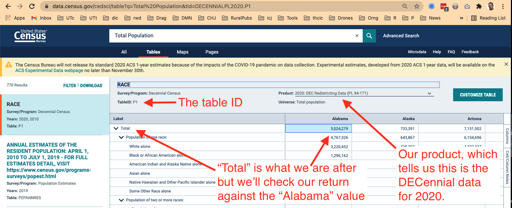
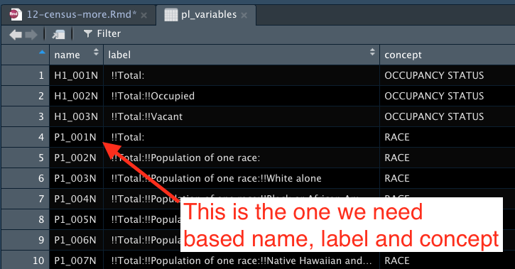

# Joining census data {#census-more}

In the last chapter we introduced U.S. Census Bureau's data.census.gov and used it to guide us in using their API with the tidycensus package. We used tidycensus to pull data and we mapped it.

In this chapter we'll use tidycensus again, but we'll use it to pull data that compliments other data (COVID cases), joining two data sets together to get a per-population rate.

## Goals of the chapter

- Introduce the New York Times' collection of COVID-related data.
- Along the way we'll learn how to use `slice()` to get a subset of data.
- Use Tidyverse to pull 2020 Decennial Census population data.
- Introduce the concept of "joining" data on a common key variable.
- Create COVID cases and death rates using the combination of these two data sets.
- Map the results.

## Questions we'll answer

- Which counties in Texas have the highest/lowest cases-per-population rates for COVID.
- Which counties have the highest/lowest deaths-per-population rates for COVID.

## Set up your notebook

We're going to use the same project from the last chapter, `yourname-census`, but start a new notebook.

1. Open your census project
2. Start a new R Notebook and name it "COVID rates".
3. Create a setup chunk with the following libraries

```{r setup,  echo=T, results='hide', message=F, warning=F}
library(tidyverse)
library(tidycensus)
library(scales)
library(janitor)
```

## New York Times COVID data

The New York Times has been collecting COVID-19 case data since the beginning of the pandemic, and they have been [publishing it on Github](https://github.com/nytimes/covid-19-data) for others to use. One of files they publish is cumulative case and death counts by county throughout the United States.

We will use this file, along with 2020 U.S. Census Bureau population data, to create cases-per-population and deaths-per-population rates for each county in Texas. Because counties have varying populations, we need a rate like this to compare them on an equal basis.

### On your own: Import the NYT data

We won't bother to save the covid data to your hard drive ... we'll just import directly from the URL.

1. Create a new section and note you are download the NYT covid data
2. Start an R chunk and use `read_csv` to import the data from this url: `https://raw.githubusercontent.com/nytimes/covid-19-data/master/us-counties.csv` and save it into an R object called `covid`. (This is similar to how you imported the Skittles data.)
3. Print your new `covid` tibble to the screen. You can pipe it into `head()` to show just the top of it so we can see what it is.


```{r import, include=FALSE}
covid <- read_csv("https://raw.githubusercontent.com/nytimes/covid-19-data/master/us-counties.csv") %>% 
  clean_names()

covid
```

There is more than 1.8 million rows of this data, so it might take a couple of seconds.

Let's tour the data real quick:

```{r peek-covid}
covid %>% head()
```

This is the same data that powers the NYT's [Coronavirus tracker](https://www.nytimes.com/interactive/2021/us/covid-cases.html). They have a team of reporters that update the data every day.

There is a new row of data for each county, each day. The data includes the date of the update along with the county, state, a FIPS code (a special geographic designation) as well as the total cases and deaths from COVID up to that date.

Since the data is cumulative, we only want the most recent date for each county.

### Slice the most recent data

Most of the concept in the next chunk you know already, but [`slice()`](https://dplyr.tidyverse.org/reference/slice.html) is new so I'll do this all and then explain it.

1. Create a new section that notes you are getting the most recent Texas data by county.
2. Add the code chunk below (one line at a time!) and run it.

```{r filter-tx}
tx_covid <- covid %>% 
  filter(state == "Texas") %>% 
  group_by(county) %>% 
  slice_max(date) %>% # our new function that gets the latest date
  filter(county != "Unknown") %>% 
  select(-state)

tx_covid
```

> IMPORTANT NOTE: The **date** values in your data should be more recent than what is shown here since you are downloading at a later date.

Let's break this down

- The first line creates a new R object `tx_covid` and fills it with the expression that follows, which is built from our raw `covid` data/
- The next line filters for Texas. Typical stuff for us.
- The next challenge is to find the most recent date for each county in Texas. There will be a row for each date for each county, and we want only the most recent date for each county. So, we do this by using `group_by(county)`so the next action will happen within the records for each county.
- `slice_max()` is our new function, which is related to the tidyverse [`slice()`](https://dplyr.tidyverse.org/reference/slice.html) function, which lets you "subset" rows of data based on its position in your data. The documentation includes this: "`slice_min()` and `slice_max()` select rows with highest or lowest values of a variable." That is what we do here ... we use `slice_max()` to get the "highest" or latest `date` in our data. Since this follows `group_by(county)`, it finds the most recent date for _each_ county.
- If you are running these one line at a time like I suggested, you'll notice there are 255 returns when there are _only_ 254 counties in Texas. That is because there is a county value of **Unknown**, which we filter out using a standard filter.
- Lastly, we use `select()` to remove the `state` column since we don't need it anymore.

So now you have the latest COVID-19 case and death counts for each county in Texas.

## Get county populations using tidycensus

We can't compare the counts of each county against each other because they have differing numbers of people. Let's put it like this using Oct. 15, 2021 numbers: Harris County -- the state's largest county -- has had 569,187 cases out of 4.7 million people. Loving County -- the smallest county -- has only 8 cases, but that is out of a total of 64 people in the county. Which is worse? And yes, only 64 people lived in Loving County when the 2020 census was taken on April 1, 2020.

So, let's use tidycensus to get the populations. Since the 2020 Decennial "Redistricting file" was released this year, we have really fresh and accurate population numbers.

### Find the data on data.census.gov

As I said in the last chapter, the hardest part of using Census data is finding what you want. There is so much data it is hard to find or even know what you need.

From experience I know that in the first Decennial Redistricting data release, there is a **RACE** table that has a total population for each census geography. **This is the most accurate count we have of people in the U.S., but we only get it every 10 years.** You are just lucky to live at this time where this data is super fresh (relatively).

If you search for "Total Population" on <http://data.census.gov> you should get the **P1** table called **RACE** as the first return, but if not you can [click here](https://data.census.gov/cedsci/table?tid=DECENNIALPL2020.P1) to get directly to it.



### Find the variable name

OK, now for the fun part. We can again use `load_variables()`, but the program we search for is **`pl`**.

> UNIMPORTANT ASIDE: That is an L in "pl", as in the PL 94-171, the law that requires the Census Bureau to produce this file. It's kinda confusing since we are also working with the P1 (one) table.

1. Start a new section and note you are getting the decennial population variable.
2. Run the code below and then open the table by double-clicking table icon for that object in your Environment pane.

```{r vars}
pl_variables <- load_variables(2020, "pl", cache = TRUE)
```

This is how you can open the table:


When we open that as a table view from your environment, we get lucky that we can see the value we are looking for: `P1_001N`.



1. Note the name of the variable in your markdown so you have it handy.


### Fetch the population data

Getting data form the decennial census is similar to the ACS, just with a differently-named function: `get_decennial()`. You need at least the **year**, the **variables** and the **geography** for your return.

Since it is Alabama that we see on the [data.census.gov](https://data.census.gov/cedsci/table?tid=DECENNIALPL2020.P1) portal, we'll start by pulling state values to make sure our numbers match.


1. Start a subsection or otherwise note you are fetching a test of the variable. If you haven't already, you should include a link back to your table on data.census.gov.
2. Insert the code block below and run it. Might as well copy/paste all of it because you need all three arguments for it to work.

```{r test-vars}
get_decennial(
  year = 2020,
  variables = "P1_001N",
  geography = "state"
)
```

Our return shows a value of 5024279	for Alabama, which matches the data portal, so we have the correct variable. Let's keep this here just for reference.

### Get data for Texas counties

1. Start a new section and note you are getting the Texas county populations.
2. Build your data using the `get_decennial()` as noted below. Note you need the first three arguments before it wil work at all.

> I've suppressed the output here because it doesn't show well in the book.

```{r dec-data, echo=T, results='hide', message=F, warning=F}
tx_pop <- get_decennial(
    year = 2020,
    variables = "P1_001N",
    geography = "county",
    state = "TX",
    geometry = TRUE
  ) %>%
  clean_names() %>% 
  arrange(name)

tx_pop
```

A couple of things to note here:

- We set the **geography** argument to "county" to get county results across the U.S.
- We use **state** argument set to "TX" to get just Texas counties.
- We use the `geometry = TRUE` argument to get our shapes for mapping.
- We pipe the result of all that into `clean_names()` because some of the column names are UPPERCASE. We don't _have_ to do this, I'm just anal retentive.

## About joins

OK, before we go further we need to talk about joining data.

There are several types of [joins](https://dplyr.tidyverse.org/reference/mutate-joins.html). We describe these as left vs right based on which table we reference first (which is the left one).

What joins do is match rows from multiple data sets that have the same "key value" and then append the data along those rows. Our two data sets have the same value in both, they just happend to be named different things.

Look at these two glimpses and note the **fips** and **geoid** fields between them.

```{r tx-covid-glimpse}
tx_covid %>% glimpse()
```

```{r tx-pop-glimpse}
tx_pop %>% glimpse()
```

The `fips` and `geoid` columns are the same value under different names. This is the FIPS code for counties used in all kinds of government data. It's actually a combination of the **state** FIPS (48 for Texas) and the **county** designation (the last three numbers). This creates a unique combination for every county in the U.S.

Knowing we have these two similar values, we can **Join** the rows that have the same value in both. Basically we will add the **_columns_** of one data set to the other based on that value.

In our case, we have the same 254 rows in each data set, but if we didn't we would need to decide what to do with data that DIDN'T match.

In the figure below, we can see which matching records are retained based on the type of join we use.


The join syntax works like this, with the * as the direction of the join:

```r
new_dataframe <- *_join(first_df, second_df, by = field_name_to_join_on)
```

If the fields you are joining on are not named the same thing (as in our case), then you can define the relationships: `by = c("a" = "b")`.

For our purposes here we want to use an `inner_join()`. We have to **start with our population data first** for the mapping to work later. (This threw me for a loop when wrote this, so learn from my experience.) We'll then add our our covid data.

### Join our data together

1. Start a new section and note we are joining our data.
2. Add the code below, run and review the results and the explanation below.

, echo=T, results='hide', message=F, warning=F


```{r tx-join}
tx_joined <- inner_join(
  tx_pop, # first table
  tx_covid, # second table with columns we'll add
  by = c("geoid" = "fips") # note the joining columns
)

tx_joined
```

So, to break this down:

- Our new combined dataframe will be called `tx_joined`, which is filled from the result of ...
- We start the `inner_join()` and then name our two tables.
- Since our "key" columns don't have the same name, we have to specify how to join them. We need to name these columns in the same order as we name the tables, hence `by = c("fips" = "geoid")`

Page through the result so you can see the new columns.

Here is glimpse of the new table:

```{r joined-glimpse}
tx_joined %>% glimpse()
```

Now that we have our `cases`, `deaths` and `value` (or population) columns in the same table so we can do some math to create case and death rates.

### Clean up column names, etc.

Let's rename our `value` column to a more descriptive `total_pop` and remove some other unneeded columns.

I don't think we've renamed columns using `rename()` yet so we'll do this together. Rename works similar to `mutate()` in that you name the new column first and then set it equal to the old one. We're also using `select()` which we've done before.

1. Create a new section noting you are renaming columns and other cleanup.
2. Add this chunk and run it.

```{r rename}
tx_renamed <- tx_joined %>% 
  rename(
    total_pop = value
  ) %>% 
  select(-name, -variable)

tx_renamed %>% glimpse()
```

## Create our rate columns

Our whole goal here was to find the number of cases per population per county and we are finally at a place where we can. We do this using `mutate()` and we've done stuff like this in the past with the Military Surplus assignment.

We're actually going to find "cases per 1,000 people" because otherwise the numbers would be too small to comprehend. For a good explanation of why we need this, read [Robert Niles' take on per capita rates](https://www.robertniles.com/stats/percap.shtml). It is also covered on Page 16 of Numbers in the Newsroom by Sarah Cohen.

To get a per-1,000 rate, the math works like this: **(cases / (total_pop / 1000))**.

1. Start a new section noting you are creating your rates
2. Add the chunk and run it.

> I'm suppressing the output here because the book doesn't show it well.

```{r rates, echo=T, results='hide', message=F, warning=F}
tx_rates <- tx_renamed %>% 
  mutate(
    cases_per_pop = (cases / (total_pop / 1000)) %>% round()
  )

tx_rates
```

You should be able to comprehend the `mutate()` function by now.

1. Go to the last column in the tibble that returns and make sure you have a new column named `cases_perpop_ and that everything worked as you expected.

### On your own: Get a deaths rate per 1,000

1. Edit your rates chunk to add an additional rule to calculate deaths per 1,000 people. It's pretty much the same but using `deaths`.

```{r rates-full, include=FALSE}
tx_rates <- tx_renamed %>% 
  mutate(
    cases_per_pop = (cases / (total_pop / 1000)) %>% round(),
    deaths_per_pop = (deaths / (total_pop / 1000)) %>% round(),
  )

tx_rates
```

### On your own: Find counties with highest rates

On your own, I want you to create **two** lists: One of the Top 10 counties with the highest cases-per-1,000 and another of the Top 10 counties with the highest deaths-per-1,000 cases. Don't overthink this ... it is a simple arrange, select and head combination. You **do not** need to save these into new object ... just print to the screen.

Use `select()` to show just the county, total_pop, cases/deaths and the appropriate rate for each view. **Note that the `geometry` column will _always_ show**. You can't remove it ... that's just how it works `¯\_(ツ)_/¯`. 

## Mapping the rates for Texas counties

We'll build a Texas map of the rates much like we did with the broadband rates in the last chapter. In fact it is pretty much the same code with updated variables and text.

1. Create a new section that you will map cases per 1,000
2. Add the chunk below and run it.
3. Update the labs to add a title, etc.

```{r map-rates}
tx_rates %>% 
  ggplot() +
  geom_sf(aes(fill = cases_per_pop), color = "white", size = .2) +
  theme_void() +
  labs(
    title = "COVID cases per 1,000 in Texas counties",
    caption = "Source: New York Times COVID, Census Bureau/2020 Decennial"
  ) +
  scale_fill_distiller(
    palette = "Greens",
    direction = 1,
    name = "Cases per 1000"
  ) +
  theme(plot.margin = unit(c(10,0,10,0), "pt"))
```

## On your own: Map the deaths per 1,000

On your own, create a map like above but:

1. Use your deaths per 1,000 data.
2. Change the color
3. Update the titles, etc to be correct.

## What we've learned

- We learned that the New York Times is awesome that they have collected COVID data and then shared it with the world.
- We used `group_by()` and  [`slice_max()`](https://dplyr.tidyverse.org/reference/slice.html) to get the most recent data for each county.
- We used tidycensus to get population data and geometry data for mapping.
- You made more maps.

## Turn in your work

(There may be an extra-credit assignment that you can try if I can work it up in time. You should know by class time.)

1. Make sure your Markdown is in good shape, chunks named, etc.
2. Make sure everything runs and knits all the way through.
3. Zip your project and turn it into Canvas.


