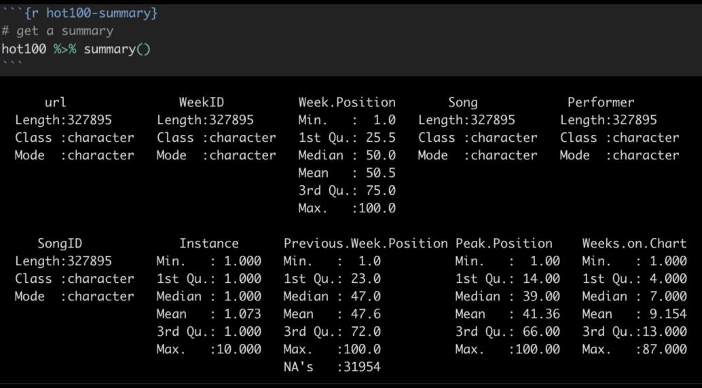
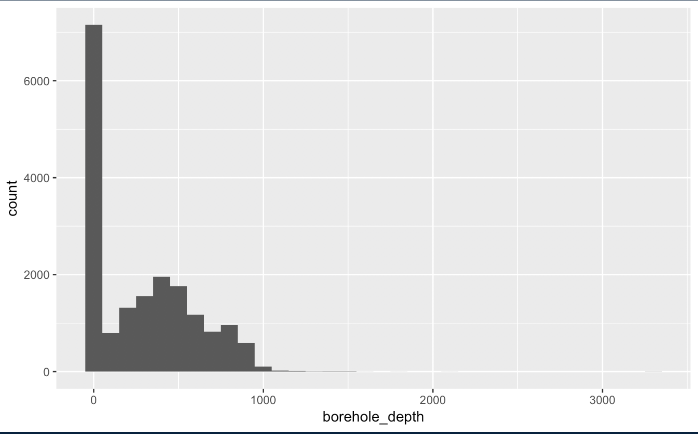

# How to tackle a new dataset

For those unfamiliar with exploring data, starting the process can be paralyzing.

How do I explore when I don't know what I'm looking for? Where do I start?

Every situation is different, but there are some common techniques and some common sense that you can bring to every project.

## Start by listing questions

It's likely you've acquired data because you needed it to add context to a story or situation. Spend a little time at the beginning brainstorming as list of questions you want to answer. (You might ask a colleague to participate: the act of describing the data set will reveal questions for both of you.) I like to start my RNotebook with this list.

## Understand your data

Before you start working on your data, make sure you understand what all the columns and values mean. Look at your data dictionary, or talk to the data owner to make sure you understand what you are working with.

To get a quick summary of all the values, you can use a function called `summary()` to give you some basic stats for all your data. Here is an example from the Top 100 Billboard data we used in a class assignment.



A `summary()` will show you the data type for each column, and then for number values it will show you the min, max, median, mean and other stats.

### Explore the distributions in your data

In many cases the summary data may be enough, but sometimes you might want see the "distributon" of values, i.e. how the values vary within the column. Are many of the values similar? A histogram can show this.

Here is an example of a histogram from our wells data exploring the borehole_depth. Each bar represents the number of wells broken down in 100ft depth increments (set with `binwidth=100`). So the first bar shows that most of the wells (more than 7000) are less than 100 feet deep.

```r
wells %>% 
  ggplot(aes(x = borehole_depth)) +
  geom_histogram(binwidth = 100)
```



While there are wells deeper than 1000 feet, they are so few they don't even show on the graphic.

You'll rarely use a histogram as a graphic with a story because they are more difficult to explain to readers. But they do help you to understand how much values differ within a column.

#### More on histograms

If you google around, you might see other ways to create a histogram, including `hist()` and `qplot()`. You might stick with the ggplot's `geom_histogram()` since you already are familiar with the syntax.

- [Tutorial on histograms](https://www.datacamp.com/community/tutorials/make-histogram-ggplot2) using ggplot from DataCamp.
- [R Cookbook](http://www.cookbook-r.com/Graphs/Plotting_distributions_(ggplot2)/) on histograms.

## Counting and aggregation

A large part of data analysis is counting and sorting, or filtering and then counting and sorting. It's possible you may need to reshape your data using `gather()` or `spread()` before you can do the mutating or grouping and summarizing you need. Review the [Tidy] chapter for more on that.

### Counting rows based on a column

If you are just counting the number of rows based on the values within a column (or columns), then `count()` is the key. When you use `count()` like this, a new column called `n` is created to hold the count of the rows. You can then use `arrange()` to sort the `n` column. (I'll often rename `n` to something more useful.)

In this example, we are counting the number of rows for each princess in our survey data, the arranging it in decending order based on the column it created, called `n`.

```r
survey %>% 
  count(princess)
  arrange(desc(n))
```

| princess                      |     n |
|-------------------------------|------:|
| Mulan                         |    14 |
| Rapunzel (Tangled)            |     7 |
| Jasmine (Aladdin)             |     6 |
| Ariel (Little Mermaid)        |     5 |
| Tiana (Princess and the Frog) |     2 |
| Aurora (Sleeping Beauty)      |     1 |
| Belle (Beauty and the Beast)  |     1 |
| Merida (Brave)                |     1 |
| Snow White                    |     1 |

### Sum, mean and other aggregations

If you want to aggregate values in a column, like adding together values, or to find a mean or median, then you will want to use `group_by()` on your columns of interest, then use `summarize()` to aggregate the data in the manner you choose, like `sum()`, `mean()` or the number of rows `n()`.

Here is an example where we use `group_by` and `summarize()` to add together values in our mixed beverage data. In this case, we had multiple rows for each establishment, but we wanted to add together `total_receipts()` for each name/address group.

```r
receipts %>% 
  group_by(location_name, location_address) %>% 
  summarise(
    total_sales = sum(total_receipts)
  ) %>% 
  arrange(desc(total_sales))
```

| location_name        | location_address                  | total_sales |
|----------------------|-----------------------------------|------------:|
| WLS BEVERAGE CO      | 110 E 2ND ST                      |    35878211 |
| RYAN SANDERS SPORTS  | 9201 CIRCUIT OF THE AMERICAS BLVD |    20714630 |
| W HOTEL AUSTIN       | 200 LAVACA ST                     |    15435458 |
| ROSE ROOM/ 77 DEGREE | 11500 ROCK ROSE AVE               |    14726420 |
| THE DOGWOOD DOMAIN   | 11420 ROCK ROSE AVE STE 700       |    14231072 |

The result will have all the columns you included in the group, plus the columns you create in your summarize statement. You can summarize more than one thing at a time, like the number of rows `numb_rows = n()` and average of the values `average = mean(column_name)`.

### Creating columns to show difference

Sometimes you need to perform math on two columns to show the difference between them. Use `mutate()` to do the math and create the column showing the change. Here's a pseudo-code example:

```r
new_or_reassigned_df <- df %>% 
  mutate(
    new_col_name = (part_col / total_col) * 100
  )
```

## Cleaning up categorical data

Another reason you might explore categorical data is to make sure that the values in that column are clean and free of typos and values that might be better combined.

In class we did this with the `proposed_use` column in our wells data in the [Cleaning] chapter. Review that chapter for examples.

Some strategies you might use:

- Create a `count()` of the column to show all the different values and how often they show up.
- You might want to use `mutate()` to create a new column and then update the values there. Again, see the [Cleaning] chapter for examples.

If you find you have hundreds of values to clean, then come see me. There are some other tools like [OpenRefine](http://openrefine.org/) that you can learn farily quickly to help.

## Time as a variable

If you have dates in your data, then you almost always want to see change over time for different variables.

- Summarize records by year or month as appropriate and plot Bar/Column charts to show how the number of records have changed.
- Do you need to see how different categories of data have changed over time? Consider a line chart that shows those categories in different colors.
- If you have the same value for different time periods, do you want to see the change or percent change in those values? If those time periods are values in different columns, you can create a new column using `mutate()` to do the math and show the difference.
- Do you need the mean (average), median or sum of a column, or certain values within columns? The the `group_by()` and `summarize()` functions are likely your tool to discover those values. 

