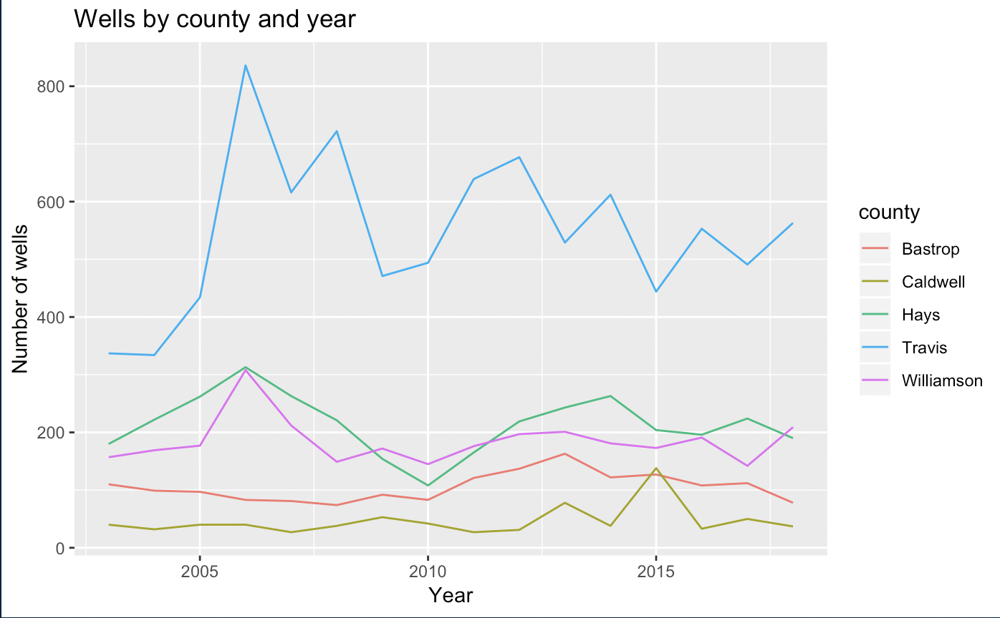

# Chart examples

> Under construction

This will be a annotated list of chart code and examples from this book. It does not include the construction of the data frame used in the plot. (I'll try to go back and add links.)

## Bar charts

```r
ggplot(wells_by_county, aes(x = county, y = wells_count)) +
  geom_bar(stat = "identity") +
  geom_text(aes(label=wells_count), vjust=-0.45) +
  labs(title = "Wells by county", x = "", y = "Number of wells drilled")
```


### Explanaton

- This is a `geom_bar()` using `stat="identity"`. See below for a similar one using `geom_col()` which assumes the identity of the category.
- The `geom_text()` line adds the numbers to the top of the bars. `vjust` moves those number up vertically.
- The `labs()` add the title and modifies the `x` and `y` labels. The `x` value is set to blank because the county labels on the bar is enough.

## Column chart

This is the same as above, but using `geom_col` which inheriently understands the `stat="identity"` problem.

```r
ggplot(wells_by_county, aes(x = county, y = wells_count)) +
  geom_col() +
  geom_text(aes(label=wells_count), vjust=-0.45) +
  labs(title = "Wells by county", x = "", y = "Number of wells drilled")
```

It looks the same as above, and is probably the better choice.


## A line chart

```r
ggplot(wells_county_year, aes(x=year_drilled, y=wells_drilled)) +
  geom_line(aes(color=county)) +
  labs(title = "Wells by county and year", x = "Year", y = "Number of wells")
```

{width=500px}

### Explanation

- A `geom_line()` needs either a `group=` or a `color=` to "split" the lines on a category across the graphic. This example does this by setting a specific `aes()` color value in the `geom_line()` call.
- In this example, the title and pretty x and y labels are added with `labs()`

## Scatterplot

```r
ggplot(mpg, aes(x = displ, y = hwy)) +
  geom_point(aes(color = class)) + # added color aesthetic
  geom_smooth()
```


### Explanation

- This plot uses the `mpg` data ggplot. It is comparing `displ` (the size of an engine) to `mpg`, the miles per gallon of the car.
- The `goem_point()` adds a new aesthetic to color the dots based on another value in the data, the `class`.
- The `geom_smooth()` plot adds a line showing the average of the points at each position. This helps you determine if there is a relationshiop between the two variables.

## Creating interactivity with plotly

This requires a library in addition to the tidyverse called `library(plotly)`. The idea is that you:

- create a ggplot graphic.
- save that entire graphic to a new R variable.
- Call the `ggplotly()` function with that new variable.

```
saved_plot <- wells_county_year %>%
  ggplot(aes(x = year_drilled, y = wells_drilled, color = county)) + 
  geom_line() +
  geom_point() +
  labs(title = "Wells drilled per county" )

# shove into ggploty
ggplotly(saved_plot)
```

This screen shot is not interactive, but you can see the hover tool tip displayed.


