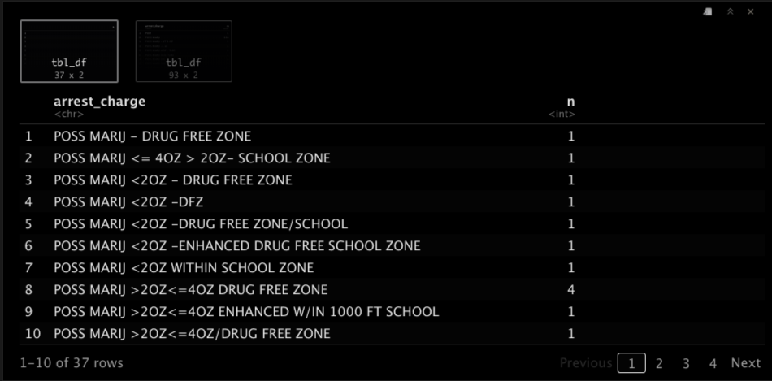
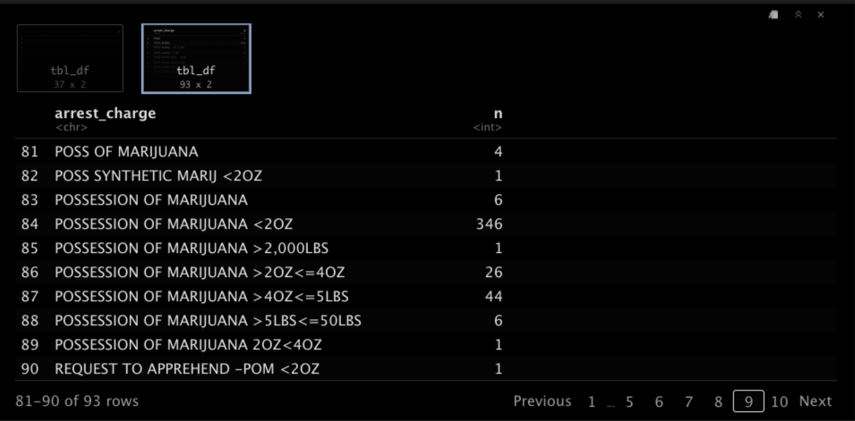

# Cleaning {#cleaning}

## IN MID-UPDATE

- include section on clean code and advanced tips. naming chunks. good indents. good markdown. tips for the navigation dropdown. keyboard command review. Restart and run.
- recode
- case_when

---

```{r setup, include=FALSE}
# hidden setup
library(tidyverse)
library(janitor)
library(readxl)
library(lubridate)
data <- read_rds("data-processed/06-chapter-output.rds")
```


In this chapter we are continuing with our "arrests" project in the `01-import.Rmd` notebook. We'll use some cleaning techniques to prepare our data for analysis later in a different notebook.

## Goals for this section

- Recap good coding practices and build on them.
- Create a `race_simplified` column using `recode()`.
- Create a cleaned `arrest_charge` column.
- Export data for next notebook.

### Resources

> Update these resources or kill it since I link within the text.

- [Strings](https://r4ds.had.co.nz/strings.html) chapter from Hadley Wickham's book, specifically about [`str_replace()`](https://r4ds.had.co.nz/strings.html#replacing-matches).
- [RDocumentation](https://www.rdocumentation.org/packages/stringr/versions/1.3.1/topics/str_replace) on `str_replace()`.
- [stringr cheatsheet](https://github.com/rstudio/cheatsheets/raw/master/strings.pdf).

## Explain thyself

Throughout this notebook, we want to explain our thoughts and goals in Markdown. You want to write these concepts out for collaborators or others who might read your work, but your future self is your first, best audience.

- Organize sections of your notebook with headlines. Write about the goal of each section.
- Each code block in the section should have a human readable explanation of the goal or task.
- Name your chunks.
- Use `#` comments in your code if you need more clarity.

- Go back and update your notebook with these things if you don't have them already.

## Syntax etiquette

You might have noticed when I write code in R, I add returns and indent code to keep it readable. I usually pipe ` %>% ` to a new line unless I have just one pipe. If I have a list of items within a function, I might put each item on a new line so they are easier to read. 

One thing you want to do is make sure no one line is too long. A good place to start adding returns to shorten a line (or nesting it) is within a function. The nested code should be indented one tab stop. RStudio helps you set tabs when you hit return, but you might need to clean up your code as you go along.

This code chunk we've already written includes a lot of these concepts, including some comments to help me understand my code later. Comments like this can be on a line of their own or at the end of a line.

```r
data <- read_excel(
    # breaking up read_excel to make shorting line
    "data-raw/APD_marijuana_arrests_2016-2020_data.xlsx",
    sheet = "Results",
    col_types = c(
      # putting values on own lines for readability
      "text",  # key
      "guess", # date
      "guess", # charge
      "guess", # race
      "guess", # sex
      "guess", # location
      "text",  # zip
      "guess", # x coordinate
      "guess"  # y coordinate
    )
  ) %>% clean_names()
```

- Go back through your code chunks and make sure the syntax is clean.

## Recode the `apd_race` column

We're going to create a simplified race column by "recoding" the values from the `apd_race` column. We'll create a smaller set of races, combing some into "other".

First, let's review the `apd_race` values:

```{r race-look}
data %>% count(apd_race)
```

Let's rename everything that isn't Asian, Black, Hispanic or White as Other. We need to make a note (in Markdown!) that we are including the Unknowns in Other and include a note with any graphic or analysis we do later.

We are creating a new column (and avoid writing over an existing column) so we can keep the old one if we perhaps want to look at the more specific race/ethnicities. We'll also port the results into a new data frame `data_race` in case we need to get to the original data for any reason.

We are using two functions here to accomplish this: We use `mutate()` to create the column and we name the new columns `race_simple`. The values for that are filled with the `recode()` function that lists the existing value first, then the new values (which is kinda opposite from mutate, where we name the new item first).

`mutate()` works like this:

```r
df %>% 
  mutate(
    new_col_name = data_to_draw_from
  )
```

And `recode()` works like this (but we will use this were `data_to_draw_from` is in our mutate).

```r
recode(
  "Old Value" = "New Value"
)
```

This is like a "search and replace" for a value within a column.

As we recode our new column we'll leave out "ASIAN", "BLACK", and "WHITE" because we aren't changing them. I'm recoding "HISPANIC OR LATINO" to just "HISPANIC" for simplicity and graph labels used later.

- Read over the code below to understand what is going on, then try to write it yourself without looking back. Run the code and if there is an error, read that first and try to figure it out.

> The completed code is below, but know I wrote it in stages. Sometimes I'll write part of the code first and make sure it works. I might write the mutate part and just fill `race_simple` from `apd_race` to make sure it works, then edit that to add the `recode()` step. I might not assign the data to a new data frame until I work out all the functions. It's a process. Below I just have the finished product. I used a count using both columns to check my work.

```{r race-recode}
data_race <- data %>% 
  mutate(
    race_simple = recode(apd_race,
      "AMERICAN INDIAN/ALASKAN NATIVE" = "OTHER",
      "HAWAIIAN/PACIFIC ISLANDER" = "OTHER",
      "HISPANIC OR LATINO" = "HISPANIC",
      "MIDDLE EASTERN" = "OTHER",
      "UNKNOWN" = "OTHER",
    )
  )

# peek at the results
data_race %>%
  count(
    apd_race, race_simple
  )
```

And now I can look just at the new column to get an idea of the simplified race breakdown.

- Add this chunk to your notebook.

```{r race-simple}
data_race %>% count(race_simple)
```

The `race_simple` column was added to the end of the data frame. If you look at your environment, `data_race` has 10 columns vs 9 for `data`.

## Filter out data we don't need

Cleaning up the `arrest_charge` column is more complicated and we need to talk about our goals first. Let's look again at the different `arrest_charge` values.

- Add this count to your notebook

```{r charge-look}
data_race %>% 
  count(arrest_charge) %>% 
  arrange(n %>% desc())
```

In your notebook you'll be able to page through the results and you can see they are a mess. (This published page doesn't paginate the results.)

### About marijuana charges

Understanding what these charges are is important to the story. We only care about Class B Possession charges, which are under 2 ounces. (Class A is between 2 and 4 ounces.) We also need to be aware of Drug Free Zone (or DFZ) charges as those are "enhanced" to a higher charge, so we want to exclude those. We also want to exclude Delivery charges and anything not marijuana. Lastly, we also want to remove charges that include "request to apprehend" as in that case the police were looking for the suspect on a different charge.

So, in short, we only want charges under 2OZ without Drug Free Zone.

**This will be a process!** We'll build filters and sometimes use `count()` to check the results before creating new data frames with the filtered data.

### Filter out delivery charges

Before we can remove data, we need to make sure we can find it properly. As you page through the charges results above, you'll see some rows have "DEL" in the charge description. We will use `filter()` (which we've used in the Transform chapter) and `str_detect()` to find these records, review them, and then "negate" the filter so they are NOT included.

- Create a new chunk called "filter-del" and include the following code. I explain it afterward.

```{r filter-del}
data_race %>% 
  filter(
    str_detect(arrest_charge, "DEL") 
  )
```

The `filter()` selects data based on a set of rules we give it. In the past, we fed the function a column name and a value to look for. This time we are feeding is a function `str_detect()` which takes two values: The column to look in, and then the text we are looking for. This method will find the text no matter where it appears within the field.

There are 27 results. As you page through these results you'll see all the rows that have DEL in it, including some that have POS like "MANF/DEL-POSS MARIJ <= 4OZ > 2OZ". That's OK If it is a delivery, we don't want it.

Now we add the "negate" option of `!` before the `str_detect` so we get all the rows **except** those with "DEL".

- Update your "filter-del" chunk to add `!` right before the `str_detect` and run it.

```{r filter-del-negate}
data_race %>% 
  filter(
    !str_detect(arrest_charge, "DEL")
  )
```

Now we'll assign that filter to a new data frame. Some folks might consider this overkill and just reassign the cleaned data to the existing `data_race` tibble. This can get confusing if you make changes up and down your notebook, so I like to create new tibbles with my changed data.

- Update your "filter-del" chunk to assign the results to a new tibble, `data_nodel`.

```{r data-nodel}
data_nodel <- data_race %>% 
  filter(
    !str_detect(arrest_charge, "DEL")
  )
```

If you look at your environment you'll see the `data_nodel` data has 27 fewer observations than the `data` tibble, the same number or records you got in your original filter. This is good!

### Remove controlled substance

If you look at the charges again, you'll see some other charges that are NOT related to marijuana. These are "controlled substance" charges. We don't want them.

```{r chg-look}
data_nodel %>% 
  count(arrest_charge)
```

We want to remove all the cases with "CS" in the `arrest_charge` field.

- Use the same technique that we used for DEL to remove the CS records and assign the results to a new dataframe `data_nocs`. Try it on your own before looking at the answer below.

<details>
  <summary>Try it first! Click to reveal answer.</summary>
  
```r
data_nocs <- data_nodel %>% 
filter(
  !str_detect(arrest_charge, "CS")
)
```
</details>


```{r filter-cs-hidden, include=FALSE}
data_nocs <- data_nodel %>% 
  filter(
    !str_detect(arrest_charge, "CS")
  )
```


### Remove drug free zones

Our next move is to remove all the records that have a drug free zone enhancement. Let's look at the charges data once again using `count()`.

- Create a new chunk called "dfz-count" and use our `data_nocs` tibble to count `arrest_charge` values.

```{r dfz-count}
data_nocs %>% 
  count(arrest_charge)
```

As you look through the results, you'll see the drug free zone designation is handled many different ways: DFZ, DRUG FREE ZONE, SCHOOL ZONE, etc. This might take some trial and error.

We will use `str_detect()` again, but we need to search for multiple terms and we want to make sure the filter works as expected. So we'll create a variable `dfz_terms` which will include a list of terms we want to search, using some [regular expressions](https://regexone.com/). We also use our `count()` function to check our results.

> Regular expressions are a powerful pattern matching concept that can get a little complicated. We'll take them slow and only use what we need to get our results.

- Start a new chunk called "dfz-filter" and set it up like the code below and run it. I'll explain what is going on below.

```r
dfz_terms <- c("DFZ|SCHOOL|DRUG")

data_nocs %>% 
  filter(str_detect(arrest_charge, dfz_terms)) %>% 
  count(arrest_charge)

data_nocs %>% 
  filter(!str_detect(arrest_charge, dfz_terms)) %>% 
  count(arrest_charge)
```

This code gives you two sets of results. I'm giving you screen shots because this published page doesn't behave the same way.

The first has the results that include the terms we are looking for:



Then second set shows the terms that DON'T have our terms because we negated them:



Now let me explain the code.

The first line creates a variable of terms to use in our string detect: "DFZ|SCHOOL|DRUG". The pipe `|` is a "regular expression" that means "or". So when we use this list in our `str_detect()` function we are looking for DFZ or SCHOOL or DRUG.

I set this up like this so we can use the same list of terms to look at the filter that contains the terms and look at a filter that negates the terms. It's the same concept we used for deliveries and controlled substances, but we create the search term in a variable so we can double-check to make sure we are getting the results we want.

```{r dfz-terms-hidden, include=FALSE}
dfz_terms <- c("DFZ|SCHOOL|DRUG")
```

Now that we know our terms are good and we are getting the results we want, we can build a new data table using a negated `str_detect` using those same terms.

- Create a new chunk that assigns the result of a filter negating the dfz_terms. Call the new tibble `data_nodfz`). Use the hint below only if you can't figure it out. Remember, you don't need the count() anymore, just the filter. You should end up with 7672 observations.

<details>
  <summary>Click here for the answer</summary>

```{r filter-dfz}
data_nodfz <- data_nocs %>% 
  filter(!str_detect(arrest_charge, dfz_terms))
```

</details>

### Remove request to apprehend

Use the same method as above to remove any records that have "REQUEST" or "RTA". Remember to start from your new `data_nodfz` tibble and name your new one `data_norta`. You should end up with 7665 observations.

<details>
  <summary>Try it first!</summary>
```r
rta_terms <- c("REQUEST|RTA")

# dfz results
data_nodfz %>% 
  filter(
    str_detect(arrest_charge, rta_terms)
  )

# no dfz results
data_nodfz %>% 
  filter(
    !str_detect(arrest_charge, rta_terms)
  ) %>% 
  count(arrest_charge)

# make new data frame
data_norta <- data_nodfz %>% 
  filter(
    !str_detect(arrest_charge, rta_terms)
  )
```
</details>

```{r filter-rta-hidden, include=FALSE}
rta_terms <- c("REQUEST|RTA")
data_norta <- data_nodfz %>% 
  filter(
    !str_detect(arrest_charge, rta_terms)
  )
```

### Removing more unwated records

This charge code really is a mess. There are some other things we can remove before getting to our main challenge of finding only charges of <2OZ. There are some codes used in the charges that we know we don't want, like `(MA)` for an A Misdemeanor, and `(FS)` for a state felony, and `(F3)` for 3rd degree felony. This is tricky because we can't remove all "MA" text because that would catch "MARIJUANA", too. We have to include the parenthesis `(MA)`, and that can be tricky in regular expressions (aka regex). The parenthesis is a special character in regex so we have to "escape" it to use it as a character. Even more confusing, [when using R we have to double-escape](https://stringr.tidyverse.org/articles/regular-expressions.html#escaping) it. This is much too confusing to get into in detail here, so this filter is a "gimmie".

We'll also remove any row that has a charge with "LB" because that definitely is more than 2 OZ.

- Add this chunk to your project and run it.

```{r}
# list escapes ( to get (MA), etc
fs_list <- c("\\(MA\\)|\\(FS\\)|\\(F3\\)|LB")

# checks the catch list
data_norta %>% 
  filter(
    str_detect(arrest_charge, fs_list)
  ) %>% 
  count(arrest_charge)

# checks the negate
data_norta %>% 
  filter(
    !str_detect(arrest_charge, fs_list)
  ) %>% 
  count(arrest_charge)

# does the deed
data_nofs <- data_norta %>% 
  filter(
    !str_detect(arrest_charge, fs_list)
  )

```

You now have `data_nofs` tibble, which we'll continue with.

## Finding just B misdemeanors

>> THIS IS WHERE I STOPPED LAST.

We've removed a lot of crap, but now we have the hard part. How do we get just B misdemeanors while dealing with some obvious data coding errors?

> attempts to get to just b mis

```{r}
mb_list <- c("< *2")

data_nofs %>% 
  filter(
    str_detect(arrest_charge, mb_list)
  ) %>% 
  count(arrest_charge)

data_nofs %>% 
  filter(
    !str_detect(arrest_charge, mb_list)
  ) %>% 
  count(arrest_charge)
```


## Export your updated data frame

> Export into data-processed


