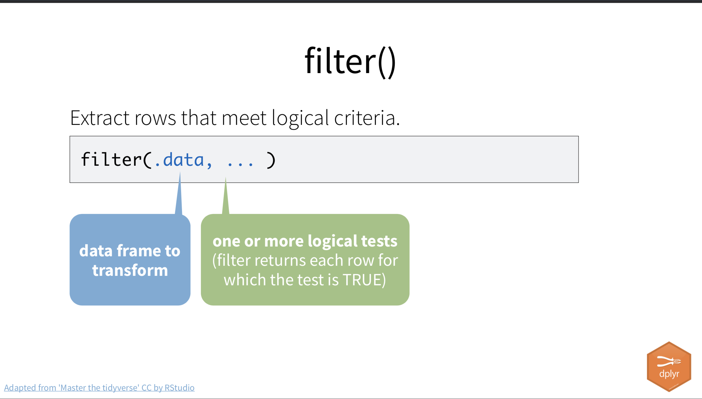
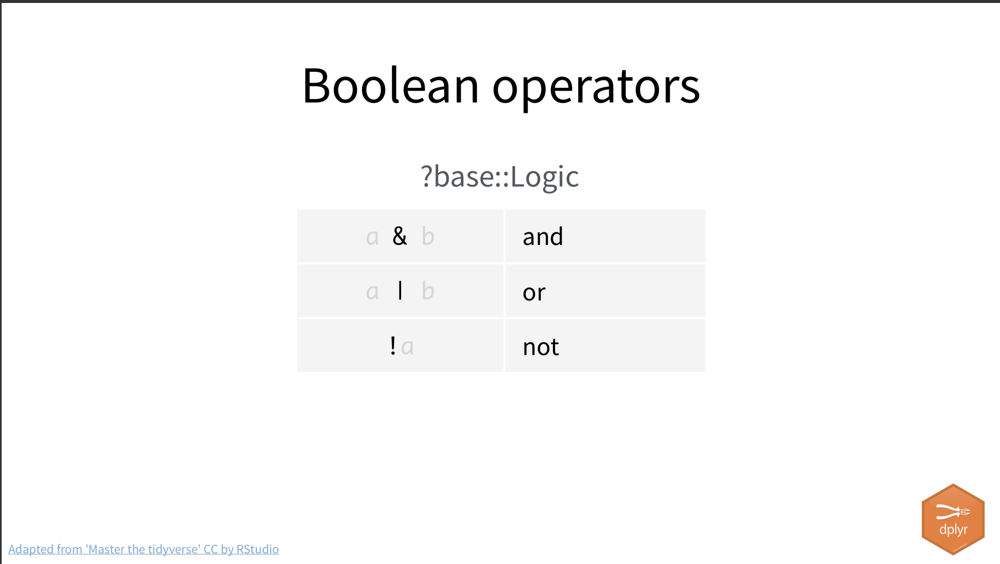

# Transform {#sped-transform}

> MID-UPDATE v1.0

## Rewite tasks

- Return to fill in story gaps

## Goals for the section

In this lesson we will continue with the Special Education project you began in the last chapter. Our goals are:

- To build good data journalism and programming practices.
- Use the [dplyr](https://dplyr.tidyverse.org/) tools to select, filter, sort and create new columns of data with mutate. You might [read this article](https://dplyr.tidyverse.org/articles/dplyr.html) to get an idea.

## Introducing dplyr

One of the packages within the tidyverse is [dplyr](https://dplyr.tidyverse.org/). Dplyr allows us to transform our data frames in ways that let us explore the data and prepare it for visualizing. It's the R equivalent of common Excel functions like sort, filter and pivoting.

> There is a cheatsheet on the [dplyr](https://dplyr.tidyverse.org/) that you might find useful. 

{width=500px}

(Some slides/images included here are used with permission from Hadley and Charlotte Wickham.)

## Start a new R Notebook

As I explained at the end of our last lesson, it's a good practice to separate your downloading/import code from your other notebooks. We are creating a new notebook to handle all our computations, too, in case we want to do different analysis in different notebooks going forward.

- Open your special-ed project if you haven't already.
- Make sure the `01-import.Rmd` file is closed.
- Under the **Session** menu in RStudio, choose _Restart R_. This cleans our environment so we don't have left-over objects from our previous session, though you still might see history in your Console.
- Create a new R Notebook and set a new title of "Special education computations".
- Remove the boilerplate language and add a description of our goals: To explore an analyze our school ratings data. Mention that you have to run the other notebook first in case your someone else (or your future self) comes here first.
- Save your file as `02-computations.Rmd`.

## Record our goals

One thing I like to do at the top of a notebook is outline what is I'm trying to do.
What do we want to learn about these school ratings?

- Add a Markdown headline `## Goals`.
- Create a bullet list of things you might want to find. Use a `*` or `-` to start each new line.

```text
- Which campus gained the most (count difference) special education students from 2015 to 2020?
- Which campus has the highest share (percent) of special education students in 2020?
- Which campus had the greatest change in share of in special education students between 2015 and 2020.
- How many AISD schools would be above the special education "audit threshold" of 8.5% in 2020 if it were still in effect? How does those numbers compare to 2015?

We will filter our list to focus on "Regular Instructional" schools to exclude alternative, disciplinary or schools part of the justice system.
```

We will filter our list to focus on "Regular Instructional" schools to exclude alternative, disciplinary or schools part of the justice system.

## Setup

The first code chunk in every notebook should be a listing of all the packages used. We put them at the top so users can see if they need to install the packages. For now, we need the tidyverse and janitor packages (which I include in every notebook).

- Create a new Markdown headline `## Import`
- Add a new code chunk (**Cmd-Shift+i**!)
- Add the tidyverse and janitor libraries
- Run the chunk

```{r setup, echo=T, results='hide', message=F, warning=F}
library(tidyverse)
library(janitor)
```

### Naming our chunks

It is good practice to name your chunks of code to make it easier to navigate throughout your R notebook. Let's do this with our setup chunk.

- In your setup chunk, change `{r}` to `{r setup}`:

```text
{r setup}
library(tidyverse)
```

(You have to imagine the three tickmarks that begin/end the code chunk above. I can't display those in the instructions.)

You can't have multi-word names. You must use a `-` or `_`, like `multi-word`.

By doing this, you can then use the notebook navigation to move to different parts of your RNotebook.

{width=400px}

 > The `{r}` part of a chunk can take a number of options in addition to a name, controlling what is displayed or knitted to your final report. We aren't going to get into it now, but you might see it in other notebooks or my code.

## Import our data

- Add a Markdown headline and description that you are loading the data.
- Add a code chunk and give it a name of **import**. Add the code below and then run the chunk:

```{r read}
sped <- read_rds("data-processed/01_sped.rds")

sped %>% glimpse()
```

What we've done is import the data we processed at the end of our **01-import.Rmd** notebook and assigned it to a data frame called `sped` and glimpsed it for reference.

We are now back to where we ended with the first notebook.

## Explore instruction type

Our first task is to filter our data to remove any schools not rated by normal standards, like disciplinary schools and the like. Before we do this, we'll do a quick exploration of the data available in the `instruction_type`  field using `count()`. This is a "summarize" concept that we'll cover more in the next chapter, but it is super useful so we'll touch on it here.

- Create a Markdown section with a headline and text that you are exploring instruction_type.
- Add a code chunk and name it "explore-type".
- Add this code and run it, then I'll explain it.

```{r explore-type}
sped %>% 
  count(instruction_type)
```

What you've done here is very similar to a pivot table in Excel where you count the rows based on values.

- We start with the data frame
- We pipe into the function `count()`
- We feed count the column name where we want to count the records by value.

The `n` column is the number of rows. We'll talk more about `count()` and other summary functions in the next chapter. It is super useful to peek at your data and use it to check filters and such.

## Filter()

We can use dplyr's `filter()` function to capture a subset of the data, like our "REGULAR INSTRUCTIONAL" schools. It works like this:

{width=500px}

> IMPORTANT: When you see a slide like the one above, please note that `.data` might be the data that you have piped ` %>% ` into the function. In fact, it usually is.

Let's put this into practice.

### Filter for Regular Instructional schools

From or count we know there are four types of schools: ALTERNATIVE INSTRUCTIONAL, DAEP INSTRUCTIONAL, JJAEP INSTRUCTIONAL and REGULAR INSTRUCTIONAL. Now that we know what the "regular" schools are called, we can build a filter to find them.

- Add a header `## Filter fun` to your notebook.
- Add text that you filtering for regular schools.
- Add a chunk, insert and run the following:

> The first box shown here is the code. The second is the result. The result is prettier in RStudio.

```{r filter}
sped %>% 
  filter(instruction_type == "REGULAR INSTRUCTIONAL")
```

When you run this, you'll see we now have only that you the about 7,372 rows instead of the 8,002 that we started with, and that also matches our "count" from above.

The arguments inside the `filter()` function work in this order:

1. What is the column (or variable) you are search in.
2. What is the logical test. In our case above we are looking for matches.
3. What is the value (or observation) you are looking for.

Note the two equals signs `==` there. It's important to use two of them when you are looking for "equal", as a single `=` will not work, as that means something else in R.

### Logical tests

There are a number of these logical test operations:

{width=500px}

### Common mistakes with filter

Some common mistakes that happen when using filter.

#### Use two == signs for "true"

DON'T DO THIS:

```r
sped %>% 
  filter(district_name = "AUSTIN ISD")
```

DO THIS:

```r
sped %>% 
  filter(district_name == "AUSTIN ISD")
```

#### Forgetting quotes

DON'T DO THIS:

```r
ratings %>% 
  filter(grade_range == 09-12)
```

DO THIS:

```r
ratings %>% 
  filter(district_name == "09-12")
```

## Combining filters

You can filter for more than one thing at a time by using an operator: `&`, `|`. `!`.

- Edit your existing code block to following code block and run it.
- Then look at the code and the result and then **write out what the filter is doing in your own words**.

```{r filter-combine}
sped %>% 
  filter(
    instruction_type == "REGULAR INSTRUCTIONAL",
    charter_type %>% is.na()
  )
```

We rewrote the first filter to indent it differently so it was more clear that we have **two logical tests** here. The second test has a nested function, testing the `charter_type` field to see if it is blank, or `is.na()`, which is a special case. We could have written this line as `is.na(charter_type)`.

If you use a comma `,` or ampersand `&` to separate two tests, then both of them have to be true. If you want OR, then you use a bar character `|` (the shift-key version of the backslash, above the Return key. That `|` is also sometimes referred to as a pipe character, but I'll call it "bar" since we also have the ` %>% `.)

{width=500px}

### Common mistakes with combining filters

Some things to watch when trying to combine filters.

#### Collapsing multiple tests into one

DON'T DO THIS:

```r
sped %>% 
  filter(district_name == "AUSTIN ISD" | "BASTROP ISD")
```

DO THIS:

```r
sped %>% 
  filter(district_name == "AUSTIN ISD" | district_name =="BASTROP ISD")
```

BUT EVEN BETTER:

```r
# Adding in Hays to the list as well
sped %>% 
  filter(district_name %in% c("AUSTIN ISD", "BASTROP ISD", "ROUND ROCK ISD"))
```

If you want to combine a series of strings in your filter, you have to put them inside a "concatenate" function, which is shortened to `c()`, as in the example above. We'll end up using this a lot.

## Select()

When we were preparing our CSTUD data we used the [`select()`](https://dplyr.tidyverse.org/reference/select.html) function to select or exclude specific columns. We need to append to the filter we've been using to remove the `instruction_type` and `charter_type` columns now that we are done with them.

In the filter code chunk you've been building, modify it i the following ways:

- Add a select function and remove the `charter_type` and `instruction_type` columns.
- Assign the result to a new data frame called `sped_reg`.
- Print the data frame to the screen so you can poke around.

```{r select-remove}
sped_reg <- sped %>% 
  filter(
    instruction_type == "REGULAR INSTRUCTIONAL",
    charter_type %>% is.na()
  ) %>% 
  select(-charter_type, -instruction_type)

sped_reg
```

Note there are some other really cool ways to use select.

Here is an example capturing columns that end with "_name". (The `head()` function just gives us the first few rows of data since we don't need to show the whole data set.)

> You don't have to do this ... I'm just showing you.

```{r}
sped_reg %>% 
  select(ends_with("_name")) %>% 
  head()
```

## How to describe the change

Now that we have all our data in the same data `sped_reg`, we can use create new columns compare the different years. Before we get into how, let's talk about describing change.

We have two values for each year to work with: The "Count" of special education -- `spec15` and `spec20` -- which is the actual number of students in the program; and the "Percentage" of students in special education out of the total in that school -- `spep15` and `spep20`.

We want to describe the change from one year to the next. You might review the Numbers in the Newsroom chapter on Measuring Change (p26) for further study. Here are some examples:

### Describing the count changes

- We can show the **simple difference** (or actual change) in the *count* of students from one year to the next. We'll assume there were `4` students in 2015 and `10` in 2020:
  - `New Count - Old Count = Simple Difference`.
  - Example: `10 - 4 = 6`.
  - "The school served six more special education students in 2020 (10 students) compared to 2015 (four students)".
- We can show the **percent change** in the *count* of students from one year to the next:
  - `((New Count - Old Count) / Old Count) * 100 = Percent change`.
  - Example: `((10 - 4) \ 4) * 100 = 150%`.
  - "The number of special education students served increased 150% from four in 2015 to 10 in 2020."

### Describing percentage differences

We also have the *percentage* of special education students in the school, which could be important. This is the share of students that are in the program compared to the total students in the school.

- We can find the **percentage point difference** from one year to the next using simple difference again, but we have the describe the change as the difference in percentage points:
  - `New Percentage - Old Percentage = Percentage Point Difference`.
  - Example: `15.5% - 11% = 4.5 percentage points` (NOT 4.5%).
  - "The share of students in special education grew by 4.5 percentage points, from 11% in 2015 to 15.5% in 2020."
- We can find the **percent change of share** from one year to the next, but we have to again be very specific about what we are talking about ... the growth (or decrease) of the _share_ of students in special education.
  - `((New Percentage - Old Percentage) / Old Percentage * 100) = Change in share of students`.
  - Example: `((15.5 - 11) / 11) * 100 = 40.9`.
  - "The share of students in special education grew 40% from 11% of students in 2015 to 15.5% of students in 2020." This describes the growth in the share of students in the program, not the number of special education students overall.

Describing a "percentage point difference" to readers can be difficult, but perhaps less confusing than describing the "percent change of a percent".

Great, so which do we use for this story? That depends on what you want to describe. Schools that have fewer special education students to begin with will show a more pronounced percent change with any fluctuation. Then again, a school that has a large percentage of students could be gaining a lot of students with a small percentage change. In the end, we might need to use all of these values to describe different kinds of schools. We are talking about human beings, so perhaps the counts are important.

## Mutate()

The [mutate()](https://dplyr.tidyverse.org/reference/mutate.html) function allows us to change a column of data or create new columns based on others. We can do calculations across columns or change data types. It is useful in calculations and cleaning data.

For our Special Education data we need to create several calculations.

### Simple change of counts

To create a column showing the number of students up or down from 2015 to 2020, we use a simple difference between our columns.

Let's set up a new data frame to hold our calculations with a glimpse so we can view them as we go along.

Remember from our preparation steps, mutate works like this:

1. first name the new column
2. set it to `=` the new value
3. specify what the new result should be

```{r}
sped_calcs <- sped_reg %>% 
  mutate(
    # simple difference
     sped_c_diff = sped_c_20 - sped_c_15
  )

sped_calcs %>% glimpse()
```

You can see the first value differences in the glimpse above: **34 - 37 = -3**. If that is difficult to see we could build a quick look to see just those columns:

```{r}
sped_calcs %>% 
  select(school_name, sped_c_15, sped_c_20, sped_c_diff) %>% 
  head()
```

You always want to check your mutates to make sure they work!

We will continue to build on our `sped_calc` data frame with new calculations.

### Calculate percent change

For this calculation we have the more complex task of the percent-change math. We also have to round the result to a readable number, accomplished by piping the math result into the `round_half_up()` function, which takes the argument of how many places to round the result.

- Modify your calculations to include the `sped_c_prccng` result:

```{r}
sped_calcs <- sped_reg %>% 
  mutate(
    # simple diff
    sped_c_diff = sped_c_20 - sped_c_15,
    # percent change
    spec_c_prccng = ((sped_c_20 - sped_c_15) / sped_c_15 * 100) %>% round_half_up(1),
    # simple diff of percent
  )

sped_calcs %>% glimpse()
```

Check your math: **((34 - 37) / 37 * 100) = 8.108**.

### Calculate percentage point difference

This is another simple difference, but this time with the percentage fields.

```{r}
sped_calcs <- sped_reg %>% 
  mutate(
    # simple diff
    sped_c_diff = sped_c_20 - sped_c_15,
    # percent change
    sped_c_prccng = ((sped_c_20 - sped_c_15) / sped_c_15 * 100) %>% round_half_up(1),
    # simple diff of percent
    sped_p_ppd = sped_p_20 - sped_p_15
  )

sped_calcs %>% glimpse()
```

Again, check your work: **19.8 - 18.0 = 1.8**.

Remember, the challenge with using this value in writing is to couch it as **percentage point difference** and not a percentage or percent change.

### Calculating our special education threshold

As you may recall, the point of the Chronicle's story was that schools that had 8.5% or higher of special education students had to go through hoops, forcing schools to try to avoid putting students in these programs. The reason we are comparing 2015 data to 2020 is to see if there are more schools with higher percentages of special education students.

The way we'll do that is to create a "threshold" column for each year. We'll use `mutate()` to create a column that says "Y" if the school is at or above the threshold, and "N" if it is not. Once we do this for both years, we can use some summaries to count them.

This process will introduce [`case_when()`](https://dplyr.tidyverse.org/reference/case_when.html) which compares to the **IF=** function in Excel.

It works like this _within_ a mutate:

```r
new_column = case_when(
  test ~ "result_if_true",
  TRUE ~ "result_if_false"
)
```

If that last `TRUE` confuses you that it is the false answer, then yeah ... me too.

The power of this is you can add multiple test by adding more lines before the `TRUE` line, but we don't need that here.

- Update your `sped_calcs` code chunk to include both of our threshold cases.


```{r calcs}
sped_calcs <- sped_reg %>% 
  mutate(
    # simple diff
    sped_c_diff = sped_c_20 - sped_c_15,
    # percent change
    sped_c_prccng = ((sped_c_20 - sped_c_15) / sped_c_15 * 100) %>% round_half_up(1),
    # simple diff of percent
    sped_p_ppd = sped_p_20 - sped_p_15,
    # meets threshold 8.5% 2015
    sped15_thsh = case_when(
      sped_p_15 >= 8.5 ~ "Y",
      TRUE ~ "N"
    ),
    # meets threhhold 8.5% 2020
    sped20_thsh = case_when(
      sped_p_20 >= 8.5 ~ "Y",
      TRUE ~ "N"
    )
  )

sped_calcs %>% glimpse
```

And then, of course, check the result to make sure it is right. Again, if you are having trouble seeing it in the glimpse, then build yourself a new R chunk to show you columns germane to your inspection:

```{r calcs-inspect}
sped_calcs %>% 
  select(
    school_name,
    sped_p_15,
    sped15_thsh,
    sped_p_20
    , sped20_thsh
  ) %>% 
  head(20)
```


## Export your computations

We're going to export this data so we can use it in multiple notebooks going forward. It might be overkill in this case, but this will allow us to do future notebooks on different districts if we want.

- Build a new export chunk and use `write_rds()` to create a file `02_sped_calcs.rds`.

```{r export-calcs}
sped_calcs %>% 
  write_rds("data-processed/02_sped_calcs.rds")
```

Again, we saved our processed data away from the raw data. We used a number to match which notebook it came from, and we used a descriptive name so we know what is inside the file.

## More dplyr in next lesson

We have covered a lot in our last two lessons, including some of our [Basic Data Journalism functions](https://vimeo.com/showcase/7320305) of **select**,  **filter** and **join**, and we learned to create new variables with with **mutate**.

There are several more dplyr functions that we haven't used yet, but will in the next lesson: `arrange()`, `group_by()` and `summarize()`.
