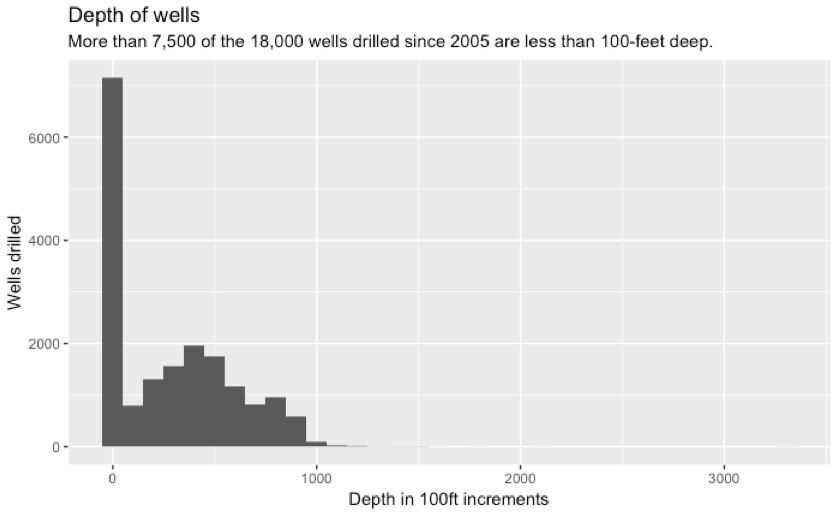
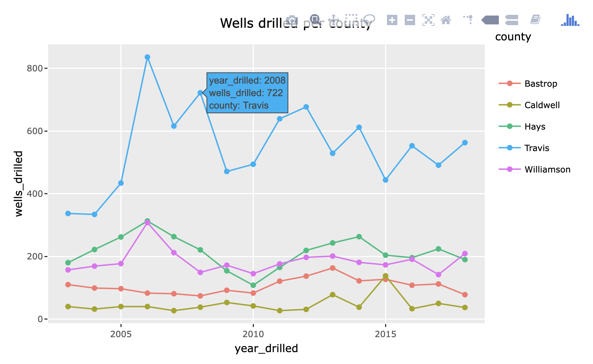

# Chart examples

## NEEDS REVIEW

> Under construction

--- 

This will be a annotated list of chart code and examples from this book. It does not include the construction of the data frame used in the plot. (I'll try to go back and add links.)

## Bar charts

```r
ggplot(wells_by_county, aes(x = county, y = wells_count)) +
  geom_bar(stat = "identity") +
  geom_text(aes(label=wells_count), vjust=-0.45) +
  labs(title = "Wells by county", x = "", y = "Number of wells drilled")
```


### Explanaton

- This is a `geom_bar()` using `stat="identity"`. See below for a similar one using `geom_col()` which assumes the identity of the category.
- The `geom_text()` line adds the numbers to the top of the bars. `vjust` moves those number up vertically.
- The `labs()` add the title and modifies the `x` and `y` labels. The `x` value is set to blank because the county labels on the bar is enough.

## Column chart

This is the same as above, but using `geom_col` which inheriently understands the `stat="identity"` problem.

```r
ggplot(wells_by_county, aes(x = county, y = wells_count)) +
  geom_col() +
  geom_text(aes(label=wells_count), vjust=-0.45) +
  labs(title = "Wells by county", x = "", y = "Number of wells drilled")
```

It looks the same as above, and is probably the better choice.


## A line chart

```r
ggplot(wells_county_year, aes(x=year_drilled, y=wells_drilled)) +
  geom_line(aes(color=county)) +
  labs(title = "Wells by county and year", x = "Year", y = "Number of wells")
```

{width=500px}

### Explanation

- A `geom_line()` needs either a `group=` or a `color=` to "split" the lines on a category across the graphic. This example does this by setting a specific `aes()` color value in the `geom_line()` call.
- In this example, the title and pretty x and y labels are added with `labs()`

## Scatterplot

```r
ggplot(mpg, aes(x = displ, y = hwy)) +
  geom_point(aes(color = class)) + # added color aesthetic
  geom_smooth()
```


### Explanation

- This plot uses the `mpg` data ggplot. It is comparing `displ` (the size of an engine) to `mpg`, the miles per gallon of the car.
- The `goem_point()` adds a new aesthetic to color the dots based on another value in the data, the `class`.
- The [`geom_smooth()`](https://ggplot2.tidyverse.org/reference/geom_smooth.html) plot adds a line showing the average of the points at each position. This helps you determine if there is a relationshiop between the two variables.

## Histogram

A histogram is a distribution of a number in your data. It's super useful in helping understand your data, but difficult to explain to readers.

We'll use the well's data column `borehole_depth` to explore this. The question is this: Are most wells shallow or deep? We can explore this with the histogram.

```r
wells %>% 
  ggplot(aes(x = borehole_depth)) +
  geom_histogram(binwidth = 100) +
  labs(title = "Depth of wells", subtitle = "More than 7,500 of the 18,000 wells drilled since 2005 are less than 100-feet deep.", y = "Wells drilled", x = "Depth in 100ft increments")
```

The histogram chart defaults to splitting into 30 even groups, but you can change that in a couple of ways.

- Using `bin = 40` will set a different number of bins.
- Using `binwidth = 100` will create bins based on your x value.

That yields this chart:



You can add labels to note the number of records in each bin with the `stat_bin()` function, which is a bit different than other ggplot functions. Here's an example in the last line of this plot:

```r
wells %>% 
  ggplot(aes(x = borehole_depth)) +
  geom_histogram(binwidth = 100) +
  labs(title = "Depth of wells", subtitle = "More than 7,500 of the 18,000 wells drilled since 2005 are less than 100-feet deep.", y = "Wells drilled", x = "Depth in 100ft increments") +
  stat_bin(binwidth = 100, geom="text", aes(label = ..count..), vjust=-.5)
```

## Titles, labels and other cleanup

Titles and labels are added as new layers on a graphic. These examples just show the line that adds the new layer.

### Title and axis labels

```r
yourchartsofar +
  labs(title = "Wells by county and year", x = "Year", y = "Number of wells")
```

### Flip the graphic

Sometime you want to turn a graphic 90 degrees to you can read long values, or make a bar chart horizontal instead of vertical.

```r
yourchartsofar +
  coord_flip()
```
### Fix exponential numbers on an axis

```r
yourchartsofar +
  scale_y_continuous(labels=comma)
```

You can do the same for `scale_x_continuous()` if needed.

## Interactivity with plotly

This requires a library in addition to the tidyverse called `library(plotly)`. The idea is that you:

- create a ggplot graphic.
- save that entire graphic to a new R object.
- Call the `ggplotly()` function with that new variable.

```
saved_plot <- wells_county_year %>%
  ggplot(aes(x = year_drilled, y = wells_drilled, color = county)) + 
  geom_line() +
  geom_point() +
  labs(title = "Wells drilled per county" )

# shove into ggploty
ggplotly(saved_plot)
```

This screen shot below is not interactive, but you can see the hover tool tip displayed.



## Resources

In addition to the examples below, you might also look at these resources:

- [The R Graph Gallery](https://www.r-graph-gallery.com/)
- [R Graphics Cookbook](http://www.cookbook-r.com/Graphs/)
- [Plotly R](https://plot.ly/r/), especially the [Plotly ggplot2 Library](https://plot.ly/ggplot2/)
- [ggplot themes]()https://ggplot2.tidyverse.org/reference/ggtheme.html and [R Graph theme list](https://www.r-graph-gallery.com/192-ggplot-themes/)

