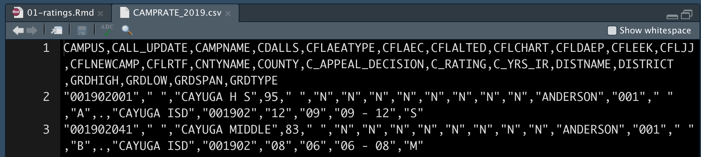

# Importing data {#import}

## Goals for this section

- Learn a little about data types available to R.
- Practice organized project setup.
- Learn about R packages, how to install and import them.
- Learn how to import CSV files.
- Introduce the Data Frame/Tibble.

We will do this through working with School Ratings data from the Texas Education Agency (the same data we used with the Sheets lesson.) We'll download the data again.

## Data types

After installing and launching RStudio, the next trick is to import data. Depending on the data source, this can be brilliantly easy or a pain in the rear. It all depends on how well-formatted is the data.

In this class, we will primarily be importing Excel files, CSVs (Comma Separated Value) and APIs (Application Programming Interface).

- CSVs are a kind of lowest-common-denominator for data. Most any database or program can import or export them.
- Excel files are good, but are often messy because humans get involved. There often have multiple header rows, columns used in multiple ways, notes added, etc. Just know you might have to clean them up before using them.
- APIs are systems designed to respond to programming. In the data world, we often use the APIs by writing a query to ask a system to return a selection of data. By definition, the data is well structured. You can often determine the file type of the output as part of the API call, including ...
- JSON (or JavaScript Object Notation) is the data format preferred by JavaScript. R can read it, too. It is often the output format of APIs, and prevalent enough that you need to understand how it works. We'll get into that later in semester.

Don't get me wrong ... there are plenty of other data types and connections available through R, but those are the ones we'll deal with most in the class.

### What is clean data

The Checking Your Data section of this [DataCamp tutorial](https://www.datacamp.com/community/tutorials/r-data-import-tutorial) has a good outline of what makes good data, but in general it should:

- Have a single header row with well-formed column names.
    + One column name for each column. No merged cells.
    + Short names are better than long ones.
    + Spaces in names make them harder to work with. Use and `_` or `.` between words.
- Remove notes or comments from the files.
- Each column should have the same kind of data: numbers vs words, etc.
- Each row should be a single thing called an "observation". The columns should describe that observation.

## Create a new project

We did this in our first lesson, but here are the basic steps:

- Launch RStudio
- Use the `+R` button to create a **New Project** in a **New Directory**
- Name the project `yourfirstname-school-ratings` and put it in your `~/Documents/rwd` folder.
- Use the `+` button to use **R Notebook** to start a new notebook.
- Change the title to "TEA School Ratings".
- Delete the other boilerplate text.
- Save the file as `01-ratings.Rmd`.

### The R Package environment

We have to back up from the step-by-step nature of this lesson and talk a little about the R programming language.

R is an open-source language, which means that other programmers can contribute to how it works. It is what makes R beautiful.

What happens is developers will find it difficult to do a certain task, so they will write an R "Package" of code that helps them with that task. They share that code with the community, and suddenly the R garage has an ["ultimate set of tools"](https://youtu.be/Y1En6FKd5Pk?t=24) that would make Spicoli's dad proud. 

One set of these tools is Hadley Wickham's [Tidyverse](https://www.tidyverse.org/), a set of packages for data science. These are the tools we will use most in this course. While not required reading, I highly recommend Wickham's book [R for data science](https://r4ds.had.co.nz/index.html), which is free. We'll use some of Wickham's lectures in the course.

There are also a series of useful [cheatsheets](https://www.rstudio.com/resources/cheatsheets/) that can help you as you use the packages and functions from the tidyverse. We'll refer to these throughout the course.

### Installing and using packages

There are two steps to using an R package:

- **Install the package** using `install.packages("package_name"). You only have to do this once for each computer, so I usually do it using the R Console instead of in notebook.
- **Include the library** using `library(package_name)`. This has to be done for each Notebook or script that uses it, so it is usually one of the first things in the notebook.

We're going to install several packages we will use in the ratings project. To do this, we are going to use the **Console**, which we haven't talked about much yet.

{width=600px}

- Use the image above to orient yourself to the R Console and Terminal.
- In the Console, type in:

```r
install.packages("tidyverse")
```

As you type into the Console, you'll see some type-assist hints on what you need. You can use the arrow keys to select one and hit Tab to complete that command, then enter the values you need.

- If it asks you to install "from source", type `Yes` and hit return.

You'll see a bunch of response in the Console.

We'll need another package, so also do:

```r
install.packages("janitor")
```

We'll use some commands from janitor to clean up our data column names, among other things. A good reference to learn more is the [janitor vignette](https://cran.r-project.org/web/packages/janitor/vignettes/janitor.html).

You only have to install the packages once on your computer (though you have to load them every time, which is explained below).

### Load the libraries

Next, we're going to tell our R Notebook to use these two libraries.

- After the metadata at the top of your notebook, use *Cmd+option+i* to insert an R code chunk.
- In that chunk, type in the two libraries and run the code block with *Cmd+Shift+Return*.

This is the code you need:


```r
library(tidyverse)
library(janitor)
```

Your output will look something like this:

{width=600px}

### Create a directory for your data

I want you to create a folder called `data-raw` in your project folder. I'm going to explain three ways, but you only need to do **one of them**.

In your Files pane at the bottom-right of Rstudio, there is a **New Folder** icon.

- Click on the **New Folder** icon.
- Name your new folder `data-raw`.

Once you've done that, it should show up in the file explorer in the Files pane.

{width=300px}

## Let's get some data

Now that we have a folder for our data, we can download our data into it. I have a copy of the data in the class Github repo.

The process to acquire this data is explained in the [School Ratings](https://github.com/utdata/rwd-mastery-assignments/blob/master/ed-school-ratings/README.md) assignment in the RWD Mastery Assignments Github repository. Since we did that in an earlier assignment I won't make you do that again here. You can just download my copy using the `download.file` function in R.

- Add a Markdown headline and text that indicates you are downloading data. You would typically include a link and explain what it is, etc. You can build a link in Markdown with `[name of the site](url-to-the-site.html)`.
- Create an R chunk and include the following:

```r
download.file("https://github.com/utdata/rwd-mastery-assignments/blob/master/ed-school-ratings/data/CAMPRATE_2019.csv?raw=true", "data-raw/camprate_2019.csv")
```

This function takes at least two arguments: The URL of the file you are downloading, and then the path and name of where you want to save it.

When you run this, it should save the file and then give you output like this:

```text
trying URL 'https://github.com/utdata/rwd-mastery-assignments/blob/master/ed-school-ratings/data/CAMPRATE_2019.csv?raw=true'
Content type 'text/plain; charset=utf-8' length 1326537 bytes (1.3 MB)
==================================================
downloaded 1.3 MB
```

### Inspect the data

You can peek at the data before you import it into your RNotebook.

- In the **Files** pane, click on the `data-raw` folder to open in.
- Click on the `camprate_2019.csv` file until you get the drop down that says View Files.

{width=300}

- The file _should_ open into a new window. It will look like this:

{width=600}

The numbers on the left are row numbers in the file. Because lines will wrap in your window, those numbers let you know where each line starts.

We can see first row is our column headers and the first column is our `CAMPUS` ID. This ID identifies our campus.

At this point the data is only on our computer in a folder within our project. It has not been imported into our RNotebook yet.

- Close this file now by clicking on the small `x` next to the file name.

### Import csv as data

Since we are doing a new thing, we should add another Markdown headline, like `## Import data` and explain what we are doing in text.

- After your description, add a new code chunk (*Cmd+Option+i*).

We'll be using the `read_csv()` function from the tidyverse [readr](https://readr.tidyverse.org/) package, which is different from `read.csv` that comes with R. It is mo betta.

Inside the function we put in the path do our data, inside quotes. If you start typing in that path and hit tab, it will complete the path. (Easier to show than explain).

- Add the follow code into your chunk and run it.

```r
read_csv("data-raw/CAMPRATE_2019.csv")
```


This prints two things to our notebook, which are shown as tabs in the R output.

The first result called "R Console" shows what columns were imported and the data types. It's important to review these to make sure things happened the way that expected. In this case it looks like it imported most everything as a character (the default) but set one column `CALL_UPDATE` as `col_double`, which is a number.

Note: **Red** colored text in this output is NOT an indication of a problem.

{width=500}

The second result **spec_tbl_df** prints out the data like a table. The data object is called a data frame or [tibble](https://tibble.tidyverse.org/), which is a fancy tidyverse version of a data frame that is part of the tidyverse.

> I will use the term tibble and data frame interchangably. Think of data frames and tibbles like a well-structured spreadsheet. They are organized rows of data (called observations) with columns (called variables) where every item in the column is of the same data type.

{width=500}

### Clean names and the pipe

A good trait for data journalist is to be ~~anal retentive~~ obsessive. One thing I almost always do is run my data through a function called `clean_names()` which makes all the column names lowercase, removes spaces and fixes other things that can cause problems later. `clean_names()` is part of the [janitor vignette](https://cran.r-project.org/web/packages/janitor/vignettes/janitor.html) package we installed above.

- Edit your code chunk to the code below and then I'll explain it.

```r
read_csv("data-raw/CAMPRATE_2019.csv") %>% 
  clean_names()
```

### The pipe %>%

The code ` %>% ` we added at the end of the `read_csv()` function is called a pipe. It is a tidyverse tool that allows us to take the **results** of a function and pass into another function. Think of it "AND THEN" the next thing.

We are using **read_csv** to import the data **and then** we run **clean_names** on that data.

It might look like there are to arguments inside `clean_names()`, but remember because of the pipe we are passing the result of the previous function into it.

For readability we often put the "next" function an indented new line, though it does work on a single line. If you do add the return, it must come **after** the ` %>% `.

> There is a keyboard command for the pipe: **Cmd+Shift+m**. Learn that one.

### Assign our data to a data frame

As of right now, we've only printed the data to our screen. We haven't "saved" it at all. What we need to do next is assign it to an **object** so it can be named thing in our project environment.

The syntax to create and object in R can seem weird at first, but the convention is to name the object first, then insert stuff into it. So, to create an object, the structure is this:

```r
# this is pseudo code. don't run it.
new_object <- stuff_going_into_object
```

Let's make a object called `ratings` and fill it with our ratings tibble.

- Edit your existing code chunk to look like this. You can add the `<-` by using **Option+-** as in holding down the Option key and then pressing the hyphen:


```r
ratings <- read_csv("data-raw/CAMPRATE_2019.csv") %>% 
  clean_names()
```

Run that chunk and two things happen:

- We no longer see the result printed to the screen. That's because we created a tibble instead of printing it to the screen.
- In the **Environment** tab at the top-right of RStudio, you'll see the `ratings` object listed.
    + Click on the blue play button next to ratings and it will expand to show you a summary of the columns.
    + Click on the name and it will open a "View" of the data in another window, so you can look at itin spreadsheet form. You can even sort and filter it.
- Close the data view once you've looked at it.

Since `ratings` is a data frame object, we'll just call it a data frame henceforth.

## Inspect the data

We are going to take a "glimpse" at our data frame to review the data types and peek at the data again.

- Add the following code in a new chunk and run it. You'll get the return below it:


```r
ratings %>% glimpse
```

```
## Rows: 8,838
## Columns: 24
## $ campus            <chr> "001902001", "001902041", "001902103", "001903001",…
## $ call_update       <dbl> NA, NA, NA, NA, NA, NA, NA, NA, NA, NA, NA, NA, NA,…
## $ campname          <chr> "CAYUGA H S", "CAYUGA MIDDLE", "CAYUGA EL", "ELKHAR…
## $ cdalls            <chr> "95", "83", "91", "89", ".", "86", "92", "92", "86"…
## $ cflaeatype        <chr> NA, NA, NA, NA, NA, NA, NA, NA, NA, NA, NA, NA, NA,…
## $ cflaec            <chr> "N", "N", "N", "N", "N", "N", "N", "N", "N", "N", "…
## $ cflalted          <chr> "N", "N", "N", "N", "N", "N", "N", "N", "N", "N", "…
## $ cflchart          <chr> "N", "N", "N", "N", "N", "N", "N", "N", "N", "N", "…
## $ cfldaep           <chr> "N", "N", "N", "N", "Y", "N", "N", "N", "N", "N", "…
## $ cfleek            <chr> "N", "N", "N", "N", "N", "N", "N", "N", "N", "N", "…
## $ cfljj             <chr> "N", "N", "N", "N", "N", "N", "N", "N", "N", "N", "…
## $ cflnewcamp        <chr> "N", "N", "N", "N", "Y", "N", "N", "N", "N", "N", "…
## $ cflrtf            <chr> "N", "N", "N", "N", "N", "N", "N", "N", "N", "N", "…
## $ cntyname          <chr> "ANDERSON", "ANDERSON", "ANDERSON", "ANDERSON", "AN…
## $ county            <chr> "001", "001", "001", "001", "001", "001", "001", "0…
## $ c_appeal_decision <chr> NA, NA, NA, NA, NA, NA, NA, NA, NA, NA, NA, NA, NA,…
## $ c_rating          <chr> "A", "B", "A", "B", "Not Rated", "B", "A", "A", "B"…
## $ c_yrs_ir          <chr> ".", ".", ".", ".", ".", ".", ".", ".", ".", ".", "…
## $ distname          <chr> "CAYUGA ISD", "CAYUGA ISD", "CAYUGA ISD", "ELKHART …
## $ district          <chr> "001902", "001902", "001902", "001903", "001903", "…
## $ grdhigh           <chr> "12", "08", "05", "12", "10", "08", "02", "05", "12…
## $ grdlow            <chr> "09", "06", "PK", "09", "08", "06", "PK", "03", "09…
## $ grdspan           <chr> "09 - 12", "06 - 08", "PK - 05", "09 - 12", "08 - 1…
## $ grdtype           <chr> "S", "M", "E", "S", "S", "M", "E", "E", "S", "M", "…
```

There are 8,838 rows and 24 columns in our data. Each column is then listed out with its datatype and the first several values in that column.

This is a good way to check the datatypes against the values in it. Some things to always consider:

- Are numbers actually numbers or characters?
- Are there numbers that should be strings, like ZIP codes?
- Have integers been imported as double numbers or vice versa?
- Are dates imported properly?

This data is kind of tricky as you might remember from our Sheets assignment. We actually want all these fields to be stings (characters) instead of nubmers, so we are good.

If there were problems, we could make some adjustments to our import statement or do some other mutations, but we'll do that in a future assignment.

## Turn in your project

Congratulations! You have created a new project in R and imported data. That is a feat of skill worth celebrating, so we will turn in this in as an assignment.

- Save your `.Rmd` file.
- Use the **Preview/Knit** button to _Knit to HTML_. Look your report over and make sure you like it.
  - If you need to, edit your `.Rmd` file, save, reKnit.
- When you are ready, go under the **File** menu to **Close project**.
- Go into your computer's finder and locate your `firstnanme-school-ratings` project.
- Create a `.zip` file of the folder.
- Upload it to the proper assignment in Canvas.

## Resources

- This [DataCamp tutorial on imports](https://www.datacamp.com/community/tutorials/r-data-import-tutorial) covers a ton of different data types and connections.
