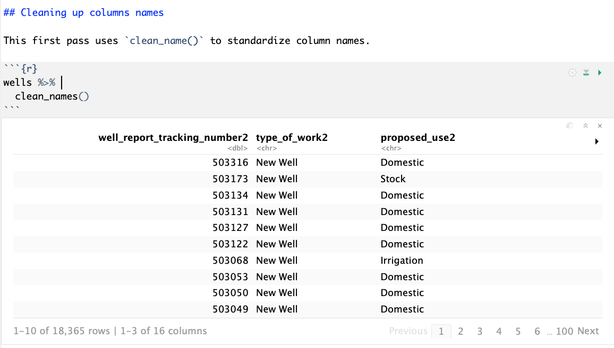

# Columns {#columns}

I'm a bit anal about cleaning up column names in my data frames, because it makes them easier to work with later. As such, I'm going to show you three different ways to clean or edit column names.

## Goals for this section

- Use the janitor plugin to clean columns names
- Mass rename columns with a pattern match
- Rename individual columns
- Fix data columns and other data types

## Relaunch the Wells project

- Launch RStudio. It will probably open to the last project you worked on.
- Open your Wells project. There are several ways you can accomplish this:
    + If you've had the project open before, you can use the drop down in the top-right of RStudio to see a list of recent projects, and choose it from there.
    + Or, under the **File** menu to **Recent projects** and choose it.
    + Or, under **File** you can use **Open Project...** and go to that folder and choose it.
- Look in the Files pane to the right and fine your `01-wells-import.Rmd` file and open it.
- Use the **Run** button in the R Notebook toolbar to **Run All** of the chunks, which will load all your data and load the data frame from our last assignment.

However you do it, make real sure you are in your wells project and that you are in your `01-wells-import.Rmd` file.

## Clean up column names

At the end of our last lesson, we printed the `wells` data frame to the screen and clicked through the columns to look at the data. I like my column names to be standardized:

- Spaces in names make them harder to work with. Use and `_` or `.` between words.
- Short names are better than long ones.
- lower_case is nice.

### Clean names with janitor

I use function from the "janitor" package called `clean_names` that will standardize column names. Often, this is all I need to do.

- After your list of things to fix, write a Markdown headline `## Clean column names`. Using the `##` makes this a smaller headline than the title. (The more `#`'s the smaller the headline.) The idea is to use these to organize your code and thoughts.
- Explain in text that we'll use janitor to clean the column names.
- Insert a new code chunk (*Cmd+shift+i* should be second nature by now.)
- Insert the name of your `wells` data frame and run it to inspect the column names again.

These are not _too_ bad, but they are a mix of upper and lowercase names, and some of them are rather long. We'll try the janitor `clean_names` function first.

- In a new code chunk, start with the `wells` data frame.

```r
wells %>% 
  clean_names()
```

And you'll get a result like this:

{width=600px}

#### About the pipe

Let's take take a moment to talk about this `%>%` text you see there. (It's called a **pipe** for dumb reasons I don't want to get into). Think of it as the "And THEN do THIS" key. It takes the result of what is on the left, and allows you to then THEN do the thing on the right.

We will use the `%>%` pipe command _a lot_, so it is worth knowing that the keyboard command *Cmd+shift+m* will give you that string of characters. I did NOT invent this keyboard command, but you might remember that Professor **M**cDonald taught it to you. It will serve you well.

Remember: Think of the ` %>% ` command as "Then". So, we first have the `wells` data frame, THEN we are cleaning the names.

#### Assign clean names back to wells

Now, we haven't _actually_ changed the names _for realz_, we just printed the data frame to our screen with those new names. We have to **assign** those changes somewhere to keep them. We could create a new data frame, but in this case, we'll just replace our current `wells` with our new `wells`, similar to how we filled wells the first time with our raw data.

Like this:

```r
wells <- wells %>% 
  clean_names()
```

The result no longer prints to our screen, but we can look at our **Environment** tab and check on our results, if we want.

This is a start, but we still have some problems:

- We have some long names, like "well_report_tracking_number2".
- We have an annoying trailing "2" at the end of all the column names.

### Simple renaming of individual columns

Renaming individual columns is pretty simple, and is another example of the "piping" concept of `data %>% do_something()`. In this case, we'll be useing the `rename()` function, which works like this:

```r
rename(new_column_name = old_column_name)`
```

The `=` assignment works from-right-to-left, just of like `<-` does when we put data into a data frame.

So, let's apply this to our wells data frame:

- Add Markdown text that says we are going to rename two columns: well_report_tracking_number2 and plugging_report_tracking_number2.
- Add a new code chunk and print the `wells` data frame.
- Now go back and add a ` %>% `pipe and the rename function, like the following:

```r
wells %>% 
  rename(well_number = well_report_tracking_number2)
```

Do *Cmd+Return* to run that line, and you'll see the first column name has changed. Note that is still ONE line of code, even though it is written in multiple lines.

We can rename more than one column at at time if we separate the assignments with commas. Now, let's edit this to also change the `plugging_report_tracking_number2` column, which is the last column of the data.

- In the same code chunk, add a comma and a return _before_ the ending `)`.
- add the new column mapping, like this:

```r
wells %>% 
  rename(well_number = well_report_tracking_number,
         plug_number = plugging_report_tracking_number)
```

Note the indents in the code there. RStudio probably indented it properly for you, but it's done that way so you can visually see that these two lines are are related.

We could do all the column names that way to remove the "2", but I want to show you a different way below to change them all at once.

#### Assign renamed columns back to wells

Now, again, we have printed these column name chages to our screen, but we have not yet saved them back to the wells data frame. We need to assign it back to `wells`.

- Add `wells <- ` to the beginning of the code chunk so what had printed to the screen is now instead being pushed into the wells data frame.

```r
wells <- wells %>% 
  rename(well_number = well_report_tracking_number2,
         plug_number = plugging_report_tracking_number2)
```

> NOTE: An important concept: Now that you have permanently changed the `wells` data frame, you can't run that same code chunk again or it will give you an error. Why? because "well_report_tracking_number2" doesn't exist anymore, so R can't find it to change it! If you need to re-run that chunk, you need to first re-run all the code above it, either by using the down-arrow play button on the chunk or going up to the Run menu and chosing "Run All Chunks Above".

### Mass renaming of columns

While we could individually rename all the columns to remove the trailing "2" on all the names, there is a way to do it all at once. It's the last way we'll discuss how to change column names, as I've already broken my rule of showing you only one way to do something. This is worth it because it saves time and introduces a couple of useful concepts.

We can access all the column names of a data frame with a generic R function called [names()](https://www.rdocumentation.org/packages/base/versions/3.5.2/topics/names), and we can use a pattern matching replacement called `str_replace()` to change them.

 - Write in text that we are going to change the names of all the columns to remove the "2".
 - Create a new code block and insert this:

```r
names(wells)
```

Run that, and you get a return like this, which is a list of all the column names of your data frame.

```text
 [1] "well_number"          "type_of_work2"        "proposed_use2"        "owner_name2"         
 [5] "county2"              "well_address2"        "coord_dd_lat2"        "coord_dd_long2"      
 [9] "grid_number2"         "drilling_start_date2" "drilling_end_date2"   "borehole_depth2"     
[13] "driller_signed2"      "driller_company"      "license_number2"      "plug_number"   
```

Cool, we can now use the ` %>% ` pipe to "THEN" perform actions on those names, just like we did on the data frame above. The next function we'll use to do that is `str_replace()` which allows us to search and replace strings. It works like this:

```r
`str_replace(data, "search_pattern", "replacement_text")`
```

In our case, the "data" will be passed into it with the pipe. We want to replace "2" with nothing, so we'll do this:

```r
names(wells) %>%
  str_replace("2", "")
```

Let's break that down again:

- We start with `names(wells)` which gives us a list of our column "names".
- We use the ` %>% ` to THEN apply a new function called `str_replace()`, which allows use to replace strings of text.
- Our data has been passed in by the pipe, so our our next argument is to search for the character `"2"` in all the names.
- And we replace those 2s with and empty string `""`, which essentially deletes them.

#### Assign the replaced column names back into names(wells)

Like our other examples, we have to now save our changes, but this one is a little different. Since we are only working with the names of the data with `names(wells)`, we need to assign the back the same way, into `names(wells)`.

- Add `names(wells) <- ` to the first line of the code chunk so we assign the names back.

```r
names(wells) <- names(wells) %>% 
  str_replace("2","")
```

## Clean data within columns

Now that we've cleaned up our column names, our next task is to clean up some of the data itself.

### Using lubridate to clean dates

Fixing dates in generic R can be a semi-complicated process. Luckily, the tidyverse package  [lubridate](https://lubridate.tidyverse.org/) makes date conversions simple. The package was included when we installed the tidyverse package, but we need to add the library.

- Go back to the top of your R Notebook where the libraries are loaded, and add this line **and run it**: `library(lubridate)`.
- Return back to the bottom of the Notebook and add in Markdown a headline and text describing that you will use lubridate to convert the date fields.
- Insert a new code chunk and add and run this, then I'll explain it:

```r
wells %>%
  mutate(drilling_start_date = mdy(drilling_start_date))
```

Go head and click over to the `drilling_start_date` column so you can see the converted date.

- We started with the `wells`.
- We then piped the results into `mutate()`, which "mutates" data within columns. Mutate is not just for dates and we will use it to change and create all kinds of changes in the future.
- The first argument of `mutate` is the name of the new column. In this case, we are changing the _existing_ column, so we are using `drilling_start_date`.
- `=` is the assignment operators. What is on the right will be put into the left.
- `mdy(drilling_start_date)` is the lubridate function. We are telling lubridate that the format of the _existing_ text field is in Month/Day/Year format. Lubridate is smart enough to realize the `/` separates the dates, and it would also understand if the separators were `-` or `.`.

That's kind of weird. We are telling lubridate that we are starting with `mdy` so it will convert and show it back to us in `yyyy-mm-dd`, which is standard database data format.

#### Your turn

It's time for you to use some of the skills you've learned already to accomplish a couple of easy tasks:

- Update the `mutate()` function above to also update `drilling_end_date` field to a date. Hint: `mutate` is a tidyverse function just like `rename`, so it works similarly.
- Assign the changes you've made back to the  `wells` data frame and then reprint it to make sure it's all good.

### Fix the bore hole depth

If you look at the CSV data, the `borehole_depth` is and integer (a number without a decimal point), but it was imported as a `<dbl>` number with decimals. This _could_ cause us problems later if we wanted to math on these, so we'll convert this to an integer using `mutate()`.

- Add a Markdown headline and description to describe our actions.
- Add a code chunk and add the following and run it:

```r
wells %>% 
  mutate(borehole_depth = as.integer(borehole_depth))
wells
```

This will reassign that column as an integer. How did I know to use `as.integer`? I Googled "r convert float to integer" and found [this tutorial](http://www.r-tutor.com/r-introduction/basic-data-types/integer) and this [Stack Overflow article](https://stackoverflow.com/questions/11638303/how-to-convert-num-to-int-in-r).

> A side note about this: I didn't realize this might be a problem until a later lesson. If I found a problem like this in Excel, I would have to redo all my steps, but since I'm using a script, I was able to make this change and then rerun the notebook.

As a last step, we have to **reassign our mutated data frame back to wells**, so change the first line to `wells <- wells %>% `.

## Export the data

It's not a bad idea to organize a project into multiple R Notebooks. I'll often create my first notebook to complete the tasks of downloading and cleaning up data, and then create a new one to handle analysis, etc. (This is why I had you name the files **01-**wells.Rmd.) It's possible to output the data frame you have created with all the changes and datatypes into a special `.rds` format that will re-import into R in exactly the same form. We'll do that now.

- Create a new Markdown header and text description to explain that you are exporting the data.
- Use the **Files** pane to create a **New Folder** called `data-out`.  (If the folder doesn't exist already, you'll get an error trying save the file.)
- Create a new code chunk and add the following and run it:

```r
wells %>% 
  saveRDS("data-out/wells_01.rds")
```

To break that down:

- We are staring with `wells`
- We are piping that into the `saveRDS()` function.
- We are giving `saveRDS()` the path to save the file.

**DO NOT** update this to assign back into the `wells` data frame. We don't have to do that here since our output is an external file.

**DO** use your **Files** pane to make sure it worked and you actually saved out the file.


## Turn in wells

Congratulations! You finished this chapter, having renamed columns and changed data types. Depending on where we are in the week, you _may_ be asked to turn this in at this stage. In any event, you should save and Knit your files.

## Practice assignment: Clean census names

You will start with the "census-practice"" project that you started in the previous chapter, so the first step is to open that project in RStudio.

The goal here is to **rename the columns** in the data to shorter, more-friendly names, such as "black" instead of "Not Hispanic - Black alone", or "american_indian" instead of "Not Hispanic - American Indian alone".

- Use `clean_names()` to standardize them.
- Use either `rename()` or `str_replace()` on `names()` to rename the columns. It doesn't matter to me how what method you use to change them, as long as it gets done.
- Make sure each step is documented in Markdown with good headlines and descriptions.


Save, Knit, Zip and submit your project folder to the "Practice: Columns" assignment.


