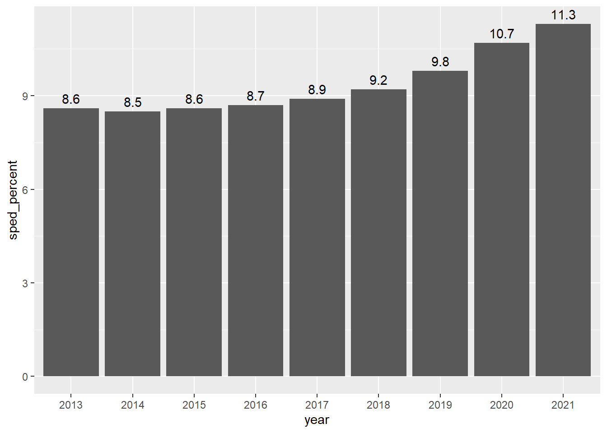
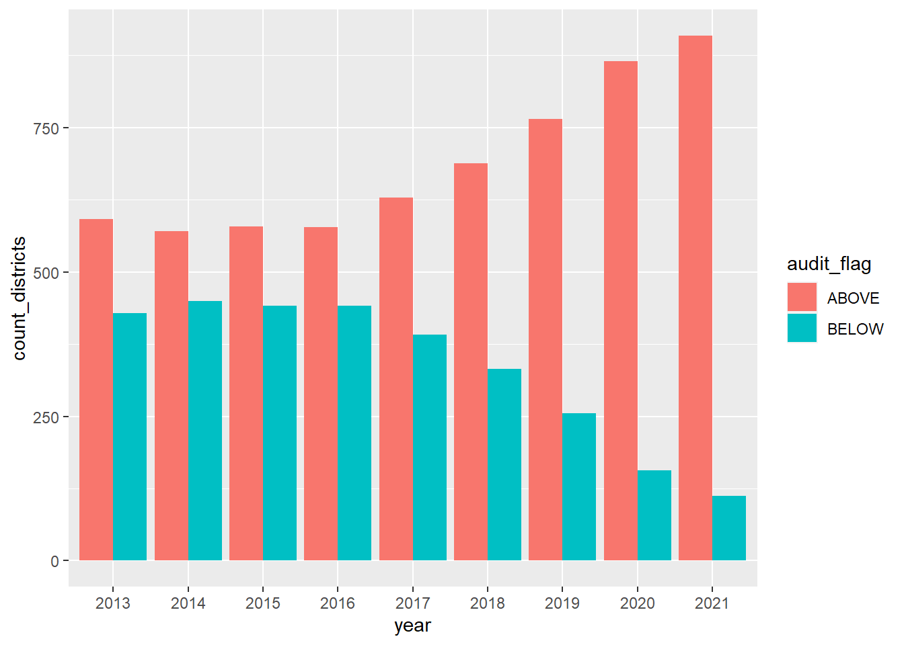
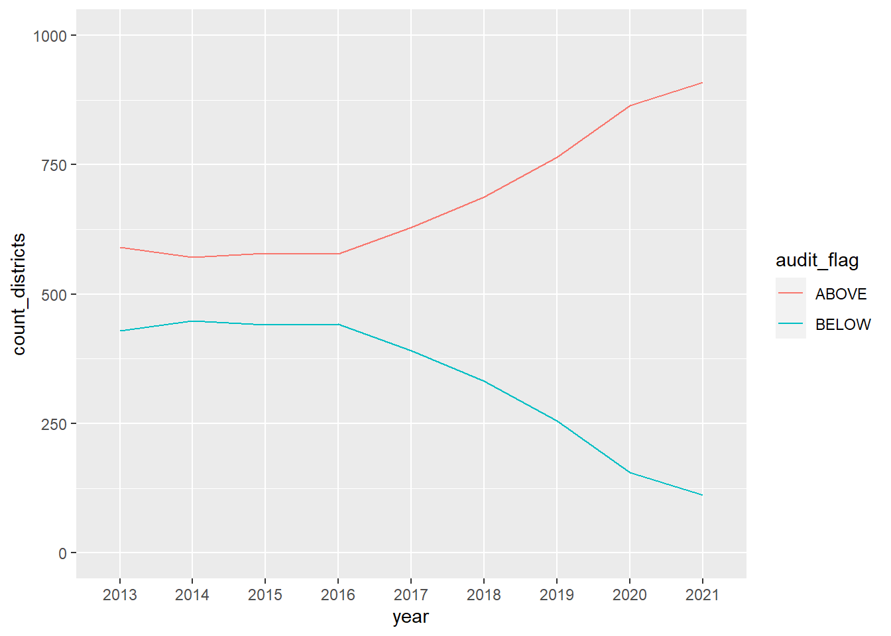
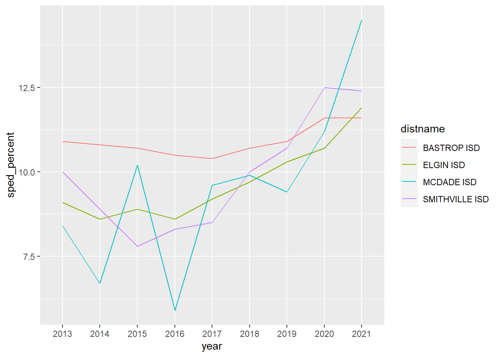

# Plotting for answers {#answers}

This is the second of of a two-chapter project. Now that we have assembled and cleaned our data, we need to answer this question in our followup to the [Denied](https://www.houstonchronicle.com/denied/) series:

- Has the percentage of special education students in Texas changed since the benchmarking policy was dropped??
- How many districts were above that arbitrary 8.5% benchmark before and after the changes?
- How have local districts changed?

The idea here is to answer those two questions through plotting. We'll use this chapter to walk through the process of using plots to explore and find answers in your data.

## Goals of this chapter

- Introduce `datatables()` from the [DT package](https://rstudio.github.io/DT/)
- Practice pivots to prepare data for plotting
- Practice plots to reveal insights in data
- There are wrap-up assignments that include writing, charts and this analysis

When a new concept is introduced, it shown and explained here. However, there are also **on your own** parts where you apply concepts you have learned in previous chapters or assignments.

## Project setup

1. Within the same project you've been working, create a new R Notebook. You might call it `02-analysis`.
1. We will be using a new package so you'll need to install it. **Use your Console** to run `install.packages("DT")`.
1. Include the libraries below and run them.


```r
library(tidyverse)
library(scales)
library(DT)
```

## Import cleaned data

1. Create a section for your import
2. Import your cleaned data and call it `sped` if you want to follow along here.

You should know how do do all that and I don't know what you called in export anyway.


But to recap, it should look like this:


```r
sped %>% head()
```

```
## # A tibble: 6 × 8
##   district distname  cntyname year  all_count sped_count sped_percent audit_flag
##   <chr>    <chr>     <chr>    <chr>     <dbl>      <dbl>        <dbl> <chr>     
## 1 001902   CAYUGA I… ANDERSON 2013        595         73         12.3 ABOVE     
## 2 001902   CAYUGA I… ANDERSON 2014        553         76         13.7 ABOVE     
## 3 001902   CAYUGA I… ANDERSON 2015        577         76         13.2 ABOVE     
## 4 001902   CAYUGA I… ANDERSON 2016        568         78         13.7 ABOVE     
## 5 001902   CAYUGA I… ANDERSON 2017        576         82         14.2 ABOVE     
## 6 001902   CAYUGA I… ANDERSON 2018        575         83         14.4 ABOVE
```

## Make a searchable table

Wouldn't it be nice to be able to see the percentage of special education students for each district for each year? The way our data is formatted now, that's pretty hard to see with our "long" data here.

We could use something more like this?  (But with all the years)

| distname      | cntyname | 2013 | 2014 | 2015 | etc |
|---------------|----------|-----:|-----:|-----:|-----|
| CAYUGA ISD    | ANDERSON | 12.3 | 13.7 | 13.2 | ... |
| ELKHART ISD   | ANDERSON |  9.1 |  8.9 | 10.4 | ... |
| FRANKSTON ISD | ANDERSON | 10.8 |  9.7 |  9.7 | ... |
| NECHES ISD    | ANDERSON | 11.1 |    9 | 11.1 | ... |
| PALESTINE ISD | ANDERSON |  7.7 |  7.8 |  8.7 | ... |
| WESTWOOD ISD  | ANDERSON |  9.3 |   10 |  9.3 | ... |

And what if you could make that table searchable to find a district by name or county? That would be magic, right?

We can do this by first reshaping our data using `pivot_wider()` and then applying a function called `datatable()`.

### Pivot wider

You used [`pivot_wider()`](https://tidyr.tidyverse.org/reference/pivot_wider.html) with the candy data [in Chapter 9](https://utdata.github.io/rwdir/tidy-data.html#pivot-wider), so you can look back at how that was done, but here are some hints:

1. Create a new section that notes you are creating a table of district percents.
1. First use `select()` to get just the columns you need: `distname`, `cntyname`, `year` and `sped_percent.`
1. Then use `pivot_wider()`to make a tibble like the one above. Remember that the `names_from =` argument wants to know which column you want to use to create the names of the new columns. The `values_from = ` argument wants to know which column to pull the cell values from.
1. Save the result into a new tibble and call it `district_percents_data`

<details>
  <summary>You won't need this code below because I believe in you</summary>

```r
district_percents_data <- sped %>% 
  select(distname, cntyname, year, sped_percent) %>% 
  pivot_wider(names_from = year, values_from = sped_percent)
```
<details>


### Make a datatable

Now comes the magic. 

1. In a new R chunk take your `district_percents_data` and then pipe it into a function called `datatable()`


```r
district_percents_data %>% 
  datatable()
```

```{=html}
<div id="htmlwidget-d19f997539c8368a4970" style="width:100%;height:auto;" class="datatables html-widget"></div>
<script type="application/json" data-for="htmlwidget-d19f997539c8368a4970">{"x":{"filter":"none","vertical":false,"data":[["1","2","3","4","5","6","7","8","9","10","11","12","13","14","15","16","17","18","19","20","21","22","23","24","25","26","27","28","29","30","31","32","33","34","35","36","37","38","39","40","41","42","43","44","45","46","47","48","49","50","51","52","53","54","55","56","57","58","59","60","61","62","63","64","65","66","67","68","69","70","71","72","73","74","75","76","77","78","79","80","81","82","83","84","85","86","87","88","89","90","91","92","93","94","95","96","97","98","99","100","101","102","103","104","105","106","107","108","109","110","111","112","113","114","115","116","117","118","119","120","121","122","123","124","125","126","127","128","129","130","131","132","133","134","135","136","137","138","139","140","141","142","143","144","145","146","147","148","149","150","151","152","153","154","155","156","157","158","159","160","161","162","163","164","165","166","167","168","169","170","171","172","173","174","175","176","177","178","179","180","181","182","183","184","185","186","187","188","189","190","191","192","193","194","195","196","197","198","199","200","201","202","203","204","205","206","207","208","209","210","211","212","213","214","215","216","217","218","219","220","221","222","223","224","225","226","227","228","229","230","231","232","233","234","235","236","237","238","239","240","241","242","243","244","245","246","247","248","249","250","251","252","253","254","255","256","257","258","259","260","261","262","263","264","265","266","267","268","269","270","271","272","273","274","275","276","277","278","279","280","281","282","283","284","285","286","287","288","289","290","291","292","293","294","295","296","297","298","299","300","301","302","303","304","305","306","307","308","309","310","311","312","313","314","315","316","317","318","319","320","321","322","323","324","325","326","327","328","329","330","331","332","333","334","335","336","337","338","339","340","341","342","343","344","345","346","347","348","349","350","351","352","353","354","355","356","357","358","359","360","361","362","363","364","365","366","367","368","369","370","371","372","373","374","375","376","377","378","379","380","381","382","383","384","385","386","387","388","389","390","391","392","393","394","395","396","397","398","399","400","401","402","403","404","405","406","407","408","409","410","411","412","413","414","415","416","417","418","419","420","421","422","423","424","425","426","427","428","429","430","431","432","433","434","435","436","437","438","439","440","441","442","443","444","445","446","447","448","449","450","451","452","453","454","455","456","457","458","459","460","461","462","463","464","465","466","467","468","469","470","471","472","473","474","475","476","477","478","479","480","481","482","483","484","485","486","487","488","489","490","491","492","493","494","495","496","497","498","499","500","501","502","503","504","505","506","507","508","509","510","511","512","513","514","515","516","517","518","519","520","521","522","523","524","525","526","527","528","529","530","531","532","533","534","535","536","537","538","539","540","541","542","543","544","545","546","547","548","549","550","551","552","553","554","555","556","557","558","559","560","561","562","563","564","565","566","567","568","569","570","571","572","573","574","575","576","577","578","579","580","581","582","583","584","585","586","587","588","589","590","591","592","593","594","595","596","597","598","599","600","601","602","603","604","605","606","607","608","609","610","611","612","613","614","615","616","617","618","619","620","621","622","623","624","625","626","627","628","629","630","631","632","633","634","635","636","637","638","639","640","641","642","643","644","645","646","647","648","649","650","651","652","653","654","655","656","657","658","659","660","661","662","663","664","665","666","667","668","669","670","671","672","673","674","675","676","677","678","679","680","681","682","683","684","685","686","687","688","689","690","691","692","693","694","695","696","697","698","699","700","701","702","703","704","705","706","707","708","709","710","711","712","713","714","715","716","717","718","719","720","721","722","723","724","725","726","727","728","729","730","731","732","733","734","735","736","737","738","739","740","741","742","743","744","745","746","747","748","749","750","751","752","753","754","755","756","757","758","759","760","761","762","763","764","765","766","767","768","769","770","771","772","773","774","775","776","777","778","779","780","781","782","783","784","785","786","787","788","789","790","791","792","793","794","795","796","797","798","799","800","801","802","803","804","805","806","807","808","809","810","811","812","813","814","815","816","817","818","819","820","821","822","823","824","825","826","827","828","829","830","831","832","833","834","835","836","837","838","839","840","841","842","843","844","845","846","847","848","849","850","851","852","853","854","855","856","857","858","859","860","861","862","863","864","865","866","867","868","869","870","871","872","873","874","875","876","877","878","879","880","881","882","883","884","885","886","887","888","889","890","891","892","893","894","895","896","897","898","899","900","901","902","903","904","905","906","907","908","909","910","911","912","913","914","915","916","917","918","919","920","921","922","923","924","925","926","927","928","929","930","931","932","933","934","935","936","937","938","939","940","941","942","943","944","945","946","947","948","949","950","951","952","953","954","955","956","957","958","959","960","961","962","963","964","965","966","967","968","969","970","971","972","973","974","975","976","977","978","979","980","981","982","983","984","985","986","987","988","989","990","991","992","993","994","995","996","997","998","999","1000","1001","1002","1003","1004","1005","1006","1007","1008","1009","1010","1011","1012","1013","1014","1015","1016","1017","1018","1019","1020","1021"],["CAYUGA ISD","ELKHART ISD","FRANKSTON ISD","NECHES ISD","PALESTINE ISD","WESTWOOD ISD","SLOCUM ISD","ANDREWS ISD","HUDSON ISD","LUFKIN ISD","HUNTINGTON ISD","DIBOLL ISD","ZAVALLA ISD","CENTRAL ISD","ARANSAS COUNTY ISD","ARCHER CITY ISD","HOLLIDAY ISD","WINDTHORST ISD","CLAUDE ISD","CHARLOTTE ISD","JOURDANTON ISD","LYTLE ISD","PLEASANTON ISD","POTEET ISD","BELLVILLE ISD","SEALY ISD","BRAZOS ISD","MULESHOE ISD","MEDINA ISD","BANDERA ISD","BASTROP ISD","ELGIN ISD","SMITHVILLE ISD","MCDADE ISD","SEYMOUR ISD","BEEVILLE ISD","PAWNEE ISD","PETTUS ISD","SKIDMORE-TYNAN ISD","ACADEMY ISD","BARTLETT ISD","BELTON ISD","HOLLAND ISD","KILLEEN ISD","ROGERS ISD","SALADO ISD","TEMPLE ISD","TROY ISD","ALAMO HEIGHTS ISD","HARLANDALE ISD","EDGEWOOD ISD","RANDOLPH FIELD ISD","SAN ANTONIO ISD","SOUTH SAN ANTONIO ISD","SOMERSET ISD","NORTH EAST ISD","EAST CENTRAL ISD","SOUTHWEST ISD","LACKLAND ISD","FT SAM HOUSTON ISD","NORTHSIDE ISD","JUDSON ISD","SOUTHSIDE ISD","JOHNSON CITY ISD","BLANCO ISD","BORDEN COUNTY ISD","CLIFTON ISD","MERIDIAN ISD","MORGAN ISD","VALLEY MILLS ISD","WALNUT SPRINGS ISD","IREDELL ISD","KOPPERL ISD","CRANFILLS GAP ISD","DEKALB ISD","HOOKS ISD","MAUD ISD","NEW BOSTON ISD","REDWATER ISD","TEXARKANA ISD","LIBERTY-EYLAU ISD","SIMMS ISD","MALTA ISD","RED LICK ISD","PLEASANT GROVE ISD","HUBBARD ISD","LEARY ISD","ALVIN ISD","ANGLETON ISD","DANBURY ISD","BRAZOSPORT ISD","SWEENY ISD","COLUMBIA-BRAZORIA ISD","PEARLAND ISD","DAMON ISD","COLLEGE STATION ISD","BRYAN ISD","TERLINGUA CSD","ALPINE ISD","MARATHON ISD","SAN VICENTE ISD","SILVERTON ISD","BROOKS COUNTY ISD","BANGS ISD","BROWNWOOD ISD","BLANKET ISD","MAY ISD","ZEPHYR ISD","BROOKESMITH ISD","EARLY ISD","CALDWELL ISD","SOMERVILLE ISD","SNOOK ISD","BURNET CISD","MARBLE FALLS ISD","LOCKHART ISD","LULING ISD","PRAIRIE LEA ISD","CALHOUN COUNTY ISD","CROSS PLAINS ISD","CLYDE CISD","BAIRD ISD","EULA ISD","BROWNSVILLE ISD","HARLINGEN CISD","LA FERIA ISD","LOS FRESNOS CISD","POINT ISABEL ISD","RIO HONDO ISD","SAN BENITO CISD","SANTA MARIA ISD","SANTA ROSA ISD","SOUTH TEXAS ISD","PITTSBURG ISD","GROOM ISD","PANHANDLE ISD","WHITE DEER ISD","ATLANTA ISD","AVINGER ISD","HUGHES SPRINGS ISD","LINDEN-KILDARE CISD","MCLEOD ISD","QUEEN CITY ISD","BLOOMBURG ISD","DIMMITT ISD","HART ISD","NAZARETH ISD","ANAHUAC ISD","BARBERS HILL ISD","EAST CHAMBERS ISD","ALTO ISD","JACKSONVILLE ISD","RUSK ISD","NEW SUMMERFIELD ISD","WELLS ISD","CHILDRESS ISD","HENRIETTA ISD","PETROLIA CISD","BELLEVUE ISD","MIDWAY ISD","MORTON ISD","WHITEFACE CISD","BRONTE ISD","ROBERT LEE ISD","COLEMAN ISD","SANTA ANNA ISD","PANTHER CREEK CISD","ALLEN ISD","ANNA ISD","CELINA ISD","FARMERSVILLE ISD","FRISCO ISD","MCKINNEY ISD","MELISSA ISD","PLANO ISD","PRINCETON ISD","PROSPER ISD","WYLIE ISD","BLUE RIDGE ISD","COMMUNITY ISD","LOVEJOY ISD","WELLINGTON ISD","COLUMBUS ISD","RICE CISD","WEIMAR ISD","NEW BRAUNFELS ISD","COMAL ISD","COMANCHE ISD","DE LEON ISD","GUSTINE ISD","SIDNEY ISD","EDEN CISD","PAINT ROCK ISD","GAINESVILLE ISD","MUENSTER ISD","VALLEY VIEW ISD","CALLISBURG ISD","ERA ISD","LINDSAY ISD","WALNUT BEND ISD","SIVELLS BEND ISD","EVANT ISD","GATESVILLE ISD","OGLESBY ISD","JONESBORO ISD","COPPERAS COVE ISD","PADUCAH ISD","CRANE ISD","CROCKETT COUNTY CONSOLIDATED CSD","CROSBYTON CISD","LORENZO ISD","RALLS ISD","CULBERSON COUNTY-ALLAMOORE ISD","DALHART ISD","TEXLINE ISD","CARROLLTON-FARMERS BRANCH ISD","CEDAR HILL ISD","DALLAS ISD","DESOTO ISD","DUNCANVILLE ISD","GARLAND ISD","GRAND PRAIRIE ISD","HIGHLAND PARK ISD","IRVING ISD","LANCASTER ISD","MESQUITE ISD","RICHARDSON ISD","SUNNYVALE ISD","COPPELL ISD","DAWSON ISD","KLONDIKE ISD","LAMESA ISD","SANDS CISD","HEREFORD ISD","WALCOTT ISD","COOPER ISD","FANNINDEL ISD","DENTON ISD","LEWISVILLE ISD","PILOT POINT ISD","KRUM ISD","PONDER ISD","AUBREY ISD","SANGER ISD","ARGYLE ISD","NORTHWEST ISD","LAKE DALLAS ISD","LITTLE ELM ISD","CUERO ISD","NORDHEIM ISD","YOAKUM ISD","YORKTOWN ISD","WESTHOFF ISD","MEYERSVILLE ISD","SPUR ISD","PATTON SPRINGS ISD","CARRIZO SPRINGS CISD","CLARENDON ISD","HEDLEY ISD","RAMIREZ CSD","BENAVIDES ISD","SAN DIEGO ISD","FREER ISD","CISCO ISD","EASTLAND ISD","GORMAN ISD","RANGER ISD","RISING STAR ISD","ECTOR COUNTY ISD","ROCKSPRINGS ISD","NUECES CANYON CISD","AVALON ISD","ENNIS ISD","FERRIS ISD","ITALY ISD","MIDLOTHIAN ISD","MILFORD ISD","PALMER ISD","RED OAK ISD","WAXAHACHIE ISD","MAYPEARL ISD","CLINT ISD","EL PASO ISD","FABENS ISD","SAN ELIZARIO ISD","YSLETA ISD","ANTHONY ISD","CANUTILLO ISD","TORNILLO ISD","SOCORRO ISD","THREE WAY ISD","DUBLIN ISD","STEPHENVILLE ISD","BLUFF DALE ISD","HUCKABAY ISD","LINGLEVILLE ISD","MORGAN MILL ISD","CHILTON ISD","MARLIN ISD","WESTPHALIA ISD","ROSEBUD-LOTT ISD","BONHAM ISD","DODD CITY ISD","ECTOR ISD","HONEY GROVE ISD","LEONARD ISD","SAVOY ISD","TRENTON ISD","SAM RAYBURN ISD","FLATONIA ISD","LA GRANGE ISD","SCHULENBURG ISD","FAYETTEVILLE ISD","ROUND TOP-CARMINE ISD","ROBY CISD","ROTAN ISD","FLOYDADA ISD","LOCKNEY ISD","CROWELL ISD","LAMAR CISD","NEEDVILLE ISD","FORT BEND ISD","STAFFORD MSD","MOUNT VERNON ISD","FAIRFIELD ISD","TEAGUE ISD","WORTHAM ISD","DEW ISD","DILLEY ISD","PEARSALL ISD","SEAGRAVES ISD","LOOP ISD","SEMINOLE ISD","DICKINSON ISD","GALVESTON ISD","HIGH ISLAND ISD","TEXAS CITY ISD","HITCHCOCK ISD","SANTA FE ISD","CLEAR CREEK ISD","FRIENDSWOOD ISD","POST ISD","SOUTHLAND ISD","DOSS CONSOLIDATED CSD","FREDERICKSBURG ISD","HARPER ISD","GLASSCOCK COUNTY ISD","GOLIAD ISD","GONZALES ISD","NIXON-SMILEY CISD","WAELDER ISD","LEFORS ISD","MCLEAN ISD","PAMPA ISD","GRANDVIEW-HOPKINS ISD","BELLS ISD","COLLINSVILLE ISD","DENISON ISD","HOWE ISD","SHERMAN ISD","TIOGA ISD","VAN ALSTYNE ISD","WHITESBORO ISD","WHITEWRIGHT ISD","POTTSBORO ISD","S AND S CISD","GUNTER ISD","TOM BEAN ISD","GLADEWATER ISD","KILGORE ISD","LONGVIEW ISD","PINE TREE ISD","SABINE ISD","SPRING HILL ISD","WHITE OAK ISD","ANDERSON-SHIRO CISD","IOLA ISD","NAVASOTA ISD","RICHARDS ISD","SEGUIN ISD","SCHERTZ-CIBOLO-U CITY ISD","NAVARRO ISD","MARION ISD","ABERNATHY ISD","COTTON CENTER ISD","HALE CENTER ISD","PETERSBURG ISD","PLAINVIEW ISD","MEMPHIS ISD","TURKEY-QUITAQUE ISD","HAMILTON ISD","HICO ISD","GRUVER ISD","PRINGLE-MORSE CISD","SPEARMAN ISD","CHILLICOTHE ISD","QUANAH ISD","KOUNTZE ISD","SILSBEE ISD","HARDIN-JEFFERSON ISD","LUMBERTON ISD","WEST HARDIN COUNTY CISD","ALDINE ISD","ALIEF ISD","CHANNELVIEW ISD","CROSBY ISD","CYPRESS-FAIRBANKS ISD","DEER PARK ISD","GALENA PARK ISD","GOOSE CREEK CISD","HOUSTON ISD","HUMBLE ISD","KATY ISD","KLEIN ISD","LA PORTE ISD","PASADENA ISD","SPRING ISD","SPRING BRANCH ISD","TOMBALL ISD","SHELDON ISD","HUFFMAN ISD","KARNACK ISD","MARSHALL ISD","WASKOM ISD","HALLSVILLE ISD","HARLETON ISD","ELYSIAN FIELDS ISD","CHANNING ISD","HARTLEY ISD","HASKELL CISD","RULE ISD","PAINT CREEK ISD","SAN MARCOS CISD","DRIPPING SPRINGS ISD","WIMBERLEY ISD","HAYS CISD","CANADIAN ISD","ATHENS ISD","BROWNSBORO ISD","CROSS ROADS ISD","EUSTACE ISD","MALAKOFF ISD","TRINIDAD ISD","MURCHISON ISD","LAPOYNOR ISD","DONNA ISD","EDCOUCH-ELSA ISD","EDINBURG CISD","HIDALGO ISD","MCALLEN ISD","MERCEDES ISD","MISSION CISD","PHARR-SAN JUAN-ALAMO ISD","PROGRESO ISD","SHARYLAND ISD","LA JOYA ISD","WESLACO ISD","LA VILLA ISD","MONTE ALTO ISD","VALLEY VIEW ISD","ABBOTT ISD","BYNUM ISD","COVINGTON ISD","HILLSBORO ISD","HUBBARD ISD","ITASCA ISD","MALONE ISD","MOUNT CALM ISD","WHITNEY ISD","AQUILLA ISD","BLUM ISD","PENELOPE ISD","ANTON ISD","LEVELLAND ISD","ROPES ISD","SMYER ISD","SUNDOWN ISD","WHITHARRAL ISD","GRANBURY ISD","LIPAN ISD","TOLAR ISD","SULPHUR SPRINGS ISD","CUMBY ISD","NORTH HOPKINS ISD","MILLER GROVE ISD","COMO-PICKTON CISD","SALTILLO ISD","SULPHUR BLUFF ISD","CROCKETT ISD","GRAPELAND ISD","LOVELADY ISD","LATEXO ISD","KENNARD ISD","BIG SPRING ISD","COAHOMA ISD","FORSAN ISD","FT HANCOCK ISD","SIERRA BLANCA ISD","DELL CITY ISD","CADDO MILLS ISD","CELESTE ISD","COMMERCE ISD","GREENVILLE ISD","LONE OAK ISD","QUINLAN ISD","WOLFE CITY ISD","CAMPBELL ISD","BLAND ISD","BOLES ISD","BORGER ISD","SANFORD-FRITCH ISD","PLEMONS-STINNETT-PHILLIPS CISD","SPRING CREEK ISD","IRION COUNTY ISD","BRYSON ISD","JACKSBORO ISD","PERRIN-WHITT CISD","EDNA ISD","GANADO ISD","INDUSTRIAL ISD","BROOKELAND ISD","BUNA ISD","JASPER ISD","KIRBYVILLE CISD","EVADALE ISD","FT DAVIS ISD","VALENTINE ISD","NEDERLAND ISD","PORT ARTHUR ISD","PORT NECHES-GROVES ISD","BEAUMONT ISD","SABINE PASS ISD","HAMSHIRE-FANNETT ISD","JIM HOGG COUNTY ISD","ALICE ISD","BEN BOLT-PALITO BLANCO ISD","ORANGE GROVE ISD","PREMONT ISD","LA GLORIA ISD","ALVARADO ISD","BURLESON ISD","CLEBURNE ISD","GRANDVIEW ISD","JOSHUA ISD","KEENE ISD","RIO VISTA ISD","VENUS ISD","GODLEY ISD","ANSON ISD","HAMLIN COLLEGIATE ISD","HAWLEY ISD","LUEDERS-AVOCA ISD","STAMFORD ISD","KARNES CITY ISD","KENEDY ISD","RUNGE ISD","FALLS CITY ISD","CRANDALL ISD","FORNEY ISD","KAUFMAN ISD","KEMP ISD","MABANK ISD","TERRELL ISD","SCURRY-ROSSER ISD","BOERNE ISD","COMFORT ISD","KENEDY COUNTY WIDE CSD","JAYTON-GIRARD ISD","CENTER POINT ISD","HUNT ISD","KERRVILLE ISD","INGRAM ISD","DIVIDE ISD","JUNCTION ISD","GUTHRIE CSD","BRACKETT ISD","KINGSVILLE ISD","RICARDO ISD","RIVIERA ISD","SANTA GERTRUDIS ISD","KNOX CITY-O'BRIEN CISD","MUNDAY CISD","BENJAMIN ISD","CHISUM ISD","PARIS ISD","NORTH LAMAR ISD","PRAIRILAND ISD","AMHERST ISD","LITTLEFIELD ISD","OLTON ISD","SPRINGLAKE-EARTH ISD","SUDAN ISD","LAMPASAS ISD","LOMETA ISD","COTULLA ISD","HALLETTSVILLE ISD","MOULTON ISD","SHINER ISD","VYSEHRAD ISD","SWEET HOME ISD","EZZELL ISD","GIDDINGS ISD","LEXINGTON ISD","DIME BOX ISD","BUFFALO ISD","CENTERVILLE ISD","NORMANGEE ISD","OAKWOOD ISD","LEON ISD","CLEVELAND ISD","DAYTON ISD","DEVERS ISD","HARDIN ISD","HULL-DAISETTA ISD","LIBERTY ISD","TARKINGTON ISD","COOLIDGE ISD","GROESBECK ISD","MEXIA ISD","BOOKER ISD","FOLLETT ISD","DARROUZETT ISD","GEORGE WEST ISD","THREE RIVERS ISD","LLANO ISD","LUBBOCK ISD","NEW DEAL ISD","SLATON ISD","LUBBOCK-COOPER ISD","FRENSHIP ISD","ROOSEVELT ISD","SHALLOWATER ISD","IDALOU ISD","O'DONNELL ISD","TAHOKA ISD","NEW HOME ISD","WILSON ISD","MADISONVILLE CISD","NORTH ZULCH ISD","JEFFERSON ISD","STANTON ISD","GRADY ISD","MASON ISD","BAY CITY ISD","TIDEHAVEN ISD","MATAGORDA ISD","PALACIOS ISD","VAN VLECK ISD","EAGLE PASS ISD","BRADY ISD","ROCHELLE ISD","LOHN ISD","CRAWFORD ISD","MIDWAY ISD","LA VEGA ISD","LORENA ISD","MART ISD","MCGREGOR ISD","MOODY ISD","RIESEL ISD","WACO ISD","WEST ISD","AXTELL ISD","BRUCEVILLE-EDDY ISD","CHINA SPRING ISD","CONNALLY ISD","ROBINSON ISD","BOSQUEVILLE ISD","HALLSBURG ISD","GHOLSON ISD","MCMULLEN COUNTY ISD","DEVINE ISD","D'HANIS ISD","NATALIA ISD","HONDO ISD","MEDINA VALLEY ISD","MENARD ISD","MIDLAND ISD","GREENWOOD ISD","CAMERON ISD","GAUSE ISD","MILANO ISD","ROCKDALE ISD","THORNDALE ISD","BUCKHOLTS ISD","GOLDTHWAITE ISD","MULLIN ISD","PRIDDY ISD","COLORADO ISD","LORAINE ISD","WESTBROOK ISD","BOWIE ISD","NOCONA ISD","GOLD BURG ISD","MONTAGUE ISD","PRAIRIE VALLEY ISD","FORESTBURG ISD","SAINT JO ISD","CONROE ISD","MONTGOMERY ISD","WILLIS ISD","MAGNOLIA ISD","SPLENDORA ISD","NEW CANEY ISD","DUMAS ISD","SUNRAY ISD","DAINGERFIELD-LONE STAR ISD","PEWITT CISD","MOTLEY COUNTY ISD","CHIRENO ISD","CUSHING ISD","GARRISON ISD","NACOGDOCHES ISD","WODEN ISD","CENTRAL HEIGHTS ISD","MARTINSVILLE ISD","ETOILE ISD","DOUGLASS ISD","BLOOMING GROVE ISD","CORSICANA ISD","DAWSON ISD","FROST ISD","KERENS ISD","MILDRED ISD","RICE ISD","BURKEVILLE ISD","NEWTON ISD","DEWEYVILLE ISD","ROSCOE COLLEGIATE ISD","SWEETWATER ISD","BLACKWELL CISD","HIGHLAND ISD","AGUA DULCE ISD","BISHOP CISD","CALALLEN ISD","CORPUS CHRISTI ISD","DRISCOLL ISD","LONDON ISD","PORT ARANSAS ISD","ROBSTOWN ISD","TULOSO-MIDWAY ISD","BANQUETE ISD","FLOUR BLUFF ISD","WEST OSO ISD","PERRYTON ISD","BOYS RANCH ISD","VEGA ISD","ADRIAN ISD","WILDORADO ISD","BRIDGE CITY ISD","ORANGEFIELD ISD","WEST ORANGE-COVE CISD","VIDOR ISD","LITTLE CYPRESS-MAURICEVILLE CISD","GORDON ISD","GRAFORD ISD","MINERAL WELLS ISD","SANTO ISD","STRAWN ISD","PALO PINTO ISD","BECKVILLE ISD","CARTHAGE ISD","GARY ISD","POOLVILLE ISD","SPRINGTOWN ISD","WEATHERFORD ISD","MILLSAP ISD","ALEDO ISD","PEASTER ISD","BROCK ISD","GARNER ISD","BOVINA ISD","FARWELL ISD","FRIONA ISD","LAZBUDDIE ISD","BUENA VISTA ISD","FORT STOCKTON ISD","IRAAN-SHEFFIELD ISD","BIG SANDY ISD","GOODRICH ISD","CORRIGAN-CAMDEN ISD","LEGGETT ISD","LIVINGSTON ISD","ONALASKA ISD","AMARILLO ISD","RIVER ROAD ISD","HIGHLAND PARK ISD","BUSHLAND ISD","MARFA ISD","PRESIDIO ISD","RAINS ISD","CANYON ISD","REAGAN COUNTY ISD","LEAKEY ISD","AVERY ISD","RIVERCREST ISD","CLARKSVILLE ISD","DETROIT ISD","PECOS-BARSTOW-TOYAH ISD","BALMORHEA ISD","AUSTWELL-TIVOLI ISD","WOODSBORO ISD","REFUGIO ISD","MIAMI ISD","BREMOND ISD","CALVERT ISD","FRANKLIN ISD","HEARNE ISD","MUMFORD ISD","ROCKWALL ISD","ROYSE CITY ISD","BALLINGER ISD","MILES ISD","WINTERS ISD","OLFEN ISD","HENDERSON ISD","LANEVILLE ISD","LEVERETTS CHAPEL ISD","MOUNT ENTERPRISE ISD","OVERTON ISD","TATUM ISD","CARLISLE ISD","WEST RUSK COUNTY CONSOLIDATED ISD","HEMPHILL ISD","WEST SABINE ISD","SAN AUGUSTINE ISD","BROADDUS ISD","COLDSPRING-OAKHURST CISD","SHEPHERD ISD","ARANSAS PASS ISD","GREGORY-PORTLAND ISD","INGLESIDE ISD","MATHIS ISD","ODEM-EDROY ISD","SINTON ISD","TAFT ISD","SAN SABA ISD","RICHLAND SPRINGS ISD","CHEROKEE ISD","SCHLEICHER ISD","HERMLEIGH ISD","SNYDER ISD","IRA ISD","ALBANY ISD","MORAN ISD","CENTER ISD","JOAQUIN ISD","SHELBYVILLE ISD","TENAHA ISD","TIMPSON ISD","EXCELSIOR ISD","TEXHOMA ISD","STRATFORD ISD","ARP ISD","BULLARD ISD","LINDALE ISD","TROUP ISD","TYLER ISD","WHITEHOUSE ISD","CHAPEL HILL ISD","WINONA ISD","GLEN ROSE ISD","RIO GRANDE CITY CISD","SAN ISIDRO ISD","ROMA ISD","BRECKENRIDGE ISD","STERLING CITY ISD","ASPERMONT ISD","SONORA ISD","HAPPY ISD","TULIA ISD","KRESS ISD","ARLINGTON ISD","BIRDVILLE ISD","EVERMAN ISD","FORT WORTH ISD","GRAPEVINE-COLLEYVILLE ISD","KELLER ISD","MANSFIELD ISD","LAKE WORTH ISD","CROWLEY ISD","KENNEDALE ISD","AZLE ISD","HURST-EULESS-BEDFORD ISD","CASTLEBERRY ISD","EAGLE MT-SAGINAW ISD","CARROLL ISD","WHITE SETTLEMENT ISD","ABILENE ISD","MERKEL ISD","TRENT ISD","JIM NED CISD","WYLIE ISD","TERRELL COUNTY ISD","BROWNFIELD ISD","MEADOW ISD","WELLMAN-UNION CISD","THROCKMORTON COLLEGIATE ISD","WOODSON ISD","MOUNT PLEASANT ISD","CHAPEL HILL ISD","HARTS BLUFF ISD","CHRISTOVAL ISD","SAN ANGELO ISD","WATER VALLEY ISD","WALL ISD","GRAPE CREEK ISD","VERIBEST ISD","UNIVERSITY OF TEXAS AT AUSTIN H S","AUSTIN ISD","PFLUGERVILLE ISD","MANOR ISD","EANES ISD","DEL VALLE ISD","LAGO VISTA ISD","LAKE TRAVIS ISD","GROVETON ISD","TRINITY ISD","CENTERVILLE ISD","APPLE SPRINGS ISD","COLMESNEIL ISD","WOODVILLE ISD","WARREN ISD","SPURGER ISD","CHESTER ISD","BIG SANDY ISD","GILMER ISD","ORE CITY ISD","UNION HILL ISD","HARMONY ISD","NEW DIANA ISD","UNION GROVE ISD","MCCAMEY ISD","RANKIN ISD","KNIPPA ISD","SABINAL ISD","UVALDE CISD","UTOPIA ISD","SAN FELIPE-DEL RIO CISD","COMSTOCK ISD","CANTON ISD","EDGEWOOD ISD","GRAND SALINE ISD","MARTINS MILL ISD","VAN ISD","WILLS POINT ISD","FRUITVALE ISD","BLOOMINGTON ISD","VICTORIA ISD","NURSERY ISD","NEW WAVERLY ISD","HUNTSVILLE ISD","HEMPSTEAD ISD","WALLER ISD","ROYAL ISD","MONAHANS-WICKETT-PYOTE ISD","GRANDFALLS-ROYALTY ISD","BRENHAM ISD","BURTON ISD","LAREDO ISD","UNITED ISD","WEBB CISD","BOLING ISD","EAST BERNARD ISD","EL CAMPO ISD","WHARTON ISD","LOUISE ISD","SHAMROCK ISD","WHEELER ISD","KELTON ISD","FORT ELLIOTT CISD","BURKBURNETT ISD","ELECTRA ISD","IOWA PARK CISD","WICHITA FALLS ISD","CITY VIEW ISD","HARROLD ISD","VERNON ISD","NORTHSIDE ISD","LASARA ISD","LYFORD CISD","RAYMONDVILLE ISD","SAN PERLITA ISD","FLORENCE ISD","GEORGETOWN ISD","GRANGER ISD","HUTTO ISD","JARRELL ISD","LIBERTY HILL ISD","ROUND ROCK ISD","TAYLOR ISD","THRALL ISD","LEANDER ISD","COUPLAND ISD","FLORESVILLE ISD","LA VERNIA ISD","POTH ISD","STOCKDALE ISD","KERMIT ISD","WINK-LOVING ISD","ALVORD ISD","BOYD ISD","BRIDGEPORT ISD","CHICO ISD","DECATUR ISD","PARADISE ISD","SLIDELL ISD","HAWKINS ISD","MINEOLA ISD","QUITMAN ISD","YANTIS ISD","ALBA-GOLDEN ISD","WINNSBORO ISD","DENVER CITY ISD","PLAINS ISD","GRAHAM ISD","NEWCASTLE ISD","OLNEY ISD","ZAPATA COUNTY ISD","CRYSTAL CITY ISD","LA PRYOR ISD"],["ANDERSON","ANDERSON","ANDERSON","ANDERSON","ANDERSON","ANDERSON","ANDERSON","ANDREWS","ANGELINA","ANGELINA","ANGELINA","ANGELINA","ANGELINA","ANGELINA","ARANSAS","ARCHER","ARCHER","ARCHER","ARMSTRONG","ATASCOSA","ATASCOSA","ATASCOSA","ATASCOSA","ATASCOSA","AUSTIN","AUSTIN","AUSTIN","BAILEY","BANDERA","BANDERA","BASTROP","BASTROP","BASTROP","BASTROP","BAYLOR","BEE","BEE","BEE","BEE","BELL","BELL","BELL","BELL","BELL","BELL","BELL","BELL","BELL","BEXAR","BEXAR","BEXAR","BEXAR","BEXAR","BEXAR","BEXAR","BEXAR","BEXAR","BEXAR","BEXAR","BEXAR","BEXAR","BEXAR","BEXAR","BLANCO","BLANCO","BORDEN","BOSQUE","BOSQUE","BOSQUE","BOSQUE","BOSQUE","BOSQUE","BOSQUE","BOSQUE","BOWIE","BOWIE","BOWIE","BOWIE","BOWIE","BOWIE","BOWIE","BOWIE","BOWIE","BOWIE","BOWIE","BOWIE","BOWIE","BRAZORIA","BRAZORIA","BRAZORIA","BRAZORIA","BRAZORIA","BRAZORIA","BRAZORIA","BRAZORIA","BRAZOS","BRAZOS","BREWSTER","BREWSTER","BREWSTER","BREWSTER","BRISCOE","BROOKS","BROWN","BROWN","BROWN","BROWN","BROWN","BROWN","BROWN","BURLESON","BURLESON","BURLESON","BURNET","BURNET","CALDWELL","CALDWELL","CALDWELL","CALHOUN","CALLAHAN","CALLAHAN","CALLAHAN","CALLAHAN","CAMERON","CAMERON","CAMERON","CAMERON","CAMERON","CAMERON","CAMERON","CAMERON","CAMERON","CAMERON","CAMP","CARSON","CARSON","CARSON","CASS","CASS","CASS","CASS","CASS","CASS","CASS","CASTRO","CASTRO","CASTRO","CHAMBERS","CHAMBERS","CHAMBERS","CHEROKEE","CHEROKEE","CHEROKEE","CHEROKEE","CHEROKEE","CHILDRESS","CLAY","CLAY","CLAY","CLAY","COCHRAN","COCHRAN","COKE","COKE","COLEMAN","COLEMAN","COLEMAN","COLLIN","COLLIN","COLLIN","COLLIN","COLLIN","COLLIN","COLLIN","COLLIN","COLLIN","COLLIN","COLLIN","COLLIN","COLLIN","COLLIN","COLLINGSWORTH","COLORADO","COLORADO","COLORADO","COMAL","COMAL","COMANCHE","COMANCHE","COMANCHE","COMANCHE","CONCHO","CONCHO","COOKE","COOKE","COOKE","COOKE","COOKE","COOKE","COOKE","COOKE","CORYELL","CORYELL","CORYELL","CORYELL","CORYELL","COTTLE","CRANE","CROCKETT","CROSBY","CROSBY","CROSBY","CULBERSON","DALLAM","DALLAM","DALLAS","DALLAS","DALLAS","DALLAS","DALLAS","DALLAS","DALLAS","DALLAS","DALLAS","DALLAS","DALLAS","DALLAS","DALLAS","DALLAS","DAWSON","DAWSON","DAWSON","DAWSON","DEAF SMITH","DEAF SMITH","DELTA","DELTA","DENTON","DENTON","DENTON","DENTON","DENTON","DENTON","DENTON","DENTON","DENTON","DENTON","DENTON","DEWITT","DEWITT","DEWITT","DEWITT","DEWITT","DEWITT","DICKENS","DICKENS","DIMMIT","DONLEY","DONLEY","DUVAL","DUVAL","DUVAL","DUVAL","EASTLAND","EASTLAND","EASTLAND","EASTLAND","EASTLAND","ECTOR","EDWARDS","EDWARDS","ELLIS","ELLIS","ELLIS","ELLIS","ELLIS","ELLIS","ELLIS","ELLIS","ELLIS","ELLIS","EL PASO","EL PASO","EL PASO","EL PASO","EL PASO","EL PASO","EL PASO","EL PASO","EL PASO","ERATH","ERATH","ERATH","ERATH","ERATH","ERATH","ERATH","FALLS","FALLS","FALLS","FALLS","FANNIN","FANNIN","FANNIN","FANNIN","FANNIN","FANNIN","FANNIN","FANNIN","FAYETTE","FAYETTE","FAYETTE","FAYETTE","FAYETTE","FISHER","FISHER","FLOYD","FLOYD","FOARD","FORT BEND","FORT BEND","FORT BEND","FORT BEND","FRANKLIN","FREESTONE","FREESTONE","FREESTONE","FREESTONE","FRIO","FRIO","GAINES","GAINES","GAINES","GALVESTON","GALVESTON","GALVESTON","GALVESTON","GALVESTON","GALVESTON","GALVESTON","GALVESTON","GARZA","GARZA","GILLESPIE","GILLESPIE","GILLESPIE","GLASSCOCK","GOLIAD","GONZALES","GONZALES","GONZALES","GRAY","GRAY","GRAY","GRAY","GRAYSON","GRAYSON","GRAYSON","GRAYSON","GRAYSON","GRAYSON","GRAYSON","GRAYSON","GRAYSON","GRAYSON","GRAYSON","GRAYSON","GRAYSON","GREGG","GREGG","GREGG","GREGG","GREGG","GREGG","GREGG","GRIMES","GRIMES","GRIMES","GRIMES","GUADALUPE","GUADALUPE","GUADALUPE","GUADALUPE","HALE","HALE","HALE","HALE","HALE","HALL","HALL","HAMILTON","HAMILTON","HANSFORD","HANSFORD","HANSFORD","HARDEMAN","HARDEMAN","HARDIN","HARDIN","HARDIN","HARDIN","HARDIN","HARRIS","HARRIS","HARRIS","HARRIS","HARRIS","HARRIS","HARRIS","HARRIS","HARRIS","HARRIS","HARRIS","HARRIS","HARRIS","HARRIS","HARRIS","HARRIS","HARRIS","HARRIS","HARRIS","HARRISON","HARRISON","HARRISON","HARRISON","HARRISON","HARRISON","HARTLEY","HARTLEY","HASKELL","HASKELL","HASKELL","HAYS","HAYS","HAYS","HAYS","HEMPHILL","HENDERSON","HENDERSON","HENDERSON","HENDERSON","HENDERSON","HENDERSON","HENDERSON","HENDERSON","HIDALGO","HIDALGO","HIDALGO","HIDALGO","HIDALGO","HIDALGO","HIDALGO","HIDALGO","HIDALGO","HIDALGO","HIDALGO","HIDALGO","HIDALGO","HIDALGO","HIDALGO","HILL","HILL","HILL","HILL","HILL","HILL","HILL","HILL","HILL","HILL","HILL","HILL","HOCKLEY","HOCKLEY","HOCKLEY","HOCKLEY","HOCKLEY","HOCKLEY","HOOD","HOOD","HOOD","HOPKINS","HOPKINS","HOPKINS","HOPKINS","HOPKINS","HOPKINS","HOPKINS","HOUSTON","HOUSTON","HOUSTON","HOUSTON","HOUSTON","HOWARD","HOWARD","HOWARD","HUDSPETH","HUDSPETH","HUDSPETH","HUNT","HUNT","HUNT","HUNT","HUNT","HUNT","HUNT","HUNT","HUNT","HUNT","HUTCHINSON","HUTCHINSON","HUTCHINSON","HUTCHINSON","IRION","JACK","JACK","JACK","JACKSON","JACKSON","JACKSON","JASPER","JASPER","JASPER","JASPER","JASPER","JEFF DAVIS","JEFF DAVIS","JEFFERSON","JEFFERSON","JEFFERSON","JEFFERSON","JEFFERSON","JEFFERSON","JIM HOGG","JIM WELLS","JIM WELLS","JIM WELLS","JIM WELLS","JIM WELLS","JOHNSON","JOHNSON","JOHNSON","JOHNSON","JOHNSON","JOHNSON","JOHNSON","JOHNSON","JOHNSON","JONES","JONES","JONES","JONES","JONES","KARNES","KARNES","KARNES","KARNES","KAUFMAN","KAUFMAN","KAUFMAN","KAUFMAN","KAUFMAN","KAUFMAN","KAUFMAN","KENDALL","KENDALL","KENEDY","KENT","KERR","KERR","KERR","KERR","KERR","KIMBLE","KING","KINNEY","KLEBERG","KLEBERG","KLEBERG","KLEBERG","KNOX","KNOX","KNOX","LAMAR","LAMAR","LAMAR","LAMAR","LAMB","LAMB","LAMB","LAMB","LAMB","LAMPASAS","LAMPASAS","LA SALLE","LAVACA","LAVACA","LAVACA","LAVACA","LAVACA","LAVACA","LEE","LEE","LEE","LEON","LEON","LEON","LEON","LEON","LIBERTY","LIBERTY","LIBERTY","LIBERTY","LIBERTY","LIBERTY","LIBERTY","LIMESTONE","LIMESTONE","LIMESTONE","LIPSCOMB","LIPSCOMB","LIPSCOMB","LIVE OAK","LIVE OAK","LLANO","LUBBOCK","LUBBOCK","LUBBOCK","LUBBOCK","LUBBOCK","LUBBOCK","LUBBOCK","LUBBOCK","LYNN","LYNN","LYNN","LYNN","MADISON","MADISON","MARION","MARTIN","MARTIN","MASON","MATAGORDA","MATAGORDA","MATAGORDA","MATAGORDA","MATAGORDA","MAVERICK","MCCULLOCH","MCCULLOCH","MCCULLOCH","MCLENNAN","MCLENNAN","MCLENNAN","MCLENNAN","MCLENNAN","MCLENNAN","MCLENNAN","MCLENNAN","MCLENNAN","MCLENNAN","MCLENNAN","MCLENNAN","MCLENNAN","MCLENNAN","MCLENNAN","MCLENNAN","MCLENNAN","MCLENNAN","MCMULLEN","MEDINA","MEDINA","MEDINA","MEDINA","MEDINA","MENARD","MIDLAND","MIDLAND","MILAM","MILAM","MILAM","MILAM","MILAM","MILAM","MILLS","MILLS","MILLS","MITCHELL","MITCHELL","MITCHELL","MONTAGUE","MONTAGUE","MONTAGUE","MONTAGUE","MONTAGUE","MONTAGUE","MONTAGUE","MONTGOMERY","MONTGOMERY","MONTGOMERY","MONTGOMERY","MONTGOMERY","MONTGOMERY","MOORE","MOORE","MORRIS","MORRIS","MOTLEY","NACOGDOCHES","NACOGDOCHES","NACOGDOCHES","NACOGDOCHES","NACOGDOCHES","NACOGDOCHES","NACOGDOCHES","NACOGDOCHES","NACOGDOCHES","NAVARRO","NAVARRO","NAVARRO","NAVARRO","NAVARRO","NAVARRO","NAVARRO","NEWTON","NEWTON","NEWTON","NOLAN","NOLAN","NOLAN","NOLAN","NUECES","NUECES","NUECES","NUECES","NUECES","NUECES","NUECES","NUECES","NUECES","NUECES","NUECES","NUECES","OCHILTREE","OLDHAM","OLDHAM","OLDHAM","OLDHAM","ORANGE","ORANGE","ORANGE","ORANGE","ORANGE","PALO PINTO","PALO PINTO","PALO PINTO","PALO PINTO","PALO PINTO","PALO PINTO","PANOLA","PANOLA","PANOLA","PARKER","PARKER","PARKER","PARKER","PARKER","PARKER","PARKER","PARKER","PARMER","PARMER","PARMER","PARMER","PECOS","PECOS","PECOS","POLK","POLK","POLK","POLK","POLK","POLK","POTTER","POTTER","POTTER","POTTER","PRESIDIO","PRESIDIO","RAINS","RANDALL","REAGAN","REAL","RED RIVER","RED RIVER","RED RIVER","RED RIVER","REEVES","REEVES","REFUGIO","REFUGIO","REFUGIO","ROBERTS","ROBERTSON","ROBERTSON","ROBERTSON","ROBERTSON","ROBERTSON","ROCKWALL","ROCKWALL","RUNNELS","RUNNELS","RUNNELS","RUNNELS","RUSK","RUSK","RUSK","RUSK","RUSK","RUSK","RUSK","RUSK","SABINE","SABINE","SAN AUGUSTINE","SAN AUGUSTINE","SAN JACINTO","SAN JACINTO","SAN PATRICIO","SAN PATRICIO","SAN PATRICIO","SAN PATRICIO","SAN PATRICIO","SAN PATRICIO","SAN PATRICIO","SAN SABA","SAN SABA","SAN SABA","SCHLEICHER","SCURRY","SCURRY","SCURRY","SHACKELFORD","SHACKELFORD","SHELBY","SHELBY","SHELBY","SHELBY","SHELBY","SHELBY","SHERMAN","SHERMAN","SMITH","SMITH","SMITH","SMITH","SMITH","SMITH","SMITH","SMITH","SOMERVELL","STARR","STARR","STARR","STEPHENS","STERLING","STONEWALL","SUTTON","SWISHER","SWISHER","SWISHER","TARRANT","TARRANT","TARRANT","TARRANT","TARRANT","TARRANT","TARRANT","TARRANT","TARRANT","TARRANT","TARRANT","TARRANT","TARRANT","TARRANT","TARRANT","TARRANT","TAYLOR","TAYLOR","TAYLOR","TAYLOR","TAYLOR","TERRELL","TERRY","TERRY","TERRY","THROCKMORTON","THROCKMORTON","TITUS","TITUS","TITUS","TOM GREEN","TOM GREEN","TOM GREEN","TOM GREEN","TOM GREEN","TOM GREEN","TRAVIS","TRAVIS","TRAVIS","TRAVIS","TRAVIS","TRAVIS","TRAVIS","TRAVIS","TRINITY","TRINITY","TRINITY","TRINITY","TYLER","TYLER","TYLER","TYLER","TYLER","UPSHUR","UPSHUR","UPSHUR","UPSHUR","UPSHUR","UPSHUR","UPSHUR","UPTON","UPTON","UVALDE","UVALDE","UVALDE","UVALDE","VAL VERDE","VAL VERDE","VAN ZANDT","VAN ZANDT","VAN ZANDT","VAN ZANDT","VAN ZANDT","VAN ZANDT","VAN ZANDT","VICTORIA","VICTORIA","VICTORIA","WALKER","WALKER","WALLER","WALLER","WALLER","WARD","WARD","WASHINGTON","WASHINGTON","WEBB","WEBB","WEBB","WHARTON","WHARTON","WHARTON","WHARTON","WHARTON","WHEELER","WHEELER","WHEELER","WHEELER","WICHITA","WICHITA","WICHITA","WICHITA","WICHITA","WILBARGER","WILBARGER","WILBARGER","WILLACY","WILLACY","WILLACY","WILLACY","WILLIAMSON","WILLIAMSON","WILLIAMSON","WILLIAMSON","WILLIAMSON","WILLIAMSON","WILLIAMSON","WILLIAMSON","WILLIAMSON","WILLIAMSON","WILLIAMSON","WILSON","WILSON","WILSON","WILSON","WINKLER","WINKLER","WISE","WISE","WISE","WISE","WISE","WISE","WISE","WOOD","WOOD","WOOD","WOOD","WOOD","WOOD","YOAKUM","YOAKUM","YOUNG","YOUNG","YOUNG","ZAPATA","ZAVALA","ZAVALA"],[12.3,9.1,10.8,11.1,7.7,9.3,10.9,6.9,7.2,10.6,10.1,7.8,10.4,9,8.6,8.6,8.9,6.9,12.3,6,7.6,5.6,8,7.2,8.1,8.6,5,9.8,14.7,9.8,10.9,9.1,10,8.4,11.5,8.8,7.7,11.5,9.7,8,9.5,11,7.5,10.7,7.2,6.8,7.8,8.8,6.9,9.4,9.6,5.5,10.2,7.4,8.4,8.7,10.8,10.2,9.9,12,11.1,9.3,9.8,11.2,9.3,5.9,10.2,10.2,15.5,11.1,9,6.9,10.7,7.1,11,11,12.5,12.6,7.8,10.3,11.6,15,7.5,4.5,6.9,9.1,3.7,8.9,8.8,10,9,7.8,9.9,9,9.2,8.1,7.5,7.2,8.9,12,8.7,10.3,8.3,10,8.8,11.7,8.7,8.4,11.8,10.6,6.9,14.8,9.5,9.5,10.6,11.6,9.9,10.4,9.9,7.2,8.5,10.4,11.6,10.2,8.2,6.8,6.6,9,7.2,7.3,4.5,8.7,1.4,10.2,6.6,9.6,7.2,10.2,10.2,7.3,10.1,9.7,8.6,9.5,6.3,8.4,8.9,8.9,5.9,8.8,7.9,9.1,11.1,8.5,8.5,10.9,10,9.1,8.2,15.8,8.8,12.6,7.6,10,9.6,10,9.9,10.6,10.3,8.2,8.6,8.7,9.2,8.8,10,11,7,8.6,8.5,8.5,6.6,11.8,10.5,9.9,9.5,7.5,8.9,9.9,9,10.5,7.6,9.4,9.9,7.6,10.1,10,8.2,6.2,3.5,5.6,6.8,9.3,12.2,6.5,8.4,8,13.2,7.6,7.9,10.9,17.5,11.6,6.5,8.1,6.9,9.1,8.5,7.4,10.1,9.2,8.7,9.3,7.5,7.7,9.1,10.3,10.7,8.1,4.9,7.4,4.1,7.7,8.9,7.3,5,9.8,14.4,9.5,9.6,8.4,9.4,8.4,8.2,9.7,8.6,7.8,10.9,8.5,8.3,12.3,10.7,11,5.8,10.7,9.8,6.6,7.2,9.5,6.9,7.4,11.2,7.5,10.8,10.4,9.3,10.9,13.7,8.9,7.3,7.7,12.6,12.5,9.9,8.9,10.7,9.7,12.3,13.8,9.6,9.9,12.4,6.2,8.8,11.3,7.5,10.2,6.7,8.9,4.7,7.9,9.4,6.3,7.6,5.1,4.4,5.9,4.2,13.7,16.5,8.4,13,12.1,7.8,12.4,9.8,10.4,14.8,8.4,9.7,9.2,8.8,8.2,8.9,10.8,7.9,11.3,8.8,9.2,15.1,8.2,8.2,6.3,7.6,9.7,8,7.4,10.1,5.8,7.9,8.3,7.8,6.3,7.8,8.7,6.9,11.2,7.9,8.2,9.5,9.4,8.1,9.5,10.3,10.3,8,12.2,5.9,8.8,8.4,10.5,9.9,4.7,9.5,9.4,0,8.8,6.2,14.1,8.6,11,6.3,6.9,9.5,9.9,9.6,9.3,8.6,11,12.5,7.6,8.3,8,7.6,5.6,6.6,7.3,6.2,7.1,9.4,9.5,8.8,8.1,6.5,9.8,9.9,9.7,6.6,9.8,12.7,7.5,11.1,9.3,8.2,9.8,6.8,9.9,11.9,8.4,10.2,6.6,8.5,11.1,6.9,7.6,8.1,8.3,7.1,9.7,8.5,9.5,7.7,8,8.2,8.1,9.6,8.6,8,7.5,7.3,6.6,7.9,10.1,7.3,10.8,8.8,9.6,10.7,8,5.1,11.2,12.4,11.5,10,9.3,8.3,9.2,5.7,8,9.5,10.6,13.2,12.7,12.8,11.2,9.5,6.3,7.3,7,4.6,7.6,5.5,7.7,6,5.1,6,6.5,8.2,8,5.8,5.6,12.3,13,15,11.4,9.1,8.9,13.4,14.4,11.3,8,14,11.1,10.4,13.5,9.3,13.1,7.1,4.1,11.6,6.7,8.3,8.4,12.7,12.8,12.5,9.8,16,14,9.2,9.5,10.3,9.9,7.6,9.8,8.5,6,5.4,11.1,7.9,8.6,13.9,10,9.4,11.9,12,10,9.8,9.9,10,9.9,11.5,11.5,7.4,4.7,13.1,9.7,10.7,10.7,7.9,8.9,9.5,9,11.3,7.5,9,13.6,0,10.3,7.6,9.1,7.7,3.5,7,7.4,9.2,11.8,9,10.8,4.7,7.9,8.8,8.2,8.8,7.5,8.8,13.1,7.4,10.7,10.3,10.6,9.3,12.3,9.7,8.6,9.2,8.6,7.5,8.1,7.9,9,10.9,8.2,8.8,10.1,7,11.2,3.6,10.4,8.6,6.7,6.4,8.5,0,8.1,6.5,9.2,9.8,2.6,6.3,4.1,14.8,15.5,9.9,9.8,9.8,13.1,10,14.9,10.1,9.1,12.1,7.2,8.9,10.7,7,10.8,9.6,9.7,9,5.6,8.2,8.8,9.1,18.8,7.5,8.7,7.7,8.6,8.4,7.6,7.7,7.3,6.7,9,7.5,8.2,14.3,12,10.8,7.4,6.5,7.9,7.4,8.6,10.2,10.8,10.1,12.3,8.5,7.2,10.3,8.6,7.4,5.5,6.7,7.6,10.1,7.6,8.4,9,8,5.2,9.3,9,6.5,7,8.1,10.4,6.9,12.7,9.8,15.7,8.3,6.6,8.1,8.1,12.1,8.5,12.6,11.2,9.9,6.5,16.1,13.8,8,8.4,10.9,9.5,5.7,8.5,5.6,9.7,10.1,9.5,6.9,10.4,8.8,6.7,4.6,8.3,5.3,11.5,9,7.8,10.9,10.2,23.6,9.9,9.1,7.5,10,8.7,10.3,13.6,8.9,7.8,10.9,11.3,7.1,6.6,6.9,9.5,8.2,9.5,9.1,7.2,13.1,8.9,6.9,7.1,10.5,9.1,6.5,7.8,6.7,12.6,14.2,10.2,8.1,7.9,8.5,7,9.4,7.1,6.2,9.4,13.7,8.3,5.8,12.4,11.6,8.2,7.6,8.6,9.8,9.4,6.5,7.7,5.5,9.3,9.5,10.7,10,11.7,7,12.5,8.5,8.2,4.9,7.5,9.5,12.6,13.6,12.2,9.8,7.6,9.4,8.7,9.8,6.5,6.7,9.8,8.3,8,9.3,8.4,7.6,6.3,8.3,4.7,7.4,6.3,6.4,8.8,8.7,2.4,5.6,10.6,9.9,6,11.7,11.2,10.6,9.8,8.7,9.1,9.3,7.7,11.9,5.8,10,8.5,6.2,8.7,10.1,10.8,12.3,16.9,9,7.9,8.7,13.2,9.8,8.4,10.4,15.4,8.7,14.2,6.5,8.4,7.6,9,8.6,9.6,11.5,7.9,14.1,4.3,9.6,7.7,7.3,6,9.2,10.2,9.4,11.2,11.6,9.8,8.9,11.2,9.2,8,9.2,8.5,9.2,10.7,10.3,10,17.2,5.5,10,10.4,5.1,9.1,16.3,8.4,12.9,7.3,13.6,11.6,19.3,7.3,8.1,7.4,10.2,9.8,7,7.4,7.9,7.1,10.8,7.3,9.2,10.6,4.5,8.8,9.9,8.7,9.1,8.7,10.5,10.3,7.9,9.9,7.8,7.4,7.3,8.1,8.5,9.6,8.8,8.4,7.7,8.6,7.5,8,8.6,9.4,11.6,11.7,7.6,8.2,6.8,6.9,9.1,7.7,8,6.4,12.8,10,9.6,5.1,6.1,10.5,13.2,6.1,11,11.6,null,10,9.9,8.1,7.1,9,9.6,6.8,9.9,8.9,11.9,13.4,9.3,13.5,8,11.2,15.5,11.9,8.1,11.1,4.9,7,6.7,6.5,6.6,6.1,3.1,8.6,12.1,8.9,8,7.2,7.2,11.5,9.2,12,9.8,9.1,10.1,9.6,9.1,7.8,10.9,8.6,9.8,7.4,8.1,10.1,11.5,12.7,10.7,7.6,7.6,8.6,6.4,6.3,7,8.3,6.2,9.8,7.9,7.1,16.2,10.8,12.3,9.1,12.4,9.9,14.7,10,5.7,4.8,7.7,6.7,8.6,9.3,9,9.3,8,8.5,8.4,7.9,10.6,8.5,9.2,6.6,10.6,11,8.8,12.6,8.5,8.5,9,9.3,8.6,8.2,8.5,9,9.2,10.1,8.4,9.3,5.8,9.8,8.9,5.9,7.6,10.1,10.8,12.6,6,7.7,10.2],[13.7,8.9,9.7,9,7.8,10,11.9,6.6,6.2,10.5,9.9,9.4,11.2,9.9,8.7,11.1,10,7.6,12.2,9.2,8.2,6.6,6.9,7.4,8,8,5.2,10.2,10.7,9.7,10.8,8.6,8.9,6.7,10.9,9.2,9.1,12.8,10.3,7.1,9.4,10.5,8.1,11.2,7.2,5.9,8.8,9.3,6.9,9.2,9.5,5.7,10.1,6.9,9,8.8,10.5,9.9,10.3,11.9,10.9,9.7,9.6,9.2,9.1,6.6,10.4,10.9,17.1,11,10.9,9.6,12.1,8.1,11.4,10.3,11.6,13,8.8,10.2,11.4,16.1,10.9,5.2,7.6,13.5,5.5,9.2,8.1,8.9,8.5,7.8,8.5,8.8,9.1,8.3,7.7,10.1,8.2,4.9,4.2,9.1,8.4,10.5,9.1,12.6,10.8,6.6,13,10.4,6.5,11.7,9.1,9.6,10.8,12,9.7,13.1,8.5,8.9,8.8,10.2,8.4,10.2,8.4,7.1,6.9,8.8,7.2,7.5,5.6,7.9,1.2,10.8,7.5,8.4,6.1,9.2,7.2,7.1,10.4,9.2,8.5,9.4,6.7,8.4,7,7.9,6.3,8.5,9.2,8.8,10.7,6.7,6.6,9,11.2,8.9,11.1,17,7.8,12.4,10.3,11.2,10.1,9.4,8.8,10.1,9.4,7.7,9.1,8.8,9.3,9,9.8,10.7,7.4,9.2,7.6,9,6.9,11.3,10.6,9.8,8.1,7.6,9.2,10.8,9.4,11.7,7.5,9.4,10.9,7.4,9.8,9.5,10.4,6.9,2.5,7,8.6,9.5,11.8,7.1,8.5,8.4,12.4,7.9,7.7,11.9,20.8,10.3,5.4,6.8,9,9,8.4,7.4,9.7,9.1,8.6,8.9,7.1,7.4,8.7,9.9,10.4,8.1,4.7,8.2,5.9,7.3,8.5,6.7,4.8,9.4,11.5,9.6,9.6,7.4,9.6,7.6,7.2,9.3,8.3,7.8,11,7.9,9.5,10.4,10.5,10.3,2.9,8.6,10.3,11.4,7.1,9.4,14.3,0,10.7,7.5,11.3,9.5,8.3,12.5,11.5,8.9,7.1,8.7,10.3,11.6,9.5,8.8,9.2,9,10.6,13.6,10.1,9.9,11,6.3,9.5,10.9,7.9,10.4,8.5,9.3,5,7.8,8.2,5.6,7.8,4.5,2.4,5.9,4.4,11.6,14.1,8.9,12,12.1,7.8,13.8,10.8,9.4,11.9,9.4,9,9,7.6,9.3,8.5,10.9,9.2,8.6,7.6,9.3,15.3,8.3,8.4,6.3,8.2,9.2,7.2,6.7,8.7,6.2,7.2,8.4,6.8,5.9,7.6,8.9,7.1,8.1,8.2,8.5,10.5,9.5,7.9,10.4,9.4,26.3,8.5,12.2,7.4,9.8,9.2,10.2,9.4,7.4,7.5,9.4,4.3,7.9,6.2,14.8,9.1,11.2,8.5,7.3,9.2,8,9.6,8.5,7.9,11.1,12.4,7.1,8,8.2,8.1,5.3,7.3,6.8,6.7,6.6,9.6,9.3,8.3,7.5,7.1,9.2,11.5,8.3,7.9,8.4,11.2,9.2,12.3,8.5,7.8,10,6.5,12.6,12,8.4,10.6,7.7,8.3,9.4,6.8,7.5,8.2,8.5,7.1,9.6,8.4,9.4,7.5,7.9,8.4,8.3,10.1,8.8,8.1,7.2,7.6,6.5,7.7,8.1,6.4,9.8,8.4,11.1,10.9,10.2,4.9,10.7,12.1,8.3,10.2,9.1,7.6,9.2,5.9,8.2,9.7,11.4,13.2,11.4,15.5,13.7,8.8,6.5,7.2,6.5,5,7.6,5.7,7.5,6,5.1,5.9,6.5,7.9,6.1,5.4,5.8,9.7,13.9,15.2,11,8.4,8.3,11.7,14.8,12.1,6,14.9,12.7,6.9,13.3,8,12.6,7.1,4.6,12.1,7.1,7,8,12.6,11.7,14.1,9.6,13.6,13.8,10.4,9.7,12.4,9.6,8.1,9.8,7,5.8,7.1,12.1,15.5,8.2,12.9,10.2,9.8,11.7,10.9,12.5,8.7,9.3,10,9.9,12,10.5,3,7.1,13.4,9.4,9.8,10.2,8.6,8,10.3,8.8,10.6,8.5,7.8,8.8,0,10.3,7.3,8.6,7.9,2.9,6.7,7.4,8.6,9.8,9.6,9.8,5,6.9,8.6,8.7,8.4,6.9,7.9,11,6.3,9.8,9.8,10.2,9.1,11.2,9,8.6,10.6,9.8,6.7,7.8,7.8,9.3,10.7,9.1,9.1,10.1,7.2,9.7,3.7,11.8,7.6,6.5,6.6,7.9,0,9.8,4.7,9.5,10.3,3.1,5.8,3.2,15.2,17.5,12.6,10,10.3,12.8,9.7,12.7,10.5,10.1,10.4,7.1,9.7,9.6,7.8,9.5,8.8,11.1,7.3,6.9,12.1,8.3,11,16.8,6.9,7.9,8,9.4,7,7.9,7.9,8.6,6.4,8,7.5,7.3,16.9,11.4,11,7.7,7.3,6.2,7.4,9.1,10,10.7,8.2,12.6,7.6,7.4,9.9,7.6,7.9,6.4,7.8,6.6,10.4,7,10.5,9.5,8.1,5.8,8.9,8.4,6.3,6.4,9.1,9.1,7.1,13,12.8,15.5,8.6,6.8,7.4,7.6,11.1,7.5,12,11.2,9.4,5.8,16.2,10.6,9,8.4,10.5,9.5,4.6,9.3,6.9,9.5,10.9,9.5,7.9,10,8.5,6.8,4.6,8.6,6.2,10,9.7,7.8,9.7,9,28.7,10.6,8.5,7.1,13.4,9.4,8.7,12.9,4.6,8.6,9.2,13.3,7.3,6.2,6.9,8.9,7.8,9.2,8.7,7,11.6,8.8,6.7,7.5,11.5,10.2,6.7,4.9,6,13.9,13.9,9.6,7.6,8.5,9.2,8,9.1,7.1,5.9,8.7,14,8.7,5.2,12.4,10.7,7.7,6,9.9,9.8,9.1,6.4,6,7.1,9.5,9.4,10.4,9.9,10.6,6.6,12.1,8.8,13.7,4.2,7.2,8.4,11.1,13,12.4,8.3,9,8.7,8.2,12.3,5.2,6.9,10.1,8.6,9.1,8.7,8.6,7.9,6.5,9.4,5.9,7,5,6.8,9.4,7.1,2,6,9.1,10.9,6,11,10,10.1,10.1,9,10.5,9.8,8,11.2,6,10.4,8.9,6.2,8.9,10.6,9.7,10.2,12.1,8.6,8.3,7,13.5,9.3,9,10.2,11.6,8.9,14.4,7.6,8.3,7.5,8.2,8.3,9.3,14.1,7.8,12,5.1,10.7,7.4,7.2,6.9,8.5,9.2,9.9,12,10,8.6,7.4,10.2,8.8,7.5,9.6,6.6,8.9,10.3,9.7,8.3,17.1,5.3,8.6,9,5.1,8.3,18.4,8.4,10.9,8.9,13,11.9,18.9,8.6,7.6,7.5,11,9.4,8.2,7.4,8.7,6.9,11.5,6.4,9.4,10.5,4.5,9.5,9.6,7.5,10.3,8.4,10.7,10.5,8.1,9.5,7.8,7.5,7.2,8.1,8.3,9.1,9.1,8,8.3,8.5,7.1,8.1,7.6,9.8,10.7,11.8,6.2,7.2,6.6,7.1,7.1,6.5,9.8,6.6,12,9.8,9.4,4,5.3,10,13.6,5.2,11.8,12.5,null,9.9,9.9,7.5,7.4,9.4,10.2,7,9,8.1,11.9,13.9,10.9,14.4,7.8,11,13.5,9.7,7.9,9.6,6.1,6.4,6,5.5,7.1,5,1.9,9.2,12,9.4,7.9,8.8,6.8,12.6,9,10.8,10.1,9.3,11.1,9.8,8.9,8.5,10.3,8.6,8.6,6.6,8.3,9.6,9.6,11.6,12.7,7.7,7.4,8.5,7,5.1,7.4,7.6,4.5,10.2,10,7.6,13.6,9.7,10.5,9.7,12.2,11.7,15,9.6,6.3,4.5,7.7,6.5,9.8,9.9,8.5,9.3,8.4,8.9,7.7,8.2,11,8.6,9.2,4.8,10.8,10,8.1,13.8,8.2,7.7,8.1,8.2,8.1,8.3,7.7,11,9.8,10.1,7.2,9.7,5.9,9.6,7.5,5.9,7.8,9.8,10.9,12.1,6.3,8.1,10.3],[13.2,10.4,9.7,11.1,8.7,9.3,12.3,6.4,7.1,10.5,9.6,11,13.8,10.3,8.7,10.8,9,7.6,10.4,10.3,8.1,6.6,7.2,7.7,8,8.1,6.8,10.8,11.9,10.2,10.7,8.9,7.8,10.2,10.6,9.2,8.8,11.9,10.1,7.1,10.6,10.5,8.3,11.2,6.8,4.9,8.9,10.4,7,9.3,9.2,5.6,10.3,7.4,8.7,9,10.3,10.2,10.5,13,10.9,9.8,10.3,11,9,6.8,10.4,12.4,18.5,12.7,12.2,10.4,13.4,10.4,11.2,11.2,11.5,13.6,7.8,9.6,12.6,16.6,9.4,6.2,8.6,11.4,6.2,9.2,8.2,7.8,8.2,8.2,8,8.5,11.6,8.1,8.1,11.5,8.3,14.6,6.9,9.7,7.9,10.3,8.5,15.2,7.8,6.3,13.8,10.7,6.6,11.5,8.3,10.2,10.4,12.4,9.8,9.8,8.1,9.4,9.9,11.2,9.6,10.2,8.6,7.7,7.5,8.7,8.1,7.5,6.6,7.3,1.5,10.3,9.6,8.6,8.1,10,8.4,7.6,10.4,9.5,8.6,9.4,7.6,7.7,5.7,7.7,6.7,7.8,10.7,8.5,11.4,7.2,10,10,11.9,9.2,8.9,16.5,7.6,12.2,9.1,13.1,10.4,7.9,6.3,9.7,9.4,7.1,10,8.6,9.6,9.2,9.9,10.6,7.8,9.3,7.1,9.1,7.1,10.5,11.3,10.5,7.7,7.4,9.5,9.8,10.4,14.9,10.5,13,9,7,11.4,11,10,7.4,3.8,3.4,9.7,6.2,11.8,7.6,11.6,8.9,13.2,7.5,6.6,11.8,17.6,10.8,5.6,6.6,8.9,9.3,8.6,7.2,9.6,9.3,8.3,9.1,7.4,7.3,8.1,9.6,10.3,9,4.8,8.7,3.5,8.2,8.1,6.6,6.1,10.4,16.8,9.8,9.8,6.6,10,7.5,7.8,9.6,8.2,7.8,11,7.8,10,12.1,11.9,10.3,3.1,7.8,8.9,17.2,6.9,9.6,12.5,5.7,12.7,8.1,11.3,9.6,9.2,12.7,11.1,10.5,7.1,10.5,10.9,14.2,10.5,10.1,10.2,9.2,12.7,13.3,10.2,10.8,8.7,6.9,9.9,10.5,8,11.2,9.9,9.1,4.6,8.1,3.3,5.6,7.6,4.7,4.2,4.4,3.4,12.3,12.3,8.8,11.9,12.3,8.6,12.2,11.8,8.8,9.7,8.9,8,8.3,7.8,9.6,8.5,10.6,7.9,10.6,7.8,8.8,15.2,8.2,8.1,6.3,7.7,8.6,6.4,7.7,6.9,6.1,8.2,8.7,6.4,4.8,7.1,9.4,7.1,6.8,8,9.2,10.2,9.6,8.2,11.4,5.7,27.8,9.3,11,6.9,9.3,9.3,11.1,7.5,6.1,7.3,9.7,14.3,8.2,5.4,14.2,8.2,11.3,7.5,7.6,9.8,7.7,8.7,8.7,7.5,13,12.3,7.2,7.9,8.3,8.1,6.2,7,7.5,7.3,6.5,6.9,9.2,8.2,7.4,6.9,8.9,11.6,7.5,8.6,8.4,11.3,9,11.5,8.8,6.3,11.4,6.3,10.4,10.7,9.1,10.5,7.7,7.9,8.4,6.7,7.4,8.4,8.9,7.2,10,8.2,9.4,7.4,7.6,8.5,8.2,10.1,9.1,8.1,7.1,7.4,6.8,7.5,9.8,6.4,9.1,8.2,10.3,10.4,7.4,4.5,9.1,14.8,9.8,10.2,9.5,7.1,9.5,6.4,8.3,9.5,10.8,12.3,11.2,17.2,17,9,6.4,7.3,6,6,8,6.2,7.2,6,5.2,6,6.5,7.9,6.5,6,5.2,8.3,11.1,16.2,10.8,9,8.3,13.5,15,11.4,8,14.4,11.5,7.9,13.8,7.3,11.4,6.2,4.4,12,8.1,7.8,8.5,13.6,11.7,13,8.4,12.7,15.1,9.7,11.5,10.5,8.9,7.5,9.1,6.8,4.2,5.7,9.3,9.6,8.5,11.8,10.6,9.9,12.8,11.8,11.5,8.2,8.2,10.5,9.8,13.3,10.1,4.7,6.3,11.4,8.4,10.8,9.6,8.8,7.8,10,8.3,10.6,8,7.9,11.1,0,10,7.2,8.7,7.7,2.9,6.4,7.4,7.7,10.3,9.9,9.7,5.9,7.3,8.3,8.6,8.8,7.2,7.2,11.6,5.7,10.6,10.4,10.3,7.7,10.3,8.7,8.3,11.3,10.3,7.2,7.7,7.7,9.2,10.5,9.8,9.3,9.6,7.1,9.9,6.4,8.7,8.6,5.8,7.3,9.2,0,9.6,4.4,10.3,10.7,5,6.8,2.9,13.8,15.8,12.5,9.7,11.2,13.8,10.6,14.4,10.6,8.2,13.5,8.8,10.4,9,9.2,9.8,10.1,10,10.1,7.8,12.5,9.7,9,17.9,6.4,7.4,8,8.6,8,7.5,8.9,7.1,6.1,7.8,8.1,8.8,15.1,10.8,9.3,8.9,7.3,8.9,8.7,9.8,10.5,10.7,7.6,11.6,6.9,7.7,9,7.4,8.4,6.9,7.3,6.7,12.9,6.7,8.9,8.7,8.1,6.5,8,7.8,6.3,7.4,9.1,8.9,7.7,12.8,13.3,14.2,8.2,6.7,6.6,8,12.1,7.2,9.5,9.1,7.9,5.6,16.5,10.7,9.3,7.7,10,10.4,5.7,9.7,5.7,9,9.9,10.3,8.2,9.6,9.5,6.7,4.8,9,9.7,7.3,9.6,7,9.7,9,36.2,8.8,8.3,7.1,11.1,9,9.1,8.8,8.1,10,9.9,12.8,7.5,6.1,7.1,8.4,8.2,9.4,9.4,8.1,12.9,9.1,9,7.5,11.9,9,7.5,4.4,6,12.9,13.1,9.6,6.4,8.2,7.9,6.7,9.4,7.2,6.5,7.8,13.6,10.4,4.6,11.3,16,7.9,7.3,9.8,9.5,9,7.7,5.8,8.7,10.1,10,8.6,10.2,10.3,6.9,15.3,7.8,15.4,3.3,7.5,7.2,11.2,12.9,12.5,9.5,7.8,8,9,9.9,6.5,5.8,10.3,9.8,7.7,8.8,8.8,7.6,6.5,9.6,5.7,7.6,5.2,8,9.3,9.3,2.3,5.5,9.9,11,7.5,11,11.3,10.1,11.3,9.4,10.2,10.6,8.2,10.8,7.2,10.1,9.4,6.7,9.3,13.2,10.8,9.8,13.2,8.5,9.3,5.6,12.5,8.3,6.2,9.5,14.2,9.8,12.4,8.2,8.6,7.5,7.8,6.9,8.9,12.5,7.9,11.1,4,10.2,8.4,7,6.4,9.1,10.9,9.7,12.7,9.3,8.9,6.7,9.6,9.3,7.4,9.6,6.1,8.9,10.3,10.7,12.8,11.5,6.6,8.1,8.3,5,9,19.4,9.1,10.5,10.7,14,12.5,17.4,4.6,7.6,7.7,10.9,9.1,7.3,6.8,8.9,7.9,12.1,6.4,9.3,12.1,4.8,9.9,9.5,8.4,9.5,7.3,10.9,9.8,8.2,9.1,8.3,7.4,7.2,8.5,8.3,8.9,8.8,8.1,8.8,8.7,7.2,8.1,6.9,9.3,10.3,11.8,6,8.3,6,6.3,7.7,7.5,10.5,7.7,14.3,9.4,9.8,4.8,4.8,9.7,12.3,6.2,11.3,12.8,null,9.9,10.1,7.4,7.9,9.2,10.4,7,9.1,8.3,8.2,14.4,8.1,13.3,7.2,11.7,10.3,10,7.6,10.2,6.2,6.1,5.1,6,7,5.4,2.2,9.7,11.4,11.7,7.7,8.7,7.6,12.2,8.9,9.7,10.3,9.7,12.2,10.1,8.9,10.2,10.4,8.9,7.4,5.8,8.8,9.2,9.1,11.5,12.1,7.9,7.4,8,7.5,5.6,8.2,8.2,3.8,10.1,10.7,8.3,12.6,9.9,11,10.7,12.3,12.7,15.4,10.9,10,5.3,7.6,6.7,8.5,9.9,8.7,8.5,9.2,8.5,8,8.5,11,9.2,9.7,4.9,10.6,9,7.5,14.9,8.8,7.4,9,6.9,8.7,8.4,9.3,10.6,7.2,10.1,6.4,10.1,4.6,8.6,7.6,5.5,6.8,9.8,11,13.9,7,8.5,10.4],[13.7,11.6,8.2,11,8.5,9.9,13,6.5,7.6,10.5,8.8,11.2,13.6,10.5,9.7,11.3,7.6,8.2,11.9,12.1,8.6,7.1,8.2,8.4,8.4,8.9,7.8,11.3,12.2,10.4,10.5,8.6,8.3,5.9,9.9,9.8,5.7,10.2,8.6,6.3,11.1,10.4,8.3,11,7.1,6,9,10.3,6.5,8.9,9.7,7.1,10.2,7.7,9.2,9.4,10.1,10.5,11.2,11.6,11,10.3,10.4,9.9,8.6,6.6,10.6,12.4,19.4,11.8,11.8,10.4,11.2,10.8,11.2,10.4,11.1,13.3,8.8,9.5,12.9,16.1,7.6,6.1,8.4,13.3,8.2,9.4,8.6,7.4,7.8,8.1,7.9,8.5,13.3,8.3,8.6,11.6,8.3,11.1,6.5,9.1,8,9.2,8.4,12.1,10.1,7,7,9.6,7.1,10.4,10.2,10.2,10.5,12.4,9.1,10.1,8.3,11.7,9.8,11,9.8,10.5,9.1,8.4,7.9,9.2,8.8,7.9,6.8,8.4,1.8,9.5,12.2,8.6,8.2,9.5,7.6,8.1,11.9,9.3,8.7,8,6.7,7,6.5,8,7.1,9.1,10.3,8.6,11,6.4,9.5,9.4,12.6,10.1,11,15.4,7.4,11.7,9.9,14.2,11.6,9.4,10,10.1,9.5,7.5,10.2,8.7,9.9,8.3,10.4,10.8,7.3,9.1,7.3,9.1,6.9,8.4,11.2,11.7,9,7.5,9.6,9.3,10.1,14.4,10.7,11.4,11.1,7.8,13,11.5,8.7,6.8,4.7,2.4,8.2,5.9,12.4,8.5,10.5,9.4,12.7,7.6,7.1,9.3,14.4,10.8,6.7,7.2,9.7,9.9,8.2,7.3,9.5,9.2,8.2,8.7,8.1,7.3,8.1,9.7,10.5,8.9,5.2,6.3,4.1,9,7.5,7.3,6.5,9.4,15.7,10.5,10.1,7.5,10.7,7.6,7.8,10,8.2,8.1,10.5,7.6,10.4,11.9,12.6,11.2,7.4,5.5,9.6,16.7,6.8,10,5.9,11.8,12.2,8.1,12.7,10.6,10.5,12.4,14.1,5.6,7.4,11.7,10,12.9,10.6,10.6,11,8.9,12.2,13.9,10.7,11.1,8.3,7,10.3,10.8,8.1,11.8,10.4,9.1,5.2,8.4,2,5.8,7.6,2.6,3.4,4.7,5.6,12.3,11.7,10.2,11.2,12.9,8.2,14.1,11.9,8.7,9.5,8.8,10.2,8.6,8.1,10.1,8.5,9.7,7.3,8.5,8.8,10.3,16.4,8.1,8.8,6.3,8.1,9.2,5.9,9.4,6.5,5,8.8,9.1,6.3,5.5,6.9,9.6,7.4,8.4,8.2,9.3,9.6,9.6,8.7,11.2,7.1,33.3,9.7,9.7,6.4,9.4,8.8,11.2,8.1,7.7,7.9,10.7,2.1,8.6,5.4,14.7,8.8,11.3,6.7,8,9.2,7.1,9.2,7.8,6.7,11.9,10.7,7.2,7.8,8,7.8,7.1,7.8,6.9,8.2,6.8,5.3,9.2,8,6.6,7.8,9.1,10.4,8.7,8.7,8.4,10.6,8,10.5,8.4,6,7.2,6.1,11.2,10.9,9.3,10.8,7.9,8.1,7.4,6.9,7.3,8.6,8.4,7.4,10,8.4,9.9,7.2,7.6,8.8,8.2,10.3,9.3,8.1,7.3,8,6.5,8.1,5.6,6,8,7.5,11.1,12,9.5,3.7,10.3,16,12.7,10.7,9.9,7.9,9.9,5.8,8.1,9.1,10.7,12.6,9.6,14.6,11.6,9.1,6.9,7.2,5.9,5.9,8.4,6.7,7,6.3,5.9,5.9,6.9,8.1,6.6,5.8,6.1,10.8,10.8,17.7,10.6,7.9,10.1,14.2,14.4,11.2,8.4,12.3,16,7.9,12.9,6.1,12.3,7.2,6,11.1,7.8,6.9,8.4,13.7,10.5,12.6,7.7,9.9,12.6,9.9,14.9,11,8.4,13.3,8.9,6.7,4.9,6.2,8.9,13.4,8,13,10.6,10.3,13.2,11.8,10.9,9.6,9.5,9.7,9.7,11.4,11.8,2,6.2,9.9,8.6,11.2,9.2,7.8,8.5,11.3,8.8,10.6,7,7.6,9.2,0,10.3,7.2,9.1,7.8,2.6,6.8,6.8,7.7,10.5,9.4,8.9,5.1,7.1,8.2,8.8,7.7,6.7,7.4,10.6,6.7,11.6,10,11.2,6.7,15.9,8.7,9.3,12.1,8.3,6.7,7.8,7.9,9.1,10.6,10.5,8.5,11.1,6.9,10.5,7.9,11.8,7.6,10.2,7.2,8.3,0,10.6,4.3,10.9,11.3,4.8,5.2,3,14.8,16,7,10.6,11.2,13.7,10.5,13.6,11.6,9,15.2,9.7,10,10.4,10.5,9.3,8.8,10.5,8.5,8,11.7,9.7,8.8,19,6.8,7.2,9.6,8.5,7.3,7.9,9,6.3,6,7.4,8.6,10,13.4,10.1,9.8,8.4,6.3,8,8.8,8.2,11.2,10.6,7,11.6,7.4,7.9,10.1,8.3,8.4,7.5,7.4,7.8,9.7,7.1,8,9.7,7.6,5.9,6.7,7.9,7.6,9.9,9.1,7.7,8.1,12.3,14.2,12,8.7,7.3,7.1,8.2,10.7,6.7,9.7,8,7.1,6.9,15.8,9.5,10,6.6,9.8,9.7,4,9.7,4.9,9.9,12.1,9.5,8.7,9.8,9.6,6.3,5.3,8.9,6.3,6.6,8.5,6.8,8.8,8.6,34.3,13.5,9.5,8.2,9.9,9.5,9.2,8.4,10.6,10.9,11.7,12.7,7.7,6.3,7.3,8.4,8,9,9.5,8.7,12.9,10.1,6.3,8.9,10.3,8.3,7.9,5.5,6.1,11.8,11.4,9.3,6.8,8.3,8.8,7.7,8.2,7,6,8.6,13.3,10.4,4.3,12.4,14,7.4,7.6,10,9.6,8.7,10.6,6.5,8.8,10.5,9.3,9.1,10.1,9.9,7.3,14.2,6.9,12.4,7.8,7.2,7.9,11,12.1,12.1,7.9,6.3,8.7,9.3,7.3,6.5,6.7,10.2,9.6,9.3,7.8,9.1,7.8,6.7,10.2,6.6,8.4,4.9,8.2,9.4,9.5,2.9,5.5,9.5,9.5,6,10.6,8.8,10.1,11.8,9.8,9.1,10.2,10,9.2,6.9,10.9,9.9,5.8,7.8,16.1,9.9,9.7,12.6,8.3,10.9,8.1,13.6,8.2,4.2,9.8,14.1,9.9,13.4,7.4,8.9,8,8.4,5.9,9,12.5,8.3,8.8,6.9,11.1,9.2,7.8,7.4,7.9,10.5,10.6,12.1,11.8,9.5,6.1,9.1,9.5,8.5,9.4,5.7,10.2,9.4,10.5,15.8,14.5,7.1,6.2,8.4,5.8,9.2,14.8,10.4,10.6,10.8,13.9,14,16.2,5.7,8.4,8.8,10.7,9.6,6.6,6.7,8.4,8.2,11.1,6.1,9.5,12.9,5.2,9.9,10,5,8.9,5.4,10.8,9.1,8.2,8.9,7.8,7.7,7.3,8.9,8.2,9.4,9.1,7.9,9.1,8.7,7.8,8.3,6.7,9.2,10.7,12.3,5.4,6.9,6.5,7.6,7.9,7,9,7.4,11.3,9.5,10.7,6.5,7.2,10.1,12.5,5.9,11.6,12.6,null,10,10,7.8,8.1,9.9,10.3,7.3,9.8,7.8,8.1,11.2,10.1,15.1,6.5,10.3,11.3,11.2,7.1,10,6.6,6.5,5.3,4.8,6.7,5.7,3.3,11.2,10.9,7.7,7.8,8.9,7.7,11.1,8.7,9.6,10.4,10.1,9.4,11.9,9.3,7.5,9.6,7.9,7,5.4,8.9,7.9,8.5,11.4,12.5,7.8,7.5,10.7,6,6.4,9.6,8,2.7,7,10.1,9,11.2,10.3,11.3,10.2,12.3,13,10.9,11,7.3,6.1,8,7,12.5,9.1,8.8,9.9,9.9,10,8.5,8.8,11,8.2,10.2,4.7,10.5,8.7,7.9,14.4,8.8,7.3,8.1,6.2,9.1,8.3,9.6,10.9,7.8,10.2,7.5,10.7,6,9.8,7.3,5.1,6.7,9.8,10.5,15,8.4,9.9,8.1],[14.2,11,8.9,9.8,8.8,10.6,12.7,7.1,7.5,10.3,8.5,11.4,14.2,10.9,10,12,8.5,8,11.9,11.8,8.4,7.5,8.4,8.3,9.3,8.6,10.1,12.4,10.1,10.9,10.4,9.2,8.5,9.6,11.3,9.8,5,9.1,9.6,7.2,9.1,11.1,7.6,11.2,6.9,5.6,10.1,11.5,7.3,9.1,9.8,7.5,10.1,8.1,9.2,9.3,10.2,11,11.9,11.3,11.3,10.4,11.2,9.7,8.9,6.7,10.8,12.1,15.3,12,12,13.6,11,12.5,10.6,11.2,11.3,13.2,9.9,8.9,12.6,15.6,6,5.6,9.3,13.1,14.7,9.7,9.2,7.3,7.4,7.8,8.1,8.5,15,8.2,8.9,11.4,7.1,5.7,0,8,8.7,9.5,9.4,15.6,8.9,7.8,4.9,8.9,7.2,11.8,10.6,11.4,11.1,11.1,8.4,8,8.7,11.4,10.3,12.7,10.7,10.8,9.4,8.8,8.5,8.9,9,8.3,6.5,9.4,2.3,9.6,12.2,10,10.7,11.4,12.1,8.2,12.2,10.1,9.5,8.5,7.3,5.6,5.6,8.9,6.9,9.1,11.4,8.6,11.7,5.1,12.1,9.3,12,9.7,10.9,10.1,8.8,9.7,9.4,13.5,11.4,8.4,8.8,10.5,10.1,8.3,10.5,8.7,10.5,9.1,10.4,11.4,7.1,9.4,10.2,9.1,6.9,8.2,12.1,10.6,8.3,7.8,10.1,10,10,13,13.6,13.8,11.8,7.9,14.7,10.7,8.9,7.3,4.9,9.5,16,8.8,11.8,7.6,10.5,10,12.1,8.2,7.5,9.4,14.8,11.1,6.1,7.9,6.3,10.7,8.4,7.5,8.9,8.3,8.1,8.5,8,7.3,8,9.7,10.8,9.2,5.4,5.3,3.9,8.7,6.8,7.1,9.4,8.8,12.4,10.5,10.4,8,10.9,7.4,7.7,10.2,8.4,8.6,11.1,7.9,10.6,7.1,13.5,11.3,5.8,6.4,13.3,16.5,6.4,8.6,6.9,0,11,8.4,13.2,10.6,9.8,13.3,14.5,5,7.9,12.2,7.8,12.7,10.3,10,13,9.4,10.9,12.7,10.7,11.8,8.2,7.3,10.4,11.4,8.8,12.2,10.3,9.1,5.8,8.7,2.5,6.6,6.9,5.8,2.9,5.2,6.1,11.8,10.9,10.9,12.9,13.4,8.4,14,11.8,8.8,9,9.6,10.1,9,8.2,11.8,7.5,10.3,7.8,7.7,9.2,9.7,16.3,8.1,9.7,6.7,8,9.5,6,10.5,6.4,7.7,9.8,9.5,5.6,6.7,7.4,10,7.5,9.3,9.3,9.6,10.1,9.6,9.5,11.7,8.7,16.7,9.4,9,5.6,11.1,10.1,11.4,7.7,9.1,9.4,11.1,0,9.3,6.1,13.7,9.2,11.4,5.1,8.6,9.7,6.8,9.9,9.2,6.4,10.1,11.4,7.9,7.4,8.5,8.1,7.3,8.2,7.4,7.8,7.7,7,9.5,8.4,7.2,8.1,9.1,8.8,6.9,11.6,9.2,12.8,8.9,10.4,8.7,5.8,10.2,5.9,11.4,10,8.7,11.3,7.8,8.5,8.9,7.2,7.2,8.7,8.5,7.7,10.4,8.5,9.9,7,7.6,9.3,8.4,10.6,9.4,7.9,7.2,8,7.3,7.9,6.5,6.1,7.8,7.8,10.9,11.2,12.1,4.3,9.7,10.1,8.5,10.9,9.9,8.2,10.3,5.4,7.9,9.7,10.9,14.4,8.2,11.7,9.6,8.2,7.7,7.5,5.7,5.7,8.9,6.8,7,6.8,6.5,6.2,7.2,8.2,6.7,5.3,6.5,11,12.3,14,10.1,8,10,15.2,12.5,11.7,8.2,10.4,17.3,10.7,13.6,7.5,12.9,7,7.4,10.6,7.1,6.8,9.5,12.8,7.6,7.6,7.6,8.9,13.4,10.3,14.5,9.9,9.8,13.6,8.7,8.5,5.3,6.4,6.5,12.5,8.9,13.5,10.5,10.8,12.7,12,10.1,10.8,8.7,10,10.3,14.5,11.1,1.9,6.6,9.5,9.4,9.7,9,8.4,8.5,11.9,9.9,10.8,7.4,10.3,9.8,6.5,9.7,7.3,9.2,7.3,2.1,7.6,7.3,7.7,8.7,9.6,7.9,4.3,7.7,8.3,9.2,7.5,7.1,7.9,8.8,6.9,11.4,11.2,11.6,6.4,15.7,8.6,10.7,13.9,10.1,5.8,8.5,8.3,9.1,11.4,10.6,8.8,11.1,8,11.8,14.7,11.7,9.9,8.4,7.6,8.5,12.5,11.3,4.8,9.8,11.3,7.2,5.2,3.7,12.8,16.4,10,11.2,12.4,13.7,9.8,12.4,10.9,9.3,14.4,8.7,10.5,12.8,10.9,9.3,10.5,10.2,8,5.8,6,10.2,8.9,15.2,7.3,7.9,8.6,5.4,7.9,7.4,9.6,7.2,7.1,10.3,8.9,10.2,13.8,11,11,10.1,5.8,8.9,8.2,8.4,10.9,10.3,7.8,11.7,7.9,8.3,9.8,7.9,8.2,8.9,6.5,6.4,16.7,7.3,7.1,10.7,6.8,4.6,7.6,8.2,7.4,8.1,9.9,9.2,8.8,12.4,15,13.5,9.3,7.5,6.9,8,12,6.9,10.6,9.4,7.2,7.5,15.3,9.8,10,7.5,9.2,9.4,7.3,9.4,4.9,9.6,11.6,9.7,9,9.5,10.5,6.5,6.2,9.7,9.8,8.3,9,7.3,13.1,8.2,23.4,12.1,9.7,7.6,11.4,9.7,10.2,9.2,8.9,8.7,11.3,13,7.8,6.5,7.7,8.3,8.5,8.5,9.5,8.8,13.2,11.3,10.2,10.7,8.8,9.2,7.9,6.6,6.6,10.2,14.4,8.2,7.1,8.5,8.8,7.3,8.2,6.3,5.9,9.4,11.6,11.9,4.5,13.5,10,7.5,7,11.4,9.9,8.6,8,5.8,8.5,10.5,9.2,9,10,10.9,7.1,17.4,5.3,11.6,9.3,7.1,7.9,10.3,12.6,12.4,8.9,7,8.6,8.2,9.3,8.2,7.7,10.6,9.4,9.3,7.6,8.9,8.8,7,8.7,6.7,9,6,10.1,9.5,9.5,4.3,6,8.3,9.7,7,9.3,9.8,10.2,11.1,10.3,10.3,11.2,11.3,9.8,6.3,11.1,10.5,5.5,9.6,13,11,10,11.3,8.6,9.3,11.6,13,9.2,7.7,8.5,10.2,9.6,14.5,8,9.3,8.9,8.6,5.5,9.2,11.7,8.5,8.6,6.5,11.4,9.2,7.6,9,9,10.8,9.5,11.4,11.9,10.3,6.8,9.5,8.7,8.7,8.9,5.7,10.6,10.2,13.2,13.4,14.3,6.3,5.7,9.1,7.5,8.3,14.3,11.1,11.2,10.8,12.8,13.5,19.4,8.5,8.1,8.7,11.1,10.6,6.8,6.8,8.7,9,11.7,6.1,9.7,11.9,6.1,9.7,10.5,4.8,9.4,6,10.5,9.3,8.2,8.9,7.6,7.9,7.6,9,8.4,8.8,9.3,8.2,9.2,8.7,7.8,8.5,6.5,10,10.9,12.6,4.6,8.4,6.3,11,7.9,7.9,7.9,7.1,11.8,9.5,11.4,5,7.8,10,13.3,5.4,12.8,12.5,null,10.4,10.2,8.2,8.3,10.3,9.2,7.5,11.7,8.3,6.2,12.3,11.6,14,7.5,10.8,13.4,9.2,8.1,10.6,4.7,6.2,4.6,5.1,8.1,6.5,3.4,11.6,10.6,9.6,8.5,10.3,7,11.4,9.6,9.9,10.5,10.6,8.8,11.7,9.9,11.1,9.2,7.6,7.5,6,8.5,7.8,7,12,10.5,7.7,8.1,11.1,6.4,6.3,8.9,8.4,4,10,10,7.7,11.8,10.1,10.3,10.8,11.8,11.3,9.5,11.9,6.2,8.4,8.1,8.1,12,9,9.2,9.8,11.2,9.8,8.6,9.1,10.5,9.6,10.4,3.6,9.7,9.2,9.2,13.6,8.7,6.9,9.4,6.9,9.5,9,9.5,10.1,6.3,9.8,7.7,10.1,5.8,10,7.9,5.3,5.9,9.5,8.4,13.4,9.6,10.2,8.8],[14.4,10.5,10.1,9.7,9.2,10.8,12.5,7.2,8.4,10.4,8.8,9.6,12.8,12.4,9,13.3,8.5,8.9,10.2,11.6,9.1,7.6,8.9,8.1,9.5,8.9,11.3,13.4,8.4,11.5,10.7,9.7,10,9.9,11.3,10.1,5.7,11,10.7,7.9,8.8,11.7,6.7,11.7,7.6,5.7,11,12.7,7.9,9.3,10,7.6,10.3,9.2,9.1,9.6,10.6,11.6,10.7,12.4,11.6,10.6,10.6,9.1,10.3,8.6,11.5,12.5,18,12.5,14.7,12.1,10.3,10.9,9.8,10.7,10.7,15.5,10.1,9,12.5,15.6,4.8,4.1,10.9,11.8,13.6,9.9,9.9,6.6,8,7.7,8.9,8.9,16.3,9,9.5,9.6,7.5,6.3,0,8.2,10.3,9.5,9.3,14.8,9.5,8.8,8.1,7.7,7.4,10.4,11,12.4,11.7,11.4,9,9,8.5,10.9,11.7,13.4,15,11.2,9.8,9.5,9.6,8.7,8.8,8.6,6.6,10.6,2.4,9.2,13.9,11.9,9,11.2,9.5,8.5,10.5,10.6,10.6,8.3,7.2,6,6.4,8.9,6.9,9.1,12.2,8.7,11.4,5.9,14,10.6,10.5,10.1,6.4,16.1,9.5,11.1,9.7,12,10.3,6.9,10.9,10.3,10.9,8.4,11.3,9.2,10.9,9.8,11,10.7,7.4,10.1,10.8,9.2,7.6,8.7,12.7,10,9.9,8.2,10.5,10.4,9.1,14.2,15.6,13.1,11.7,7.9,12.8,11.8,8.8,8.6,5.3,1.3,13,10.7,11.2,8.4,10.9,10.3,16.1,7.6,8.3,10.4,14.7,12.2,5.6,8.2,8.4,11.1,8.6,8.2,9.4,8.3,8.3,8.2,9,7.7,8.1,10,10.8,8.6,6,9.3,3.7,9.1,8.6,8.1,13.6,9.5,16.1,10.7,11,8.7,11.6,7.5,8.7,10.9,9,9.2,11.8,7.5,11.1,8.3,15,11.4,5.1,5,11.6,13.5,6.9,9.1,7.8,12.1,11.8,8.4,15,10.8,10.3,14.4,14.5,5.2,8.4,10.9,9.1,13.8,10.3,10,13.7,9.9,14.7,14.4,11.2,11.8,8.7,7.8,10.7,11.2,10.1,12.1,9.7,9.3,6.3,9.4,2.8,7.1,7.8,5.8,3.4,6.9,7.3,12.7,10.3,9.6,15.3,13,7.8,15.8,12.4,9.9,9.5,10.4,10.3,9.6,8.8,12,7,8.3,7,8.9,9,9.2,16.8,8.8,10.1,7.7,8,9.9,6.4,10.5,7.3,8.4,11.8,10,6.9,5.2,7.9,10.5,7.7,9.2,9.7,11.7,10.3,9.9,10.2,10.2,7.6,4,9.7,8,6.7,10.4,11.4,13.7,8.4,11.8,10,11.8,4.1,10.2,6.4,13.8,10.8,11.5,5.6,8.8,10.3,6.1,9.1,9.7,6.1,11.1,12,7.6,7.4,8.5,8.3,7.7,9.6,7.8,7.4,8.5,6.7,10.3,9.3,7.7,9.2,8,6.8,7.6,13.6,9.5,12.9,8,10.4,9.3,6.3,7.1,5.9,9.6,12.6,8.6,12.7,8.6,8.3,8,7.6,7.3,9.2,8.5,8,10.4,8.6,10,7.1,7.7,9.9,8.8,10.9,9.8,8.2,7.7,7.8,7,9.4,2,6.6,8.5,8.2,10.5,12.9,11.6,5.9,10.7,11.3,4.5,11.6,9.9,8.7,10.8,7.3,7.3,10.8,9.9,14.7,9,9.8,9,9.1,8.3,8.2,5.9,6.2,9.5,6.9,7.2,7.1,6.9,6.4,7.8,8.3,6,6.4,6.3,11.1,14,13.1,10.2,11.8,9.5,13.9,12.6,12.7,10.6,12.8,20.7,11.1,13.8,7.2,13,7.1,9.8,10.5,7.9,6.4,10.1,13.5,10.2,9.1,9.4,11.4,13.3,9.7,14.6,10.8,9.7,11.2,9,8,6.5,6.4,9.6,12.5,9.4,12.5,11.1,11.1,14.8,11.3,9.6,12.8,10.7,11.8,11.4,14,9.2,2,5.8,8.8,9.7,10.9,9.4,8.6,9.6,11.6,10.8,11.2,7.3,10.5,11.5,9.1,10.4,7.5,9.4,7.6,2.2,7.6,7.7,8,7,9.9,8.9,3.1,6.7,8.3,9.7,7.5,7.4,7,9.6,8.4,10.7,12.7,12.6,7.7,18.9,8.7,10.9,13.6,10.8,8.2,8.8,8.9,8.7,11.6,10.7,8.4,10.3,8.9,12.5,17.9,13.8,10.1,8.9,8.1,7.9,17.6,11.2,3,10.3,12.1,7.1,7.6,2,12.2,14.4,9.1,9.8,12.3,14,8.7,9.7,11.2,8.3,14.5,9,11.8,12.8,12.2,9.1,12.1,11.4,5.8,4.5,4.9,10.3,9.3,16.9,7.8,7.2,7.6,8,8.7,7.2,9.3,6.3,6.9,9.2,10.4,10.3,14.9,10.9,11,9.3,8.2,9.5,9.5,10.2,10.9,10.6,6.8,12.9,8.3,8.6,10.9,7.2,8.4,11.5,6.6,6.5,11.7,7.9,6.6,10.5,7.3,5.6,7.2,8.1,6.6,7,10.3,9,9.2,13.2,16.2,11.2,9,8,7.5,8.4,13.9,7,9.5,9.9,7.5,8.1,14.8,11.3,9.8,7.5,8.9,11.3,8.1,9,5.4,11.8,10.8,9.7,9.3,9.9,9.3,6.8,5.9,8.9,9.2,9.3,9.3,7.2,12.4,10,28.2,13.5,9.8,10.1,12,10.8,12.6,8.3,6.9,13.9,16,12.4,7.8,6.7,8.4,8.5,9.3,8.4,9.1,9.1,15.9,13.4,9.3,11.4,10.4,8.5,8.9,6.8,6.7,11.3,17.6,9.2,8.2,9.6,9.5,7.3,10,7.3,6,9.7,12.9,14.9,5.5,14.6,8.9,6.9,6.8,12.7,10.8,8.7,7.5,5.3,7.1,10.3,9.1,10.8,10.2,11.1,7.2,17.6,6,10,6.2,6.8,8.6,10.5,11.9,12.2,7.7,6.5,8.9,7.3,9.7,6.3,10.3,11.6,10.8,11.4,8.2,9.2,9.6,7.4,8,6.8,9.7,6.9,10.4,8.9,10,4.1,6.1,10.7,10.3,7.9,9.2,9.5,9.9,11.4,10.5,11.2,12.3,11.4,7.1,6.8,11.6,11.2,6.1,13.3,11.2,9.5,9.4,10.2,10,9.7,19.4,12.5,9,4.6,10.7,14.6,10.6,15.1,8.3,9.6,10.2,9.1,6.3,9.6,7.8,8.4,9.9,10,12.1,9.9,7.7,8.2,10,10.4,9.9,12.3,10.8,10.1,7.6,9,8.4,8.5,9.3,5.6,10.8,11,12.9,19.2,13.2,6,6.8,10.2,7,8.3,14.1,10.9,12.6,11,14.9,11.3,21.1,10.7,7.5,8.8,10.6,10,6.6,7.3,9.2,9.9,11.5,6.5,9.6,10.9,6.5,9.5,11.5,7.9,9.6,7.6,10.8,8.8,7.8,9.3,7.9,8.3,8,9.6,8.8,9.1,9.5,8.9,9.2,8.9,8.9,8.8,6.9,9.6,11.4,13.4,9.7,10.2,6.5,11.1,7.8,8.9,6.4,4.4,10.5,10.5,9.8,5,7.6,10.4,14.9,5.2,13.4,10.4,null,10.9,10.6,8.7,8.4,12,7.6,7.5,11.8,9.5,9.2,14.2,10.5,14.1,8.5,12,13.1,10.8,8.4,10.3,4.8,6,5,4.9,7.9,7.1,5.1,10.5,10.1,10.9,9.1,9,8.1,12.1,10.2,10,10.3,10.6,9.6,12.4,10.4,6.9,8,7.2,8,6.6,8.5,8.6,7.4,12.3,10.3,8.1,8.5,10.4,6.3,7.2,8.6,8.7,5.2,11.1,9,9.5,11.1,10.6,12.3,11.1,11.7,11.6,14.9,12,7.5,8.8,7.9,8.8,11.1,10.3,9.9,8.3,12.2,10.2,8.1,9.3,10.2,9.5,11,5.5,9,9.7,11.1,14.1,8.6,6.7,10.5,7.4,9.2,9.4,11.3,10,6.6,11.4,8.9,10.5,7.6,10.6,9.2,5.8,7.6,10,8.7,13.5,10.2,10.3,9.2],[14.9,10.7,11.5,8.7,10.7,12.3,12.3,8,8.6,10.8,11.1,10.3,13.1,13.7,10.1,13.5,9.1,8.4,10.6,13.2,10.1,7.9,10,8.7,9.7,9.7,11.2,13.5,12.1,12.5,10.9,10.3,10.7,9.4,12.7,10.2,4.7,10.6,10.7,9.1,8.8,12.6,8.5,12.5,8.2,6.6,11.8,13.1,8.2,9.8,10.2,8.7,11,10.4,9.4,9.8,11,12.4,12.6,11.9,12.1,11.6,10.8,9.8,11.2,8.4,12.1,15.2,20.2,12.8,15,12.8,12.9,12.8,9.6,10.9,10.9,15.6,9.4,8.9,13.4,14.7,6.1,6.2,10.4,16.8,13.4,10.3,10.6,6.4,8.8,7.5,9.6,9.6,18.6,10.7,10.3,10.9,8,5.5,0,7.9,11.2,9.6,10.2,12.6,9.4,8.8,10.3,8.7,8.8,10.4,13.1,14.1,12.7,11.2,10.1,8.8,8.7,10,13,13.4,14.3,12.1,10.1,10.6,11,9.4,9.4,9.1,6.3,11.6,2.8,9.7,12.3,12.6,10.5,13,7.8,9.9,10,11.6,11.8,7,7.5,9.4,4.3,9.1,7.8,8.9,13.4,9.3,12.1,6.6,11.7,12,12.3,11.6,9.3,19.8,11.2,9.3,9.9,11.9,10.4,8.3,9.5,10.9,11.9,9,12.1,9.5,11.6,10.8,11.5,11.2,8.3,10.8,12.2,10.4,8.4,10.6,13.3,11.2,9.9,8.4,10.9,11.5,10.1,13,18,13.4,11.1,8.3,12.8,11.3,10.3,10.8,7.7,6.3,10.4,10.3,11.4,7.7,10.4,10.7,16.8,8,8.5,13.5,14.4,12.1,8.5,7.9,8.9,12,8.2,8.8,9.3,8.9,8.7,8.9,8.8,8.1,8.3,10.6,11.7,9.8,6.6,6.5,3.8,11.4,6.7,9.4,11,10.5,16.1,11,11.7,8.5,12.1,8.7,8.3,11.8,9.5,9.9,11.4,8,11.4,6,15.1,11,4.6,6.8,13.5,13.4,9.2,9.8,9.9,11.1,12.9,9.8,14.6,11.9,10.2,14.5,16.3,8.4,8.6,13.9,10.4,12.7,10.3,11.5,13.6,10.6,14.3,15.7,11.7,13,7.6,8.5,11,12.3,11.1,12.6,10.5,9.5,6.8,10.3,2.5,7.2,8.8,4.6,5.1,8.2,6.5,13.3,10.8,11.6,13.5,13.8,7,15.4,14.9,9.6,11.8,9.8,10.7,10.7,8.9,14.7,5.6,9.4,8.4,9.8,8.9,10.4,17.7,9.8,11.3,8.7,8.5,9.8,6.8,10.6,7.3,8.4,13,10.3,7.5,6.6,7.9,11.6,8.7,9.9,10.2,12.5,10.5,10.4,10.6,9.8,11.4,0,10.4,8.5,8.6,10.8,11.3,15,11.4,11.1,12.3,12,10,10.6,8.7,14,11.9,12,6.5,9,10.8,7.5,8.8,11,7.2,10.1,13.6,7.9,7.6,9.6,9.8,7.6,11.1,9.2,8.7,9.4,7.3,11.4,10.2,8.2,8.8,7.1,7.2,8.5,13,10.4,13.9,9.1,13.3,10.1,8.3,8.3,7,10,15,8.8,14.3,9.5,9,8.4,8.1,7.7,9.8,9.2,8.4,11.5,9,10.4,7.4,8,10.6,9.6,10.7,10.4,8.9,8.1,7.9,7.9,9.8,5.6,6.8,9,10.2,10.9,13.8,12.2,4.9,12.4,12.3,6.8,12,10.2,8.7,11.6,7.7,10.2,12.8,11.3,14.6,11.1,8.3,15.6,8.1,9,9.3,6.2,6.9,10.2,7.6,7.2,7.8,7.4,6.6,8.7,8.4,6.7,7,6.9,11.9,17.1,13,10.7,13.7,11,12.4,12.7,12.6,10.1,13.3,15.9,13.7,14.3,6.7,13.3,7.8,8.6,11.5,6.4,5.3,11.3,13.7,10.7,10.8,10.4,10.5,13.3,10.7,12.4,10.9,8.8,12.5,10.2,8.2,7,8.1,12.4,11.1,9.5,13.6,12.5,11.5,13.7,12.2,9.5,18.3,9.3,11.3,11.7,13.8,9.7,4.3,8,10.7,9.8,12.9,10.3,8.4,10.4,10.9,11.3,11.7,7.8,10.8,11.8,10.5,11.1,8.3,9.6,8,2.7,9.5,8.8,9.1,7.6,10.6,11.5,6.5,6.6,8.6,9.5,8.3,8.2,8.1,9.3,8.4,11,12.3,13.7,8.9,19.6,9.9,12.8,13.3,13.4,10,10.1,9.5,9.3,13.9,11.7,9.5,10.5,9.9,13,20.3,13.2,11.4,8.8,9.3,9.4,23.8,12.9,4,12,12.6,7.3,7.8,2.6,14.1,15.7,10.2,9.9,12.7,13.9,8.6,11.3,10.7,8.5,14.5,9.7,12.9,14.9,13.5,9.4,14.7,12.1,4.8,4.2,4.3,10.9,9.4,16.3,7.9,8.9,9.4,8.5,8.2,7.4,9.6,9.7,7.4,11.1,12,11.9,15.6,11.5,11.1,8.9,6.8,10.2,10.3,12.1,11.8,11.2,7.3,14.6,9.1,9,11.5,7.4,8.1,12.4,8.2,5.9,14.6,8.6,8.3,12.7,7,4.7,9.2,9.1,7.5,12.8,10.1,8.9,9.9,15.1,15.1,17.3,10.1,9.4,8.1,8.6,12,8.6,11.7,11,8.1,8.3,16.8,13.9,10.4,7.9,9.2,12.4,7.6,11.6,8.3,12.2,8.2,8.5,10.5,11,8.5,7.1,6.7,8.1,8.4,8.4,8.8,9.2,13.7,11.7,27.9,14.9,12.2,15.8,9.9,11.3,13.4,8.7,7.8,15,16.9,12.5,8.2,7.4,8.4,9.6,10.1,8.3,9.5,10.4,14.9,13.9,8,12.9,12.4,10,9.9,6.8,6.4,11.5,18.6,9.7,8.2,10.1,9.2,7.5,9.4,7.7,7.9,12.7,14.6,15.9,7.3,14.6,17.1,7.5,7.5,12.6,11.5,9.4,9.2,5.6,8.8,10.6,8.7,10.4,11,11.5,7.3,16.5,6.1,12,8.5,7.5,9.2,10.1,12.7,12.4,7.5,7.8,9.8,7.1,10.2,5.3,10.2,11.2,10.9,11.3,8.8,10.2,9,7.6,7.9,7.2,9,7.4,11.1,8.8,12,3.1,6.6,8.8,10.2,8.7,9.1,8.4,9.7,11.6,11.3,11.7,12.2,12.1,8,6,13.1,11,7.2,12.8,12.1,10.3,12,11.6,9.9,10.2,17.1,13.2,9.8,7.3,10.1,13.9,11.5,17.1,9.3,9.8,10.4,9.7,6.2,11.3,8.7,10.4,12.2,9.6,11.4,11.6,8.1,8.9,10.9,10.7,10.5,13.8,12.6,12.5,8.5,9,9,8.9,10,8,12.8,10.9,11.4,17.9,10.5,6.2,6.6,11,7.9,9.5,14.5,11.3,18,10.4,14.9,11.8,24.7,11.7,7.6,9,10.6,10.2,7.1,8,10.4,10.9,12.3,7.2,10,16.6,7,10.9,14.3,8.9,9.2,9.3,10,7.5,8.8,9.8,8.7,9,8.3,10.2,9.1,9.7,9.8,8.1,9.7,9.7,9.7,9.2,7.4,9.5,12.8,14.7,13.5,10.8,7,11.6,8.6,11.1,4.8,6.1,13.2,11.2,9.8,6.2,9.8,10.4,13.4,6.7,15.5,9.8,null,12,11.1,8.9,8.4,13.3,9.2,7.8,14.2,9.8,9,17.4,12,14.6,10.1,14,12.8,11.3,8.9,11,5.3,6.4,5.8,5.3,8.5,7.3,6.7,11.6,9.8,11.2,10.1,7,8.2,12.5,10.2,9.9,11.1,11.8,10.1,13.1,11.2,7.6,8,7.6,7.4,7.5,8.4,8.7,8.2,12.6,10.1,8.8,9,13.1,6.9,7.3,8.8,10.3,5.5,13.5,10.1,12.2,8.8,12.7,11.7,11.2,11.7,12.3,12.1,13.4,9,8.7,8.1,10.1,9.3,10.3,10.6,9.2,12.5,11.8,8.9,9.7,10.1,9.7,11.8,9.5,9,10.1,11.6,15,8,7.4,11.2,6.6,10,9.3,11.3,10.5,6.7,12.9,9.4,11.6,9.3,13.2,11,6.8,7.2,11.3,9.3,12.7,10.7,11.2,11.5],[14.7,11.8,11.6,7.1,11.6,14,13.4,8.5,9,11.6,14,11.3,15.3,15,12.1,12.7,10.5,9.1,10.9,14.2,12.5,9.2,12.7,9.8,12.4,11.2,14.4,13.9,16.5,14,11.6,10.7,12.5,11.2,12.2,11.9,2.3,11.5,12,9.6,10.1,13.7,8.5,13.3,8.5,8.2,13,13.5,9.1,11.1,11.4,9,12.2,11.3,9.5,11,11.6,14.4,11.6,12.3,12.9,13,13.2,10.9,12.7,8.2,14.1,15.5,18.5,12.5,17.6,16.7,17.5,16.4,11,11.6,8.6,15.1,10.3,10.5,13.4,14.9,5.5,6.7,10.8,20.5,11.1,11.4,11.7,11.6,10,9.4,11.2,10.2,24.6,12.2,11.9,12.2,10.6,7,0,9.2,12.3,9.9,10.7,11.9,11.9,9,14.8,10,9.7,12.2,13.4,14.8,13.8,10.9,13.3,10.6,9.1,11.7,13.6,15.1,15.5,13.3,11,11.5,12.2,9.2,10.6,10.5,9.2,13.8,3,10.8,15.4,12.6,10.7,12.9,9,10.7,11.9,12.6,13.6,6.9,8,6.8,6.5,10.7,9.4,9.5,13.8,10.6,12.9,6.7,13.5,13,14.4,13.6,14.2,25.4,12.5,12,9.9,13.2,11.8,9.5,14.8,11.8,14,10.1,12.6,10.2,12.4,11.4,12,12.4,9.9,11.4,12.1,12.1,8.7,11.4,13.6,11.3,11.7,9.9,11.9,11.5,9.5,10.4,13,20.4,17.1,9.1,13.5,11.6,12.5,11.1,9.6,4.4,9.3,12.4,11.9,6.7,11.5,11.6,16.5,9,8.5,12.7,14.5,11.3,8.8,8.8,7.4,13.1,8.3,9.4,9.9,9.5,9.4,9.3,8.9,8.2,8.6,11.7,12.2,12.4,7.8,9.4,4.1,13,7.9,10.9,14.8,11.4,20.3,11.7,13.8,10,13.1,10,9.8,12.8,10.2,11.1,11.5,8.9,14.2,5.9,14.7,10.6,2.5,6.7,16.3,16.2,8.7,13.5,13.2,10.5,14,11.9,13.7,14.2,10.3,15.5,18.5,10.2,9.1,15.5,13.4,15.3,11,12.9,13.3,11.9,15,17.4,11.9,14.2,7.8,10,11.5,12.9,12.2,13.8,10.6,10.1,7.2,11.3,1.6,7.5,10.6,6.5,5.5,9.9,9.9,12.5,10.8,11,14.4,12.8,8.5,18.8,16.2,11,13.4,11,11,10.7,10.7,16.9,6.4,8.7,9.6,12.2,8.5,10.3,19.6,12.6,11.7,10,9.1,10.4,8.7,13.5,9.3,7.8,17.4,10,8,5.7,8.6,13.3,9.7,11.7,12.2,13,11.8,11.2,11.5,14.4,9,0,13.2,10.6,9.2,12.8,13.4,15.6,10.4,17.8,18.1,13.4,4.2,10.5,11.9,15.2,13.4,13.4,6.4,11.3,12.6,8.8,10,13.1,7.6,10.6,15.4,8.8,8.4,10.5,11.4,9.3,12.1,10.5,11.9,11.9,7.5,12.1,11.5,10.5,11.1,7.3,10.1,9.4,14.4,10.6,18.5,11,14.6,9.3,8.7,6.4,8.2,12.9,18.5,12.4,16.5,12.5,10.2,8.6,8.8,8.7,10.5,10.2,9.3,12.5,9.5,11.1,7.9,8.9,11.9,10.6,10.7,11.4,9.6,9,8.5,8.5,12.2,8.3,7,11.4,12.8,11.4,14.2,13.6,6.1,14.5,12.1,16.3,13.4,11,8.8,12.7,8.6,13,13.5,11.9,16.4,10.9,9.9,19.7,8.5,9.7,10.1,6.8,8,11.4,9,8.1,8.8,7.1,7.5,10.1,9.2,6.3,8.7,8,11.1,19.7,12.6,11.8,13.2,13.3,12.4,12.8,13.7,12.5,13.6,14.2,14,15.5,6,12,9.9,7.2,12.7,7.9,5.9,12.2,16,12.9,8.5,14.5,12.1,13.8,12.5,13.7,10.8,11.5,16.6,13.8,9.8,8.3,10.6,21.9,12.1,11,14.3,13.4,12.8,16,12.1,9.7,22.2,11.2,12.7,12.5,13.4,14.1,7.6,9.9,10.5,11,14.2,11.6,7.5,10,13.1,12.7,12,9.4,15,13.4,5,11.5,9.8,9.7,8.7,2.1,9,9.3,11.2,10.6,11.5,15.5,7,7.9,10.3,11.2,9.3,9.7,10,11,9.2,12.2,13.2,12.7,12.2,20,10.8,14.4,15.5,14.6,9.7,11.7,10.7,10.3,14.6,13.1,11,12.8,10.9,14.1,16.4,13.7,13.4,7.8,10.8,11.8,16.7,13.5,6.9,14,14.4,8.9,6.8,3.8,16.7,17.7,11.3,10.6,13.2,13.2,9.2,11.5,11.7,9.3,16.6,10.5,14.6,13.8,14.8,11.2,16.6,12.9,4.2,4.3,3.7,10.8,10.6,15.9,8,8.5,9.7,9,8.4,8,10.6,8.1,9.1,13.2,13,13.1,16.3,13,14.1,8.9,12.9,11.9,10.5,12.7,12.4,11.8,7.6,16.1,10.1,9.4,12.6,7.1,8,12.3,10.9,5.6,14.2,8.8,13.1,15.4,7.9,4.9,8,9.7,8.3,12.5,11.5,9.4,10.6,16.2,11.9,16.2,11,10.8,8.4,10.5,10.8,9.3,14.6,10.7,9.2,8.8,16.9,14.8,10.6,9.2,11.2,14.3,6.1,9.9,8.7,12.8,10.2,9.6,10.5,12.3,8.3,7.7,8.6,8,6,7.7,8.6,9,12.1,13.5,28.2,14.6,12.6,18.5,10.2,12.3,17.1,9.7,12.1,12.7,18.6,12.5,8.7,8.4,9.5,11,10.8,8.9,9.9,12.3,16.6,15.7,12,12.2,11.9,11.9,11,7.7,7.2,11.4,18.6,8.7,9.2,10.5,11.7,10.7,12.1,9,9.2,15,15.3,16.5,9.4,15.8,15.3,8.4,8.8,14,12.4,10.4,9.9,5.4,7.5,11.6,9.7,11.8,12,11.9,9.2,17,6.8,11.7,8.7,9.4,11,11.2,14.4,13.6,5.6,8.6,11.2,8.2,11.8,5.9,11.6,12.2,10.4,12.4,10.6,12.7,11.6,8.3,8.4,7.9,10.6,9.6,10.4,10.1,12.4,4.7,8.7,7.6,13.3,10.4,9.6,10.3,11.2,12.5,12.6,14.4,13.8,13.2,8.8,6.3,13.3,11.8,10,14.4,13,9.3,10.6,12.8,10.5,9.6,20.3,15.6,12.1,6.8,9,12.1,11.3,18.3,8.6,10.2,11.9,11.2,7.4,12.9,11.4,11.5,14.5,11.5,15.3,12.5,8.2,10.9,11.5,13.2,12.5,15.5,17.5,12.5,10,8.7,10.6,10.5,10.2,8.3,14.1,11.8,10.5,19.5,8.7,6.3,7,10.3,7.9,8.4,20.5,11.7,21.1,13.2,17,13,25.3,12.2,8.9,9.4,12.1,11.9,10.2,9,11.4,11.8,11.9,7.7,9.9,17.5,7.8,12.2,15.5,13.6,11.2,8.6,11.8,8.2,8.4,10.4,10.1,9.7,8.8,11.2,10,9.6,10.6,8.5,11.2,10.6,11.9,10.4,7.9,10.5,13.4,17.1,15.9,10.9,7.3,17.7,10.5,9.8,6.2,6.8,11.1,12.4,9.9,7.4,12.6,10.9,14.3,7.1,19.1,13.3,2,12.8,12.1,10,9.1,14.8,10.2,9.4,15.6,11.5,10.9,16.8,13.1,16.1,10.3,16,13.3,14.6,9.1,12.7,6,6.4,5.5,5.8,10.8,9.3,9.2,15.2,10.3,13.5,12.1,8.3,8.5,14.7,12.1,8.8,11.3,12.9,12.1,14.8,12.2,5.5,8.4,8.5,9,9.2,10.1,10.4,8.8,13.1,9.5,9.4,10.2,13.5,8.2,7.7,9.7,11.5,6.2,15.3,9.2,14.5,10.6,13.8,11,13.4,12.8,17.3,14.2,13.6,7.8,10.8,9.3,12.6,8.8,12.6,11.8,6.3,13.7,12.4,11.2,10.2,10.5,8.7,12.7,9.2,9.6,11.9,13,14.9,9.5,10.1,13.8,8.4,11.8,10.7,12.3,13.7,8.6,12.9,10.7,12.6,9,13.1,15.5,7.3,7.3,13,13.8,13.7,12.1,12.5,12.3],[14.6,12.3,12.8,9.2,12.9,14.3,13.9,9.4,10.7,12,14.5,11.6,17,14.7,13.1,13.2,10.6,9.7,9.8,13.6,14.3,10.6,13.3,11.7,12.9,12.6,11.6,13.8,15.8,15.2,11.6,11.9,12.4,14.5,13.6,12.5,9.5,10.8,11.9,9.7,11.8,14.4,9.9,14,9.7,8.4,14.2,15.1,9.9,12,12.5,10.3,13.1,11.7,10.7,11.9,12.1,15.7,13.6,13.3,13.5,13.8,15.1,10.7,14.6,7.8,17,17,19.9,13.5,18.3,17.4,17.5,14.7,11.9,11.3,11.5,15.8,10.1,11.4,14.5,13.3,5.9,5.6,10.2,20.8,8.7,11.9,12.7,12.1,11.5,10.8,13.6,10.1,17.4,13,13.2,13.3,11.3,5,20,10.2,14.1,10.1,11.5,13.3,13.4,11.6,10.1,9.6,9.3,10.9,13.1,14.5,15.1,11.3,14.3,10.4,9.2,14.4,13.3,14.7,14.8,14.4,11.8,13.3,13.4,10,12.9,10.8,8.5,16.4,3.3,10.2,16.8,12.5,12.9,13.1,12.1,11.7,12.9,12.4,14.4,12.4,8.9,9.4,5.6,11,10.2,10.1,15.6,12.6,13,8.3,14.1,13.3,16.3,13.9,13.1,26.5,13.1,10.6,12.5,12.9,14.1,10.2,24.4,12.8,14.6,10.9,13.8,10.3,13.1,12.4,12.3,12.9,10.4,11.9,12.1,11.4,8.9,10.5,14.3,11.3,11.3,10.5,12.5,12.2,10.4,10,11.3,21.6,18.2,9.6,12.7,11.7,14.9,12.1,11.9,8.6,8.2,10.6,12.3,8.6,10.9,12.9,17.5,8.6,8.1,16.8,14,10.2,10.3,8.5,11.6,13.6,8.1,9.7,10,10,9.9,9.6,9.7,7.7,9.2,12.2,12.9,12.7,8.4,7.9,5.3,12.8,11.1,11.3,15.5,11.4,17,12.4,15.2,10.9,13.9,10.7,10.4,13.8,10.4,11.7,12.4,10,14.6,6.3,14.9,10.6,1.5,7.2,20.9,17.8,9.4,14.5,16.8,15.9,14.5,13.9,13.4,15.2,12.2,14.1,19.8,10.8,9.6,15.6,11.6,12.3,11.2,13.8,16.4,12.8,14.3,18.3,12.5,15.3,7.8,11.1,11.6,13.4,14,14.1,11.7,9.8,7.9,11.5,2.8,7.9,11.4,7.7,7.8,12.2,7,10.8,10,12.6,13.9,15,10.4,16.4,13.8,11.7,10.9,10.5,12.1,12.7,12,15.3,7.7,8.5,12.5,12.2,9.2,8.6,19.3,13.4,13.5,10.8,8.4,11,9.4,14.6,10.9,9.1,19.2,11.9,5.8,8.3,10.2,13.8,10.5,14.1,14.8,13.8,12.4,12,12.3,12.5,8.5,5.6,13.8,11,8.9,12.8,13.5,16.4,13.2,18,14,15.4,5.3,12.3,13.2,15.5,15,13.7,8.2,11.7,13.6,10.5,10.6,14.1,8.4,11.8,14.5,8.2,8.8,11.1,12.8,10.5,13.8,12.2,13.3,13.9,11,13.4,12.9,11.5,13,9.3,11.5,9.9,15,11.1,21.2,11.3,13.2,10,9.3,7.1,7.9,18.4,17.8,13.9,17.1,13.3,11.5,10.7,9,9.4,11.1,11.2,10,13.2,10.4,11.7,8.2,9.4,12.7,11.1,11.8,11.9,10.2,10.1,9,9.2,13.8,9.1,7.1,11.5,14.4,11.6,15,12.5,6.8,15.3,14.9,13.2,14.1,11.4,9.4,13.3,9.9,13.9,14.3,12.5,17.8,11.4,9.7,22,10.6,10.4,11.2,7.4,8.3,12.3,10.2,9.1,9.4,8.2,8.2,10.8,9.8,7.9,10.1,8.8,12,22.1,13,14,12.3,12,10.9,15.2,14.7,12.6,14.5,14.2,15.2,17.1,7.6,12.9,9.6,9.1,13.5,8.7,6.8,13.2,14.8,12.4,9.5,14.9,15.8,14.2,12.6,14.3,12.5,12.7,17.5,15.9,10.3,8.4,9.6,19.5,9.9,12.8,13.6,15,13.7,16,14.2,11.3,24,13.6,13.9,12.6,14,14.8,15.1,9.9,11.5,11.8,15.8,12.8,8,9.3,11.7,12.5,13,11.4,15.9,12.3,8.8,11.8,10.1,9.8,8.9,2.3,9.7,9.8,12,10.2,12.1,17.8,9.5,8.5,10.9,11.7,10.1,10.5,11.5,10.9,10.4,12.7,13.1,11.5,12.3,19.6,10.3,11.8,15.9,15.8,7.9,12.5,11.6,11.5,15.8,13.6,11.3,12.9,11.8,15.3,13.5,15.3,14.4,12,12,13.3,13.6,13.5,8.4,16.6,14.7,9.5,8,6.4,18,16.1,18.3,11.7,12.8,14.1,10.3,11.5,10.8,10.3,12.7,10.9,14.9,12.7,16.7,12.5,17.2,11.8,8.4,6.3,5.2,10.8,11.2,16.9,9.2,9.7,11.5,12.5,10.3,8.3,12,9.8,9.6,13.7,12.8,14.4,18.2,12.8,14.2,9.4,14.7,15.2,11.3,14.9,13,12.8,7.3,17,10.3,9.7,12.9,7.7,9.3,13.8,12.4,5.7,14.1,9.4,10.7,17.1,8,4,8.5,10.4,8.9,14.2,11.6,9.8,10.8,15.6,10.8,18.6,11.1,11.6,8.1,9.7,10.2,10.6,15.2,12.8,10.3,12.2,15.5,16.6,10.2,9.7,12,15.8,6.1,12.8,7.1,14.6,12.4,10.7,11.9,12.9,9.3,8,9.3,8.8,6,7.6,8.5,9.9,15.6,12.3,21.8,10.3,12.5,16.2,9.7,13.9,17.3,12,10.6,12.5,14.8,12.5,8.8,9.7,10,12.1,11.4,9.6,10.4,11.8,15.9,17.1,12.6,13.7,11.8,11.3,12,7.5,7.2,11.8,16.5,7.5,8.4,11.4,12.2,10.2,13.2,8.8,9.8,13.8,15.7,16.5,10.1,15.8,14.9,7.8,9.7,13.6,12.7,10.7,9.8,5.1,7.8,11.9,9.8,11.1,12.3,11.9,9.9,17.5,10,11.5,9.3,10.4,12.3,11.5,14.3,14,9.1,8.2,11.6,9.6,8.5,6,11.9,12.2,13.2,10.6,11.8,14.2,12.1,9.2,9.2,8.4,15.7,11.6,11.1,10,14.3,5,10.2,8.6,14,8.7,10.4,12.7,12.4,12.3,13.4,15.8,13.1,12.7,10.9,7.1,12.6,11.8,10.8,17.2,12.4,10.2,11.4,15,10,9.7,22.1,18.5,13.4,5.6,10.3,16.8,12.1,18.1,8.3,10.9,12.5,12.1,7.7,15.1,15.5,12.3,19,14,14.4,11.9,8.7,12.6,12.8,13.7,13.8,16.4,19.1,13,11.1,9.6,11.2,12.3,12.4,8.2,13.3,13.3,11.9,16.1,10.9,7.1,7.2,11.4,7.7,10.1,17.1,12.1,21.6,13.8,16.8,14,18.3,15.4,9.7,11.3,12.2,15.2,11.8,9.2,11.7,13,13.3,8.8,10.4,15.7,8.4,13.6,18.9,11.3,9.2,11.2,12.5,9,8.4,11.2,10.7,10.4,9.5,11.2,10.4,10.8,11.5,9,12.9,10.8,12.7,11.3,8.1,10.8,14.7,18,20.6,11,8.3,22.3,13.3,11.7,9.1,5,11.8,13.2,11,8.6,13.7,11.2,17.7,7.1,19.7,10.9,1.1,13.3,12.1,10.7,9.8,15.7,10.7,10.1,15.1,10.2,13.8,20,10.6,16.2,13.3,14.9,10.9,15.1,9.6,13.4,7.8,7.7,5.7,6.2,10.3,10.7,10.5,17.8,11.1,10.2,13,9.1,9.2,15,12.2,10.3,10.8,13.7,10.7,15.1,12.4,12.8,9.5,9.2,9.1,11.9,10,14.3,10.2,13.9,10.1,9.9,11.4,14.1,8.1,8.1,10.3,12.7,6.8,15.4,10.3,10.1,9,14.9,13.2,12.9,13.5,18.4,13.1,15.3,10.5,10.9,9.7,14,9.9,11.8,12.7,8,14.5,13.7,11.8,10.8,11.1,10.4,13.3,9.2,10.2,11.3,11.9,15.9,11,11.4,16.7,9.5,12.8,13,13.9,12.6,10.5,11.9,10.7,13.7,10,14,17.5,7.9,7.7,14.5,17.1,15,12.7,12.8,12.1]],"container":"<table class=\"display\">\n  <thead>\n    <tr>\n      <th> <\/th>\n      <th>distname<\/th>\n      <th>cntyname<\/th>\n      <th>2013<\/th>\n      <th>2014<\/th>\n      <th>2015<\/th>\n      <th>2016<\/th>\n      <th>2017<\/th>\n      <th>2018<\/th>\n      <th>2019<\/th>\n      <th>2020<\/th>\n      <th>2021<\/th>\n    <\/tr>\n  <\/thead>\n<\/table>","options":{"columnDefs":[{"className":"dt-right","targets":[3,4,5,6,7,8,9,10,11]},{"orderable":false,"targets":0}],"order":[],"autoWidth":false,"orderClasses":false}},"evals":[],"jsHooks":[]}</script>
```

That's kinda brilliant, isn't it? You know can search by any value in the table.

Quick, tell me what was the percentage for Austin ISD in 2020?

That will be useful tool for you when you are writing about specific districts.

## Choosing a chart to display data

Our first question about this data was this: **Has the percentage of special education students in Texas changed since the benchmarking policy was dropped?**

Given the data we have, can we answer this?

Let's think about the charts that might be able to show two related variables like that. Choosing the chart type to display that takes experimentation and exploration.  Chapter 4 of Nathan Yau's _Data Points_ book is an excellent look at which chart types help show different data.

This decision tree option might also help you think through it.


Lastly, another resource to consider this is the [ggplot cheatsheet](https://github.com/rstudio/cheatsheets/blob/main/data-visualization-2.1.pdf), where it includes possible chart types based on the type of data we are comparing.

## Plot yearly student percentage

I'll often do a hand drawing of a chart that might help me understand or communicate data. This helps me think about how to summarize and shape my data to get to that point.

For this question **Has the percentage of special education students in Texas changed since the benchmarking policy was dropped?**, we could show the percentage of special education students for each year. If we are to chart this, the x axis would be the year and the y axis would be the percentage for that year. Perhaps like this:


We have the percent of students in special education for each district in each year. We _could_ get an average of those percentages for each year, but that won't take into account the size of each district. Some districts have a single-digit number of students while others have hundreds of thousands of students.

But we also have the number of all students in a district with `all_count` and the number of special education students `sped_count`. With these, we can build a more accurate percentage across _all_ the districts. This allows us to calculate our student groups by year.

### Build the statewide percentage by year data

So, let's summarize our data. This is a "simple" group_by and summarize to get yearly totals, then a mutate to build our percentage. I'll supply the logic so you can try writing it yourself.

1. Start a new notebook section and note you are getting yearly percentages
1. In an R chunk, start with your `sped` data.
1. Group by the `year` variable.
1. In summarize, create a `sum()` of the `all_count` variable. Call this `total_students`.
1. In the same summarize, create a sum() of the `sped_count` variable. You might call this `total_sped`.
1. Check your results at this point ... make sure it makes sense.
1. Next use `mutate()` to create a percentage called `sped_percent` from your `total_students` and `total_sped` summaries. The math for percentage is: (part / whole) * 100. You might want to round that resulting value to tenths as well.
1. I suggest you save all that into a new tibble called `yearly_percent` (because that's what I'm gonna do).

<details>
  <summary>My version</summary>

```r
yearly_percent <- sped %>% 
  group_by(year) %>% 
  summarise(
    total_students = sum(all_count),
    total_sped = sum(sped_count)
  ) %>% 
  mutate(sped_percent = ((total_sped / total_students) * 100) %>% round(1))

yearly_percent
```

```
## # A tibble: 9 × 4
##   year  total_students total_sped sped_percent
##   <chr>          <dbl>      <dbl>        <dbl>
## 1 2013         4870038     418360          8.6
## 2 2014         4929867     420847          8.5
## 3 2015         4984714     427377          8.6
## 4 2016         5034274     437487          8.7
## 5 2017         5070664     449303          8.9
## 6 2018         5088351     468097          9.2
## 7 2019         5099385     499240          9.8
## 8 2020         5142334     551718         10.7
## 9 2021         4993274     566484         11.3
```
</details>

### Build the statewide percentage chart

And with that table, you can plot your chart using the `year` and `sped_percent`.


```r
yearly_percent %>% 
  ggplot(aes(x = year, y = sped_percent)) + 
  geom_col() +
  geom_text(aes(label = sped_percent, vjust = -.5))
```



This definitely shows us that the percentage of students in special education (in traditional public schools) has increased each year since 2017 when the benchmark was dropped and then outlawed by the legislature.

I would be careful about saying the increase is _because_ of the changes (though that is likely true), but you can certainly say with authority that it has gone up, and interview other people to pontificate on the reasons why.

BTW, if you wanted to make that chart in [datawrapper](https://academy.datawrapper.de/article/20-how-to-create-a-column-chart), you could use the same tibble, select just the `year` and `sped_percent` columns and then use the `clipr::write_clip()` function to copy your data.

## Districts by benchmark and year

Our second question is this: **How many districts were above that arbitrary 8.5% benchmark before and after the changes?**

It was in anticipation for this that we built the `audit_flag` field in our data. With that we can count how many rows have the "ABOVE" or "BELOW" value. (In reality, it's probably at this point we would discover it useful to create, instead of at the data cleaning phase, but I wanted to get that part out of the way to we can concentrate on the charts.)

To decide on which chart to build, we can go back to our chart decision workflow or consult the ggplot cheetsheet. Given we have the discrete values of `audit_flag` and `years`, and we want to plot how many districts are counted (which is a continuous value), we're looking at a stacked or grouped column/bar chart or a line chart.

### Build the audit flag data

Before we can build the chart, we need to summarize our data. The logic is this: We need to group our data by both the `year` and the `audit_flag`, and then count the number of rows for those values.

1. Start a new Markdown section and note you are counting districts by the audit flag.
1. Start with your original `sped` data.
1. Group your data by both `year` and `audit_flag`.
1. Summarize your data by counting `n()` the results. Name the variable `count_districts`.
1. Save the resulting data into a tibble called `flag_count_districts`. You might print that result out so you can refer to it.

<details>
  <summary>Use GSA or the `count()` shortcut</summary> 

```r
# I used the count() shortcut instead of GSA
flag_count_districts <- sped %>% 
  count(year, audit_flag, name = "count_districts")
```
</details>
<br>
The data should look like this:


```
## # A tibble: 18 × 3
##    year  audit_flag count_districts
##    <chr> <chr>                <int>
##  1 2013  ABOVE                  591
##  2 2013  BELOW                  429
##  3 2014  ABOVE                  571
##  4 2014  BELOW                  449
##  5 2015  ABOVE                  579
##  6 2015  BELOW                  441
##  7 2016  ABOVE                  578
##  8 2016  BELOW                  442
##  9 2017  ABOVE                  629
## 10 2017  BELOW                  391
## 11 2018  ABOVE                  688
## 12 2018  BELOW                  332
## 13 2019  ABOVE                  765
## 14 2019  BELOW                  255
## 15 2020  ABOVE                  865
## 16 2020  BELOW                  156
## 17 2021  ABOVE                  909
## 18 2021  BELOW                  112
```


### Build the audit flag chart

Now that we have the data, we can build the ggplot column chart. The key new thing here is we are using a new aesthetic `fill` to apply colors based on the `audit_flag` column.

1. Add some notes you are buliding the first exploratory chart
1. Add an R chunk with the following:


```r
flag_count_districts %>% 
  ggplot(aes(x = year, y = count_districts, fill = audit_flag)) +
  geom_col()
```


This is actually not a bad look because it does clearly show the number of districts below the 8.5% audit benchmark is dropping year by year, and the number of districts above is growing.

Leave that chart there for reference, but let's build a new one that is almost the same, but we'll adjust it to be a grouped column chart instead of stacked. The key difference is we are adding `position = "dodge"` to the column geom.

1. Note in Markdown text you are building the grouped column version
1. Add a new chunk and start with exactly what you have above.
1. Update the column geom to this: `geom_col(position = "dodge")`


```r
flag_count_districts %>% 
  ggplot(aes(x = year, y = count_districts, fill = audit_flag)) +
  geom_col(position = "dodge")
```



That's not bad at all ... it might be the winner.

Lastly, let's chart this data as a line chart to see if that looks any better or is easier to comprehend.

1. Note you are visualizing as a line
1. Add the chunk below.


```r
flag_count_districts %>% 
  ggplot(aes(x = year, y = count_districts, group = audit_flag)) +
  geom_line(aes(color = audit_flag)) +
  ylim(0,1000)
```



The chart above has `ylim()` added because the default didn't start the y axis at zero. `ylim` is a shortcut for `scale_y_continuous(limits = c(0,1000))`.

### Which chart is best?

Remember, this is the question you are trying to answer: **How many districts were above that arbitrary 8.5% benchmark before and after the changes?**

I would say the grouped bar chart (the bars next to each other) is probably best to explain this concept.

## Local districts

We have one last question: **How have local districts changed?** i.e., what are the percentages for districts in Bastrop, Hays, Travis and Williamson counties? We want to make sure none of these buck the overall trend.

You can certainly use the searchable table we made to get an idea of the number of districts and how the numbers have changed, but you can't **_see_** them there. Searching there does reveal there are too many districts to visualize them all at once. Maybe we can chart one county at a time.

Looking at the chart suggestions workflow, we are doing a comparison over time of many categories ... so our trusty line chart is the horse to hitch.

To make that line chart we think about our axes and groups: We need our x axis of `year`, y axis of the `sped_percent` and we need to group the lines by their district. Since we need a column that has each year, the _long_ data we started with should suffice:


```r
sped %>%
  head()
```

```
## # A tibble: 6 × 8
##   district distname  cntyname year  all_count sped_count sped_percent audit_flag
##   <chr>    <chr>     <chr>    <chr>     <dbl>      <dbl>        <dbl> <chr>     
## 1 001902   CAYUGA I… ANDERSON 2013        595         73         12.3 ABOVE     
## 2 001902   CAYUGA I… ANDERSON 2014        553         76         13.7 ABOVE     
## 3 001902   CAYUGA I… ANDERSON 2015        577         76         13.2 ABOVE     
## 4 001902   CAYUGA I… ANDERSON 2016        568         78         13.7 ABOVE     
## 5 001902   CAYUGA I… ANDERSON 2017        576         82         14.2 ABOVE     
## 6 001902   CAYUGA I… ANDERSON 2018        575         83         14.4 ABOVE
```

We just need to filter that down to a single county `cntyname == "BASTROP"` to show this. We can even do this all in one code block. Let's see if you can follow this logic and build Bastrop county for yourself.

1. Start a new section that you are looking at local districts
1. Start a new chunk with your original `sped` data
1. Filter it to have just rows for **BASTROP** county
1. Pipe that result into the `ggplot()` function
1. For the x axis, you are using `year`, for the y use `sped_percent` and for group use `distname`
1. Inside your `geom_line()` set the the color to the district: `aes(color = distname)`.

It should look like this:



1. Now do the same for the other three counties, each in their own code chunk: Hays, Travis and Williamson.

These charts give you some reference for the local districts. You'll see the more districts there are within a county, the less effective the line chart becomes. But at least it gives you an idea of which districts are following the trend.

## The assignments

Now that you have looked at this data, you should be able to describe what has happened to the share of special education students across the state. You'll do this in three parts: a written piece, a published Datawrapper chart, and you'll turn in this analysis.

See Canvas for details on each of these.

-- 30 --

