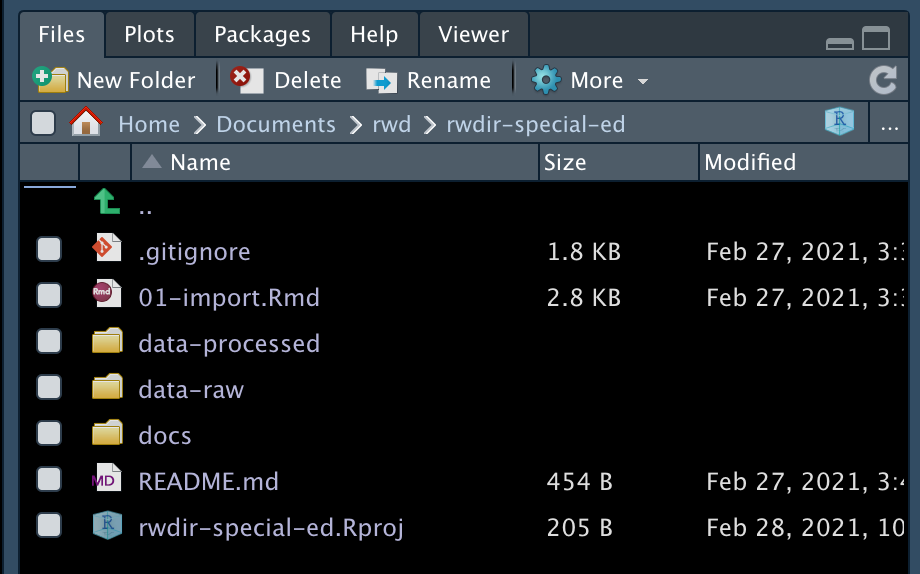
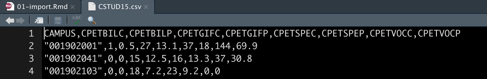

# SPED Joins {#sped-import}

> DRAFT FOR v1.0

> This three-part lesson was originally conceived as a first project instead of Billboard so it has some pretty specific details and explanation.

## Goals for this section

- Learn a little about data types available to R.
- Practice organized project setup.
- Learn about R packages, how to install and import them.
- Learn how to import CSV files.
- Introduce the Data Frame/Tibble.
- Introduce the tidyverse ` %>% `.
- Using [readr]() package
- Introduce joins

## Our project data

We achieve these goals while working with same Texas Education Agency data from their [TAPR] tool. This is a replication of an assignment for Workbench.

For now, see [this assignment](https://github.com/utdata/rwd-mastery-assignments/tree/master/ed-special-ed) for details about the data and concepts.

Here are the questions we seek from the data:

- Which campus gained the most (count difference) special education students from 2015 to 2020?
- Which campus has the highest share (percent) of special education students in 2020?
- Which campus had the greatest change in share of in special education students between 2015 and 2020.
- How many AISD schools would be above the special education "audit threshold" of 8.5% in 2020 if it were still in effect? How does those numbers compare to 2015?

We want to only consider "Regular Instructional" schools and exclude alternative, disciplinary or schools part of the justice system.

> I NEED TO ADD MORE DETAIL HERE, BUT USE THE ASSIGNMENT LINK FOR NOW FOR BACKGROUND

## About data sources

After installing and launching RStudio, the next trick is to import data. Depending on the data source, this can be brilliantly easy or a pain in the rear. It all depends on how well-formatted is the data.

In this class, we will primarily be using data from Excel files, CSVs (Comma Separated Value) and APIs (Application Programming Interface).

- **CSVs** are a kind of lowest-common-denominator for data. Most any database or program can import or export them.
- **Excel** files are good, but are often messy because humans get involved. There often have multiple header rows, columns used in multiple ways, notes added, etc. Just know you might have to clean them up before using them.
- **APIs** are systems designed to respond to programming. In the data world, we often use the APIs by writing a query to ask a system to return a selection of data. By definition, the data is well structured. You can often determine the file type of the output as part of the API call, including ...
- **JSON** (or JavaScript Object Notation) is the data format preferred by JavaScript. R can read it, too. It is often the output format of APIs, and prevalent enough that you need to understand how it works. We'll get into that later in semester.

Don't get me wrong ... there are plenty of other data types and connections available through R, but those are the ones we'll deal with most in this book.

### What is clean data

The Checking Your Data section of this [DataCamp tutorial](https://www.datacamp.com/community/tutorials/r-data-import-tutorial) has a good outline of what makes good data, but in general it should:

- Have a single header row with well-formed column names.
    + One column name for each column. No merged cells.
    + Short names are better than long ones.
    + Spaces in names make them harder to work with. Use and `_` or `.` between words.
- Remove notes or comments from the files.
- Each column should have the same kind of data: numbers vs words, etc.
- Each row should be a single thing called an "observation". The columns should describe that observation.

Data rarely comes clean like that. There can be many challenge in importing and cleaning data. We'll face some of those challenges here.

## Create a new project

We did this in our first lesson, but here are the basic steps:

- Launch RStudio
- Use the `+R` button to create a **New Project** in a **New Directory**
- Name the project `yourfirstname-special-ed` and put it in your `~/Documents/rwd` folder.
- Use the `+` button to use **R Notebook** to start a new notebook.
- Change the title to "TEA Special Education".
- Delete the other boilerplate text.
- Save the file as `01-import.Rmd`.

### The R Package environment

We have to back up from the step-by-step nature of this lesson and talk a little about the R programming language.

R is an open-source language, which means that other programmers can contribute to how it works. It is what makes R beautiful.

What happens is developers will find it difficult to do a certain task, so they will write an R "Package" of code that helps them with that task. They share that code with the community, and suddenly the R garage has an ["ultimate set of tools"](https://youtu.be/Y1En6FKd5Pk?t=24) that would make Spicoli's dad proud. 

One set of these tools is Hadley Wickham's [Tidyverse](https://www.tidyverse.org/), a set of packages for data science. These are the tools we will use most in this course. While not required reading, I highly recommend Wickham's book [R for data science](https://r4ds.had.co.nz/index.html), which is free. We'll use some of Wickham's lectures in the course.

There are also a series of useful [cheatsheets](https://www.rstudio.com/resources/cheatsheets/) that can help you as you use the packages and functions from the tidyverse. We'll refer to these throughout the course.

### Installing and using packages

There are two steps to using an R package:

- **Install the package** using `install.packages("package_name"). You only have to do this once for each computer, so I usually do it using the R Console instead of in notebook.
- **Include the library** using `library(package_name)`. This has to be done for each Notebook or script that uses it, so it is usually one of the first things in the notebook.

We're going to install several packages we will use in the ratings project. To do this, we are going to use the **Console**, which we haven't talked about much yet.

> REPLACE THIS IMAGE

{width=600px}

- Use the image above to orient yourself to the R Console and Terminal.
- In the Console, type in:

```r
install.packages("tidyverse")
```

As you type into the Console, you'll see some type-assist hints on what you need. You can use the arrow keys to select one and hit Tab to complete that command, then enter the values you need.

- If it asks you to install "from source", type `Yes` and hit return.

You'll see a bunch of response in the Console.

We'll need another package, so also do:

```r
install.packages("janitor")
```

We'll use some commands from janitor to clean up our data column names, among other things. A good reference to learn more is the [janitor vignette](https://cran.r-project.org/web/packages/janitor/vignettes/janitor.html).

You only have to install the packages once on your computer (though you have to load them every time, which is explained below).

### Load the libraries

Next, we're going to tell our R Notebook to use these two libraries.

- After the metadata at the top of your notebook, use *Cmd+option+i* to insert an R code chunk.
- In that chunk, type in the two libraries and run the code block with *Cmd+Shift+Return*.

This is the code you need:


```r
library(tidyverse)
library(janitor)
```

Your output will look something like this:

{width=600px}

## Downloading raw data

### Create a directory for your data

I want you to create a folder called `data-raw` in your project folder. We are creating this folder because we want to keep a pristine version of it our original data that we never change or overwrite. This is a basic data journalism principle: Thou shalt not change raw data.

In your Files pane at the bottom-right of Rstudio, there is a **New Folder** icon.

- Click on the **New Folder** icon.
- Name your new folder `data-raw`. This is where we'll put raw data. We never write data to this folder.
- Also create another new folder called `data-processed`. This is were we write data. We separate them so we don't accidentally overwrite raw data.

Once you've done that, they should show up in the file explorer in the Files pane. Click the refresh button if you don't see them. (The circlish thing at top right of the screenshot below.)

{width=300px}

You can ignore the `.gitignore` and `docs` folders I have there. Those are for publishing steps we'll learn later.

### Let's get some data

Now that we have a folder for our data, we can download our data into it. I have a copy of the data in the class Github repo.

The process to acquire this data is explained in the [Special Education](https://github.com/utdata/rwd-mastery-assignments/tree/master/ed-special-ed) assignment in the RWD Mastery Assignments Github repository.

> MIGHT UPDATE later to download the files directly instead of using download.file

In the interest of time, you can just download my copy using the `download.file` function in R.

- Add a Markdown headline and text that indicates you are downloading data. You would typically include a link and explain what it is, etc. You can build a link in Markdown with `[name of the site](url-to-the-site.html)`.
- Create an R chunk and include the following:

```r
# cstud15 download
download.file("https://github.com/utdata/rwd-mastery-assignments/blob/main/ed-special-ed/data/CSTUD15.csv?raw=true", "data-raw/CSTUD15.csv")
# cstud20 download
download.file("https://github.com/utdata/rwd-mastery-assignments/blob/main/ed-special-ed/data/CSTUD20.csv?raw=true", "data-raw/CSTUD20.csv")
# directory download
download.file("https://github.com/utdata/rwd-mastery-assignments/blob/main/ed-special-ed/data/Directory.csv?raw=true", "data-raw/Directory.csv")
```

This `download.file` function takes at least two arguments: The URL of the file you are downloading, and then the path and name of where you want to save it.

When you run this, it should save the file and then give you output similar to this for each of the three files:

```text
trying URL 'https://github.com/utdata/rwd-mastery-assignments/blob/main/ed-special-ed/data/CSTUD15.csv?raw=true'
Content type 'text/plain; charset=utf-8' length 331596 bytes (323 KB)
==================================================
downloaded 323 KB
```

### Peek at the data file

You can inspect the data before you import it into your RNotebook.

- In the **Files** pane, click on the `data-raw` folder to open in.
- Click on the `CSTUD15.csv` file until you get the drop down that says View Files.

{width=300}

- The file _should_ open into a new window. It will look like this:

{width=600}

The numbers on the left are row numbers in the file.

We can see first row is our column headers and the first column is our `CAMPUS` ID. This ID identifies our campus, but you'll notice there is no school name. We'll have to get that from the `Directory.csv` file in a minute.

At this point the data is only on our computer in a folder within our project. It has not been imported into our RNotebook yet.

- Close this file now by clicking on the small `x` next to the file name.

### Import csv as data

Since we are doing a new thing, we should note that with a Markdown headline and text. 

- Add a Markdown headline: `## Import data`
- Add some text to explain  that we are importing the school ratings data.
- After your description, add a new code chunk (*Cmd+Option+i*).

We'll be using the `read_csv()` function from the tidyverse [readr](https://readr.tidyverse.org/) package, which is different from `read.csv` that comes with R. It is mo betta.

Inside the function we put in the path do our data, inside quotes. If you start typing in that path and hit tab, it will complete the path. (Easier to show than explain).

- Add the follow code into your chunk and run it.

```r
read_csv("data-raw/CSTUD15.csv")
```

You get two results printed to your screen.

The first result called **"R Console"** shows what columns were imported and the data types. It's important to review these to make sure things happened the way that expected. In this case it looks like it imported `CAMPUS` as text -- noted as `col_character()`, (the default) -- and everything as `col_double`, which is a number.

Note: **Red** colored text in this output is NOT an indication of a problem.

{width=400}

The second result **spec_tbl_df** prints out the data like a table. The data object is called a data frame or [tibble](https://tibble.tidyverse.org/), which is a fancy tidyverse version of a data frame that is part of the tidyverse.

> I will use the term tibble and data frame interchangably. Think of data frames and tibbles like a well-structured spreadsheet. They are organized rows of data (called observations) with columns (called variables) where every item in the column is of the same data type.

{width=500}

When we look at the data output into RStudio, there are several things to note:

- Below each column name is an indication of the data type. This is important.
- You can use the arrow icon on the right to page through the additional columns.
- You can use the paging numbers and controls at the bottom to page through the rows of data.
- The number of rows and columns is displayed at the bottom.

The **Student Enrollment by Program** portion of the [Campus Student Information data dictionary](https://rptsvr1.tea.texas.gov/perfreport/tapr/2015/xplore/cstud.html) is especially helpful in understanding what this data is since the column names are not very telling.

Of special note here, we have only printed this data to the screen. We have not saved it in any way, but that will come soon.


## Assign our import to a data frame

As of right now, we've only printed the data to our screen. We haven't "saved" it at all. Next we need to assign it to an  R**object** so it can be named thing in our project environment so we can reuse it. We don't want to re-import the data every time we use the data.

The syntax to create and object in R can seem weird at first, but the convention is to name the object first, then insert stuff into it. So, to create an object, the structure is this:

```r
# this is pseudo code. don't run it.
new_object <- stuff_going_into_object
```

Let's make a object called `cstud15` and fill it with our imported tibble.

- Edit your existing code chunk to look like this. You can add the `<-` by using **Option+-** as in holding down the Option key and then pressing the hyphen:


```r
cstud15 <- read_csv(
  "data-raw/cstud15.csv"
)
```

Run that chunk and two things happen:

- We no longer see the result printed to the screen. That's because we created a tibble instead of printing it to the screen.
- In the **Environment** tab at the top-right of RStudio, you'll see the `cstud15` object listed.
    + Click on the blue play button next to ratings and it will expand to show you a summary of the columns.
    + Click on the name and it will open a "View" of the data in another window, so you can look at it in spreadsheet form. You can even sort and filter it.
- Close the data view once you've looked at it.

Since `cstud15` is a data frame object, we'll just call it a data frame henceforth.

### Print a peek to the screen

Since we can't see the data after we assign it, let's print the object to the screen so we can refer to it.

- Edit your import chunk to add the last two lines of this, including the one with the `#`:

```r
cstud15 <- read_csv(
  "data-raw/cstud15.csv"
)
  
# peek at the data
cstud15
```

This prints your saved data frame to the screen.

The line with the `#` is a comment _within_ the code chunk. Commenting what your code is important to your future self, and sometimes we do that within the code chunk instead of markdown if it will be more clear.

### Glimpse the data

There is another way to peek at the data that I prefer because it is more compact and shows you all the columns and data examples without scrolling: `glimpse()`.

- In your existing chunk, edit the last line to add the `glimpse()` function as noted below.

I'm showing the return here as well. Afterward I'll explain the pipe: ` %>% `.


```r
cstud15 <- read_csv(
  "data-raw/cstud15.csv"
)
```

```
## Rows: 8646 Columns: 9
```

```
## ── Column specification ────────────────────────────────────────────────────────
## Delimiter: ","
## chr (1): CAMPUS
## dbl (8): CPETBILC, CPETBILP, CPETGIFC, CPETGIFP, CPETSPEC, CPETSPEP, CPETVOC...
```

```
## 
## ℹ Use `spec()` to retrieve the full column specification for this data.
## ℹ Specify the column types or set `show_col_types = FALSE` to quiet this message.
```

```r
# peek at the data
cstud15 %>% glimpse()
```

```
## Rows: 8,646
## Columns: 9
## $ CAMPUS   <chr> "001902001", "001902041", "001902103", "001903001", "00190300…
## $ CPETBILC <dbl> 1, 0, 0, 0, 0, 0, 10, 6, 1, 3, 15, 2, 1, 26, 20, 104, 54, 130…
## $ CPETBILP <dbl> 0.5, 0.0, 0.0, 0.0, 0.0, 0.0, 3.3, 2.3, 0.4, 1.7, 3.7, 1.8, 0…
## $ CPETGIFC <dbl> 27, 15, 18, 23, 0, 9, 3, 12, 18, 5, 23, 7, 17, 33, 18, 4, 0, …
## $ CPETGIFP <dbl> 13.1, 12.5, 7.2, 6.5, 0.0, 3.0, 1.0, 4.7, 8.1, 2.9, 5.7, 6.1,…
## $ CPETSPEC <dbl> 37, 16, 23, 33, 1, 36, 29, 27, 28, 16, 34, 16, 25, 96, 44, 27…
## $ CPETSPEP <dbl> 18.0, 13.3, 9.2, 9.3, 100.0, 11.8, 9.6, 10.5, 12.6, 9.2, 8.4,…
## $ CPETVOCC <dbl> 144, 37, 0, 273, 0, 0, 0, 0, 213, 0, 0, 103, 15, 849, 247, 0,…
## $ CPETVOCP <dbl> 69.9, 30.8, 0.0, 76.9, 0.0, 0.0, 0.0, 0.0, 95.5, 0.0, 0.0, 90…
```

This also shows there are 8,646 rows and 9 columns in our data. Each column is then listed out with its data type and the first several values in that column.

### About the pipe %>%

We need to break down this code a little: `cstud15 %>% glimpse()`.

We are starting with the data frame `cstud15`, but then we follow it with ` %>% `, which is called a pipe. It is a tidyverse tool that allows us to take the **results** of an object or function and pass into another function. Think of it at **"AND THEN" the next thing**.

It might look like there are to arguments inside `glimpse()`, but what we are actually doing is passing the results of `cstud15` into it.


> IMPORTANT: There is a keyboard command for the pipe ` %>% `: **Cmd+Shift+m**. Learn that one.

### Creating consistent column names

A good trait for data journalist is to be ~~anal retentive~~ obsessive. One thing I almost always do after importing data is to run it through a function called `clean_names()` that makes all the column names lowercase, removes spaces and fixes other things that can cause problems later. `clean_names()` is part of the [janitor](https://cran.r-project.org/web/packages/janitor/vignettes/janitor.html) package we installed above.

- Edit your code chunk to look like the code below and run it.


```r
cstud15 <- read_csv("data-raw/cstud15.csv") %>% 
  clean_names()
```

```
## Rows: 8646 Columns: 9
```

```
## ── Column specification ────────────────────────────────────────────────────────
## Delimiter: ","
## chr (1): CAMPUS
## dbl (8): CPETBILC, CPETBILP, CPETGIFC, CPETGIFP, CPETSPEC, CPETSPEP, CPETVOC...
```

```
## 
## ℹ Use `spec()` to retrieve the full column specification for this data.
## ℹ Specify the column types or set `show_col_types = FALSE` to quiet this message.
```

```r
# peek at the data
cstud15 %>% glimpse()
```

```
## Rows: 8,646
## Columns: 9
## $ campus   <chr> "001902001", "001902041", "001902103", "001903001", "00190300…
## $ cpetbilc <dbl> 1, 0, 0, 0, 0, 0, 10, 6, 1, 3, 15, 2, 1, 26, 20, 104, 54, 130…
## $ cpetbilp <dbl> 0.5, 0.0, 0.0, 0.0, 0.0, 0.0, 3.3, 2.3, 0.4, 1.7, 3.7, 1.8, 0…
## $ cpetgifc <dbl> 27, 15, 18, 23, 0, 9, 3, 12, 18, 5, 23, 7, 17, 33, 18, 4, 0, …
## $ cpetgifp <dbl> 13.1, 12.5, 7.2, 6.5, 0.0, 3.0, 1.0, 4.7, 8.1, 2.9, 5.7, 6.1,…
## $ cpetspec <dbl> 37, 16, 23, 33, 1, 36, 29, 27, 28, 16, 34, 16, 25, 96, 44, 27…
## $ cpetspep <dbl> 18.0, 13.3, 9.2, 9.3, 100.0, 11.8, 9.6, 10.5, 12.6, 9.2, 8.4,…
## $ cpetvocc <dbl> 144, 37, 0, 273, 0, 0, 0, 0, 213, 0, 0, 103, 15, 849, 247, 0,…
## $ cpetvocp <dbl> 69.9, 30.8, 0.0, 76.9, 0.0, 0.0, 0.0, 0.0, 95.5, 0.0, 0.0, 90…
```

When writing R code we'll often string a bunch of functions together with the ` %>% ` so for readability we often put the "next" function a new indented line. When you do this, the ` %>% ` must come at the **end** of the previous line, like the `clean_names()` function above.

### Import other data frames

We need to import our other two data frames so we can prepare and join them. Create a new chunk for each data set, import them, clean the names and glimpse the data.

We'll talk more about these data in a minute when we prepare it. Name your new data frames `cstud20` and `directory`.


```r
cstud20 <- read_csv("data-raw/cstud20.csv") %>% 
  clean_names()
```

```
## Rows: 8866 Columns: 21
```

```
## ── Column specification ────────────────────────────────────────────────────────
## Delimiter: ","
## chr  (2): CAMPUS, CPNTVHSP
## dbl (19): CPETBILC, CPETBILP, CPETG9XC, CPETGIFC, CPETGIFP, CPETSPEC, CPETSP...
```

```
## 
## ℹ Use `spec()` to retrieve the full column specification for this data.
## ℹ Specify the column types or set `show_col_types = FALSE` to quiet this message.
```

```r
# peek at the data
cstud20 %>% glimpse()
```

```
## Rows: 8,866
## Columns: 21
## $ campus   <chr> "001902001", "001902041", "001902103", "001903001", "00190304…
## $ cpetbilc <dbl> 0, 1, 0, 0, 3, 12, 7, 3, 5, 14, 1, 6, 126, 85, 96, 20, 92, 13…
## $ cpetbilp <dbl> 0.0, 0.8, 0.0, 0.0, 1.2, 3.6, 2.5, 1.3, 2.8, 3.7, 0.9, 2.5, 1…
## $ cpetg9xc <dbl> 172, 0, 0, 378, 0, 0, 0, 228, 0, 0, 111, 0, 987, 0, 0, 0, 0, …
## $ cpetgifc <dbl> 14, 17, 8, 10, 13, 4, 17, 40, 14, 17, 7, 16, 35, 18, 3, 0, 8,…
## $ cpetgifp <dbl> 8.1, 13.6, 3.1, 2.6, 5.0, 1.2, 6.1, 17.5, 8.0, 4.5, 6.3, 6.6,…
## $ cpetspec <dbl> 34, 17, 31, 44, 29, 48, 26, 19, 28, 44, 11, 14, 103, 70, 50, …
## $ cpetspep <dbl> 19.8, 13.6, 11.9, 11.6, 11.2, 14.4, 9.4, 8.3, 15.9, 11.5, 9.9…
## $ cpetvhsc <dbl> 134, 0, 0, 138, 0, 0, 0, 207, 0, 0, 49, 0, 918, 0, 0, 0, 0, 0…
## $ cpetvhsp <dbl> 77.9, 0.0, 0.0, 36.5, 0.0, 0.0, 0.0, 90.8, 0.0, 0.0, 44.1, 0.…
## $ cpetvocc <dbl> 165, 0, 0, 341, 37, 0, 0, 207, 0, 0, 107, 53, 975, 133, 0, 0,…
## $ cpetvocp <dbl> 95.9, 0.0, 0.0, 90.2, 14.3, 0.0, 0.0, 90.8, 0.0, 0.0, 96.4, 2…
## $ cpntbilc <dbl> 0, 1, 0, 0, 3, 12, 7, 3, 5, 14, 1, 6, 126, 85, 96, 20, 92, 13…
## $ cpntbilp <dbl> 0.0, 0.8, 0.0, 0.0, 1.2, 3.6, 2.5, 1.3, 2.8, 3.7, 0.9, 2.5, 1…
## $ cpntg9xc <dbl> 172, 0, 0, 378, 0, 0, 0, 228, 0, 0, 111, 0, 987, 0, 0, 0, 0, …
## $ cpntgifc <dbl> 14, 17, 8, 10, 13, 4, 17, 40, 14, 17, 7, 16, 35, 18, 3, 0, 8,…
## $ cpntgifp <dbl> 8.1, 13.6, 3.1, 2.6, 5.0, 1.2, 6.1, 17.5, 8.0, 4.5, 6.3, 6.6,…
## $ cpntspec <dbl> 34, 17, 31, 44, 29, 49, 26, 19, 28, 45, 11, 15, 103, 70, 51, …
## $ cpntspep <dbl> 19.8, 13.6, 11.9, 11.6, 11.2, 14.7, 9.4, 8.3, 15.9, 11.8, 9.9…
## $ cpntvhsc <dbl> 134, 0, 0, 138, 0, 0, 0, 207, 0, 0, 49, 0, 918, 0, 0, 0, 0, 0…
## $ cpntvhsp <chr> "77.9", ".", ".", "36.5", ".", ".", ".", "90.8", ".", ".", "4…
```


```r
directory <- read_csv("data-raw/Directory.csv") %>% 
  clean_names()
```

```
## Rows: 9572 Columns: 34
```

```
## ── Column specification ────────────────────────────────────────────────────────
## Delimiter: ","
## chr (32): County Number, County Name, Region Number, District Number, Distri...
## dbl  (2): District Enrollment as of Oct 2019, School Enrollment as of Oct 2019
```

```
## 
## ℹ Use `spec()` to retrieve the full column specification for this data.
## ℹ Specify the column types or set `show_col_types = FALSE` to quiet this message.
```

```r
# peek at the data
directory %>% glimpse()
```

```
## Rows: 9,572
## Columns: 34
## $ county_number                      <chr> "'001", "'001", "'001", "'001", "'0…
## $ county_name                        <chr> "ANDERSON COUNTY", "ANDERSON COUNTY…
## $ region_number                      <chr> "'07", "'07", "'07", "'07", "'07", …
## $ district_number                    <chr> "'001902", "'001902", "'001902", "'…
## $ district_name                      <chr> "CAYUGA ISD", "CAYUGA ISD", "CAYUGA…
## $ district_type                      <chr> "INDEPENDENT", "INDEPENDENT", "INDE…
## $ district_street_address            <chr> "P O BOX 427", "P O BOX 427", "P O …
## $ district_city                      <chr> "CAYUGA", "CAYUGA", "CAYUGA", "ELKH…
## $ district_state                     <chr> "TX", "TX", "TX", "TX", "TX", "TX",…
## $ district_zip                       <chr> "75832-0427", "75832-0427", "75832-…
## $ district_phone                     <chr> "(903) 928-2102", "(903) 928-2102",…
## $ district_fax                       <chr> "(903) 928-2646", "(903) 928-2646",…
## $ district_email_address             <chr> "admin1@cayugaisd.com", "admin1@cay…
## $ district_web_page_address          <chr> "www.cayugaisd.com", "www.cayugaisd…
## $ district_superintendent            <chr> "DR RICK WEBB", "DR RICK WEBB", "DR…
## $ district_enrollment_as_of_oct_2019 <dbl> 557, 557, 557, 1247, 1247, 1247, 12…
## $ school_number                      <chr> "'001902001", "'001902041", "'00190…
## $ school_name                        <chr> "CAYUGA H S", "CAYUGA MIDDLE", "CAY…
## $ instruction_type                   <chr> "REGULAR INSTRUCTIONAL", "REGULAR I…
## $ charter_type                       <chr> NA, NA, NA, NA, NA, NA, NA, NA, NA,…
## $ school_street_address              <chr> "P O BOX 427", "P O BOX 427", "P O …
## $ school_city                        <chr> "CAYUGA", "CAYUGA", "CAYUGA", "ELKH…
## $ school_state                       <chr> "TX", "TX", "TX", "TX", "TX", "TX",…
## $ school_zip                         <chr> "75832-0427", "75832-0427", "75832-…
## $ school_phone                       <chr> "(903) 928-2294 ext:012", "(903) 92…
## $ school_fax                         <chr> "(903) 928-2239", "(903) 928-2646",…
## $ school_email_address               <chr> "admin1@cayugaisd.com", "admin1@cay…
## $ school_web_page_address            <chr> "www.cayugaisd.com", "www.cayugaisd…
## $ school_principal                   <chr> "DR JOE E SATTERWHITE III", "MRS SH…
## $ grade_range                        <chr> "'09-12", "'06-08", "'EE-05", "'09-…
## $ school_enrollment_as_of_oct_2019   <dbl> 172, 125, 260, 378, 0, 258, 334, 27…
## $ school_status                      <chr> "Active", "Active", "Active", "Acti…
## $ school_status_date                 <chr> NA, "03/11/1996", NA, NA, "06/28/20…
## $ update_date                        <chr> "2/25/2021 5:35:04 AM", "2/25/2021 …
```

## Prepare data for joining

To meet our story goals here we need pieces of all three of these data sets put together in one dataframe. As such, we're going to jump ahead with some data wrangling techniques because we need them to prepare and join our data for our next lesson. Some explanations may seem cursory if I plan on getting into more detail later.

### Prepare the directory data

#### Selecting directory columns

For our Directory data, we only need about a half dozen of the 30+ columms in the data. We will use the [`select()`](https://dplyr.tidyverse.org/reference/select.html) function to pluck columns out of the dataframe and assign them to a new data frame.

Here is the code, then I'll explain it.


```r
directory_cols <- directory %>% 
  select(
    school_number,
    school_name,
    district_name,
    instruction_type,
    charter_type,
    grade_range
  )

directory_cols %>% glimpse()
```

```
## Rows: 9,572
## Columns: 6
## $ school_number    <chr> "'001902001", "'001902041", "'001902103", "'001903001…
## $ school_name      <chr> "CAYUGA H S", "CAYUGA MIDDLE", "CAYUGA EL", "ELKHART …
## $ district_name    <chr> "CAYUGA ISD", "CAYUGA ISD", "CAYUGA ISD", "ELKHART IS…
## $ instruction_type <chr> "REGULAR INSTRUCTIONAL", "REGULAR INSTRUCTIONAL", "RE…
## $ charter_type     <chr> NA, NA, NA, NA, NA, NA, NA, NA, NA, NA, NA, NA, NA, N…
## $ grade_range      <chr> "'09-12", "'06-08", "'EE-05", "'09-12", "'KG-12", "'0…
```

When we use `select()` we are _selecting_ columns from the data. Inside the function we list them by name or order. There are many variations of `select()` which we'll get into later.

Note also code indents for the `select()` function. We write the code this way to we can easily identify and edit the arguments inside the function (our list of columns in this case.)

#### Clean up the school number

In this data set, the TEA included a `'` before each value in the `school_number` column. They do this to ensure that it is imported as a text and not a number, which might drop the very important `00` at the beginning of the ID. It is this ID that allows us to match the directory with all other kinds of TEA data about schools.

We need to remove that `'` but keep the column as a text data type. There are many different ways we could do this but we'll introduce `mutate()` and `str_replace()` to accomplish the task. We'll get into both of these functions in more detail in a later lesson.

- Edit your existing code block creating the `directory_cols` data frame with a new ` %>% ` and functions indicated below and run them. I'll explain them after.


```r
directory_cols <- directory %>% 
  select(
    school_number,
    school_name,
    district_name,
    instruction_type,
    charter_type,
    grade_range
  ) %>% 
  mutate(
    campus = school_number %>% str_replace("'","")
  )
  
directory_cols %>% glimpse()
```

```
## Rows: 9,572
## Columns: 7
## $ school_number    <chr> "'001902001", "'001902041", "'001902103", "'001903001…
## $ school_name      <chr> "CAYUGA H S", "CAYUGA MIDDLE", "CAYUGA EL", "ELKHART …
## $ district_name    <chr> "CAYUGA ISD", "CAYUGA ISD", "CAYUGA ISD", "ELKHART IS…
## $ instruction_type <chr> "REGULAR INSTRUCTIONAL", "REGULAR INSTRUCTIONAL", "RE…
## $ charter_type     <chr> NA, NA, NA, NA, NA, NA, NA, NA, NA, NA, NA, NA, NA, N…
## $ grade_range      <chr> "'09-12", "'06-08", "'EE-05", "'09-12", "'KG-12", "'0…
## $ campus           <chr> "001902001", "001902041", "001902103", "001903001", "…
```

What we did there with your `mutate()` function was create a NEW column called **campus** that starts with the `school_number` field _AND THEN_ uses a string replace function `str_replace()` to replace the `'` character with an empty string, or nothing. We named our new column `campus` because that is that the ID is called in the CSTUD data, and that will make joining easier later.

One thing of special note here: We not only used a ` %>% ` to append the `mutate()` function, but we also used a ` %>% ` _WITHIN_ the mutate arguments, modifying the `school_number` field along the way. This is called **nesting functions**. Not to get to far into the weeds, but the tidyverse ` %>% ` makes this is a lot easier to read and understand than base R, which would be: `mutate(str_replace(school_number,"'",""))`.

#### Remove the old school number columns

Since we don't need the `school_number` column anymore, we will remove it with `select()`, but we put a `-` before the column name because we want to _remove_ it.

- Append the new `select()` lines below to your existing code block.


```r
directory_cols <- directory %>% 
  select(
    school_number,
    school_name,
    district_name,
    instruction_type,
    charter_type,
    grade_range
  ) %>% 
  mutate(
    campus = school_number %>% str_replace("'","")
  ) %>% 
  select(-school_number)
  
directory_cols %>% glimpse()
```

```
## Rows: 9,572
## Columns: 6
## $ school_name      <chr> "CAYUGA H S", "CAYUGA MIDDLE", "CAYUGA EL", "ELKHART …
## $ district_name    <chr> "CAYUGA ISD", "CAYUGA ISD", "CAYUGA ISD", "ELKHART IS…
## $ instruction_type <chr> "REGULAR INSTRUCTIONAL", "REGULAR INSTRUCTIONAL", "RE…
## $ charter_type     <chr> NA, NA, NA, NA, NA, NA, NA, NA, NA, NA, NA, NA, NA, N…
## $ grade_range      <chr> "'09-12", "'06-08", "'EE-05", "'09-12", "'KG-12", "'0…
## $ campus           <chr> "001902001", "001902041", "001902103", "001903001", "…
```

OK, we are done preparing our new `directory_cols` data frame. We'll work next to prepare our CSTUD data.

### Prepare CSTUD data

We only need the `campus` and the two special education values from our CSTUD data for this story. If we review our data dictionaries ([2015](https://rptsvr1.tea.texas.gov/perfreport/tapr/2015/xplore/cstud.html) | [2020](https://rptsvr1.tea.texas.gov/perfreport/tapr/2020/xplore/cstud.html)) we can see these special education columns are called `CPETSPEC` (the number of special education students) and `CPETSPEP` (the percentage of students in the school that are in special education).

> In 2020, the TEA modified how they define enrollment, so don't get confused by those figures in 2020 data and later. According to Page 31 of the TAPR Glossary ([linked from here](https://rptsvr1.tea.texas.gov/perfreport/tapr/2020/index.html)): _Please note, the Enrollment section of this report is new this year. The definitions below describe the nuances between Membership and Enrollment. **If comparing the data shown from this year’s report to previous reports, use the data displayed under Membership**_.

We'll use `select()` to capture just the `campus`, `cpetspec` and `cpetspep` columns and put them into new data frames and then glimpse them.

But we need to rename the special education columns to include the year they come from so we can tell them apart when they all get joined together. We use the [`rename()`](https://dplyr.tidyverse.org/reference/rename.html) function to do this. Like a lot of things in R, we _name the new thing first_ and then "fill it" afterward.

- Add a Markdown note that we are preparing the student enrollment data
- Add a new R chunk and add the following:


```r
# set up 2015
cstud15_cols <- cstud15 %>% 
  select(
    campus,
    cpetspec,
    cpetspep
  ) %>% 
  rename(
    sped_c_15 = cpetspec,
    sped_p_15 = cpetspep
  )

# set up 2020
cstud20_cols <- cstud20 %>% 
  select(
    campus,
    cpetspec,
    cpetspep
  ) %>% 
  rename(
    sped_c_20 = cpetspec,
    sped_p_20 = cpetspep
  )

# peek at both
cstud15_cols %>% glimpse()
```

```
## Rows: 8,646
## Columns: 3
## $ campus    <chr> "001902001", "001902041", "001902103", "001903001", "0019030…
## $ sped_c_15 <dbl> 37, 16, 23, 33, 1, 36, 29, 27, 28, 16, 34, 16, 25, 96, 44, 2…
## $ sped_p_15 <dbl> 18.0, 13.3, 9.2, 9.3, 100.0, 11.8, 9.6, 10.5, 12.6, 9.2, 8.4…
```

```r
cstud20_cols %>% glimpse()
```

```
## Rows: 8,866
## Columns: 3
## $ campus    <chr> "001902001", "001902041", "001902103", "001903001", "0019030…
## $ sped_c_20 <dbl> 34, 17, 31, 44, 29, 48, 26, 19, 28, 44, 11, 14, 103, 70, 50,…
## $ sped_p_20 <dbl> 19.8, 13.6, 11.9, 11.6, 11.2, 14.4, 9.4, 8.3, 15.9, 11.5, 9.…
```

## Joining the data together

This is another case where we'll just touch on a skill -- joining data -- that we'll detail more later. You might [review the video about joins](https://vimeo.com/showcase/7320305/video/435910338) for a refresher on the terms and concepts.

Our aim here is to create a single data set with a single row for each school that includes information from each of the three data sets. We do this by **joining** on the `campus` ID within each of the three data sets. However, as we do so, we'll end up losing some rows that don't have matches in the other files.

To do the comparison for our story we need the schools that were open in both 2015 and 2020, but some schools existed in only one year or the other, so we'll drop those. When we join our files, we'll use an `inner_join()` to keep _only_ schools with  **matching** records from both 2015 and 2020. This will drop schools that opened after 2015 or closed before 2020.

The [`join()`](https://dplyr.tidyverse.org/reference/join.html) functions (there are several) generally take three arguments: the two tables to join and then **by =** to say which columns to match on.

`inner_join(first_table, second_table, by = "column")`

In our case we are using some tidyverse foo, which I'll explain after you add and run the chunk.

- Add notes in Markdown to note what you are doing.
- Create a new code block for the joins
- Add the following and run it.


```r
sped <- directory_cols %>% 
  inner_join(cstud15_cols)
```

```
## Joining, by = "campus"
```

```r
sped %>% glimpse()
```

```
## Rows: 8,087
## Columns: 8
## $ school_name      <chr> "CAYUGA H S", "CAYUGA MIDDLE", "CAYUGA EL", "ELKHART …
## $ district_name    <chr> "CAYUGA ISD", "CAYUGA ISD", "CAYUGA ISD", "ELKHART IS…
## $ instruction_type <chr> "REGULAR INSTRUCTIONAL", "REGULAR INSTRUCTIONAL", "RE…
## $ charter_type     <chr> NA, NA, NA, NA, NA, NA, NA, NA, NA, NA, NA, NA, NA, N…
## $ grade_range      <chr> "'09-12", "'06-08", "'EE-05", "'09-12", "'KG-12", "'0…
## $ campus           <chr> "001902001", "001902041", "001902103", "001903001", "…
## $ sped_c_15        <dbl> 37, 16, 23, 33, 1, 36, 29, 27, 28, 16, 34, 16, 25, 96…
## $ sped_p_15        <dbl> 18.0, 13.3, 9.2, 9.3, 100.0, 11.8, 9.6, 10.5, 12.6, 9…
```

Here is what's going on here:

- We start with our new dataframe we are creating: `sped` andbwe use ` <-` to fill it.
- To fill `sped` we start with the `directory` data and then pipe it ` %>% ` into an `inner_join()` function as the first table argument.
- Inside the `inner_join()` we name the second column we are joining, `cstud15_cols`.
- We did not specify which columns to join **by =** so it did what is called a "natural join", using all the variables with common names across the two tables. It noted that with the message: **Joining, by = "campus"**.

> Note we went from 9,572 rows in our `directory` data to just 8,087 rows with our joined data. This **inner_join** kept just the records that had the same `campus` ID values in both tables.

Now we will amend our join statement to also join the more recent data.

- Append the join statement as follows:


```r
sped <- directory_cols %>% 
  inner_join(cstud15_cols) %>% 
  inner_join(cstud20_cols)
```

```
## Joining, by = "campus"
## Joining, by = "campus"
```

```r
sped %>% glimpse()
```

```
## Rows: 8,002
## Columns: 10
## $ school_name      <chr> "CAYUGA H S", "CAYUGA MIDDLE", "CAYUGA EL", "ELKHART …
## $ district_name    <chr> "CAYUGA ISD", "CAYUGA ISD", "CAYUGA ISD", "ELKHART IS…
## $ instruction_type <chr> "REGULAR INSTRUCTIONAL", "REGULAR INSTRUCTIONAL", "RE…
## $ charter_type     <chr> NA, NA, NA, NA, NA, NA, NA, NA, NA, NA, NA, NA, NA, N…
## $ grade_range      <chr> "'09-12", "'06-08", "'EE-05", "'09-12", "'06-08", "'E…
## $ campus           <chr> "001902001", "001902041", "001902103", "001903001", "…
## $ sped_c_15        <dbl> 37, 16, 23, 33, 36, 29, 27, 28, 16, 34, 16, 25, 96, 4…
## $ sped_p_15        <dbl> 18.0, 13.3, 9.2, 9.3, 11.8, 9.6, 10.5, 12.6, 9.2, 8.4…
## $ sped_c_20        <dbl> 34, 17, 31, 44, 29, 48, 26, 19, 28, 44, 11, 14, 103, …
## $ sped_p_20        <dbl> 19.8, 13.6, 11.9, 11.6, 11.2, 14.4, 9.4, 8.3, 15.9, 1…
```

The second join worked the same way as the first. It also reducee the number of rows down to 8,002 as it dropped more schools that are not present in all the data sets.

We've done quite a bit here if you think about it:

1. We imported three different data sets
2. We selected only the columns we needed from each of the three columns
3. We sometimes mutated data needed adjusting, like the school_number.
4. We renamed our merging data so we can better identify them later.
5. We did the actual merge.

Now that we have all this data together, we can start doing some math and other calculations to see how the numbers of special education students have changed over time after the Legislature changed rules. We'll do that in the next lesson.

## Exporting data

### Single-notebook philosophy

I have a pretty strong opinion that you should be able to open any RNotebook in your project and run it from top to bottom without it breaking. In short, one notebook should not be dependent on the previous running of another notebook, unless it is to provide an output file that can be accessed later by another notebook.

This is why I had you name this notebook `01-import.Rmd` with a number 1 at the beginning. We'll number our notebooks in the order they should be run. It's an indication that before we can use the notebook `02-computations.Rmd` (next lesson!) that the `01-import.Rmd` notebook has to be run first.

But what is important is we will create an exported file from our first notebook that can be used in the second one. Once we create that file, the second notebook can be opened and run at any time.

Why make this so complicated? It might seem like overkill for this project ... after all, the csv file imported cleanly and we don't need to do anything further to it except lowercase column names.

The answer is **consistency**. When you follow the same project structure each, you quickly know how to dive into that project at a later date. If everyone on your team uses the same structure, you can dive into your teammates code because you already know how it is organized. If we separate our importing and cleaning into it's own file to be used by many other notebooks, we can fix future cleaning problems in ONE place instead of many places. 

One last example to belabor the point: It can save time. I've had import/cleaning notebooks that took 20 minutes to process. Imagine if I had to run that every time I wanted to rebuild my analysis notebook. Instead, the import notebook spits out clean file that can be imported in a fraction of that time.

This was all a long-winded way of saying we are going to export our data now.

### Exporting as rds

We are able to pass cleaned data between notebooks because of a native R data format called `.rds`. When we export in this format it saves not only rows and columns, but also the data types. (If we exported as CSV, we would potentially have to re-fix data types when we imported again.)

We will use another readr function called `write_rds()` to create our file to pass along to the next notebook, saving the data into the `data-processed` folder earlier. We are separating it from our data-raw folder because "Thou shalt not change raw data" even by accident. By always writing data to this different folder, we help avoid accidentally overwriting our original data.

- Create a Markdown headline `## Exports` and write a description that you are exporting files to .rds.
- Add a new code chunk and add the following code:

<!-- running this code to get output for future chapter -->


```r
sped %>% 
  write_rds("data-processed/01_sped.rds")
```

So, we are starting with the sped data frame that we saved earlier. We then pipe ` %>% ` the result of that into a new function `write_rds()`. In addition to the data, the function needs to who where to save the file, so in quotes we give the path to where and what we want to call the file: `"data-processed/01_sped.rds"`.

Remember, we are saving in data-processed because we never export into data-raw. We are naming the file starting with `01_` to indicate to our future selves that this output came from our first notebook. We then name it, and use the `.rds` extension.

## Review of what we've learned so far

Most of this lesson has been about importing and combining data, with some data mutating thrown in for fun. (OK, I have an odd sense of what fun is.) Importing data into R (or any data science program) can sometimes be quite challenging, depending on the circumstances. Here we were working with well-formed data, but we still used quite a few tools from tidyverse packages like readr (read_csv, write_rds) and dplyr (select, mutate).

You've learned a lot already: 

- About using RMarkdown and RNotebooks to document and organize your work
- About R packages like the tidyverse and janitor, and how they can add new tools to your data Swiss Army knife
- About preserving data integrity by separating your raw and processed data
- You learned how to import csv data, pluck out the parts you need an join them into something you can use

Next we'll dive a little deeper into mutate, creating the calculations from our data that we need to reach our story goals.

## Resources

- This [DataCamp tutorial on imports](https://www.datacamp.com/community/tutorials/r-data-import-tutorial) covers a ton of different data types and connections.
