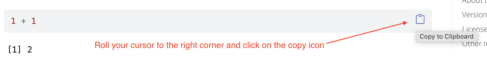

--- 
title: "Reporting with Data in R"
author: "Christian McDonald"
date: "2021-09-22"
site: bookdown::bookdown_site
output: bookdown::gitbook
documentclass: book
bibliography: [book.bib, packages.bib]
biblio-style: apalike
link-citations: yes
github-repo: utdata/rwdir
description: "Reporting with Data in R is a series of lessons and instructions used in courses in the School of Journalism and Media, Moody College of Communication at the University of Texas at Austin. It is taught by Christian McDonald, assistant professor of practice."
---

# About this book {-}

> NOTE: This book is in the middle of a rewrite. The original "beta" version used in spring 2019 is long gone in a commit history and the new version is being rewritten under a new URL. Some chapters need to be written or rewritten, as noted. This new version will become v1.0 and is being used for fall 2021.

Reporting with Data in R is a series of lessons and instructions used for courses in the School of Journalism and Media, Moody College of Communication at the University of Texas at Austin.

It is written in [bookdown](https://bookdown.org/) and the source is available on [Github](https://github.com/utdata/rwdir).

I'm a strong proponent of what I call Scripted Journalism, a method of committing data-centric journalism in a programmatic, repeatable and transparent way. There are a myriad of programming languages that further this, including Python ([pandas](https://pandas.pydata.org/) using [Jupyter](https://jupyter.org/)) and JavaScript ([Observable](https://beta.observablehq.com/)), but we'll be using [R](https://www.r-project.org/), [RMarkdown](https://rmarkdown.rstudio.com/) and [RStudio](https://www.rstudio.com/).

R is a super powerful, open-source programming language for data that is deep with features and an awesome community of users who build upon it. No matter the challenge before you in your data storytelling, there is probably a package available to help you solve that challenge. Probably more than one.

## About my philosphy {-}

There is always more than one way to do things in R. This book is a [Tidyverse](https://www.tidyverse.org/)-oriented, opinionated collection of lessons intended to teach students new to programming and R for the expressed act of committing journalism. As a beginner course, I strive to make it as simple as possible, which means I may not go into detail about alternative (and possibly better) ways to accomplish tasks in favor of staying in the Tidyverse and reducing options to simplify understanding.

This is the second version of this book. The first "beta" version was used in Spring 2019, and it was my first time to introduce R to beginning students. While the experience went well, there were pros and cons to using R in a beginning data class and I continue to experiment with material. I hope to use my experience in that first class to improve this edition.

After that Spring 2019 class I chose to use a different web-based tool — [Workbench](http://workbenchdata.com/) — which allowed for a similar scripted workflow but without the same level of coding. I loved Workbench, especially for beginning students, but the site is scheduled to close down in October 2021.

## Tips on my writing style {-}

I try to be consistent in the way I write documentation and lessons. I'm human, so sometimes break my own rules, but in general I keep the following in mind.

### Things to do {-}

I usually put things I want you to DO in ordered lists:

1. Do this thing.
2. Then do this thing.

Explanations are usually in text, like this very paragraph.

And sometimes I'll explain things in lists:

- This is the first thing I want you to know.
- This is the second. You don't have to DO these things, just know about them.

### Notes, some important {-}

I will use the blockquote syntax to set off irrelevant background:

> Markdown was developed by JOHN GRUBER, as outlined on his [Daring Fireball blog](https://daringfireball.net/projects/markdown/).

But sometimes those asides are important. I usually indicate that:

> IMPORTANT: You really should learn how to use [Rmarkdown](https://rmarkdown.rstudio.com/) as you will use it the whole semester, and hopefully for the rest of your life.

### Copy code blocks {-}

When you see R code in the instructions, you can roll your cursor over the right-corner and click on the copy icon to copy the code to your clipboard:

You can then paste the code inside your R chunk.

That said, typing code yourself has many, many benefits. You learn better when you type yourself, make mistakes and have to fix them. **I encourage you to always type short code snippets.** Leave the copying to long ones.

## About the author {-}

I'm a career journalist who most recently served as Data and Projects Editor at the Austin American-Statesman before joining the University of Texas at Austin faculty full-time in Fall 2018 as an assistant professor of practice. I've taught data-related course at UT since 2013.

- My UT Github: [utdata](https://github.com/utdata)
- My Personal Github: [critmcdonald](https://github.com/critmcdonald?tab=repositories)
- Twitter: [crit](https://twitter.com/crit)
- Email: <christian.mcdonald@utexas.edu>

## License {-}

 This work is licensed under a <a rel="license" href="http://creativecommons.org/licenses/by-nc-sa/4.0/">Creative Commons Attribution-NonCommercial-ShareAlike 4.0 International License</a>.

Let's just say this is free on the internet and I don't make any money from it and you shouldn't either.

## Other resources {-}

This text stands upon the shoulders of giants and by design does not cover all aspects of using R. Here are some other useful books, tutorials and sites dedicated to R. There are other task-specific tutorials and articles sprinkled throughout the book in the Resources section of select chapters. 

- [R Journalism Examples](https://utdata.github.io/r-journalism-examples/), a companion piece of sorts to this book with example code to accomplish specific tasks. It is a work-in-progress, and quite nascent at that.
- [R for Data Science](https://r4ds.had.co.nz/index.html) by Hadley Wickham and Garrett Grolemund.
- The [Tidyverse](https://www.tidyverse.org/) site, which has tons of documentation and help.
- The [RStudio Cheatsheets](https://www.rstudio.com/resources/cheatsheets/).
- [R Graphics Cookbook](https://r-graphics.org/index.html)
- [The R Graph Gallery](https://www.r-graph-gallery.com/) another place to see examples.
- [Practical R for Journalism](https://www.crcpress.com/Practical-R-for-Mass-Communication-and-Journalism/Machlis/p/book/9781138726918) by Sharon Machlis, an editor with PC World and related publications. Sharon is a longtime proponent of using R in journalism.
- [Sports Data Analysis and Visualization](http://mattwaite.github.io/sports/) and [Data Journalism with R and the Tidyverse](http://mattwaite.github.io/datajournalism/) by Matt Waite, a professor at the University of Nebraska-Lincoln.
- [R for Journalists](http://learn.r-journalism.com/en/) site by Andrew Tran, a reporter at the Washington Post. A series of videos and tutorials on using R in a journalism setting.
