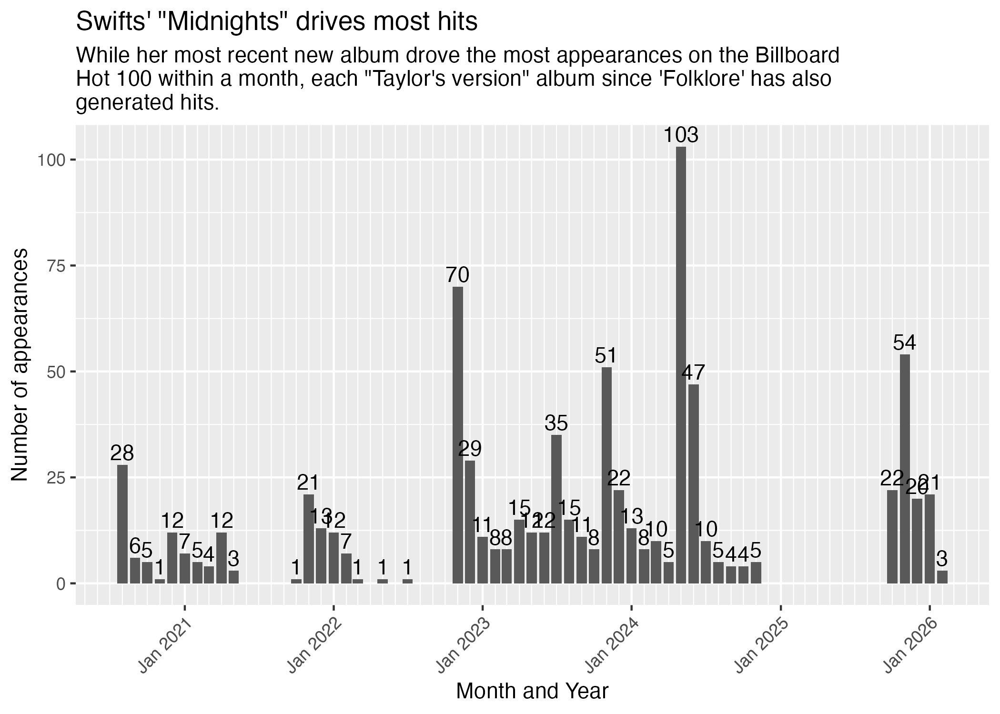

# Grouping by dates {#group-dates}

::: callout-note
This lesson was pulled out of the Billboard project because it was getting really long, but you'll need this skill when you are working on your mastery assignments.
:::

It is not uncommon in data journalism to count or sum records by year based on a date within your data. Or even by other date parts like month or week. There are some really nifty features within the [lubridate](https://lubridate.tidyverse.org/) package that make this pretty easy.

We'll run through some of those scenarios here using the Billboard Hot 100 data we used in Chapters 3 & 4. If you want to follow along, you can create a new Quarto Document in your Billboard project. Or you can just use this for reference.

## Setting up

We need to set up our notebook with libraries and data before we can talk specifics. While we are using the **lubridate**, it is included as part of **tidyverse** so we do not need to load it separately.

```{r}
#| label: setup
#| message: false
#| warning: false

library(tidyverse)
```

```{r}
#| label: options
#| echo: false

options(dplyr.summarise.inform = FALSE)
```

And we need our cleaned Billboard Hot 100 data. We'll glimpse the rows and check out the date range so we can remember what we have.

```{r import}
hot100 <- read_rds("data-processed/01-hot100.rds")

hot100 |> glimpse()

hot100$chart_date |> summary()
```

## Plucking date parts

If you look at the [lubridate cheatsheet](https://rstudio.github.io/cheatsheets/lubridate.pdf) under "GET AND SET DATE COMPONENTS" you'll see functions to pluck out parts of a date, like `year()`. (There is a [web version of that cheatsheet](https://rstudio.github.io/cheatsheets/html/lubridate.html), though I like the PDF better.)

If we have a date, like perhaps Taylor Swift's birthday, we can pluck the year from it.

```{r year-example}
year("1989-12-13")
```

## Grouping by a date part on the fly

Let's show how this might be useful through an example question:

**Which performer has the most appearances on the chart in a given year?**

The logic works like this: 

- Group all the records by `performer` AND the year of the `chart_date`
- Summarize and count the rows

```{r grp-year, warning=FALSE}
hot100 |> 
  group_by(
    year(chart_date), # <1>
    performer
  ) |> 
  summarize(appearances = n()) |> 
  arrange(desc(appearances))
```

1. This is where we add the year to the group_by, plucking it from the `chart_date` with the `year()` function.

It looks like Morgan Wallen had the most appearances in 2023. There is definitely some kinda story here.

Anyway, notice how the year column name is kinda shite? We would not be able to easily reference that variable later, so we should rename that AS we make the group:

```{r grp-year-betta}
hot100 |> 
  group_by(
    yr = year(chart_date), # <1>
    performer
  ) |> 
  summarize(appearances = n()) |> 
  arrange(desc(appearances))
```

1. I added the `yr = ` part here.

It is a good practice to rename any grouping variable made from a function like that. FWIW, it would've worked if I called the new column `year`, but I named it `yr` so I'm less likely to confuse it with the function `year()`. It's a personal preference what to name the new column.

## Making reusable date parts

If you think you'll use a date parts more than once, then it makes sense to create new variables and save them. You might make only one or two, but I'll build on an example to show you several variations.

Here I'm creating a random sample of data with only the `chart_date` and `title` columns just so it is easier to see what we are doing. You would normally work with the whole data frame! Here is our sample:

```{r make-sample}
hot100_sample <-
  hot100 |>
  slice_sample(n = 6) |>
  select(chart_date, title)

hot100_sample
```

::: callout-important

### Building up this code chunk

If you are following along in your own notebook, please know I'm _BUILDING_ on the code block below, where each new bit below should be _edited_ into your existing chunk.

As we add on more and more variables you might have to scroll the dataframe to see them.

:::


### Let's make a year

Here's how we do it:

```{r make-year}
hot100_sample |> 
  mutate( # <1>
    yr = year(chart_date) # <2>
  )
```

1. We use mutate to "create or change data". This is where it starts.
2. And then we name the new column `yr`, and then set the value to the `year()` of `chart_date`.

### The magical month

We can also pluck out the month of the date, which is pretty useful if you want to measure seasonality within a year, like hot days of summer, etc. The default `month()` function pulls the month as a number.

```{r}
hot100_sample |> 
  mutate(
    yr = year(chart_date),
    mo = month(chart_date) #<1>
  )
```

1. Here we have added a month column, which gives us the _number_ of the month.

But there are some options within `month()` to give us month NAMES that are ordered as factors instead of alphabetical.

```{r}
hot100_sample |> 
  mutate(
    yr = year(chart_date),
    mo = month(chart_date),
    mo_label = month(chart_date, label = TRUE), # <1>
    mo_long = month(chart_date, label = TRUE, abbr = FALSE) #<2>
  ) |> 
  arrange(mo_label)
```

1. Here we've added a variable using the same `month()` function, but it adds an argument `label = TRUE` to make the value a label for the month name instead of the number.
2. And here, again we use `month()` with the label argument, but we also add the `abbr = FALSE` so it gives us the long name instead of the abbreviation.

Note the datatype `<ord>` under the column `mo_label` and `mo_long`. That means this is an "ordered factor" and that when sorted by those labels it will list in MONTH order instead of alphabetical order, which is quite useful.

### Floor dates

Sometimes you want to count the number of records within a month and year, like all the songs in January 2000, then February 2000, etc. One way to do that is to create a floor_date, which gives you the "lowest" date within a certain unit like year or month.

Note that the resulting new variables below are real dates, but they have the "lowered" to the first day of the month or year.

```{r date-floor}
hot100_sample |> 
  mutate(
    yr = year(chart_date),
    mo = month(chart_date),
    mo_label = month(chart_date, label = TRUE),
    mo_long = month(chart_date, label = TRUE, abbr = FALSE),
    mo_floor = floor_date(chart_date, unit = "month"), # <1>
    yr_floor = floor_date(chart_date, unit = "year") # <2>
  )
```

1. The `mo_floor` gives you the first day of the month for that `chart_date`.
2. The `yr_floor` gives you the first day of the year for that `chart_date`.

## Saving date parts

Once we know we need these date parts, we can save them into a new data object and use that.

::: callout-tips

Some things to note with what I'm doing with this code chunk:

- I changed the originating data from our hot100_sample to our actual hot100 data frame.
- I'm also making a "mutate machine" with a glimpse at the end so I can see all the new variables.
- I typically go back to my cleaning notebook to add these once I recognize I need them, and then rerun everything.

:::

```{r}
hot100_dateparts <-
  hot100 |> 
  mutate(
    yr = year(chart_date),
    mo = month(chart_date),
    mo_label = month(chart_date, label = TRUE),
    mo_long = month(chart_date, label = TRUE, abbr = FALSE),
    mo_floor = floor_date(chart_date, unit = "month"),
    yr_floor = floor_date(chart_date, unit = "year")
  )

hot100_dateparts |> glimpse()
```

Now I can use that new `hot100_dateparts` object with the rest of my analysis.

### Use the parts!

Let's put this to use with an example. I'll use that `mo_floor` find **Recent appearances by Taylor Swift by month**.

```{r swift-month}
swift_month <-
  hot100_dateparts |> 
  filter(
    performer == "Taylor Swift",
    chart_date >= "2020-07-01"
  ) |> 
  group_by(mo_floor) |> 
  summarize(appearances = n())

swift_month
```

And chart it:

```{r}
swift_month_plot <-
  swift_month |> 
  ggplot(aes(x = mo_floor, y = appearances)) +
  geom_col() +
  geom_text(aes(label = appearances), vjust = -.3) +
  scale_x_date(date_labels="%b %Y", date_breaks  ="1 year", minor_breaks = "1 month") +
  guides(x =  guide_axis(angle = 45)) +
  labs(
    x = "Month and Year",
    y = "Number of appearances",
    title = "Swifts\' \"Midnights\" drives most hits",
    subtitle = str_wrap("While her most recent new album drove the most appearances on the Billboard Hot 100 within a month, each \"Taylor\'s version\"  album since 'Folklore' has also generated hits.")
  )

ggsave("figures/swift_month_plot.png")
```



Can you guess when she [released her albums](https://en.wikipedia.org/wiki/Taylor_Swift_albums_discography#Studio_albums)?


